# 了解新加坡 HDB 转售价格的数据驱动方法

> 原文：<https://towardsdatascience.com/data-driven-approach-to-understanding-hdb-resale-prices-in-singapore-31c3beecfd97?source=collection_archive---------11----------------------->

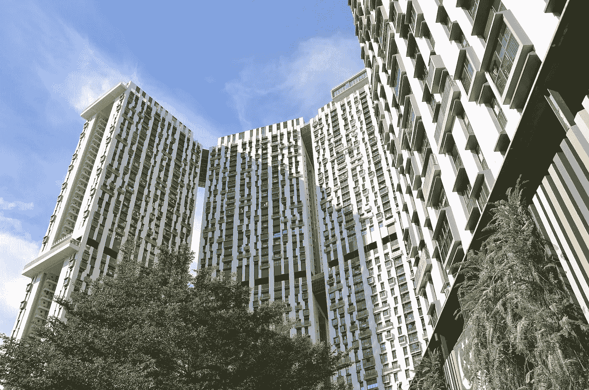

HDB Housing in Singapore. Image from [PixaBay](https://pixabay.com/photos/the-pinnacle-singapore-2640724/)

82%的新加坡人住在 HDB(住房发展局)建造的公寓里。在 HDB 买房是新加坡年轻人谈论最多的话题之一，也可能是年轻人最大的经济负担之一。给定一定的预算，在哪里和什么类型的转售 HDB 单位可以购买？

像大多数想在 HDB 买房的年轻人一样，我和我的团队已经开始着手这个项目，心中有几个目标:

1.了解影响 HDB 转售价格的关键因素

2.建立一个综合定价模型来确定 HDB 转售公寓的*内在*价格

HDB 在新加坡的转售价格很大程度上基于销售比较法，即你的前邻居的房子卖了多少钱。在这种情况下，HDB 转售单位的最佳价格预测值因此是附近类似公寓的先前交易价格，并根据细微差异进行了一些调整。有时，这种定价也可能是不合理的，因为人们猜测政府可能在不久的将来回购股票，这种定价可能被人为抬高。

这为我们提供了一个非常有趣的数据分析问题:根据客观因素，如公寓条件、单位的可达性以及其他房地产信息，一所房子的真实*内在*价值是多少。

考虑到这一点，我们开始收集大量数据来构建我们的模型。

# **特色工程**

基于对市场信息的观察以及对购买我们自己的 HDB 公寓的研究，我和我的团队对影响 HDB 公寓价格的关键因素建立了以下假设:

1.**可达性**:所用时间包括步行到最近的捷运站的时间，以及从最近的捷运站到莱佛士广场捷运站的行车时间。

2.**邻近设施**:HDB 公寓邻近小学、商场等设施。

3.**公寓所在的城镇**:公寓所在的城镇越成熟，转售价格越高。

4.**户型**:平层、剩余租期、面积、户型。

5.**遗产构成**:如遗产中工作成年人的百分比、老年人的百分比、年轻人的百分比

# **数据来源**

我们使用的数据来源是公开的，很容易在网上找到。特别感谢[data.gov.sg](https://data.gov.sg/)、 [onemap.sg](https://www.onemap.sg/) 、 [Singstats](https://www.singstat.gov.sg/) 和其他几个在线资源，我和我的团队能够获得我们在模型上构建输入特性所需的大部分信息:

**https://data.gov.sg/dataset/resale-flat-prices**:从[检索 2017 年 8 月至 2018 年 8 月所有转售交易的地址、户型信息、价格等历史数据](https://data.gov.sg/dataset/resale-flat-prices)

**地理位置信息:**为了提取事务的位置数据，我们构建了一个 [python 工具](https://github.com/mylee16/onemap-api)来从 onemap.sg API 中提取纬度和经度信息。我们还提取了新加坡所有捷运站、小学和商场的经度和纬度信息

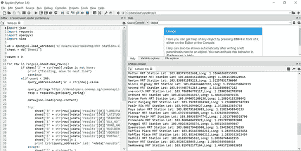

Extracting Lat and Long from MRT stations

Python Tool to extract lat and long from onemap.sg

**Malls** :从维基百科手动提取新加坡所有的商场。使用 python 工具提取的纬度和经度。

**捷运站:**全国各地的捷运站和 LRT 站摘自 LTA 的网站。使用 python 工具提取的纬度和经度。

**到名胜古迹的相对距离**:利用从 onemap.sg 获取的经纬度信息，我们能够利用毕达哥拉斯定理计算出 HDB 公寓到名胜古迹的距离，比如最近的捷运站、最近的小学、最近的商场。

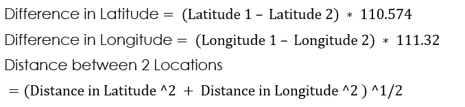

Calculating the distance between two locations

**居民地理人口统计:**从新加坡统计局提取的特定规划区域的人口统计数据，如规划区域内工作成年人的百分比。

**从莱佛士广场捷运站的行程时间:**从各捷运站和 LRT 站到莱佛士广场捷运站的行程时间从[https://www.transitlink.com.sg/eservice/eguide/rail_idx.php](https://www.transitlink.com.sg/eservice/eguide/rail_idx.php)手动提取

# **最终数据集**

下面显示的最终数据集显示了 2017 年 8 月至 2018 年 8 月期间交易的所有公寓的信息。这些信息包括城镇、交易月份、剩余租赁年限、邻近因素以及转售价格等。

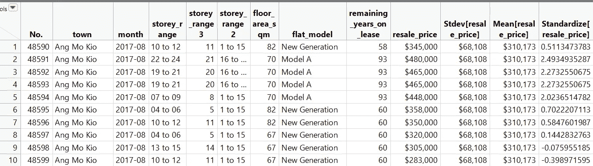

Analytical Sandbox

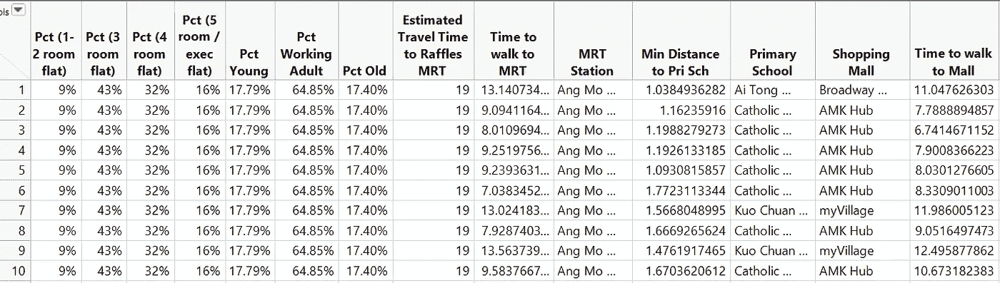

Analytical Sandbox (cont.)

# **方法论**

利用这些数据，我们使用 SAS JMP Pro 对各种模型(即多元线性回归(标准最小二乘法)、多元线性回归(逐步)、随机森林和自助森林)进行了试验，以选择最佳价格预测模型。最佳模型的选择基于:

验证数据集的拟合质量。

可解释性，即模型不应该使用太多的变量，也不应该是一个黑箱。

我们发现**多元线性回归——标准最小二乘**模型是首选模型，因为它简单且其性能(调整后的 R 平方)与其他模型相当。最重要的是，利用多元线性回归——标准最小二乘法，我们可以轻松地分解算法，了解每个变量如何影响估计价格。

# **调查结果**

通过线性回归，我们建立了模型来预测 HDB 转售交易的价格，并了解每个变量是否以及如何影响交易价格。

基于我们对影响 HDB 转售公寓价格的关键因素的假设，以及用我们的模型对信息的分析，我们已经为 HDB 的一套四居室公寓的价格推导出以下等式:

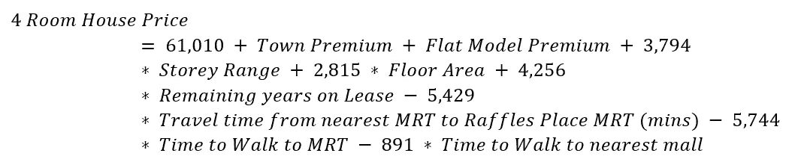

4-room HDB resale pricing formula

**城镇溢价:** HDB 转售成交价由单位所在的城镇决定(如:昂船洲镇)。我们得出的结论是，位于设施更完善的成熟城镇的公寓会获得更高的溢价。上述等式中的“城镇地价”考虑了这一因素。下表概述了将在基础价格上增加或减少的城镇溢价的估计金额。例如，一个买家将不得不支付额外的 7，624.01 美元购买一套位于 Ang Mo Kio 镇的 4 个房间的 HDB 转售公寓。然而，如果他在 Bukit Batok 购买一套公寓，将有 57，446.29 美元的溢价折扣。

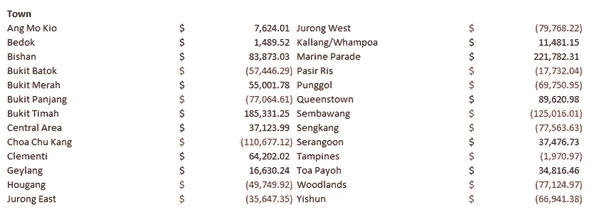

Town Premium

**扁平模型:**我们已经得出结论，HDB 转售交易价格部分由扁平模型决定。例如，如果一个买家购买了 DBSS(一个由私人开发商建造的公共 HDB 公寓的模型)，他/她将不得不在 HDB 一套四居室公寓的基础价格上支付 81，226.21 美元的溢价。

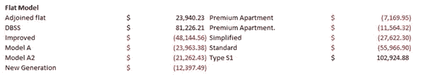

Flat Model Premium

楼层范围:我们已经得出结论，一个四居室的 HDB 每增加一层要花费 3749 美元。

**占地面积:**我们得出的结论是，一个四居室的 HDB 每平方米的成本为 2815 美元。

**剩余租期:**HDB 所有的公寓都由政府提供 99 年的租约。每过一年，一套四居室的 HDB 就会贬值 4256 美元。

**步行至最近的地铁站所需时间(分钟)**:HDB 的单位离最近的地铁站越远，估计楼价越低。到捷运站每多走一分钟就少花 5744 美元。每分钟相当于 80 米。

**前往莱佛士广场捷运站的行车时间(分钟):**最近的捷运站离莱佛士广场捷运站越远，估计楼价越低。在捷运上每多行驶一分钟就少花 5429 美元。

**步行至最近商场的时间(分钟)**:单位离最近商场越远，估计单位价格越低。到购物中心每多走一分钟就少花 891 美元。

我们在模型中包括的其他变量，如房地产构成(如工作成人的百分比)和到最近小学的距离，在统计上不显著，因此从公式中排除。

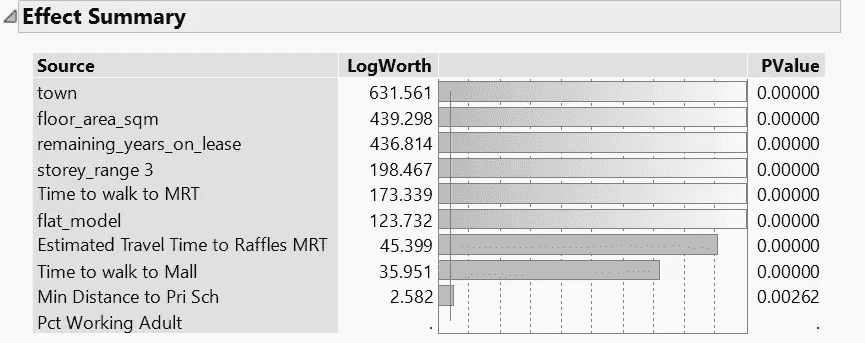

Effect summary — % of working adult and nearest primary school are not statistically significant at 99.9% confidence level

# **解读分析**

这种分析可以在很多方面帮助我们选择理想的家。不同的夫妻，在选房子的时候，预算不同，偏好也不同。如果你喜欢靠近中央商务区的公寓，你可以比较一下城镇地价和到中央商务区的距离。

一些城镇因靠近中央商务区而更物有所值:

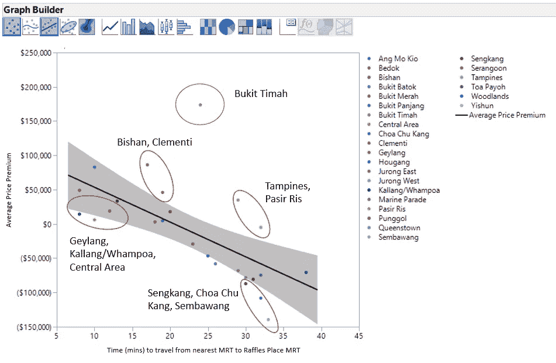

Average price premium vs time (mins) to travel from nearest MRT to Raffles Place MRT

**距离莱佛士广场 5-10 分钟:**卡尔朗/黄埔(溢价 11，000 美元)vs 皇后镇(溢价 89，000 美元)

**距离莱佛士广场 15-20 分钟:**贝多克(溢价 15000 美元)vs 碧山(溢价 83000 美元)

**距离莱佛士广场 30-35 分钟:**森巴旺(溢价-125，000 美元)vs 坦皮恩斯(溢价-190，000 美元)

对于一套距离莱佛士广场(Raffles Place)15-20 分钟路程的 HDB 公寓来说，贝多克的房价比璧山便宜大约 8 万美元。

我们也可以用这个公式来理解给定一定预算的权衡。你愿意每增加一层支付 3749 美元，还是每靠近捷运站一分钟支付 5744 美元？

# 推荐

回答最重要的问题，根据这 9 个因素(城镇地价、公寓型号、楼层范围、建筑面积、剩余租赁年限、步行到最近的地铁站的时间、步行到最近的购物中心的时间、从最近的地铁站到莱佛士广场的旅行时间)，我们在哪里可以找到最有价值的 HDB 转售公寓？

Which HDB estate has the best value for 4-room HDB?

结果发现，小印度的巴生巷(Klang Lane)和布法罗路(Buffalo Road)的四居室公寓最有价值，没有考虑其他因素，如直接的邻居、风水、公寓的朝向、景观、装修等。

对于基于 9 个因素的最差价值的遗产:

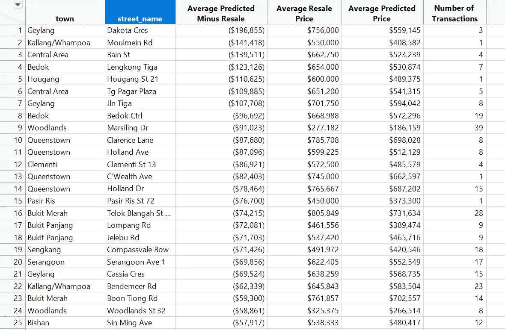

Which HDB estate has the worst value for 4-room HDB?

# **结论**

根据我们的调查结果，我们得出的结论是，新加坡的 HDB 转售价格在很大程度上受到一些关键因素的影响，如城市的成熟度、公寓是否靠近中央商务区以及购物中心等设施。然而，有些城镇更靠近中央商务区，但城镇地价较低。这些位于这些地区的公寓可能会吸引那些希望靠近 CBD 但预算紧张的买家。

希望你找到你的完美房子！

小组成员:[孟勇·李](https://www.linkedin.com/in/mylee1/)、[努尔·艾尤尼·胡斯娜·宾提·巴克里](https://www.linkedin.com/in/aeiyuni-husna-63624a136/)、卡·伊

还要特别感谢[西尔万·张](https://medium.com/@syltruong)！