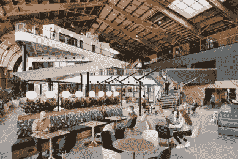
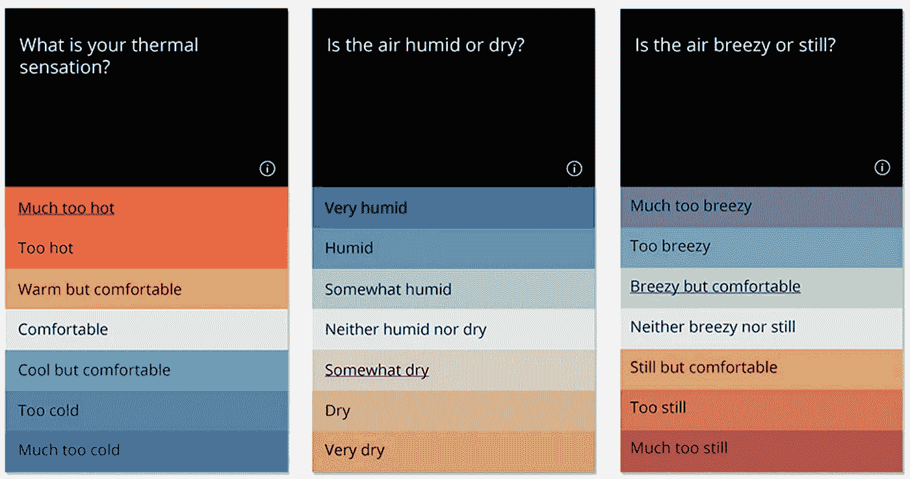
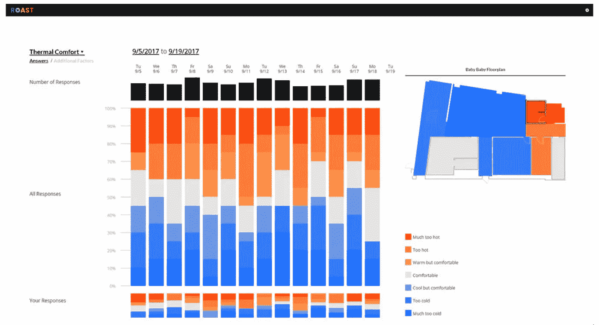

# 数据驱动架构

> 原文：<https://towardsdatascience.com/data-driven-architecture-6b38ccd7d24e?source=collection_archive---------10----------------------->

## 建筑世界的下一步是什么？来自建筑用户的数据会告诉我们。

在他的书《超级计算者》中，伊恩·艾尔斯认为直觉和经验已经不足以让企业做出决策。艾尔斯认为，最好的决策是在专业知识和数据的交汇处做出的。建筑界充满了受过高等教育、经验丰富的专业人士，但缺乏来自数据的建筑见解。

在数据科学之前，我学习和实践了将近十年的架构。随着时间的推移，很明显，建筑是一个严重依赖于 T2 经验的职业。在设计建筑时，建筑师通常依靠历史、经验和直觉。人们可能会在办公室听到这样的短语:

*“在我参与的上一个项目中，我做了 _____。”*

或者类似于:

“过去我总是做 _____。”

即使当建筑师面临一个新的设计问题，我们倾向于尝试和真实的解决方案。在此基础上，我们对建筑设计进行更小的调整和微调，以独特地满足客户的需求和愿望。

话虽如此，我的观点是这样的:**架构师应该在设计过程中优先考虑数据驱动的决策。经验和专业知识现在和将来都很重要，但它被赋予了太多的分量。正如艾尔斯所建议的，数据和经验应该携手合作。我们经常依赖于来自过时经验的“最佳实践”,而构建用户的需求和愿望总是随着时间而变化。为了补救这一点，我们应该设计来自用户的连续反馈回路——在设计之前，以及在入住期间。数据可以告诉我们人们在各种建筑类型中真正想要的是什么:工作场所、教室或医院。问题是——反馈没有被视为架构设计过程中的一个重要步骤。**

尽管缺乏建筑数据收集，但至少有一种方法是一些建筑师目前正在使用的。这种方法被称为**“POE”**或**“使用后评估”**POE 可以采取多种形式，如面对面访谈、电话或现场观察。但最常见的情况是，POE 采取通过电子邮件向建筑用户发送调查问卷的形式。该调查可能会询问有关建筑声学、热舒适、照明、一般美学等方面的问题。问题以不同的形式呈现，如评分表、多项选择或开放式回答。例如:

*你觉得你的工作环境如何:*

*A)太大声*

*B)有点太大声*

*C)刚刚好*

*D)太安静*

或者也许:

*在 1-10 分的范围内，你在当前工作环境中的注意力有多集中？请解释您的评分。*

Poe 通常用于大型建筑类型，如:医疗保健、高等教育和商业建筑。让我们以一个新设计的办公楼为例。建筑完工后，租户搬进去，有时间安顿下来，适应新环境。大约一年后，建筑师会将 POE 发送给业主，业主会将调查结果转发给租户。租户填写这个 POE，它被发送给建筑业主，最后被送回给建筑师。

假设大部分问题都是以结构化的格式呈现的(即多为选择题和评分量表)，那么就可以快速分析数据，而不需要太多的清理来识别设计趋势。这些趋势可以按建筑类型进行组织，并可以在内部进行宣传，以帮助设计师做出决策。来自用户反馈的趋势可以识别用户真正喜欢和不喜欢的空间、设计元素和系统。它们可以显示设计在哪里可行，在哪里不可行。

精心策划的调查数据可以洞察常见的用户行为。对于办公室类型，一项调查可以回答:

*“员工最常使用哪些空间？”*

*“这种开放式办公室的概念对这些用户来说真的很好吗，还是会分散注意力？”*

*“小会议室真的需要自然光吗，为什么？”*

从本质上讲，POE 数据可以消除人们对建筑物及其内部空间需求的猜测。听起来很棒，对吧？

问题是:客户经常从工作范围中删除这些 POE 调查，以节省资金。在业主-建筑师协议中，它通常作为“照菜单点菜”的选项呈现给客户。这使得客户在涉及范围和合同谈判时很容易选择退出。大型实践的领导者应该将 Poe 视为每个项目工作范围的一个要求。**为了跟上建筑用户的技术和行为变化，建筑服务不应再选择 Poe。**

[**KieranTimberlake**](https://kierantimberlake.com/)是费城的一家建筑公司，在整个设计过程中收集和使用多种形式的数据。它的联合创始人斯蒂芬·基兰曾经说过:

“我们的身体需要定期检查，我们的建筑也应该如此。”

正如身体会随着时间的推移而老化和变化，建筑也是如此。POE 数据收集不应只进行一次，而应在建筑物的整个生命周期内定期进行，以确保其处于最佳工作状态。一座建筑可能会保留近一个世纪甚至更久——然而，变化是不可避免的。建筑物的居住者会改变，人们的行为方式会改变，他们对建筑物的要求也会改变。例如，一个旧飞机库可能会成为下一个谷歌总部！

The Spruce Goose Hangar, before adaptive renovations. **Credit: Playa Vista/Brookfield Residential**

The Spruce Goose Hangar, after adaptive renovations for Google Los Angeles. **Credit: ZGF Architects & Google**

数据已经在我们的世界中驱动了如此多的决策:在社交媒体上显示哪些广告，哪个按钮最有吸引力，等等。因此，也许建筑的未来也取决于数据。例如，建筑物中的居住者传感器已经可以收集关于人类活动的数据，以控制建筑物中的照明和 HVAC 的光学和热舒适性。但是，如果建筑从技术世界吸取了教训，并找到了一种方法来持续收集关于居住者对建筑的舒适度和满意度的数据，会怎么样呢？

事实证明，KieranTimberlake 已经开发了一个基于网络的调查应用程序来解决这个问题。这款应用名为“烘焙” [**【烤】**](https://kierantimberlake.com/page/roast) 跨多个变量测量乘员舒适度，包括:温度、湿度、个人活动水平、空气流动、空气质量、视觉刺激和听觉刺激。

The Roast app offers a simple user interface for building occupants to submit information about their day-to-day comfort through a descriptive and structured gradient scale of comfort levels. **Credit: KieranTimberlake**

With colored plans and stacked bar graphs, the Roast app can quickly and graphically tell the story of building user comfort. It shows where in the building occupants are uncomfortable, and in what way they are uncomfortable. **Credit: KieranTimberlake**

KieranTimberlake 的研究员罗德里克·贝茨告诉我们:

有时不舒适的建筑并不是糟糕设计的产物，而是缺乏信息…不了解人们的感受，你就一无所知

这里学到的经验是，建筑用户的最佳表现取决于许多变量。即使最好的建筑师听取了客户的意见，并给出了他们所要求的东西，随着时间的推移，建筑仍然可能无法为用户提供理想的服务。我们需要不断地倾听用户，了解他们需要什么以及他们何时需要。

为了将建筑设计推进到下一个十年，建筑公司应该考虑用数据做以下三件事:

## **1。在建筑设计服务中，定期用户反馈**是强制性的。

## **2。分析收集的用户数据。确定大趋势以及具体的细微差别，以确定以前设计的建筑中的功能差距。**

## **3。发布关键发现，讲述用户舒适度的“故事”。将经验与数据驱动的见解相结合，设计出更好的建筑。**