# 有效的数据挖掘对于制定有效的营销策略至关重要

> 原文：<https://towardsdatascience.com/data-driven-decision-support-system-to-predict-the-success-of-marketing-campaign-719e8541515f?source=collection_archive---------12----------------------->

## 营销活动中的有效自动化

## 使用 ML 算法的营销分析和决策支持系统

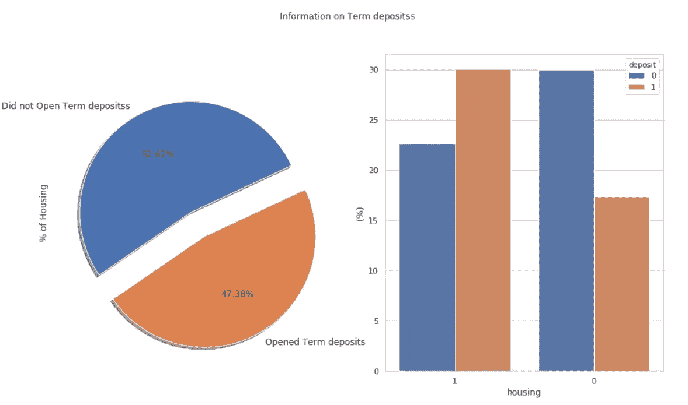

数据挖掘方法通常用于预测不同营销产品的销售成功与否。我们听到了许多时髦的词汇，如商业智能、决策科学、数据科学等。等等。；从广义上讲，他们都支持使用工具&技术将数据转化为商业见解的相同目标。在这里，我们将分析与银行客户、确定的产品和社会经济属性相关的 100 多个特征。

## 用例与问题陈述:

持续的收入损失迫使一家著名银行重新审视其内部流程并进行根本原因分析。他们发现的一个原因是，客户不像以前那样频繁地选择定期存款。因此，银行希望识别现有客户，即那些更有可能选择定期存款的客户，并希望将营销工作集中在这些客户上。

在建模阶段，基于业务知识，我们执行了半自动特征选择，以将维度减少到 17 个相关特征，用于进一步分析。

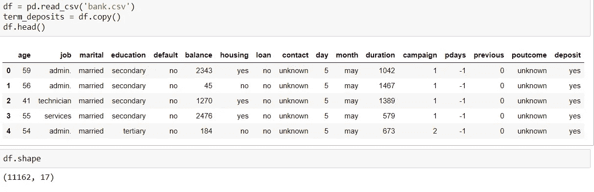

## 特征工程:

特征工程是数据挖掘的关键。除了常用的银行客户端和产品属性之外，这里我还在特性中使用了社会和经济指标。为了保持简单，没有显示整个数据挖掘过程。经过预处理后，数据集的统计概要—

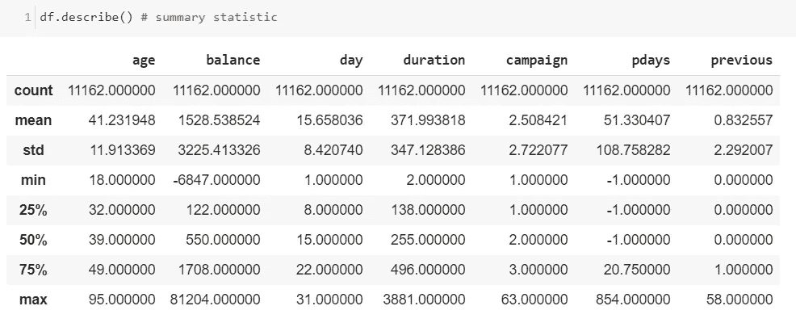

平均余额为 1，528.53，但标准偏差(std)为 3，225.41，因此我们可以通过这一点了解到余额在整个数据集内分布很广。期限与潜在客户是否会购买定期存款高度相关。

平均活动持续时间为 372 (~371.99)，让我们看看高于该平均值的客户是否更有可能开立定期存款账户。因此，需要删除 duration 列；此外，持续时间是在向潜在客户发出呼叫之后获得的，因此如果目标客户从未收到过呼叫，则该功能就没有多大用处。

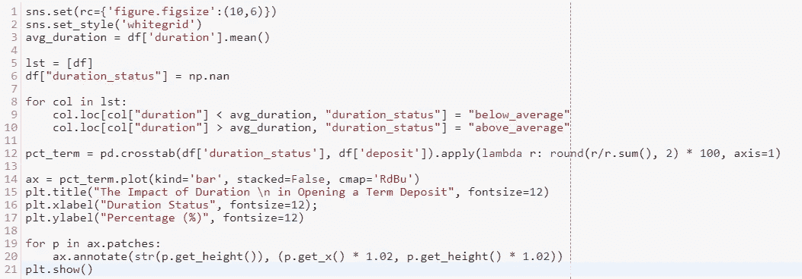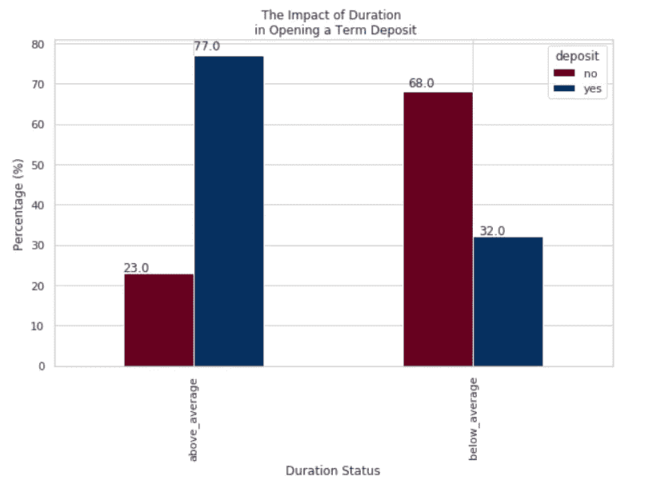

超过期限状态的人更有可能开立定期存款账户。持续时间高于平均值的群体中有 77%开立了定期存款账户，而低于平均值的群体中有 32%开立了定期存款账户(*应为 77/33 或 78/32* )。显然，一个好主意是瞄准那些在平均水平以上的人。

我们可以进行聚类和数据分析，找出历史上哪个变量对定期存款有最重要的影响，例如-

*   婚姻状况&教育、职业、教育、贷款、期限、住房等。

为了简单起见，我将跳过本文中的所有分析。为了便于理解，我将采用一种简单的方法，通过绘制相关图来检查哪些变量与存款相关。

```
corr = df.corr()
sns.heatmap(corr, xticklabels=corr.columns.values, yticklabels=corr.columns.values, annot = True, annot_kws={‘size’:12})
heat_map=plt.gcf()
heat_map.set_size_inches(20,15)
plt.xticks(fontsize=10)
plt.yticks(fontsize=10)
plt.show()
```

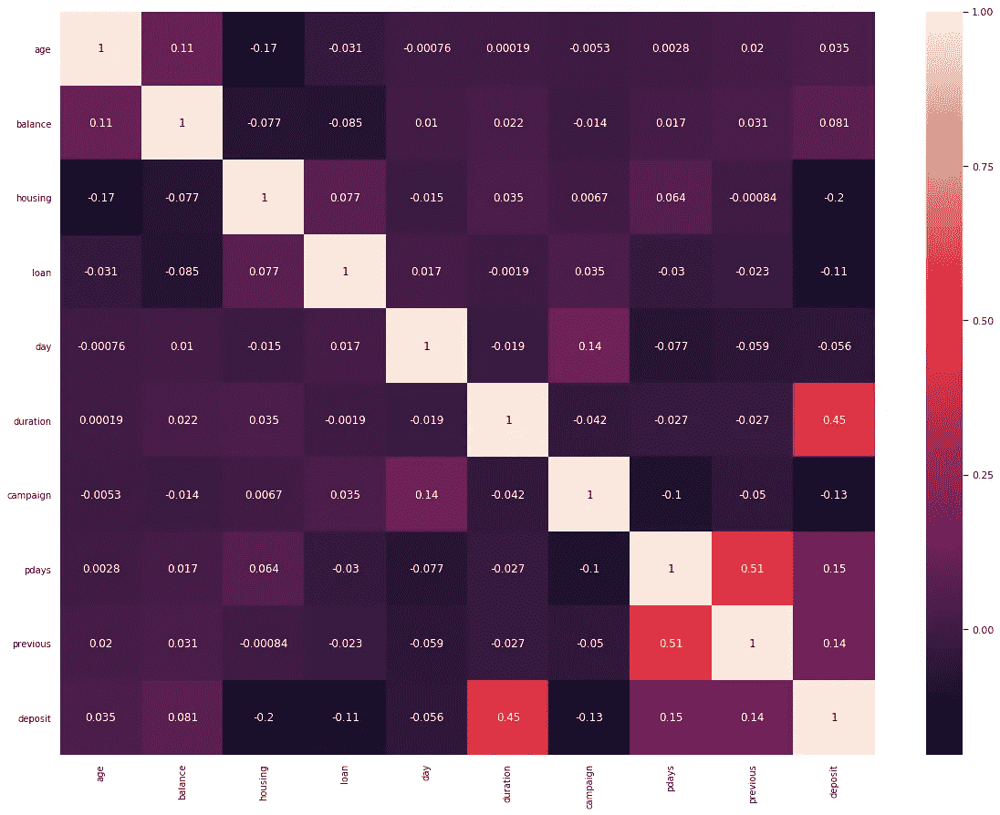

从上面我们可以看出，“住房”和“贷款”是最重要的两个，分别与存款有-20%和-11%的相关性。这里我们将重点讨论“贷款”;让我们看看贷款分布模式。

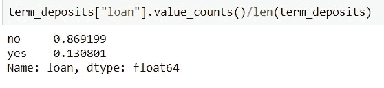

```
ax = (df['deposit'].value_counts() /len(df)*100).plot(kind='bar', stacked = True, rot = 0)
ax.yaxis.set_major_formatter(mtick.PercentFormatter())
ax.set_ylabel('% Customers')
ax.set_xlabel('Personal loan')
ax.set_title('Frequency Percentage by Class')totals = []  # list to collect the plt.patches data# values and append to list
for i in ax.patches:
    totals.append(i.get_width())total = sum(totals)  # setting individual bar labels using above listfor i in ax.patches:
    ax.text(i.get_x()+.15, i.get_height()-3.5,         str(round((i.get_height()/total), 1))+'%’, color = 'white’, weight = 'bold')
```

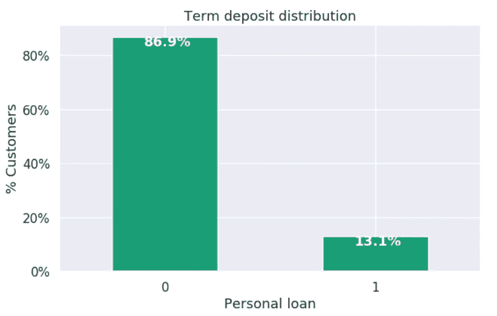

“贷款”一栏包含 87%(86.9%)的“没有”(没有个人贷款)，13%(13.1%)的“有”(有个人贷款)。数据集严重失真。

你可以在这里访问[](/forensic-analytics-application-of-machine-learning-to-anomaly-detection-ccd7bef58097)*来寻找其他不对称数据集的用例。这里，我们希望确保我们的训练和测试集包含相同的比率，即 87%“否”和 13%“是”。*

> *为了避免过度拟合，分层抽样或交叉验证很重要，但是，我们必须确保至少对标签有最大影响的特征(潜在客户是否会开立定期存款)是平均分布的。*

*这里，我们将数据分为训练集和测试集，并实现了分层。*

```
*# Creating pipelines
numerical_pipeline = Pipeline([("select_numeric", DataFrameSelector(["age", "balance", "day", "campaign", "pdays", "previous","duration"])),("std_scaler", StandardScaler())])

categorical_pipeline = Pipeline([("select_cat", DataFrameSelector(["job", "education", "marital", "default", "housing", "loan", "contact", "month","poutcome"])),("cat_encoder", CategoricalEncoder(encoding='onehot-dense'))])

preprocess_pipeline = FeatureUnion(transformer_list=[("numerical_pipeline",  numerical_pipeline),("categorical_pipeline", categorical_pipeline)])*
```

*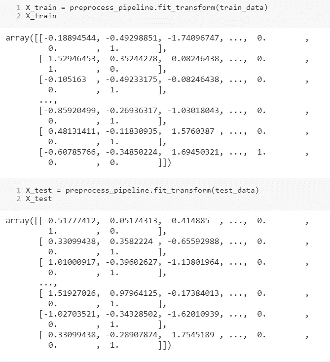**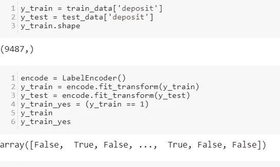*

## *分类算法:*

*现在，训练和测试集已经准备好，让我们通过训练如下 8 个模型来检查哪个分类算法适合我们的情况—*

```
*dict_classifiers = {"Logistic Regression": LogisticRegression(solver='lbfgs', max_iter=5000), "Nearest Neighbors": KNeighborsClassifier(),"Linear SVM": SVC(gamma = 'auto'),"Gradient Boosting Classifier": GradientBoostingClassifier(),"Decision Tree": tree.DecisionTreeClassifier(),"Random Forest": RandomForestClassifier(n_estimators=18),"Neural Net": MLPClassifier(alpha=1),"Naive Bayes": GaussianNB()}no_classifiers = len(dict_classifiers.keys())

**def** batch_classify(X_train, Y_train, verbose = **True**):
    df_results = pd.DataFrame(data=np.zeros(shape= (no_classifiers,3)), columns = ['classifier', 'train_score', 'training_time'])
    count = 0
**for** key, classifier **in** dict_classifiers.items():
    t_start = time.process_time()
    classifier.fit(X_train, Y_train)
    t_end = time.process_time()
    t_diff = t_end - t_start
    train_score = classifier.score(X_train, Y_train)
    df_results.loc[count,'classifier'] = key
    df_results.loc[count,'train_score'] = train_score
    df_results.loc[count,'training_time'] = t_diff
**if** verbose:
    print("trained **{c}** in **{f:.2f}** s".format(c=key, f=t_diff))
    count+=1
**return** df_resultsdf_results = batch_classify(X_train, y_train)
print(df_results.sort_values(by='train_score', ascending=**False**))*
```

*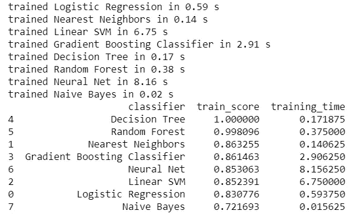*

*我们在这里看到，最有可能的是决策树分类器和随机森林分类器过拟合，因为我们得到了接近完美的分数(100%和 99.62%)准确度分数。*

## *欠拟合(偏差)和过拟合(方差):*

*如果数据本质上更复杂，我们将永远无法用一条线来很好地描述数据集。这种现象被称为欠拟合。它没有足够的模型灵活性来适当地考虑数据中的所有特征；另一种说法是模型有很高的偏差。*

*如果模型拟合具有足够的灵活性，几乎完美地解释了数据中的所有特征，并导致数据的过度拟合。过多的模型灵活性最终会导致随机错误和底层数据分布。换句话说，模型有很高的方差。*

*我们必须采用交叉验证过程来避免这种情况。这样做的主要目的是将数据的整体模式提供给模型。*

```
*# Logistic Regression
log_reg = LogisticRegression(solver=’lbfgs’, max_iter=5000)
log_scores = cross_val_score(log_reg, X_train, y_train, cv=3)
log_reg_mean = log_scores.mean()# SVC
svc_clf = SVC(gamma=’auto’)
svc_scores = cross_val_score(svc_clf, X_train, y_train, cv=3)
svc_mean = svc_scores.mean()# KNearestNeighbors
knn_clf = KNeighborsClassifier()
knn_scores = cross_val_score(knn_clf, X_train, y_train, cv=3)
knn_mean = knn_scores.mean()# Decision Tree
tree_clf = tree.DecisionTreeClassifier()
tree_scores = cross_val_score(tree_clf, X_train, y_train, cv=3)
tree_mean = tree_scores.mean()# Gradient Boosting Classifier
grad_clf = GradientBoostingClassifier()
grad_scores = cross_val_score(grad_clf, X_train, y_train, cv=3)
grad_mean = grad_scores.mean()# Random Forest Classifier
rand_clf = RandomForestClassifier(n_estimators=18)
rand_scores = cross_val_score(rand_clf, X_train, y_train, cv=3)
rand_mean = rand_scores.mean()# NeuralNet Classifier
neural_clf = MLPClassifier(alpha=1)
neural_scores = cross_val_score(neural_clf, X_train, y_train, cv=3)
neural_mean = neural_scores.mean()# Naives Bayes
nav_clf = GaussianNB()
nav_scores = cross_val_score(nav_clf, X_train, y_train, cv=3)
nav_mean = neural_scores.mean()# Create a Dataframe with the results.
d = {‘Classifiers’: [‘Logistic Reg.’, ‘SVC’, ‘KNN’, ‘Dec Tree’, ‘Grad B CLF’, ‘Rand FC’, ‘Neural Classifier’, ‘Naives Bayes’], 
 ‘Crossval Mean Scores’: [log_reg_mean, svc_mean, knn_mean, tree_mean, grad_mean, rand_mean, neural_mean, nav_mean]}result_df = result_df.sort_values(by=['Crossval Mean Scores'], ascending=**False**)
result_df*
```

*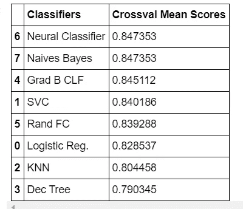*

*我们将以 84.51%的分数进行梯度提升。*

```
*y_train_pred = cross_val_predict(grad_clf, X_train, y_train, cv=3)
grad_clf.fit(X_train, y_train)
print ("Gradient Boost Classifier accuracy is **%2.2f**" % accuracy_score(y_train, y_train_pred))# Gradient Boost Classifier accuracy is 0.85*
```

## *分类报告:*

*此报告显示了每个类别的主要分类指标。*

> *分类报告提供了对分类器行为的更深层次的直觉，而不是全局准确性，这可以掩盖多类问题中某一类的功能缺陷。*

*该报告显示模型的精确度、召回率、F1 和支持度分数。*

```
*conf_matrix = confusion_matrix(y_train, y_train_pred)
f, ax = plt.subplots(figsize=(10, 6))
sns.heatmap(conf_matrix, annot=**True**, fmt="d", linewidths=.5, ax=ax)
plt.title("Confusion Matrix", fontsize=12)
plt.subplots_adjust(left=0.15, right=0.99, bottom=0.15, top=0.99)
ax.set_yticks(np.arange(conf_matrix.shape[0]) + 0.5, minor=**False**)
ax.set_xticklabels("")
ax.set_yticklabels(['Refused T. Deposits', 'Accepted T. Deposits'], fontsize=12, rotation=360)
plt.show()*
```

*从上表我们可以看出，阳性预测值为{4150 /( 4150+826)} 83.4%，阴性预测值为{3857/(654+3857)} 85.5%。这主要是由我们选择的阈值决定的。*

*为了确定我们的模型有多好，我们需要度量标准，如**真阳性率** ( **TPR/即** **回忆**)，**假阳性率** ( **FPR** )和**精度**，这将 ***随**阈值**变化*，我们选择将预测概率转化为预测类别(0 或 1)。***

*如果我们检查**每一个可能的阈值**并计算这些*度量*，我们可以为给定的模型建立**接收器工作特性** ( **ROC** )曲线和**精确召回** ( **PR** )曲线。*

## *精确度、召回率、f1 分数和排队率的可视化:*

*辨别阈值是肯定类别被选择超过否定类别的概率或分数。通常，该值设置为 50%,但可以调整阈值，以增加或减少对误报或其他应用因素的敏感度。*

*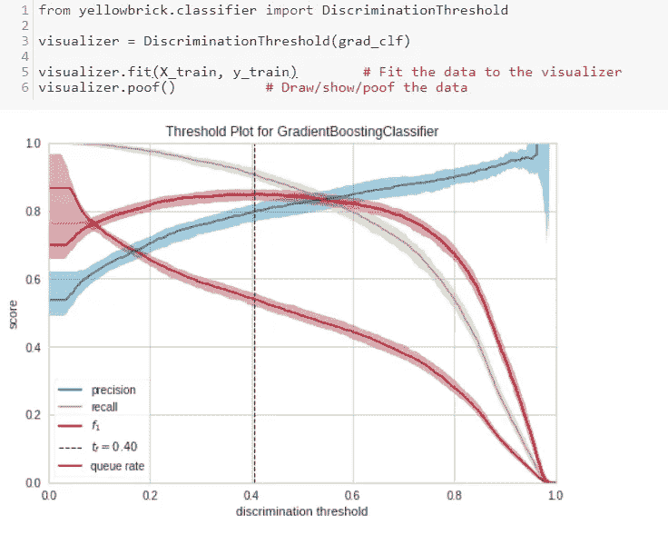*

*在上图中，我们看到可视化工具被调整为寻找最佳 F1 分数，该分数被标注为阈值 0.41。如果概率> 0.41，则选择正类，否则选择负类。然而，该阈值可能不是最佳阈值:相对于区分阈值，精确度和召回率之间通常存在反比关系。通过调整分类器的阈值，可以将 F1 分数(精确度和召回率的调和平均值)调整到最佳拟合，或者调整分类器以针对特定应用表现最佳。通过考虑以下指标来调整分类器:*

*   *精确度:精确度的提高意味着假阳性数量的减少；当特殊待遇的成本很高时(例如在定期存款市场活动中浪费时间)，应优化该指标。*
*   *回忆:回忆的增加减少了肯定类被错过的可能性；当即使以更多的假阳性为代价也要抓住这个案例时，这个度量应该被优化。*
*   *F1 分数:F1 分数是精确度和召回率之间的调和平均值。fbeta 参数确定计算此指标时精度和召回的相对权重，默认设置为 1 或 F1。优化这一指标可以在精确度和召回率之间取得最佳平衡。*
*   *排队率:“排队”是存款查询的术语。此度量描述必须审查的实例的百分比。如果定期存款的审查成本很高，则必须根据业务要求尽量降低成本。如果没有，这可以被优化以确保查询框是干净的。*

*我们看到，该图被调整为寻找最佳 F1 分数，该分数被标注为阈值 0.40。该模型在多个训练/测试分割上运行多次，以说明模型相对于指标的可变性(显示为中间曲线周围的填充区域)。*

# *ROC 曲线(受试者操作特征)AUC(曲线下面积):*

*如果我们绘制一系列分界点的真阳性结果的分数(真阳性数/有存款的数)与假阳性结果的分数(假阳性数/无存款的数)的关系图，它将生成一条 ROC 曲线。该曲线以图形方式描述了调整截止点时灵敏度和特异性之间的权衡*

*ROC 测量分类器的预测质量，并可视化模型的灵敏度和特异性之间的权衡。在 Y 轴上绘制的 TP 比率和在 X 轴上绘制的 FP 比率基于全球平均值和每个类别。因此，理想点是图的左上角:FP 为零，TP 为一。这就引出了 AUC，也就是 FP 和 TP 的关系。AUC 越高，模型越好。然而，检查曲线的“陡度”也很重要，因为这描述了 TP 率的最大化同时 FP 率的最小化。*

*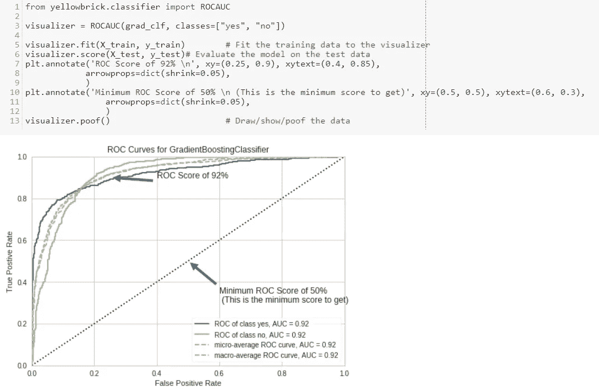*

*现在我们可以说，如果我们愿意接受 20%的 *FPR* ，我们将得到 60%以上的 *TPR* 。*

## *精确召回曲线:*

*用于评估分类器质量的精确召回曲线度量。精度-召回曲线显示了精度(结果相关性的度量)和召回(返回多少相关结果的度量)之间的权衡。曲线下的大部分区域表示高召回率和高精度，这是分类器的最佳情况，显示了为其选择的大多数类返回准确结果的模型。*

*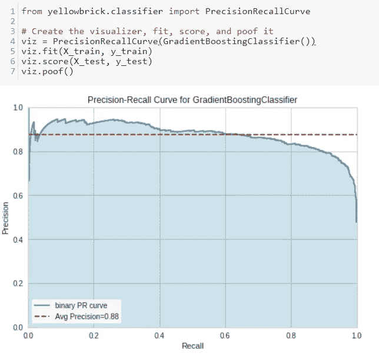*

*在上图中，我们可以看到 y 轴上的精度与 x 轴上的召回率的关系。填充区域越大，分类器越强。红线标注了平均精度，这是整个图的摘要，计算为每个阈值达到的精度的加权平均值，因此权重是与前一个阈值的召回差异。这里说，我们的模型预测平均准确率为 88%。*

## *学习曲线:*

*学习曲线显示了具有不同数量训练样本的评估者的训练分数与交叉验证测试分数之间的关系。它是一种工具，可以发现我们从添加更多的训练数据中获益多少，以及估计量是更容易受到方差误差还是偏差误差的影响。*

*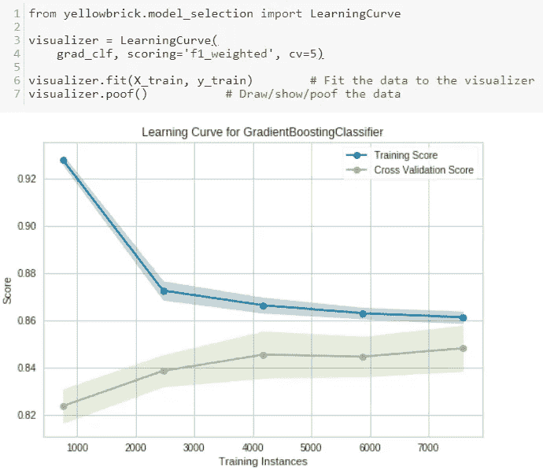*

*随着更多数据的添加，训练和交叉验证分数会聚合在一起，因此模型可能不会从更多数据中受益。曲线以平均分数绘制，但是交叉验证期间的可变性以阴影区域显示，代表所有交叉验证平均值上下的标准偏差。我们可以看到，训练分数和交叉验证分数最后都不是很好。然而，曲线的形状显示，训练分数在开始时非常高(超过 92%)，并且下降到接近 86%，交叉验证分数在开始时非常低(接近 82%)，并且上升到接近 85%。因此，我们看到训练和验证分数最终几乎相等。添加更多的训练样本很可能会提高泛化能力。*

## *升力/增益曲线:*

> *“累积收益和提升曲线是一种简单而有用的方法，基于使用预测模型锁定最有前景的客户，可以了解我们开展营销活动可能获得的回报以及我们应该联系多少客户”*

*提升/累积收益图表用于评估结果，因为每个结果都有成本。这些信息还可以用来决定打电话的次数，以平衡营销成本和最终电话的预期回报。每个目标客户都有相关的成本(*直接&间接*)，因此我们的目标是最大限度地增加通过电话营销获得的受访者数量。现实情况是，挖掘模型很可能介于两个极端之间；在随机猜测和完美预测之间。随机猜测的任何改进都被认为是提升。*

## *十分位数组:*

*使用拟合的模型，我们可以将从历史营销活动中观察到的结果(即，谁回应了谁没有回应)与该活动中联系的每个客户的预测回应概率进行比较。在实践中，该模型适用于数据的子集，并使用该模型来预测“拒绝”样本中每个客户的响应概率，以更准确地评估该模型对新客户的表现。*

*可以通过按照客户的预测概率从最高(最接近 1)到最低(最接近 0)的降序对客户进行排序来制作图表。将客户分成大小相等的部分，我们创建包含相同数量客户的组。因此，我们预测最有可能做出响应的客户位于十分之一组 1，其次是十分之一组 2，依此类推。检查每个十分位数组，我们可以生成一个十分位数汇总，总结每个十分位数中客户和受访者的数量和比例。*

## *累积收益:*

*从十分位数汇总，我们还可以计算出模型提供的*累计收益。我们将调查对象的累计百分比与营销活动中各组接触的累计百分比进行比较。这是针对使用最高响应概率的客户总数的给定百分比的 ***【增益】*** ，而不是随机针对他们。**

**该图显示了该模型将受访者和非受访者区分开来的效果。在这里，人口被分为十分之一，根据他们成功的预测概率递减的顺序。**

```
**skplt.metrics.plot_cumulative_gain(y_test, predicted_probas)
plt.show()**
```

**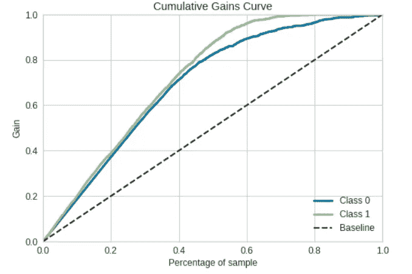**

**斜虚线表示随机猜测的结果，是评估 lift 的基线。我们得到另外两行:一行显示训练数据集的理想结果，第二行显示模型的实际提升，或者结果的改进。这里，过滤模型的理想线显示在等级 1 中，而实际升力线显示在等级 0 中。我们可以从图表中看出，理想线的峰值在 60%左右，这意味着我们可以通过向总人口的 60%发送邮件来接触到 100%的目标客户。**

**根据发送每个电话的相关成本和每个回答者的预期收入，累积收益图可用于决定联系的最佳客户数量。**

```
**skplt.metrics.plot_lift_curve(y_test, predicted_probas, title=’Lift Curve’, ax=None, figsize=None, title_fontsize=’large’, text_fontsize=’medium’)**
```

## **电梯:**

**我们还可以看一下 ***提升*** 所实现的目标客户群百分比递增，按概率递减排序。 ***提升*** 简单来说就是调查对象的百分比与联系客户的百分比之比。所以，与随机联系客户相比，1 的提升相当于没有收获。然而，举个例子来说，lift 值为 2 时，与我们通过随机联系相同数量的客户所预期的数量相比，联系到的受访者数量是两倍。因此，我们可能只接触了 40%的客户，但我们可能接触到了客户群中 80%的受访者。因此，与联系随机抽样的客户相比，我们将目标群体的受访者数量增加了一倍。**

**这些数字可以显示在升力曲线上。理想情况下，我们希望提升曲线尽可能高地延伸到图的左上角，这表明我们与一小部分客户的联系有很大的提升。**

**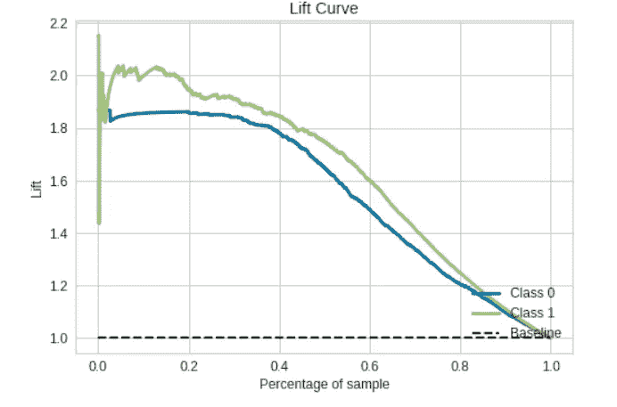**

**现在，我们的预测模型已经准备好了，让我们找出影响*定期存款认购结果的特征。这可以使用决策树、XGB 或 RandomForest 等来完成。为此我使用了决策树。***

## ***决策树分类器:***

***我们的分类器的三个最重要的特征是-***

***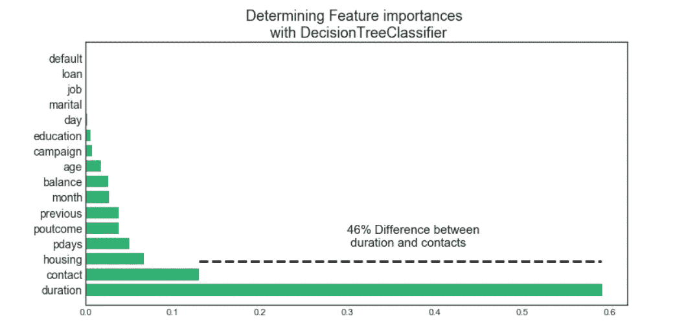***

*   ***持续时间(销售代表和潜在客户之间的对话持续了多长时间)，***
*   ***联系人(同一营销活动中潜在客户的联系人数量)，***
*   ***月份(一年中的月份)。***

# ***摘要***

***现在我们已经完成了所有的分析和预测模型，是时候设计一个营销策略了***

*   ***从历史数据中，我们可以找出营销活动水平最高的月份。在此基础上，可以决定活动的时间。***
*   ***从年龄类别中，我们可以向下钻取并找出现有存款人的平均年龄。在此基础上，活动可以在下一次活动中瞄准这个年龄。***
*   ***职业也可能对存款有影响，这也可以从数据中挖掘出来。所以，这也给营销人员一些提示。***
*   ***从统计汇总中我们看到，持续时间越长(> 372 ~371.99)，该目标群体开立定期存款账户的可能性越大。这个群体开立定期存款账户的可能性为 78%，这是相当高的。这将使得下一次营销活动的成功率非常高。***

******我这里可以到达***[](https://www.linkedin.com/in/saritmaitra/)****。*******