# 数据驱动的在旧金山哪里停车的决策

> 原文：<https://towardsdatascience.com/data-driven-decisions-for-where-to-park-in-sf-98f96ae0a63a?source=collection_archive---------24----------------------->

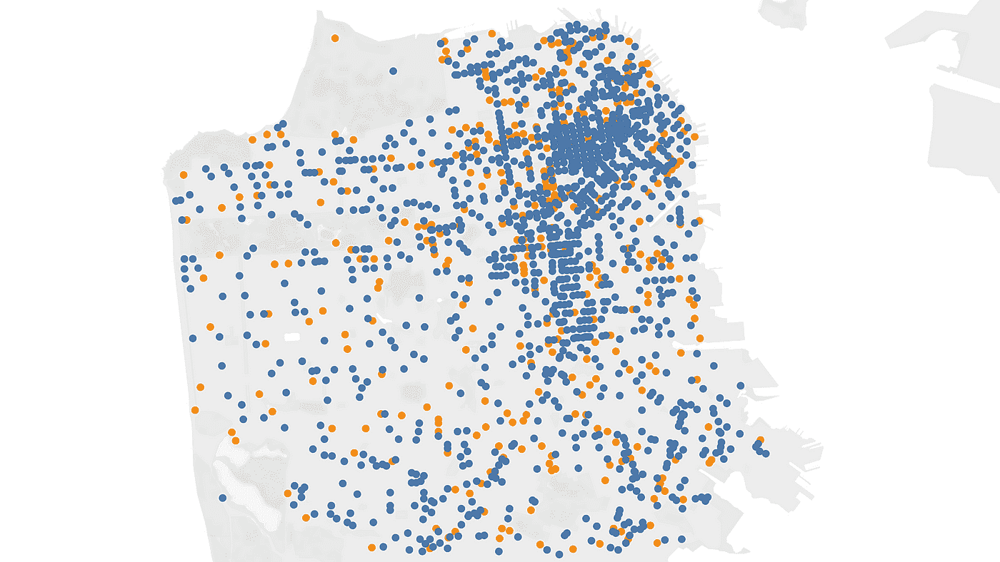

你有没有觉得在阴凉的地方停车不确定？特别是，您是否曾经在旧金山停车，并想知道，如果我测量 SFPD 去年记录的每起车辆事故的平均平方反比距离，我当前的位置会落在哪个百分点？

如果是这样，我们为那个开发了一个应用[。在本帖中，我们将解释我们的方法及其实现。](https://rockset.com/sf-parking)

# 旧金山停车

众所周知，与车辆相关的入室盗窃和盗窃在旧金山[司空见惯。就在上周，价值 50 万美元的物品在](https://www.nbcbayarea.com/news/local/Breaking-Point-475109113.html)[一起高调的汽车盗窃案](https://abc7news.com/sf-community-reacts-to-police-response-over-car-burglary-with-celebrity-victim/5465666/)中被盗。甚至还有一个[推特账号](https://twitter.com/sfcarbreakins)追踪事件。

旧金山警察局维护着自 2018 年 1 月 1 日以来所有事件的持续[数据集(还有一个](https://data.sfgov.org/Public-Safety/Police-Department-Incident-Reports-2018-to-Present/wg3w-h783)[2003-2018](https://data.sfgov.org/Public-Safety/Police-Department-Incident-Reports-Historical-2003/tmnf-yvry))。《旧金山纪事报》由此创造了一个[巨大的地图可视化](https://projects.sfchronicle.com/trackers/sf-car-breakins/)来追踪非法闯入。我们希望让这些数据更具可操作性，以帮助实时评估特定位置的停车安全性。

因此，激励性的问题是:如果我想在旧金山停车，我怎么能感觉到我现在的位置有多安全？

# 定义风险分值

当然，停车位的风险可以用许多不同的定性和定量方法来衡量。我们选择了一个量化指标，无可否认是相当武断的，作为过去一年中停车地点和每个闯入地点之间距离的平均平方反比。

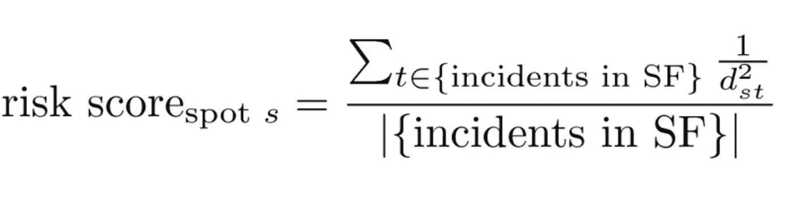

这只是给出一个数字分数。然后，我们评估整个旧金山停车点代表性样本的得分，并将当前停车点置于该样本中的百分位数。分数越高，地点离历史事件越近(距离的倒数)，风险就越高。

我们将把这一切都包装在一个简单的移动网络应用程序中，这样你就可以从你的车上打开它，按下一个按钮，就可以得到你的停车位有多安全的百分比。

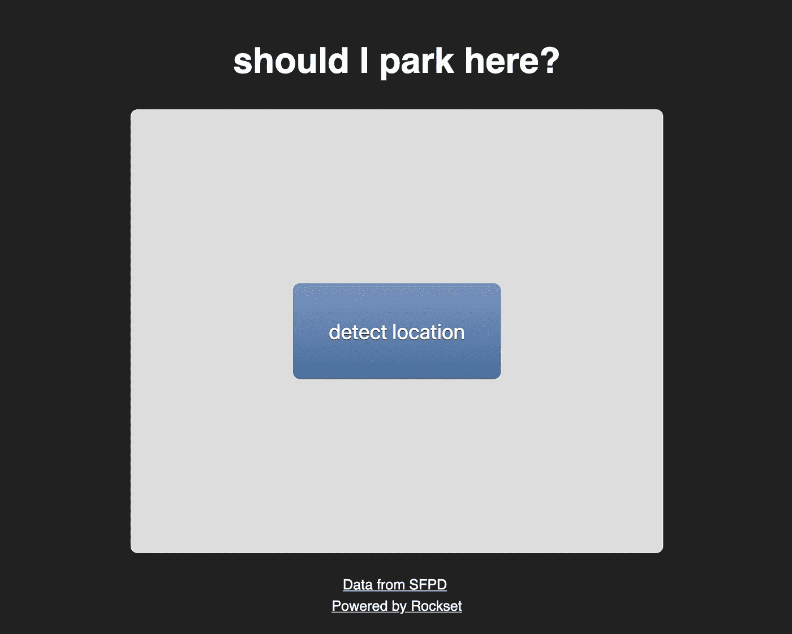

现在，我们只需使用数据来计算风险分值百分比。对于此任务，我们将把 SFPD 数据加载到 Rockset 集合中，并在用户单击按钮时查询它。

# 加载数据

为了快速开始，我们将简单地下载 CSV 格式的数据，并将文件上传到一个新的集合中。

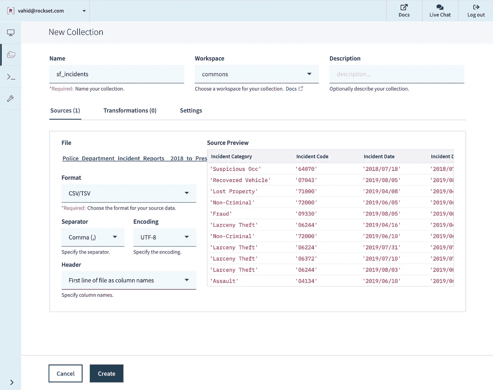

稍后，我们可以设置一个定期作业，通过 API 将数据集转发到集合中，以便它总是保持最新。

# 过滤数据

让我们切换到 query 选项卡，尝试编写一个查询来过滤我们关心的事件。我们要检查几个条件:

*   **车辆相关事故。**每个事件都有一个由警察局犯罪分析股指定的“事件子类别”。我们在这个字段上做一个`SELECT DISTINCT`查询，扫描结果，挑选出我们认为与车辆相关的。

> 机动车辆盗窃
> 
> 机动车辆盗窃(未遂)
> 
> 车内盗窃
> 
> 盗窃罪—汽车零部件
> 
> 盗窃——从车辆中

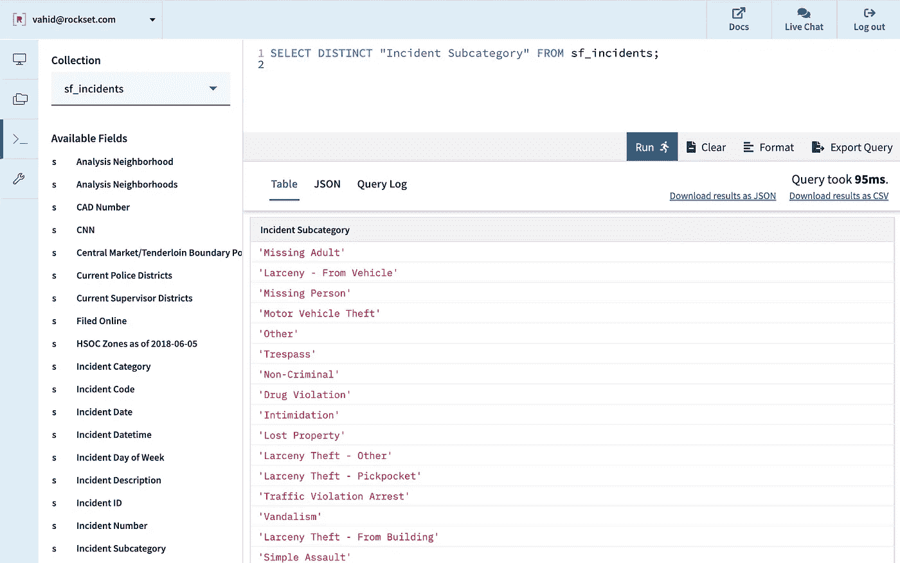

*   **初次报告。**根据[数据文档](https://data.sfgov.org/Public-Safety/Police-Department-Incident-Reports-2018-to-Present/wg3w-h783)，记录一旦归档就无法编辑，因此一些记录作为现有事件的“补充”归档。我们可以通过在报告类型描述中查找单词“Initial”来过滤掉它们。

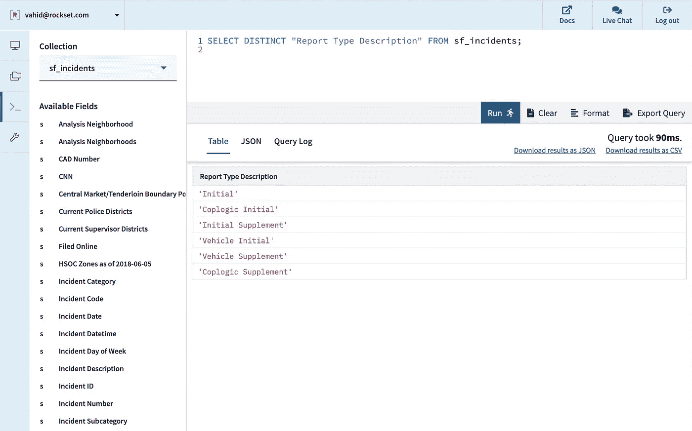

*   **顺丰内部。**文件还规定一些事件发生在旧金山以外，这些事件在“警区”字段中的值为“旧金山以外”。

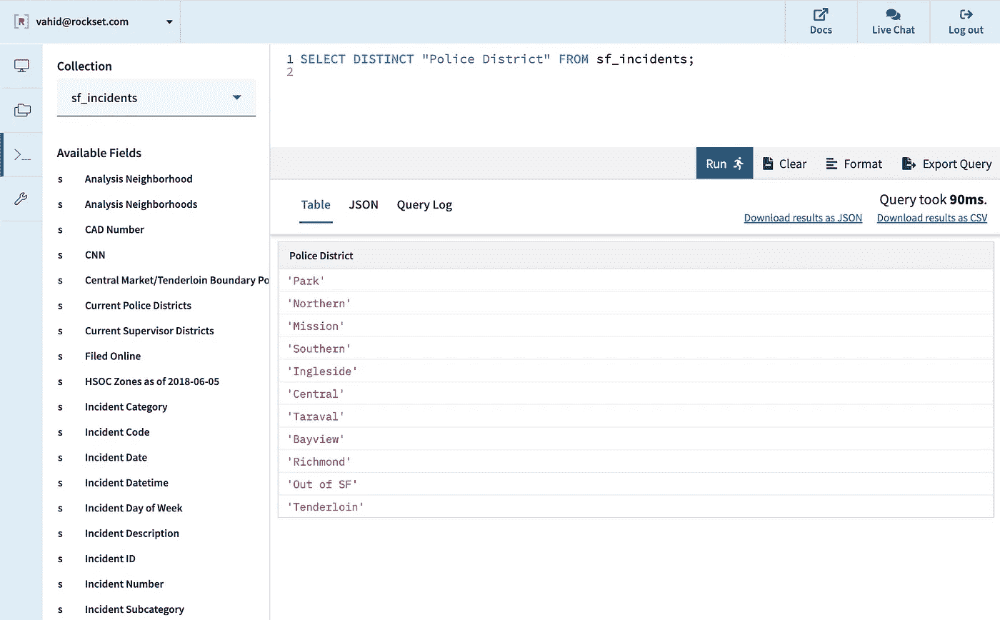

*   **去年。**数据集提供了一个日期时间字段，我们可以解析它并确保它在过去 12 个月内。

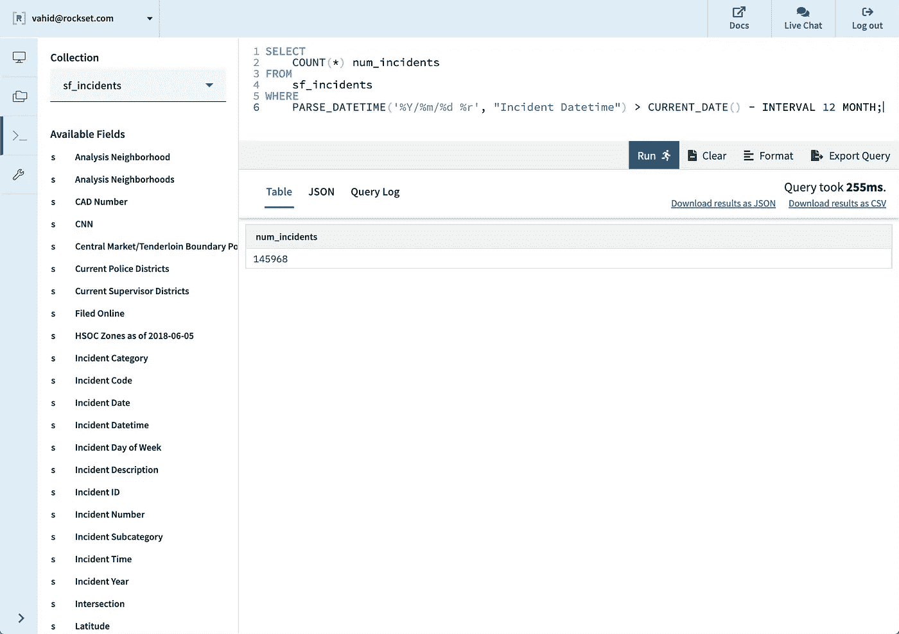

*   **地理定位可用。**我们注意到一些行缺少纬度和经度字段，取而代之的是一个空字符串。我们将通过过滤掉这些记录来忽略它们。

将所有这些条件放在一起，我们可以从这个数据集中的 242，012 条记录精简到 28，224 个相关的车辆事故，打包成一个`WITH`查询。

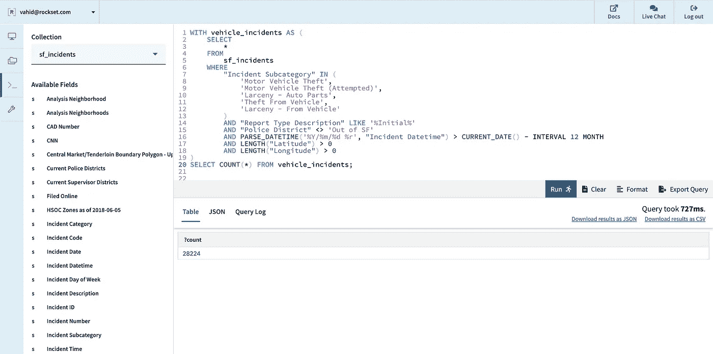

# 计算风险分数，一个点

现在我们有了去年的所有车辆事故，让我们看看是否可以计算旧金山市政厅的安全分数，该市政厅的纬度为 37.7793 N，经度为 122.4193 W。

使用一些古老的数学技巧(半径乘以弧度角度得到弧长，将弧长近似为直线距离，以及毕达哥拉斯定理)，我们可以计算到每个过去事件的英里距离:

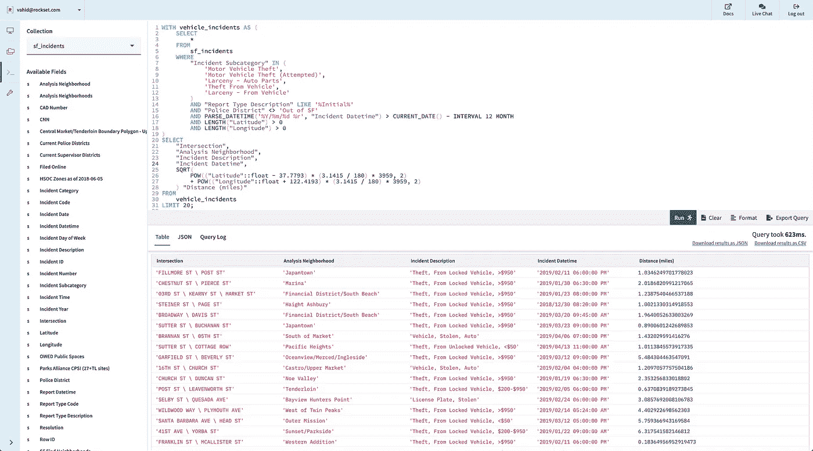

我们用上面的公式计算这些距离，瞧！

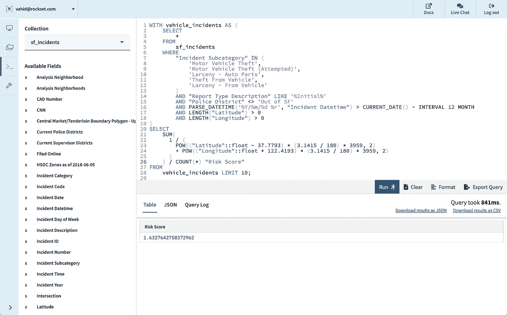

对于我们的应用程序，我们将用来自用户浏览器位置的参数替换市政厅的纬度/经度。

# 旧金山停车点示例

因此，我们可以计算出一个风险分数——市政厅为 1.63——但这毫无意义，除非我们可以将其与旧金山的其他停车点进行比较。我们需要在旧金山找到一组有代表性的所有可能的停车点，并计算每个停车点的风险分数，以获得风险分数的分布。

事实证明，SFMTA 正是我们所需要的——进行实地调查来统计路边停车位的数量，他们的结果作为开放数据集发布[。我们也会把这个上传到 Rockset！](https://data.sfgov.org/Transportation/On-street-Parking-based-on-Parking-Census/9ivs-nf5y)

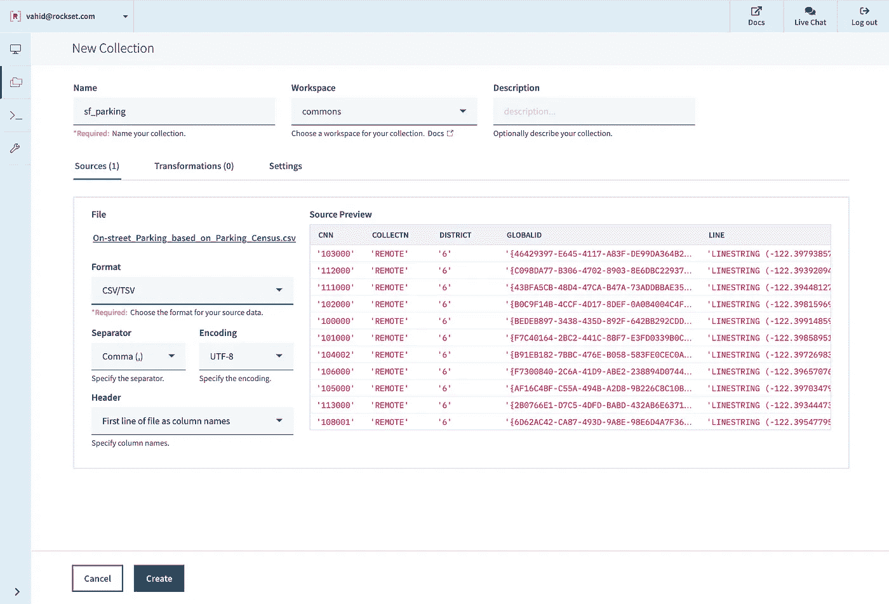

让我们看看这个数据集包含什么:

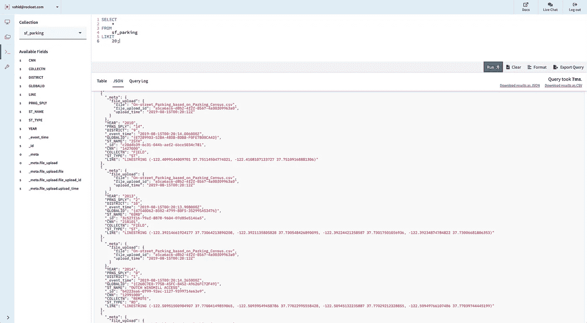

对于每条街道，让我们提取纬度/经度值(只是第一个点，足够接近的近似值)、点的计数和唯一标识符(根据需要转换类型):

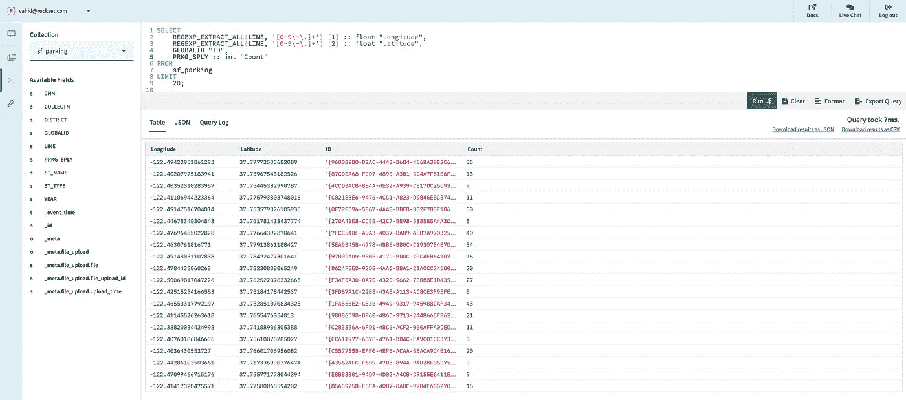

# 计算风险分数，SF 中的每个点

现在，让我们试着计算每个点的分数，就像我们在上面对市政厅所做的一样:

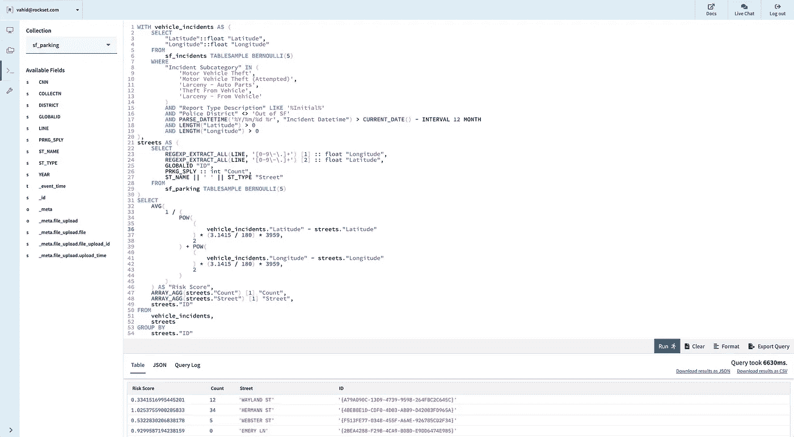

我们做到了！旧金山每个街道段的停车风险分数。这是一个繁重的查询，所以为了减轻负担，我们实际上对每个街道和事件抽取了 5%的样本。

(即将推出 Rockset:geo-indexing——在接下来的几周内，请关注关于这方面的博客文章！)

让我们将这个查询的结果存储在另一个集合中，这样我们就可以用它来计算百分位数。我们首先创建一个新的空集合:

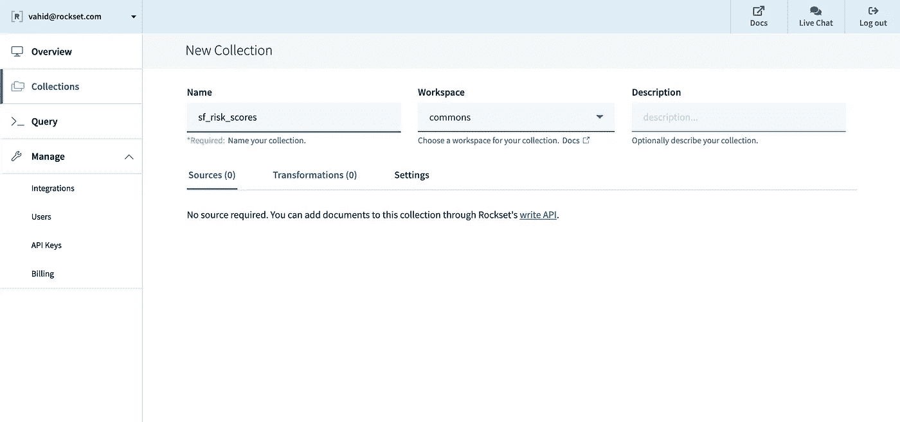

现在我们运行一个`INSERT INTO sf_risk_scores SELECT ...`查询，对事件和街道进行高达 10%的采样:

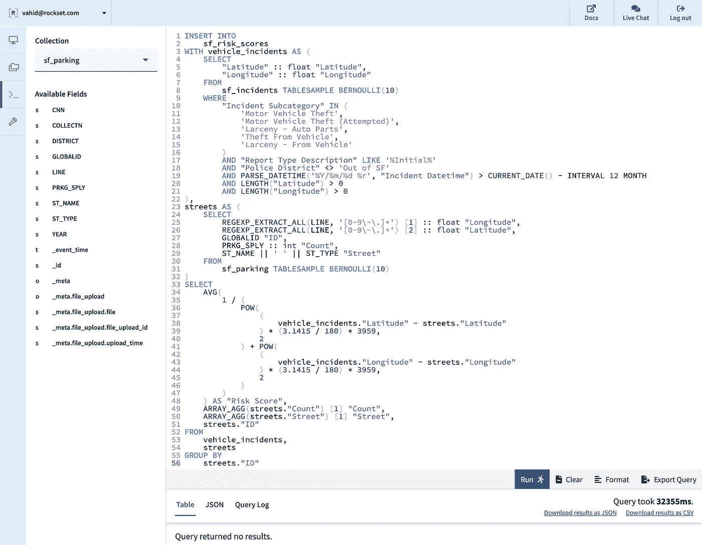

# 以百分位数对风险评分进行排序

现在，让我们根据插入到`sf_risk_scores`中的样本来获取市政厅的百分比。我们保留了最初的停车位分数计算方法，但现在也计算了比当前停车位更安全的采样停车位的百分比。

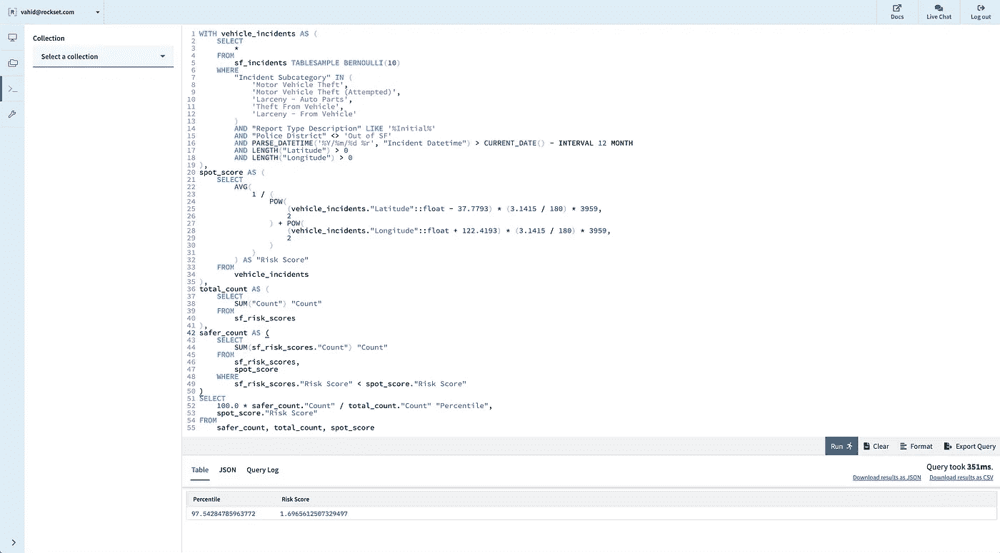

# 停车点风险评分即服务

现在我们有了一个可以说是有用的查询，让我们把它变成一个应用程序吧！

我们将保持简单——我们将创建一个 AWS Lambda 函数来服务两种类型的请求。根据`GET`的请求，它将服务于一个本地`index.html`文件，该文件充当 UI。对于`POST`请求，它将解析`lat`和`lon`的查询参数，并将它们作为上面最后一个查询中的参数传递。lambda 代码如下所示:

对于客户端，我们编写一个脚本来获取浏览器的位置，然后调用后端:

我们添加了一些基本的 HTML 元素和样式，它已经准备好了！

最后，我们添加 API Gateway 作为 lambda 的触发器，并将 Rockset API 密钥放入环境中，这些都可以在 AWS 控制台中完成。

# 结论

总结一下我们在这里所做的事情:

*   我们采用了两个相当简单的数据集——一个是 SPFD 报告的事件，一个是 SFMTA 报告的停车点——并将数据加载到 Rockset 中。
*   经过几次 SQL 迭代之后，我们有了一个 API，可以调用它来获取给定地理位置的风险分数。
*   我们在 AWS Lambda 中编写了一些简单的代码，作为移动 web 应用程序。

唯一需要的软件是一个 web 浏览器(下载数据，在 Rockset 控制台中查询，在 AWS 控制台中部署)，从构思到生产，总共不到一天就完成了。lambda 的源代码可在[这里](https://github.com/rockset/recipes/tree/master/sf-parking)获得。

如果你在旧金山停车，请在这里随意试用应用程序[。如果不是，请评论你认为哪些现实生活中的决策可以通过更多的数据来改进！](https://rockset.com/sf-parking)

【https://rockset.com】最初发表于**。**