# 了解你的衡量标准

> 原文：<https://towardsdatascience.com/data-driven-growth-with-python-part-1-know-your-metrics-812781e66a5b?source=collection_archive---------2----------------------->

## [使用 Python 实现数据驱动的增长](https://towardsdatascience.com/tagged/data-driven-growth)

## 了解使用 Python 追踪什么以及如何追踪

**简介**

这一系列文章旨在解释如何以一种简单的方式使用 Python，通过将预测方法应用于您的所有行动来推动您公司的发展。它将是编程、数据分析和机器学习的结合。

我将在以下九篇文章中讨论所有主题:

**1-了解你的衡量标准**

2- [客户细分](/data-driven-growth-with-python-part-2-customer-segmentation-5c019d150444)

3- [客户终身价值预测](/data-driven-growth-with-python-part-3-customer-lifetime-value-prediction-6017802f2e0f)

4- [流失预测](/churn-prediction-3a4a36c2129a)

[5-预测下一个购买日](/predicting-next-purchase-day-15fae5548027)

[6-预测销售额](/predicting-sales-611cb5a252de)

[7-市场反应模型](/market-response-models-baf9f9913298)

[8-隆起建模](/uplift-modeling-e38f96b1ef60)

[9- A/B 测试设计和执行](/a-b-testing-design-execution-6cf9e27c6559)

文章将有自己的代码片段，使您可以轻松地应用它们。如果你是编程的超级新手，你可以在这里很好地介绍一下 [Python](https://www.kaggle.com/learn/python) 和 [Pandas](https://www.kaggle.com/learn/pandas) (一个我们会在任何事情上使用的著名库)。但是仍然没有编码介绍，您可以学习概念，如何使用您的数据并开始从中产生价值:

> 有时候你必须先跑，然后才能走——托尼·斯塔克

作为先决条件，确保你的电脑上安装了 J [upyter Notebook](https://jupyter.readthedocs.io/en/latest/install.html) 和 P [ython](https://www.python.org/downloads/) 。代码片段只能在 Jupyter 笔记本上运行。

好吧，我们开始吧。

# 第 1 部分:了解您的度量标准

我们都记得斯派洛船长著名的指南针，它显示了他最想要的东西的位置。没有**北极星指标**，这就是我们的增长情况。我们想要更多的客户、更多的订单、更多的收入、更多的签约、更高的效率…

在进入编码之前，我们需要理解什么是北极星度量标准。如果你已经知道并跟踪它，这篇文章可以帮助你用 Python 做一个深入的分析。如果你不知道，首先你应该找到你的(可能你已经在追踪它但没有在概念上将其命名为北极星)。这是肖恩·埃利斯对它的描述:

> **北极星指标**是*单一指标*，最能抓住你的产品向客户传递的核心价值。

该指标取决于贵公司的产品、定位、目标等。Airbnb 的北极星指标是预订的夜晚，而脸书的指标是每日活跃用户。

在我们的例子中，我们将使用在线零售的样本数据集。对于在线零售商，我们可以选择北极星指标作为**月收入。让我们看看我们的数据在 jupyter 笔记本上是什么样的。**

## 月收入

让我们从导入我们需要的库开始，并在 pandas 的帮助下从 CSV 读取我们的数据:

我们的数据看起来是这样的:

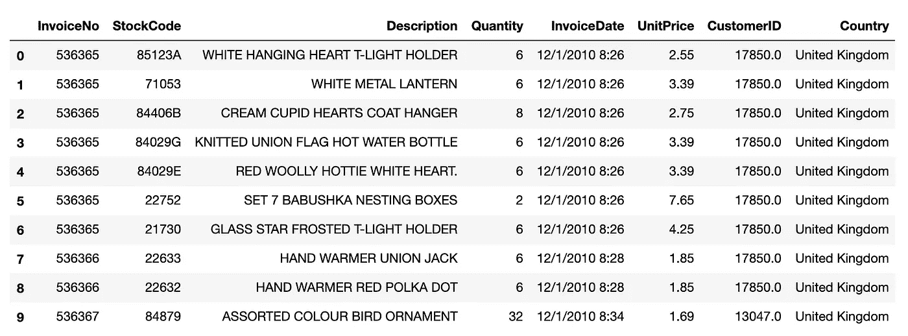

我们有所有需要的关键信息:

*   客户 ID
*   单价
*   量
*   发票日期

有了所有这些特征，我们可以建立我们的北极星度量方程:

> **收入** =活跃客户数*订单数*平均每单收入

是时候把手弄脏了。我们希望看到每月的收入，但不幸的是没有免费的午餐。让我们设计我们的数据:

干得好，现在我们有了一个显示我们每月收入的数据框架:

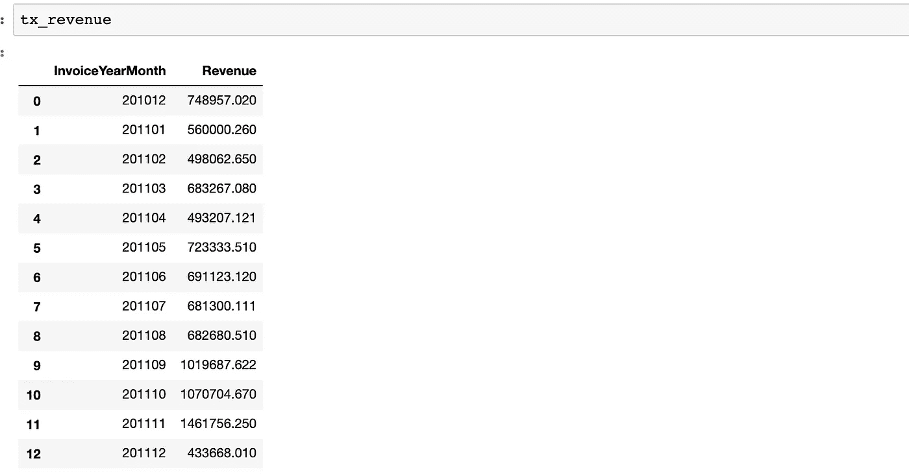

下一步，可视化。线图就足够了:

Jupyter 笔记本输出:

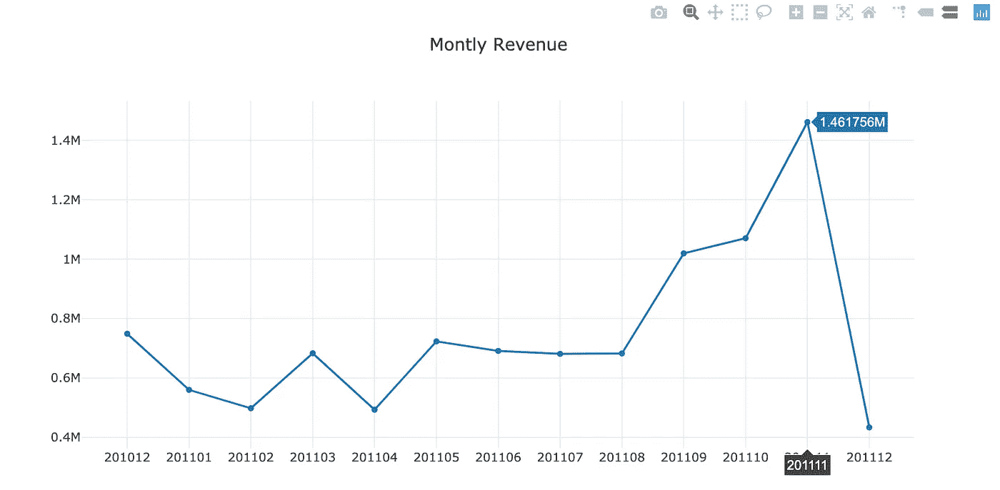

这清楚地表明我们的收入正在增长，尤其是从 8 月 11 日开始(我们 12 月的数据不完整)。绝对数字没问题，让我们算出我们的**月收入增长率是多少:**

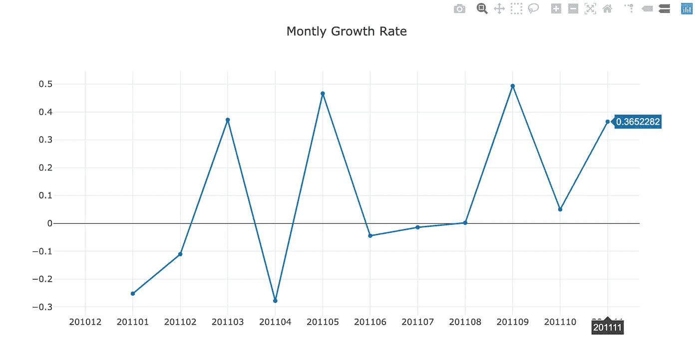

一切看起来都很好，我们看到上个月有 36.5%的增长(12 月被排除在代码之外，因为它尚未完成)。但我们需要确定 4 月 16 日到底发生了什么。是因为不太活跃的客户还是我们的客户订单少了？也许他们只是开始购买更便宜的产品？没有做深层次的分析，我们什么都不能说。

## 每月活跃客户

要查看每月活跃客户的详细信息，我们将遵循我们对每月收入所做的步骤。从这一部分开始，我们将只关注英国的数据(记录最多)。我们可以通过计算唯一的*客户 id*来获得月活跃客户。代码片段和输出如下:

每月活跃客户数量及其柱状图:

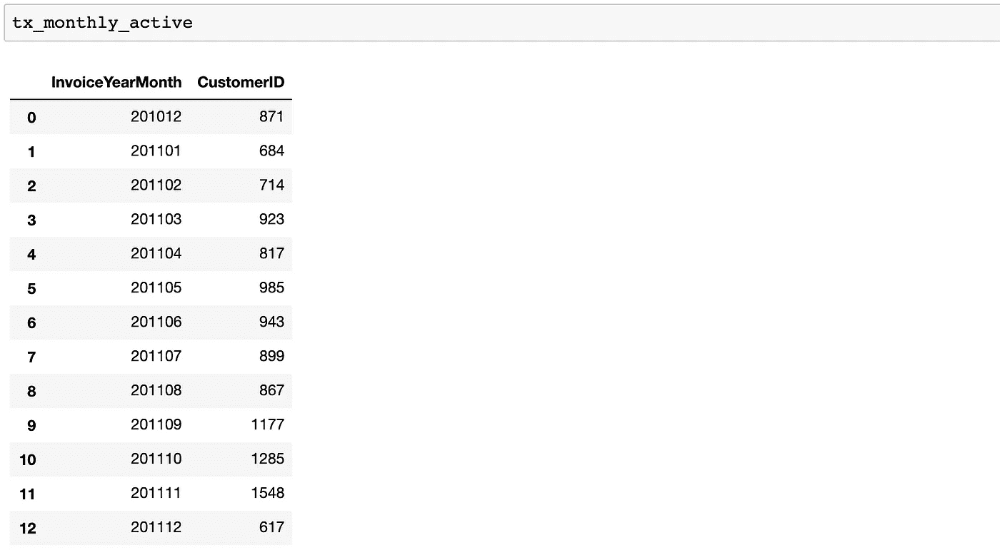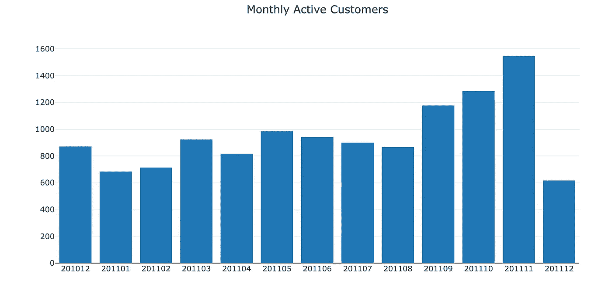

4 月份，月活跃客户数量从 923 个下降到 817 个(-11.5%)。

我们也将看到订单数量的相同趋势。

## 每月订单计数

我们将通过使用*数量*字段应用相同的代码:

每月订单数量及其条形图:

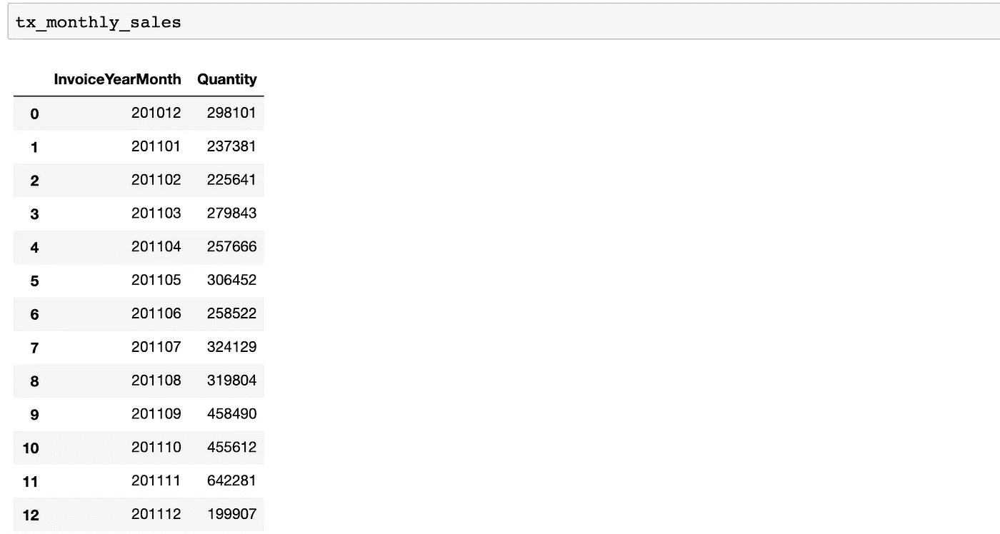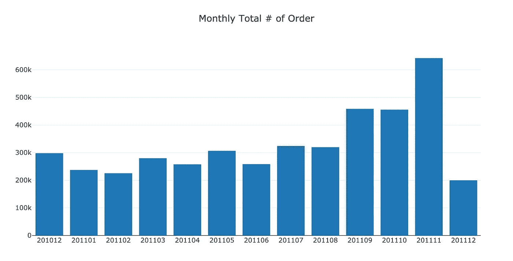

正如我们所料，4 月份订单数量也有所下降(从 279，000 件降至 257，000 件，降幅为 8%)

我们知道活跃客户数量直接影响订单数量的减少。最后，我们还应该明确检查我们的**每份订单的平均收入**。

## **平均每单收入**

要获得这些数据，我们需要计算每个月的平均收入:

每个订单的月平均收入及其条形图:

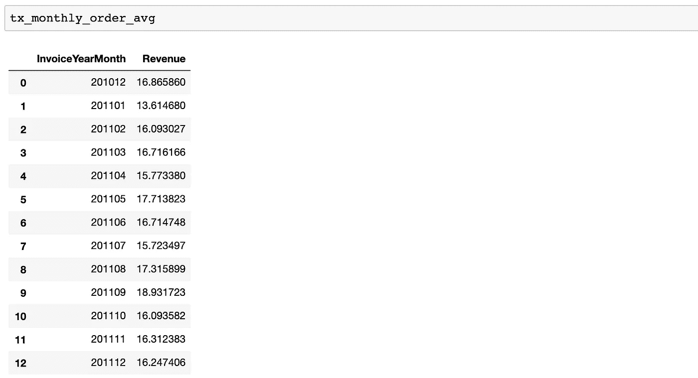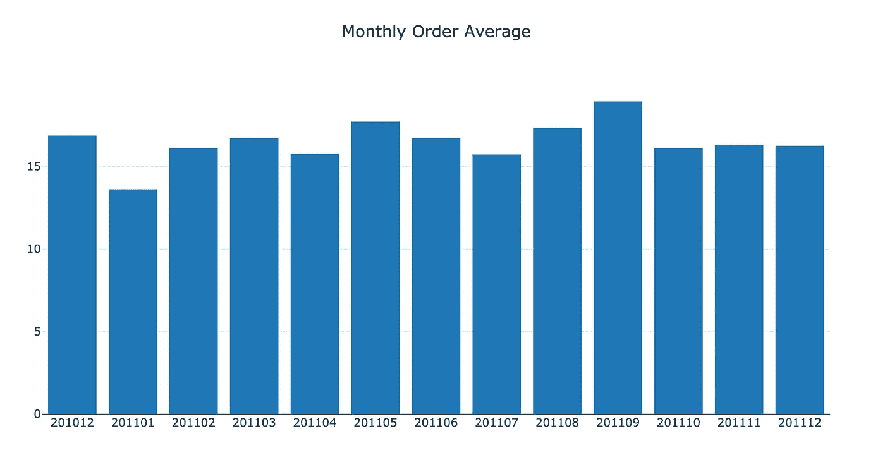

甚至 4 月份的月平均订单量也有所下降(从 16.7 降至 15.8)。我们观察到影响我们北极星的每一个指标都变慢了。

我们已经查看了我们的主要指标。当然，还有更多的问题，并且因行业而异。让我们继续研究一些其他重要的指标:

*   新客户比率:一个很好的指标，表明我们是否正在失去现有客户或无法吸引新客户
*   保留率:指标之王。指明我们在特定时间窗口内保留了多少客户。我们将展示每月保留率和基于群组的保留率的示例。

## 新客户比率

首先我们应该定义什么是新客户。在我们的数据集中，我们可以假设新客户是在我们定义的时间窗口内第一次购物的人。对于这个例子，我们将每月做一次。

我们将使用**。min()** 函数查找每个客户的首次购买日期，并基于此定义新客户。下面的代码将应用这个函数，并显示每个组每月的收入明细。

与首次购买日期合并后的数据帧输出:

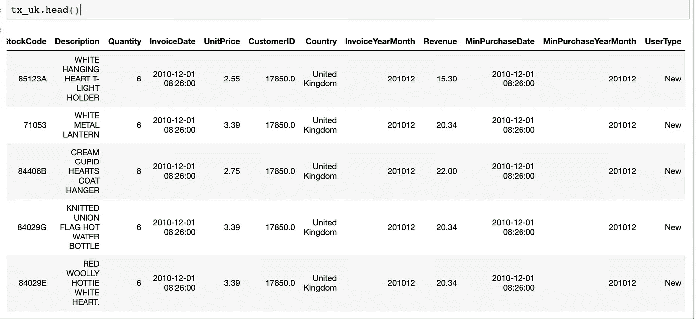

新客户和现有客户的每月收入:

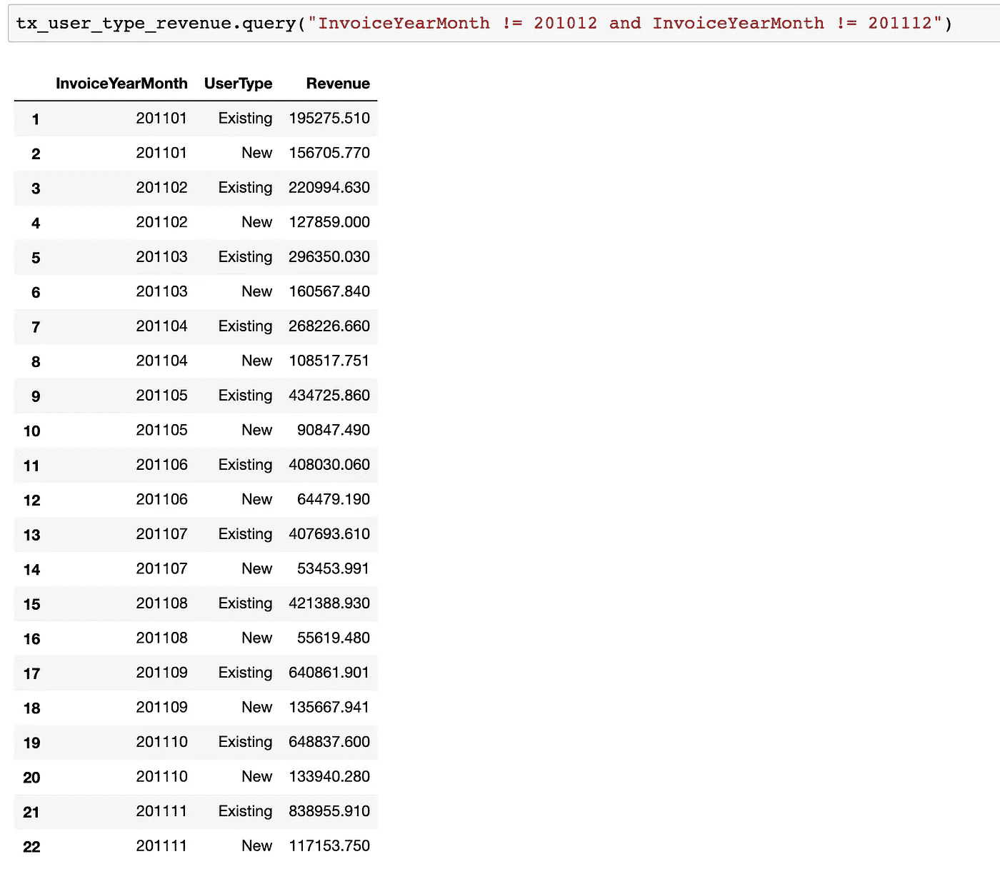

上面的折线图:

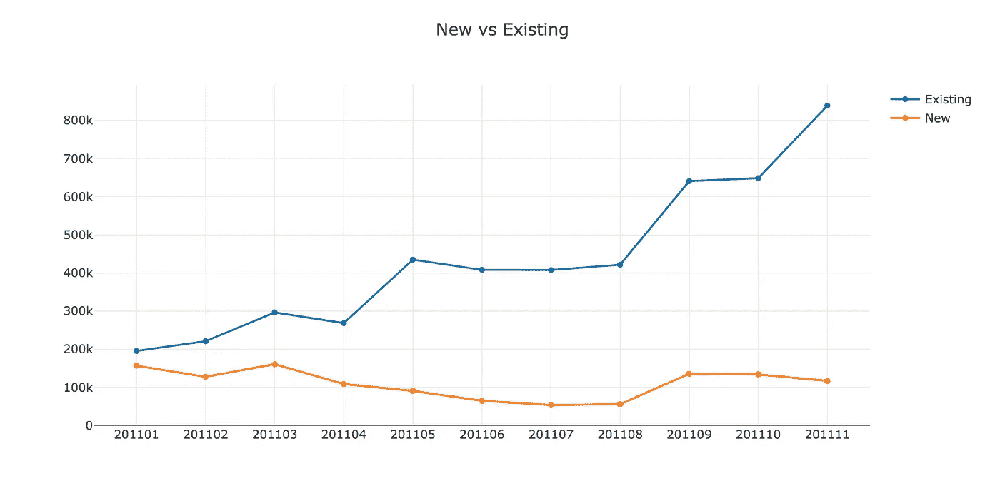

现有客户显示出积极的趋势，并告诉我们，我们的客户群正在增长，但新客户有轻微的消极趋势。

让我们更好地了解一下新的客户比率:

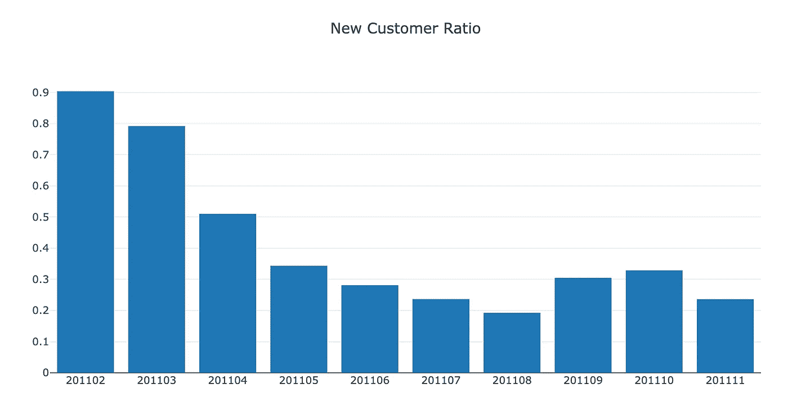

新客户比率如预期下降(我们在 2 月假设所有客户都是新客户),大约为 20%。

## 每月留存率

留存率应该被密切监控，因为它表明你的服务有多粘，你的产品有多适合市场。为了使每月的保留率可视化，我们需要计算上个月保留了多少客户。

> **月留存率** =前期留存的客户。月/活跃客户总数

我们将使用 pandas 的 **crosstab()** 函数，这使得计算留存率变得非常容易。

首先，我们创建一个数据框架，显示每个客户的月总收入:

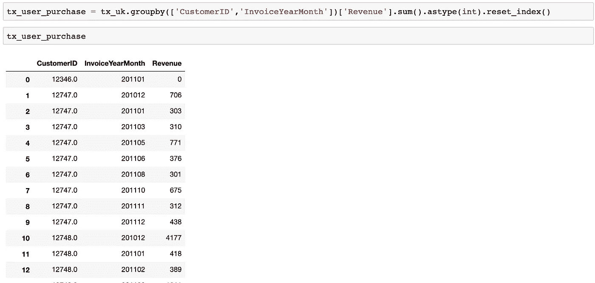

**crosstab()** 函数将其转换为保留表:

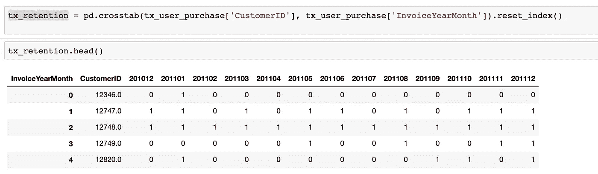

保留表显示了每个月哪些客户是活跃的(1 代表活跃)。

在循环的简单*的帮助下，我们每月计算上个月的保留客户数和总客户数。*

最后，我们得到了保留率数据框架和折线图，如下所示:

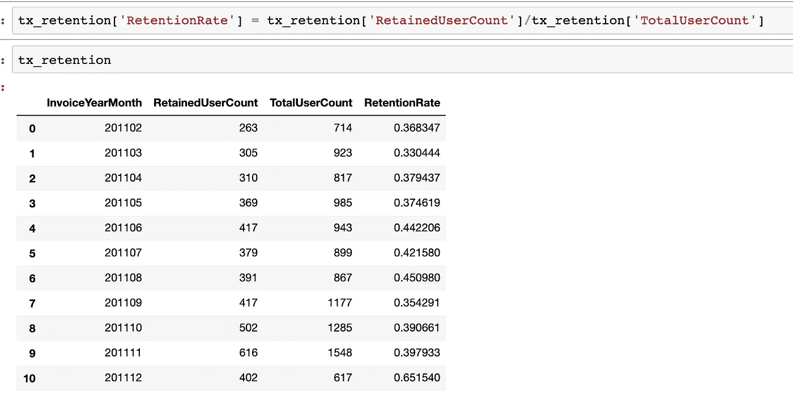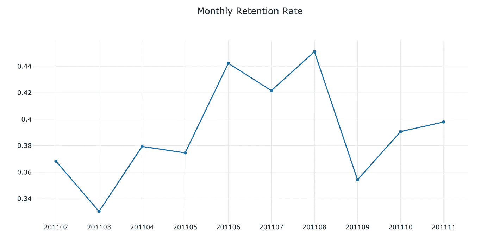

从 6 月到 8 月，每月保留率显著上升，之后又回到以前的水平。

## 基于群组的保留率

还有另一种测量保留率的方法，可以让您看到每个群组的保留率。分组被确定为客户的第一个购买年月。我们将测量每个月第一次购买后保留的客户百分比。此视图将帮助我们了解新旧客户群在保留率方面的差异，以及最近客户体验的变化是否会影响新客户的保留率。

就编码而言，这将比其他的要复杂一点。

**Tx_retention** 对基于群组的保留率有着惊人的看法:

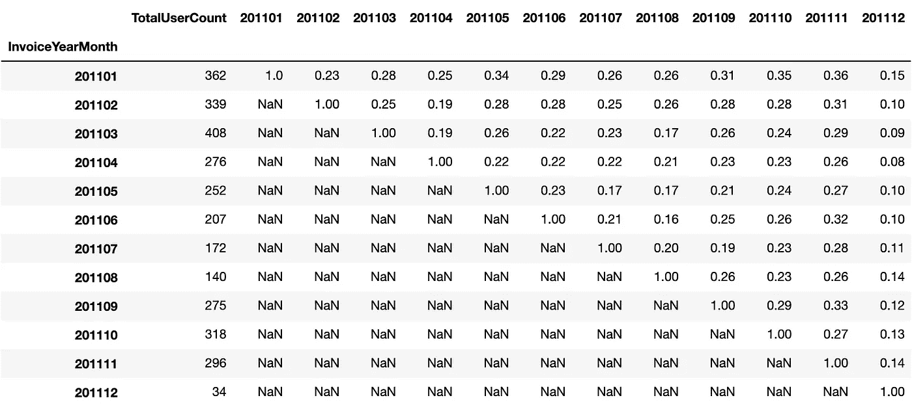

我们可以看到，第一个月的保留率最近变得更好了(不考虑 2011 年 12 月)，在近 1 年的时间里，我们有 15%的客户保留了下来。

最后…我们知道我们的指标以及如何使用 Python 来跟踪/分析它们。

你可以在这里找到这篇文章[的 jupyter 笔记本。](https://gist.github.com/karamanbk/314d3d5483b9be1d2cc7f9694368f3bc)

让我们试着细分我们的客户群，看看谁是我们在[第二部分](https://medium.com/@karamanbk/data-driven-growth-with-python-part-2-customer-segmentation-5c019d150444)的最佳客户。

需要帮助来发展你的公司吗？点击这里与我一起预订免费课程[。](https://app.growthmentor.com/mentors/baris-karaman)