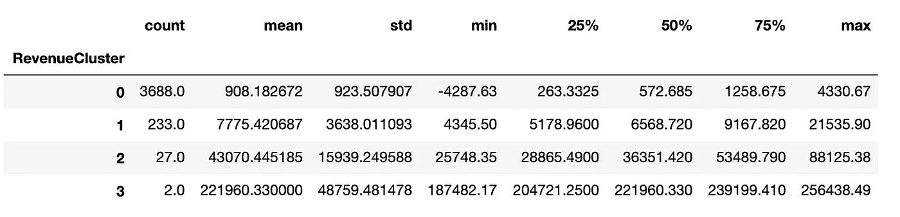

# 客户细分

> 原文：<https://towardsdatascience.com/data-driven-growth-with-python-part-2-customer-segmentation-5c019d150444?source=collection_archive---------0----------------------->

## [使用 Python 实现数据驱动的增长](https://towardsdatascience.com/tagged/data-driven-growth)

## RFM 聚类分割

**简介**

这一系列文章旨在解释如何以一种简单的方式使用 Python，通过将预测方法应用于您的所有行动来推动您公司的发展。它将是编程、数据分析和机器学习的结合。

我将在以下九篇文章中讨论所有主题:

1- [了解你的指标](/data-driven-growth-with-python-part-1-know-your-metrics-812781e66a5b?source=post_page---------------------------)

**2-客户细分**

3- [客户终身价值预测](/data-driven-growth-with-python-part-3-customer-lifetime-value-prediction-6017802f2e0f?source=post_page---------------------------)

4- [流失预测](/churn-prediction-3a4a36c2129a?source=post_page---------------------------)

[5-预测下一个购买日](/predicting-next-purchase-day-15fae5548027?source=post_page---------------------------)

[6-预测销售额](/predicting-sales-611cb5a252de?source=post_page---------------------------)

[7-市场反应模型](/market-response-models-baf9f9913298)

[8-隆起建模](/uplift-modeling-e38f96b1ef60)

[9- A/B 测试设计和执行](/a-b-testing-design-execution-6cf9e27c6559)

文章将有自己的代码片段，使您可以轻松地应用它们。如果你是编程的超级新手，你可以在这里很好地介绍一下 [Python](https://www.kaggle.com/learn/python?source=post_page---------------------------) 和 [Pandas](https://www.kaggle.com/learn/pandas?source=post_page---------------------------) (一个我们会在任何事情上使用的著名库)。但是仍然没有编码介绍，您可以学习概念，如何使用您的数据并开始从中产生价值:

> 有时候你得先跑，然后才能走——托尼·斯塔克

作为先决条件，确保你的电脑上安装了 J [upyter Notebook](https://jupyter.readthedocs.io/en/latest/install.html?source=post_page---------------------------) 和 P [ython](https://www.python.org/downloads/?source=post_page---------------------------) 。代码片段只能在 Jupyter 笔记本上运行。

好吧，我们开始吧。

# 第 2 部分:客户细分

在[的上一篇文章](https://medium.com/@karamanbk/data-driven-growth-with-python-part-1-know-your-metrics-812781e66a5b)中，我们分析了我们在线零售业务的主要指标。现在我们知道了使用 Python 追踪什么以及如何追踪。是时候关注客户并对他们进行细分了。

但是首先，我们为什么要做细分？

因为你不可能用同样的内容，同样的渠道，同样的重要性，来对待每一个客户。他们会找到更理解他们的另一种选择。

使用您平台的客户有不同的需求，他们有自己不同的概况。你应该据此调整你的行动。

你可以根据你想要达到的目标做许多不同的细分。如果你想提高保留率，你可以做一个基于流失概率的细分，并采取行动。但是也有非常常见和有用的分割方法。现在我们将在我们的业务中实现其中的一个: **RFM。**

**RFM** 代表近期频率货币价值。理论上，我们将拥有如下细分市场:

*   **低价值**:不太活跃的客户，不是非常频繁的买家/访客，产生非常低-零-可能是负收入。
*   **中值**:一切事物的中间。经常使用我们的平台(但没有我们的高价值)，相当频繁，产生中等收入。
*   **高价值**:我们不想失去的群体。高收益，高频率，低闲置。

作为方法论，我们需要计算*新近性、频率和货币价值*(我们从现在开始称之为收入)并应用*无监督机器学习*来为每个识别不同的组(群)。让我们开始编码，看看如何进行 **RFM 聚类**。

## 崭新

为了计算最近，我们需要找出每个客户最近的购买日期，并查看他们有多少天没有活动。在获得每个客户的非活动天数后，我们将应用 K-means*聚类为客户分配一个*最近得分*。

对于这个例子，我们将继续使用相同的数据集，可以在这里找到[。在进入近期计算之前，让我们回顾一下我们之前做过的数据工作。](https://www.kaggle.com/vijayuv/onlineretail)

现在我们可以计算新近度:

我们的新数据帧 **tx_user** 现在包含最近的数据:

为了快速了解最近的情况，我们可以使用熊猫的**。**形容()方法。它显示我们数据的平均值、最小值、最大值、计数和百分位数。

我们看到，即使平均值为 90 天，中位数为 49 天。

我们上面的代码片段有一个直方图输出，向我们展示了最近在我们客户中的分布情况。

现在是有趣的部分。我们将应用 K 均值聚类来分配一个最近得分。但是我们应该告诉 K-means 算法需要多少个聚类。为了找出答案，我们将采用肘法。肘方法简单地告诉最优惯性的最优簇数。代码片段和惯性图如下:

惯性图:

这里看起来 3 是最佳选择。根据业务需求，我们可以增加或减少集群数量。在本例中，我们将选择 4:

我们已经计算了集群并将它们分配给数据帧 **tx_user** 中的每个客户。

我们可以看到我们最近的聚类有不同的特征。与聚类 2 相比，聚类 1 中的客户是最近的客户。

我们在代码中添加了一个函数 **order_cluster()** 。K-means 以数字的形式分配聚类，但不是以有序的方式。我们不能说集群 0 是最差的，集群 4 是最好的。order_cluster()方法为我们做到了这一点，我们的新数据帧看起来更加整洁:

太好了！3 代表最近的客户，而 0 代表最不活跃的客户。

让我们对频率和收入应用同样的方法。

**频率**

为了创建频率聚类，我们需要找到每个客户订单总数。首先计算一下，看看频率在我们的客户数据库中是什么样的:

对频率群集应用相同的逻辑，并将其分配给每个客户:

我们的频率群集的特征如下所示:

与最近聚类的符号相同，高频率数字表示更好的客户。

## 收入

让我们看看，当我们根据收入对客户进行聚类时，我们的客户数据库是什么样子。我们将计算每个客户的收入，绘制直方图，并应用相同的聚类方法。

我们也有一些负收益的客户。让我们继续应用 k 均值聚类:

## 总分

厉害！我们有最近、频率和收入的分数(聚类数)。让我们为它们创建一个总分:

上面的评分清楚地告诉我们，得分为 8 的客户是我们最好的客户，而得分为 0 的客户是最差的。

为了简单起见，我们最好将这些分数命名为:

*   0 到 2:低值
*   3 到 4:中间值
*   5+:高值

我们可以很容易地在数据帧上应用这种命名:

现在，这是最好的部分。让我们看看我们的细分市场是如何分布在散点图上的:

就 RFM 而言，你可以看到这些细分市场是如何明显区分开来的。您可以在下面找到图形的代码片段:

我们可以开始对这一细分采取行动。主要策略非常明确:

*   高价值:提高保留率
*   中值:提高保留率+增加频率
*   低值:增加频率

越来越精彩了！在[第 3 部分](https://medium.com/@karamanbk/data-driven-growth-with-python-part-3-customer-lifetime-value-prediction-6017802f2e0f)中，我们将计算和预测客户的终身价值。

你可以在这里找到这篇文章[的 jupyter 笔记本。](https://gist.github.com/karamanbk/962443877d629713e0e410d52443c7d6)

*理想情况下，我们在这里所做的事情可以通过使用分位数或简单宁滨(或 Jenks 自然间断优化以使分组更准确)轻松实现，但我们正在使用 k-means 来熟悉它。

需要帮助来发展你的公司吗？点击这里，与我[一起预订免费课程。](https://app.growthmentor.com/mentors/baris-karaman)