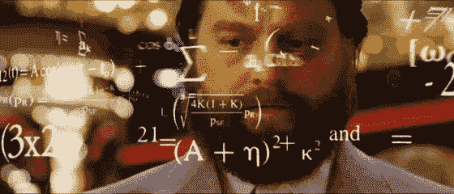

# 客户终身价值预测

> 原文：<https://towardsdatascience.com/data-driven-growth-with-python-part-3-customer-lifetime-value-prediction-6017802f2e0f?source=collection_archive---------1----------------------->

## [使用 Python 实现数据驱动的增长](https://towardsdatascience.com/tagged/data-driven-growth)

## 基于 XGBoost 多分类的 LTV 预测

**简介**

这一系列文章旨在解释如何以一种简单的方式使用 Python，通过将预测方法应用于您的所有行动来推动您公司的发展。它将是编程、数据分析和机器学习的结合。

我将在以下九篇文章中讨论所有主题:

1- [了解你的指标](/data-driven-growth-with-python-part-1-know-your-metrics-812781e66a5b?source=post_page---------------------------)

2- [客户细分](/data-driven-growth-with-python-part-2-customer-segmentation-5c019d150444?source=post_page---------------------------)

3- **客户终身价值预测**

4- [流失预测](/churn-prediction-3a4a36c2129a?source=post_page---------------------------)

[5-预测下一个购买日](/predicting-next-purchase-day-15fae5548027?source=post_page---------------------------)

[6-预测销售额](/predicting-sales-611cb5a252de?source=post_page---------------------------)

[7-市场反应模型](/market-response-models-baf9f9913298)

[8-隆起建模](/uplift-modeling-e38f96b1ef60)

[9- A/B 测试设计和执行](/a-b-testing-design-execution-6cf9e27c6559)

文章将有自己的代码片段，使您可以轻松地应用它们。如果你是编程的超级新手，你可以在这里很好地介绍一下 [Python](https://www.kaggle.com/learn/python?source=post_page---------------------------) 和 [Pandas](https://www.kaggle.com/learn/pandas?source=post_page---------------------------) (一个我们会在任何事情上使用的著名库)。但是仍然没有编码介绍，您可以学习概念，如何使用您的数据并开始从中产生价值:

> 有时候你得先跑，然后才能走——托尼·斯塔克

作为先决条件，确保你的电脑上安装了 J [upyter Notebook](https://jupyter.readthedocs.io/en/latest/install.html?source=post_page---------------------------) 和 P [ython](https://www.python.org/downloads/?source=post_page---------------------------) 。代码片段只能在 Jupyter 笔记本上运行。

好吧，我们开始吧。

# 第 3 部分:客户终身价值

在[之前的文章](https://medium.com/@karamanbk/data-driven-growth-with-python-part-2-customer-segmentation-5c019d150444)中，我们对我们的客户进行了细分，并找出了谁是最好的客户。现在是时候衡量我们应该密切跟踪的最重要的指标之一:**客户终身价值。**

我们投资客户(收购成本、线下广告、促销、折扣等)。)来产生收入，实现盈利。自然，这些行为使一些客户在终身价值方面变得非常有价值，但总有一些客户会降低盈利能力。我们需要识别这些行为模式，细分客户并采取相应的行动。

计算一生的价值是容易的部分。首先，我们需要选择一个时间窗口。可能是 3 个月、6 个月、12 个月或 24 个月。通过下面的等式，我们可以得到特定时间窗口内每个客户的终身价值:

> **生命周期价值**:总毛收入-总成本

这个等式现在给出了历史寿命值。如果我们看到一些客户在历史上拥有非常高的负终身价值，采取行动可能为时已晚。此时，我们需要用机器学习来预测未来:

**我们将建立一个简单的机器学习模型，预测我们客户的终身价值。**

## 终生价值预测

在这个例子中，我们将继续使用我们的[在线零售数据集](https://www.kaggle.com/vijayuv/onlineretail)。让我们确定通往荣耀的道路:

*   为客户终身价值计算定义适当的时间框架
*   确定我们将要用来预测未来和创造未来的特征
*   计算用于训练机器学习模型的终身价值(LTV)
*   构建并运行机器学习模型
*   检查模型是否有用

决定时间框架真的取决于你的行业、商业模式、战略等等。对某些行业来说，一年是很长的时间，而对其他行业来说，一年又很短。在我们的示例中，我们将继续进行 **6 个月。**

每个客户 ID 的 RFM 分数(我们在[上一篇文章](https://medium.com/@karamanbk/data-driven-growth-with-python-part-2-customer-segmentation-5c019d150444)中计算过)是特征集的完美候选。为了正确地实现它，我们需要分割数据集。我们将采用 3 个月的数据，计算 RFM，并用它来预测未来 6 个月。因此，我们需要首先创建两个数据帧，并将 RFM 分数附加到它们上。

我们已经创建了我们的 RFM 评分，现在我们的功能集如下所示:

我不会重复 RFM 得分的细节，因为我会重复第二部分。

既然我们的功能集已经准备好了，让我们为每个客户计算 6 个月的 LTV，我们将使用它来训练我们的模型。

数据集中没有指定成本。这就是为什么收入直接成为我们的 LTV。

此代码片段计算 LTV 并绘制其直方图:

柱状图清楚地显示我们有负 LTV 的客户。我们也有一些异常值。过滤掉离群值对于拥有合适的机器学习模型是有意义的。

好，下一步。我们将合并 3 个月和 6 个月的数据框架，以查看 LTV 和我们拥有的特征集之间的相关性。

下面的代码合并了我们的功能集和 LTV 数据，并绘制了 LTV 与 RFM 的总得分:

正相关在这里相当明显。高 RFM 分数意味着高 LTV。

在建立机器学习模型之前，我们需要确定这个机器学习问题的类型。LTV 本身就是一个回归问题。机器学习模型可以预测 LTV 的价值。但在这里，我们希望 LTV 部分。因为这样更有可操作性，也更容易与其他人交流。通过应用 K-均值聚类，我们可以识别现有的 LTV 组，并在此基础上构建细分市场。

考虑到这个分析的业务部分，我们需要根据客户的预测 LTV 来区别对待他们。在本例中，我们将应用聚类，并有 3 个细分市场(细分市场的数量实际上取决于您的业务动态和目标):

*   低 LTV
*   LTV 中部
*   高 LTV

我们将应用 K-means 聚类来决定细分并观察它们的特征:

我们已经完成了 LTV 聚类，下面是每个聚类的特征:

2 是最好的，平均 LTV 为 8.2k，而 0 是最差的，平均为 396。

在训练机器学习模型之前还有几个步骤:

*   需要做一些功能工程。我们应该将分类列转换成数字列。
*   我们将对照我们的标签“LTV 聚类”来检查特征的相关性。
*   我们将分割我们的特征集并将(LTV)标记为 X 和 y。我们使用 X 来预测 y
*   将创建训练和测试数据集。训练集将用于建立机器学习模型。我们将把我们的模型应用到测试集上，看看它的真实性能。

下面的代码为我们做了这一切:

让我们从第一行开始。 **get_dummies()** 方法将分类列转换为 0–1 表示法。看看它在这个例子中到底做了什么:

这是我们在 get_dummies()之前的数据集。我们有一个分类列，它被分段。应用 get_dummies()后会发生什么:

段列没有了，但我们有新的数字来表示它。我们已经将其转换为 3 个不同的列，分别为 0 和 1，并使其可用于我们的机器学习模型。

与相关性相关的线条使我们有了下面的数据:

我们看到 3 个月的收入、频率和 RFM 分数将有助于我们的机器学习模型。

因为我们有了训练集和测试集，所以我们可以构建我们的模型。

我们使用了一个非常强大的 ML 库 XGBoost 来为我们进行分类。自从我们有了 3 个组(集群)以来，它已经成为一个多分类模型。让我们来看看最初的结果:

在测试集上准确率显示为 84%。看起来真不错。是吗？

首先，我们需要检查我们的基准。我们拥有的最大集群是集群 0，占总基数的 76.5%。如果我们盲目地说，每个客户都属于聚类 0，那么我们的准确率将是 76.5%。

84%对 76.5%告诉我们，我们的机器学习模型是一个有用的模型，但肯定需要一些改进。我们应该找出模型失败的地方。

我们可以通过查看分类报告来确定这一点:

精度和召回率对于 0 是可接受的。例如，对于聚类 0(低 LTV)，如果模型告诉我们*该客户属于聚类 0* ，则 100 分中有 90 分是正确的(精度)。该模型成功识别了 93%的实际 0 类客户(回忆)。我们真的需要为其他集群改进模型。例如，我们几乎没有发现 56%的 LTV 中部客户。改进这些要点的可能行动:

*   添加更多功能并改进功能工程
*   尝试 XGBoost 以外的其他型号
*   将超参数调整应用于当前模型
*   如果可能，向模型中添加更多数据

太好了！现在，我们有了一个机器学习模型，可以预测我们客户的未来 LTV 细分市场。基于此，我们可以很容易地调整我们的行动。例如，我们绝对不希望失去 LTV 高的客户。因此，我们将在[第 4 部分](/churn-prediction-3a4a36c2129a)中重点关注客户流失预测。

你可以在这里找到这部分[的 jupyter 笔记本。](https://gist.github.com/karamanbk/29983fdf5572a838f53163a6010b14f9)

需要帮助来发展你的公司吗？点击这里与我一起预订免费课程[。](https://app.growthmentor.com/mentors/baris-karaman)