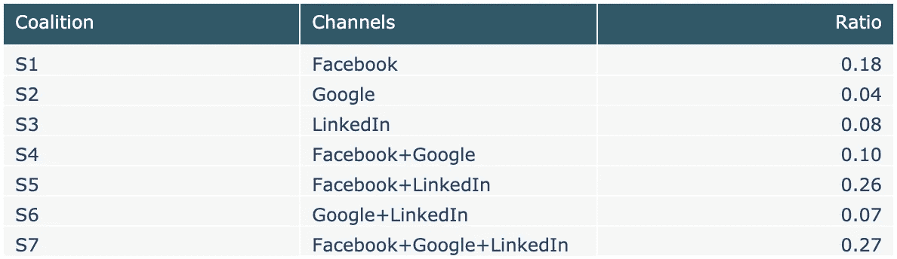
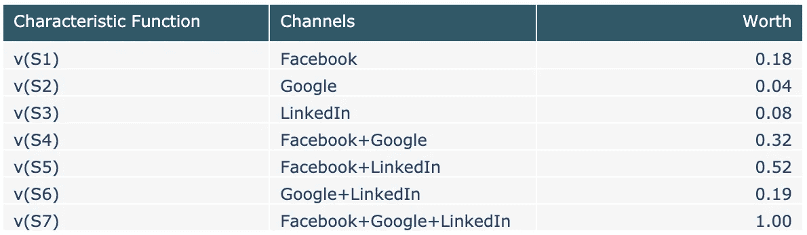
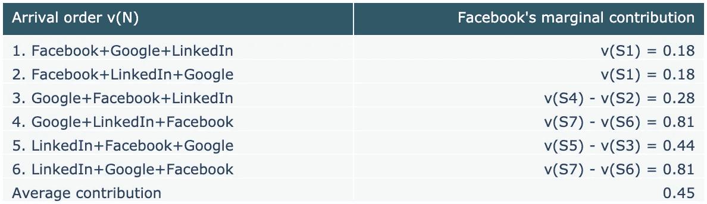
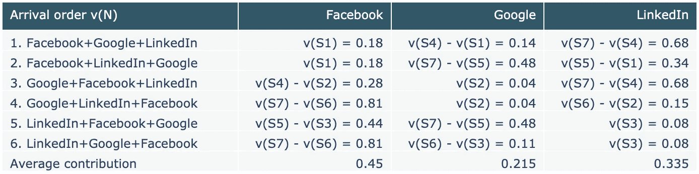
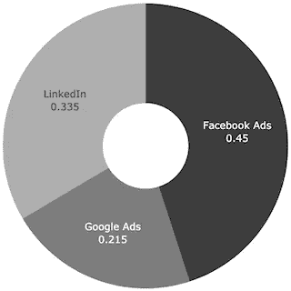

# 数据驱动的营销归因

> 原文：<https://towardsdatascience.com/data-driven-marketing-attribution-1a28d2e613a0?source=collection_archive---------7----------------------->

## 基于合作博弈的顾客归因

Working together for the win

## 营销归因的问题

流行的营销归因模式各有利弊，选择最佳模式取决于个人业务需求。然而，流行模型的一个共同缺点是，它们是基于规则的，用户必须预先决定他们希望如何在渠道之间分配销售转换的积分。受欢迎的型号包括:

*   **线性**:在所有接触点之间分配相等份额的回报
*   **时间衰减**:随着时间的推移，接触点与转化日期的距离越远，回报的百分比越低
*   **位置**:第一次和最后一次触摸占 40%，剩下的 20%平均分配给两次触摸之间的部分

首席营销官使用所选模型的结果来衡量投资回报率，并就未来在何处投资营销资源做出更明智的决策。准确的结果很重要，但这些启发式解决方案不够灵活，无法区分真正的低影响和高影响接触点，导致信用划分不准确。

幸运的是，有更复杂的、数据驱动的方法来解决这些限制。数据驱动归因是一种定制解决方案，能够通过模拟渠道(更重要的是不同渠道组合)如何与买家互动以影响预期销售结果，来捕捉买家旅程的复杂性。数据驱动的模型提供了关于哪些渠道表现最佳的最准确的视图，推动了更好的营销责任和效率。

这篇文章探索了一个数据驱动的归因模型，该模型基于合作博弈理论中的 Shapley 值概念。

## 博弈论与沙普利值

在一个多玩家的游戏中，他们可以一起工作(形成联盟)以增加期望结果(收益)的可能性，Shapley 值提供了一种在玩家之间公平分配收益的方法。

本质上，Shapley 值是一个玩家对每个联盟的平均边际贡献的度量。考虑到玩家可以在不同的时间点(顺序)加入联盟，拥有不同程度的影响力(价值)。它基于这样一个假设，即每个排序都有相同的发生概率，因此玩家根据他们对所有排列的贡献获得奖励。

> Rovira i 维尔吉利大学[1]和加州大学洛杉矶分校[2]发表的论文提供了 Shapley 值及其公理的优秀形式定义，这超出了本文的范围。

在营销分析的背景下，营销渠道是游戏的参与者，渠道在整个购买过程中与客户互动的各种方式形成了联盟。合作博弈理论和 Shapley 值提供了一种稳定的方法来衡量渠道影响力，并根据渠道对总回报的贡献，在渠道之间公平划分销售转化的功劳。

营销优势:

*   更深入地了解渠道绩效
*   根据衡量的贡献公平分配信贷
*   优化营销投资和影响销售结果的能力
*   Shapley value 是一个广泛使用的、获得诺贝尔奖的解决方案( [Google Analytics](https://support.google.com/analytics/answer/3264076?hl=en&ref_topic=3180362) 将其用于频道归属)

## 特征函数

一个游戏由一组玩家 ***N*** 和一个特征函数 ***v*** 定义。玩家的每个子集被称为联盟 ***S*** ，特征函数 ***v(S)*** 为每个联盟分配一个值，以表示其**值**。一个联盟的价值代表了当它的成员一起工作时它所能产生的回报。

定义营销特征函数的选项包括:

*   每个联盟产生的总收入
*   每个联盟产生的销售转换总数
*   每个联盟的转换率(转换率/机会)
*   转换的条件概率—转换给定频道集的可能性

## 转换率示例

让我们看一个使用通道转换率的例子。假设您的公司在一个财政季度末转化了 100 个机会。在此期间，营销部门通过三种渠道向相关客户做广告:

**N** = { **脸书**，**谷歌**， **LinkedIn** }

所有 100 个客户在购买过程中都被一个或多个渠道接触过。换句话说，这些渠道通过形成联盟来增加机会转换的可能性。

下表列出了所有可能的渠道联盟及其转换率:

Example coalition conversion ratios

每个联盟的**价值**由特征函数决定。在这个例子中，价值被表示为联盟中每个渠道的转换率之和。

*   联盟 S5 =脸书+LinkedIn
*   v(S5) =脸书(S1) +领英(S3) +脸书+领英(S5)
*   v(S5) = 0.18 + 0.08 + 0.26
*   v(S5) = 0.52

Coalition worth

包含所有玩家的联盟被称为大联盟 ***v(N)*** 。大联盟的价值应该等于总收益。

现在我们知道了每个联盟的价值，Shapley 值可以通过平均每个渠道对游戏的边际贡献来计算，考虑所有可能的排序。具体来说，Shapley 值为我们提供了一种在三个渠道之间分配大联盟价值(总收益)的方法。

脸书的沙普利值:

Facebook’s Shapley value

*   在**命令 1** 和 **2** 中，脸书是第一个到达的，因此它收到了它的全部贡献
*   在顺序 3 中，脸书排在谷歌之后，所以它的边际贡献是包含脸书谷歌 v(S4)的联盟减去没有脸书 v(S2)的联盟
*   在**命令 4** 和 **6** 中，脸书最后到达，因此其边际贡献是包含所有信道的联盟 v(S7)减去没有脸书的联盟 v(S6)
*   在顺序 5 中，脸书排在领英之后，所以它的边际贡献是包含脸书领英 v(S5)的联盟减去没有脸书 v(S3)的联盟

所有通道的 Shapley 值:

Shapley values

这个例子的代码可以在 Github 上的这个 [Jupyter 笔记本](https://github.com/jrkinley/game-theory-attribution/blob/master/game_theory_attribution.ipynb)中找到。以下代码片段展示了如何在 Python 中计算 Shapley 值:

## 结论

从这个例子中的 Shapley 值可以清楚地看出，脸书是表现最好的渠道，而脸书和 LinkedIn 的组合是最有影响力的联盟。CMO 可能会看到这一点，决定向脸书和 LinkedIn 分配更多资源，以优化转化率。他们也可能会质疑为什么谷歌表现不佳，并投入更多资源来改善谷歌广告上的活动。

Shapley values

总之，随着企业努力提高责任性、效率和数据驱动的决策，合作博弈论和 Shapley value 为营销部门提供了准确和定制的归因解决方案，这种解决方案有可能提供比基于规则的模型所能提供的更多的东西。

## 参考

*   [1] S .卡诺·贝朗加和 JM。Giménez Gómez 和 C. Vilella，[归因模型和合作博弈理论](https://recercat.cat/bitstream/handle/2072/290758/201702.pdf) (2017)，罗维拉维尔吉利大学
*   [2] T. Ferguson，[博弈论](https://www.math.ucla.edu/~tom/Game_Theory/coal.pdf) (2014)，加州大学洛杉矶分校数学系
*   [3] R. Affane，[营销归因](https://medium.com/data-from-the-trenches/marketing-attribution-e7fa7ae9e919) (2018)，来自战壕的数据—大台库