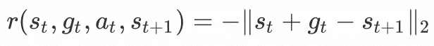
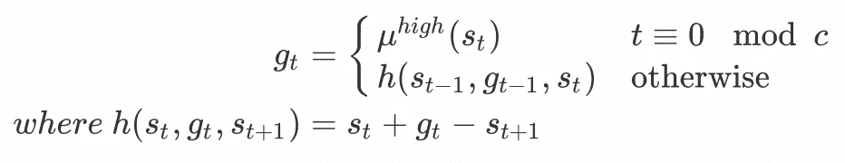
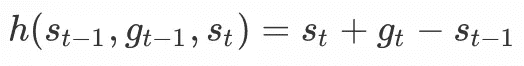
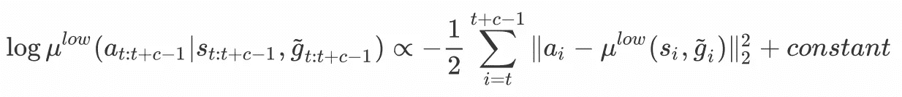
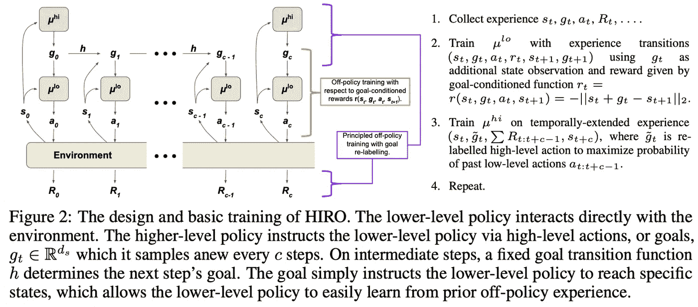

# 数据高效的分层强化学习— HIRO

> 原文：<https://towardsdatascience.com/data-efficient-hierarchical-reinforcement-learning-hiro-5d8538c27a80?source=collection_archive---------13----------------------->

## 介绍

近年来，传统的强化学习算法取得了令人鼓舞的成功。然而，它们在原子尺度上推理的本性使得它们很难扩展到复杂的任务。 **H** 层次结构 **R** 强化 **L** 收益(HRL)引入了高层抽象，代理人能够以不同的规模进行计划。

在这篇文章中，我们讨论了 Ofir Nachum 等人在 NIPS 2018 的谷歌大脑中提出的 HRL 算法。这种算法被称为带有 **O** ff 策略修正(HIRO)的 **HI** 层次 **R** 强化学习，是为目标导向的任务而设计的，在这种任务中，代理试图达到某种目标状态。

注意，这篇文章是连续两篇文章中的第一篇。在下一篇帖子中，我们将讨论由同一团队提出的另一种 HRL 算法，作为对 HIRO 的改进，名为分层强化学习的近优表示学习。

为了更好的数学表达可读性，你可以参考[我的个人博客](https://xlnwel.github.io/blog/reinforcement%20learning/HIRO/)

## 具有偏离策略校正的分层强化学习

我们首先介绍关于 HRL 的三个基本问题:

1.  应该如何训练较低级别的策略来诱导语义不同的行为？
2.  应该如何定义高级策略操作？
3.  应该如何培训多种政策而不招致过多的经验收集？

HIRO 可以通过回答上述问题得到很好的解释(从这里开始，我们只关注一个两级 HRL 代理):

1.除了状态观察之外，我们将由较高级别的策略产生的目标提供给较低级别的策略，以便较低级别的策略学会针对它试图实现的不同目标表现出不同的行为。因此，为了指导低层策略的学习过程，我们将目标条件奖励函数定义为

Eq.1 low-level reward function

2.高级策略操作被定义为目标，低级策略试图在某个时间段内实现这些目标。当 *t≡0(mod c)* 时，目标或者每 *c* 步从高层策略中取样，或者通过固定的目标转移函数计算。数学上，目标被定义为

Eq.2 goal function

3.为了提高数据效率，我们使用非策略算法(如 TD3)分别训练高级和低级策略。具体来说，对于两级 HRL agent，下层策略是用经验 *(sₜ，gₜ，aₜ，rₜ，s_{t+1}，g_{t+1})* 训练的，其中内在报酬 *rₜ* 和目标 *gₜ* 分别由等式 1 和等式 2 计算；更高级别的策略是基于时间扩展的经验 *(sₜ，\蒂尔德·gₜ，∑ R_{t:t+c-1}，s_{t+c})* ，其中*\蒂尔德·gₜ*是重新标记的目标(我们将在下一节中讨论)，而 *R* 是环境提供的奖励。因为所有附加变量都是由代理本身定义的，所以从环境中收集的经验可以与两种策略共享。

**HIRO 的目标**

由高级策略产生的目标描述了状态空间中期望的相对变化。这使得在等式中定义的目标转换函数的定义有意义。​2

goal transition function

其中 *sₜ+gₜ* 计算期望状态 *s_{t+c}* 。它还为等式 1 中定义的目标条件奖励函数带来了一个很好的解释:奖励函数简单地根据期望状态 *sₜ+gₜ* 和代理通过采取行动 *aₜ* 到达的下一个状态 *s_{t+1}* 之间的欧几里德距离进行惩罚。注意，在这个定义中，**目标的形式与状态观测值相同。**

到目前为止，我们已经了解了低层策略的目标，现在让我们考虑它在高层策略中的作用。首先，我们注意到，虽然目标是由高层次的策略作为高层次的行动产生的，但它们实际上是由低层次的策略执行的。随着较低级别策略的发展，为实现相同目标而采取的较低级别操作会发生变化，这反过来会导致不同的状态和沿途收集的奖励。这使得旧的高层转换 *(sₜ，\颚化符 gₜ，∑ R_{t:t+c-1}，s_{t+c})* 无效。为了恢复这种体验，我们重新标记了目标，使得它很可能用较低级别策略的当前实例化来诱导相同的较低级别行为。数学上， *\tilde gₜ* 被选择来最大化概率*y μ^{low}(a_{t:t+c-1}|s_{t:t+c-1}，\tilde g_{t:t+c-1})* ，其中中间目标 *\tilde g_{t+1:t+c-1}* 使用等式中定义的目标转移函数来计算。​2.实际上，我们通常取而代之的是最大化其对数概率*、*，如果动作是从高斯分布中采样的，则可以如下计算

Eq.3 measure for relabeled goals

为了近似最大化这个数量，我们计算了许多目标的对数概率*\蒂尔德 gₜ* ，并选择最大的目标来重新标记体验。例如，我们对从以 *s_{t+c}-sₜ* 为中心的高斯分布中随机抽样的八个候选目标计算这个数量，还包括原始目标 *gₜ* 和对应于候选集中差异 *s_{t+c}-sₜ* 的一个目标，总共有 10 个候选。因此，最大化等式 3 的那个被选择为重新标记的目标。

**算法**

从论文中摘录的下图完美地阐释了该算法，其中高层和低层策略都由 TD3 训练。

from Data-Efficient Hierarchical Reinforcement Learning

注意，我们实际上必须使用经验 *(s_{t:t+c}，gₜ，a_{t:t+c-1}，∑ R_{t:t+c-1})* 来训练高层策略，因为我们必须重新标记目标。

## 结束

欢迎在下面留下评论和思考来讨论话题:)

## 参考

Ofir Nachum 等.数据有效的分层强化学习

Scott Fujimoto 等人在演员-评论家方法中解决函数近似错误