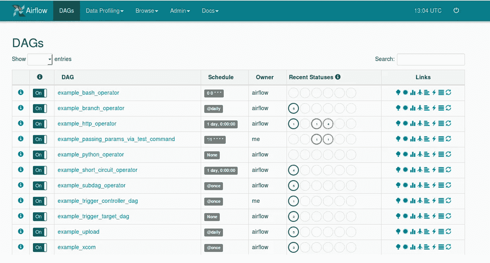

# 数据工程 Apache 气流的基础——构建您的第一条管道

> 原文：<https://towardsdatascience.com/data-engineering-basics-of-apache-airflow-build-your-first-pipeline-eefecb7f1bb9?source=collection_archive---------1----------------------->

## 从多个数据源提取数据


如果你从事技术工作，你很有可能需要管理数据。

**数据**随着公司规模的扩大，数据会快速增长，变得更加复杂和难以管理。管理层希望从他们拥有的数据中提取洞察力，但他们没有这样做的技术技能。然后他们雇佣你，友好的邻里数据科学家/工程师/分析师或者任何你现在想称呼自己的头衔(不管怎样，所有的工作都由你来做)来做。

你很快意识到，为了让你提供洞见，你需要某种观想来解释你的发现，并随着时间的推移监控它们。为了使这些数据保持最新，您需要在固定的时间间隔内(每小时、每天、每周、每月)从多个数据源提取、转换这些数据，并将其加载到您的首选数据库中。

公司有**工作流程管理系统**来处理这样的任务。它们使我们能够在内部创建和安排工作。每个人都有自己的偏好，但我要说的是，许多旧的 WMS 往往效率低下，难以扩展，缺乏良好的用户界面，没有重试的策略，更不用说可怕的日志，使故障排除/调试成为一场噩梦。它会造成不必要的精力和时间浪费。下面是一个用于调度作业的传统 crontab 示例。


不要再烦恼了。**阿帕奇气流**来拯救世界了。

阿帕奇气流可以作为贵公司的 **WMS，然后一些。** Airflow 最初是由 Airbnb 的人创建的，是开源的。Airbnb 将其用于:

*   **数据仓库:**提取、转换并加载到数据仓库中
*   **增长分析:**计算客人和主人参与度以及增长核算的指标
*   **实验:**计算我们的 A/B 测试实验框架逻辑和集合
*   **电子邮件定位:**应用触发器，通过电子邮件活动吸引客户
*   **会话化:**计算点击流和耗时数据集
*   **搜索:**计算搜索排名相关指标
*   **数据基础设施维护:**数据库抓取、文件夹清理、应用数据保留策略

(来源:[https://medium . com/Airbnb-工程/气流-a-工作流-管理-平台-46318b977fd8](https://medium.com/airbnb-engineering/airflow-a-workflow-management-platform-46318b977fd8) )

Airflow 还能够与 Hive、Presto、MySQL、HDFS、Postgres 和 S3 等热门技术进行交互。airflow 的基本模块也设计为易于扩展，因此如果不包括您的堆栈(这不太可能)，可以重写模块以与您所需的技术交互。

我不打算详细说明气流后端是如何工作的。你可以在这里 **了解更多[**。**](https://medium.com/@dustinstansbury/understanding-apache-airflows-key-concepts-a96efed52b1a)**

Airflow 还有一个闪亮的用户界面，允许您管理和监控您的工作流程。依赖关系更容易建立，日志更容易访问，代码更容易阅读，每项任务花费的时间，完成时间，点击一个按钮触发/暂停工作流等等，都可以通过 UI 完成。



还没卖出去？

你现在可以把气流带到云端。谷歌已经推出了
**Google-Cloud-Composer**，这是一个基于**云**的 Apache Airflow 托管服务。这为您省去在公司的本地服务器上运行 Airflow 的麻烦。你再也不用担心气流崩溃了。

正如你所看到的，数据管道只是触及了表面。气流的可能性是无限的。

但你不是来闲聊的。你想弄脏你的手。好吧，我们就这么做吧。


Photo by [Amaury Salas](https://unsplash.com/@eseamau?utm_source=medium&utm_medium=referral) on [Unsplash](https://unsplash.com?utm_source=medium&utm_medium=referral)

# 入门指南

我不打算安装 Airflow，因为我正在使用 Google-Cloud-Composer，请研究如何安装它，因为这是一个相当复杂的过程。

完成之后，让我们来看看如何创建你的第一个工作流。气流通过 Dag(有向无环图)创建工作流。**Dag 是一个高层次的概要，它定义了可以排序和调度的从属和独占任务。**不要被这个吓倒，因为它只是一个你自己修改的 python 文件。

打开你喜欢的文本编辑器，开始**编码**。

# 进口

```
# airflow related
from airflow import models
from airflow import DAG# other packages
from datetime import datetime, timedelta
```

# 设置默认参数

```
default_dag_args = {
    # Setting start date as yesterday starts the DAG immediately       when it is
    # detected in the Cloud Storage bucket.
    # set your start_date : airflow will run previous dags if dags #since startdate has not run
#notify email is a python function that sends notification email upon failure    
    'start_date': datetime(2019, 5, 1, 7),
    'email_on_failure': True,
    'email_on_retry': True,
    'project_id' : 'your_project_name',
    'retries': 1,
    'on_failure_callback': notify_email,
    'retry_delay': timedelta(minutes=5),
}with models.DAG(
    dag_id='your_dag_name',
    # Continue to run DAG once per day
    schedule_interval = timedelta(days=1),
    catchup = True,
    default_args=default_dag_args) as dag:
```

在这个块中，我们定义了我们的 default_args 参数，你可以在默认参数[这里](https://airflow.apache.org/_api/airflow/models/index.html#airflow.models.BaseOperator)中读到所有的参数。然后我们实例化一个 DAG 对象，将`schedule_interval`设置为每日，将`start_date`设置为
`May 1st 2019, 7am` ，如`default_dag_args`中所示。这是定义 DAG 执行日期/时间的两个重要参数。
DAG 将在`start_date + schedule_interval`上第一次运行**。
在这种情况下，DAG 将在`May 2nd 2019, 7am`第一次运行**，执行日期= `May 1st 2019, 7am`。这里有一个例子，****

********

****此 DAG 的执行日期为 2019–06–12 17:00，DAG 运行于
2019–06–13 17:00，导致此任务在 2019–06–13 18:02 运行，因为 DAG 的`schedule_interval`是一天。****

****这几乎建立了你的狗的脊梁。接下来，我们必须定义要执行的任务以及如何执行这些任务。****

# ****定义我们的 DAG、任务和运算符****

****首先，为了提取数据，您需要知道运行哪种任务。让我们以我的管道为例。它包括从 Postgres 数据库中提取数据，并将其加载到我们的数据仓库中(Google Bigquery)。根据我的经验，事情是这样的。****

****按顺序的任务:****

1.  ****连接到 Postgres 数据库从属服务器，检查任何复制延迟。****
2.  ****将数据写入 CSV，存储在某个地方。****
3.  ****将 CSV 数据加载到数据仓库****
4.  ****检查数据仓库中负载的任何复制****
5.  ****写日志****
6.  ****发送通知电子邮件****

****有许多方法来设计你的管道，但这是我怎么做的。我选择为每个包含运行它的代码的任务创建新的定制操作符。然后，我将它导入 DAG，并根据操作符设置依赖项和顺序。**优势**对此有几点:****

1.  ****DAGs 代码看起来更干净，可读性更高(重要)。****
2.  ****操作符可以在多个 Dag 中重用，不需要重新键入代码。****
3.  ****如果任务有任何变化，对操作符代码进行修正会修正使用该特定操作符的所有 Dag****
4.  ****更少的代码操作和工作，团队只需更改 DAG 中的一个参数，操作员的工作就会不同****

****操作员做所有真正的工作。****

****让我们从我的管道中写一个操作符:
**任务 2。将数据从数据源**
写入 CSV 在你的文本编辑器中打开第二个窗口，并开始**编码你的操作符。******

# ****进口****

```
**# airflow related
from airflow.models import BaseOperator
from airflow.utils.decorators import apply_defaults# other packages
from datetime import datetime, timedelta
from os import environ**
```

# ****定义您的操作员****

****除传感器操作符外，所有操作符都来自 **BaseOperator** 。传感器操作符派生自 **BaseSensorOperator** 从 BaseOperator 派生而来，我们在这里不讨论传感器。BaseOperators 有一个执行函数和您自定义的函数。作为操作符主干的操作符的一般格式可以在下面找到。****

```
**class AirflowOperatorName(BaseOperator):
    @apply_defaults
    def __init__(
            self,
            param1,
            param2,
            *args, **kwargs):super(AirflowOperatorName, self).__init__(*args, **kwargs)
        self.param1 = param1
        self.param2 = param2

    def execute(self, context):
        # task to be executed**
```

****将主干应用到我们的**任务 2 中。将数据从数据源写入 CSV******

```
**class DataSourceToCsv(BaseOperator):
    """
    Extract data from the data source to CSV file
    """[@apply_defaults](http://twitter.com/apply_defaults)
def __init__(
        self,
        bigquery_table_name,
        extract_query,
        connection = #connection,
        *args, **kwargs):super(DataSourceToCsv, self).__init__(*args, **kwargs)
        self.bigquery_table_name = bigquery_table_name
        self.extract_query = extract_query
        self.connection =  connection
        self.file_path = #filepath_to_save_CSVdef __datasource_to_csv(self, execution_date):
# code to execute def execute(self, context):
self.__datasource_to_csv(execution_date)**
```

****这基本上涵盖了你的大部分操作文件。在这段代码中，我们:****

1.  ****定义要从 DAG 传递给运算符的参数****
2.  ****设计完成工作的代码****
3.  ****用特定的参数值初始化该运算符的实例****

# ****设计您的代码****

****关于你希望任务如何执行，有许多方法。
下面是我从数据源编写 CSV 的步骤和代码:****

1.  ****运行 sql 代码(在 DAG 中定义),以最少的转换提取结果。****
2.  ****将结果写入一个具有正确命名的 CSV 文件，保存在数据仓库可以访问的地方。****

****以下是我对操作符整体使用的完整代码:****

## ****恭喜你！****

****您已经成功编写了第一个运算符。将其另存为“DataSourceToCsv”。现在让我们将它导入到您的 DAG 中。我在 Google Cloud Composer 中导入操作符的方式是将操作符文件存储在 DAG 文件夹中一个名为“operators”的文件夹中。然后通过以下方式将其导入 DAG:****

******回到 DAG 的代码:******

# ****进口经营者****

```
**# import operators from the 'operators' file
from operators import DataSourceToCsv**
```

******让我们调用 DAG 中的操作符，并传入我们的参数:******

# ****呼叫接线员****

```
**task2 = DataSourceToCsv.DataSourceToCsv(
    task_id='task name',
    bigquery_table_name = 'tablename',
    extract_query = """ Select * from tablename """,
    connection = #my defined postgres db connection)**
```

****定义完所有任务后，就该设置执行它们的顺序和依赖关系了。要设置执行的顺序，就像在你的任务上加上“> >”一样简单。
举例如下:****

```
**task1 >> task2 >> task3 >> task4**
```

****要设置任务的依赖关系，就像给任务加上 **'set_upstream()'** 一样简单。下面的示例显示 task1 和 task2 并行执行，task3 依赖于 task2 的完成，然后执行 task4。****

```
**task1
task2
task3.set_upstream([task2])
task3 >> task 4**
```

## ****恭喜你！****

****你已经准备好了。将您的 DAG 文件另存为“DAGNAME.py ”,并将其上传到 airflow 中的 DAG 文件夹。等待几分钟，您应该会在 UI 中看到一个新的 DAG 弹出。****

****建立你的第一个管道是什么感觉？
我必须说，我在建筑材料中找到了满足感，管道只是其中之一。当 DAG 从头到尾工作时，有一种非常满意的感觉。****

****然而，它并不总是按照你想要的方式工作。完成你的第一个 DAG 后，你必须开始调试它，因为总会有问题。一旦你有了经验，错误就会减少。这只是旅程的一部分。****

****下面是我刚才描述的 DAG 的完整代码:****

****我希望我至少激发了您对数据工程的兴趣，如果不是帮助您建立了第一条管道的话。****

****最后，让我引用一段话。****

> ****如果没有大数据，你会又瞎又聋，还在高速公路上。
> —杰弗里·摩尔****

## ****[订阅我的时事通讯，保持联系。](https://www.nicholas-leong.com/sign-up-here)****

****也可以通过 [**我的链接**](https://nickefy.medium.com/membership) 注册中等会员来支持我。你将能够从我和其他不可思议的作家那里读到无限量的故事！****

****我正在撰写更多关于数据行业的故事、文章和指南。你绝对可以期待更多这样的帖子。与此同时，可以随时查看我的其他 [**文章**](https://nickefy.medium.com/) 来暂时填补你对数据的饥渴。****

*******感谢*** *阅读！如果你想与我取得联系，请随时联系我在 nickmydata@gmail.com 或我的* [*LinkedIn 个人资料*](https://www.linkedin.com/in/nickefy/) *。也可以在我的*[*Github*](https://github.com/nickefy)*中查看之前的撰写代码。*****