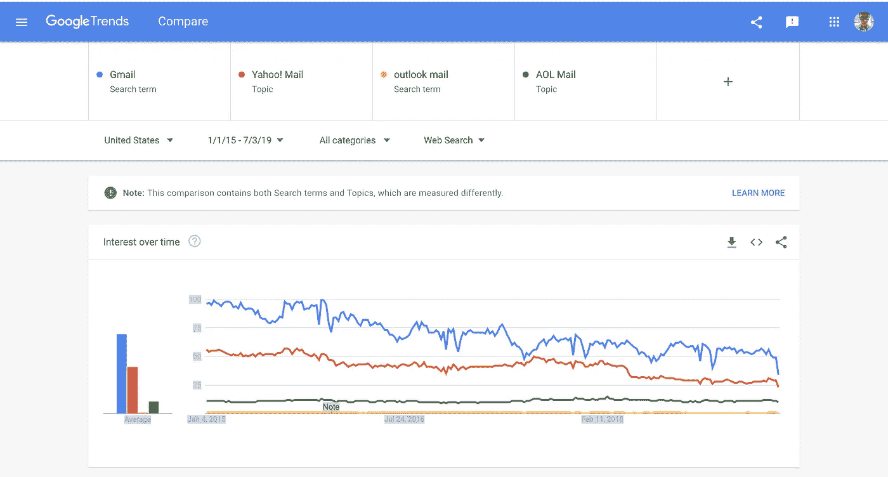
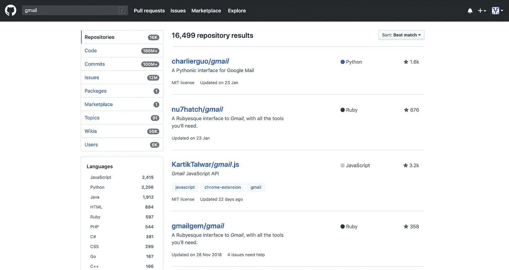
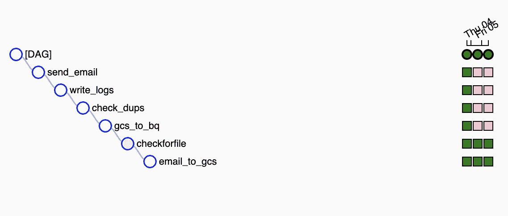

# 数据工程——如何在 Apache Airflow 上构建 Gmail 数据管道

> 原文：<https://towardsdatascience.com/data-engineering-how-to-build-a-gmail-data-pipeline-on-apache-airflow-ce2cfd1f9282?source=collection_archive---------12----------------------->

## 黑掉你的 Gmail 收件箱。


我的读者朋友们，你们好。你今天过得怎么样？好吗？
我将向你解释我是如何为我的公司制作了一个
**Gmail 数据管道**来让它变得更好。
围拢过来。你不会想错过的。

那是什么？你说你为什么要在乎这个？
嗯，考虑到谷歌通过整合大量技术(如 Google Drive、Google Photos、Google Calendar、Google Everything)在电子邮件服务提供商领域占据了主导地位，它也被许多评论网站评为顶级电子邮件服务提供商。这里有一个[的例子。](https://www.toptenreviews.com/best-free-email-services)

这也是大多数公司和临时用户的首选。我不会深究为什么 Gmail 是最好的。
这里谁用雅虎邮箱？正是我的观点。

还不信服？
只需看看谷歌趋势中电子邮件提供商之间的比较。



结果不言自明。
Github 上也有对 Gmail 相关代码的巨大支持。仅 Gmail 一项，Github 就有超过 16k 个知识库和 1.8 亿个代码。因此，任何你能想到的用 Gmail 实现的东西，可能已经有人做过类似的事情了。



话虽如此。你登上 Gmail 火车了吗？最好快点。在你告诉你的老板你能够从 Gmail 中自动提取、转换和加载数据到你的数据仓库后，他可能会立即大幅提升你到数据科学的领导位置。请给我捐点钱，我的银行账号是
I-M-K-I-D-D-I-N-G，来自讽刺银行。让我们进入正题。

# Gmail 数据管道

*   每天自动从您的 Gmail 收件箱提取、转换数据并将其加载到您的首选数据仓库中
*   一个自动化系统，可以更好地将您的 Gmail 附件组织到您的数据库中。只保留你需要的，其余的都扔掉
*   易于使用，没有麻烦。停止下载附件并手动上传到数据仓库

我将使用由 Google Cloud Composer 管理的 Apache Airflow 来执行管道。在我的公司里，我也使用 Google Bigquery 作为我的数据仓库。你可以使用任何你喜欢的 WMS 和数据仓库，无论如何 Google API 应该是可调用的。

我写过一篇如何从零到英雄操作阿帕奇气流的文章。
你可以在这里找到: [*阿帕奇气流基础*](/data-engineering-basics-of-apache-airflow-build-your-first-pipeline-eefecb7f1bb9)

# 第一步。设置您的 Gmail 收件箱

管道的第一步是设置要提取的标签收件箱。提取收件箱中的所有附件是可能的，但是请考虑一下。
其中一些将是图片、文本文件、视频、pdf 等。我们只想要 csv 文件，因为数据通常是这样发送的。我们还想标准化每个管道的格式，这样我们就不会在未来遇到任何不一致的情况。
例如，詹姆斯发给你的每周财务报告的数据和莫尼卡发给你的每周活动结果的数据是不同的。
因此，我们需要通过添加标签来区分数据。

进入您的 gmail 收件箱。在右上角，

**设置** > **过滤器并屏蔽** **地址** > **创建新过滤器**

设置标签的条件。例如，unknown@gmail.com 每周给我发一份产品性能报告。
电子邮件的主题通常是“每周报告产品 A”

因此，我将从:unknown@gmail.com
**主题**:周报产品 A
中设置
**，并勾选**有附件**框。**

选择**创建过滤器**，你会看到一堆复选框:
重要的有

*   **应用标签:选择一个标签**
*   **还将过滤器应用于匹配对话**

务必选中这两个框，并为这批特定的电子邮件创建一个新的标签名称。我通常也会勾选“跳过收件箱”,这样电子邮件就会被直接发送到标有“收件箱”的地方。让我们为我们正在使用的示例创建一个标签收件箱，命名为“**每周报告产品收件箱**”。

您现在应该会看到所有的电子邮件，包括关于产品 A 的周报告的现有邮件，这些邮件在
**周报告产品 A 收件箱**中包含附件。
祝贺您，您已经完成了这个流程中最简单的一步。

# 第二步。在 Apache Airflow 中创建 DAG 文件

如果你现在迷失了，给自己两个耳光，集中注意力。我们即将进入本质，也就是代码。我假设您知道如何在 Apache Airflow 中创建 Dag 和操作符，如果您不知道，请节省一些时间，阅读我的文章[中关于如何创建 Dag 和操作符的内容。这样一来，打开你最喜欢的文本编辑器，开始编码。](/data-engineering-basics-of-apache-airflow-build-your-first-pipeline-eefecb7f1bb9)

# 进口

```
# airflow related
from airflow import models
from airflow import DAG# other packages
from datetime import datetime, timedelta
```

# 设置默认参数

```
default_dag_args = {
    # Setting start date as yesterday starts the DAG immediately       when it is
    # detected in the Cloud Storage bucket.
    # set your start_date : airflow will run previous dags if dags #since startdate has not run
#notify email is a python function that sends notification email upon failure    
    'start_date': datetime(2019, 7, 1, 10),
    'email_on_failure': True,
    'email_on_retry': True,
    'project_id' : 'your_project_name',
    'retries': 1,
    'on_failure_callback': notify_email,
    'retry_delay': timedelta(minutes=5),
}with models.DAG(
    dag_id='your_dag_name',
    # Continue to run DAG once per day
    schedule_interval = timedelta(weeks=1),
    catchup = True,
    default_args=default_dag_args) as dag:
```

我们将 DAG 设置为每周一上午 10 点运行**。**假设每周报告将在每周一上午 10 点前发送。如果在上午 10 点以后收到电子邮件，将不会有任何数据加载到数据仓库中。请记住，当你设置这个的时候，你总是想要设置一个你**确定**数据会出现在收件箱的时间。我选择每周一次的报告也没有特别的原因。如果您正在处理的是每日报告，只需将 schedule_interval 更改为 timedelta(days=1)。

# 定义我们的 DAG、任务和运算符

让我们设计要在这个特定 DAG 中运行的任务。
我的做法是:

1.  浏览 Gmail 收件箱并将所有附件下载到 GCS
2.  检查是否有要加载的附件
3.  将所有附件加载到 Google Bigquery
4.  检查 Google Bigquery 中的任何重复加载
5.  写日志
6.  发送电子邮件

让我们为操作员编写执行这些任务的代码。
不用担心。我将和你一起浏览所有重要的操作符。
在文本编辑器中打开第二个窗口，开始**编写操作符。**

# **操作员:给 GCS 发邮件**

# 进口

```
# airflow related
from airflow.models import BaseOperator
from airflow.utils.decorators import apply_defaults# other packages
from datetime import datetime, timedelta
from os import environ
import csv
import getpass, imaplib
```

# 设计

```
class ExtractAttachment(BaseOperator):
    """
    Extract data from Gmail into GCS
    """[@apply_defaults](http://twitter.com/apply_defaults)
def __init__(
        self,
        inbox_name,
        *args, **kwargs):super(DataSourceToCsv, self).__init__(*args, **kwargs)
        self.inbox_name = inbox_name
        self.file_path = #filepath_to_save_CSVdef __extract_email_attachment(self, execution_date):
        userName = 'your_user_name'
        passwd = 'your_password' imapSession = imaplib.IMAP4_SSL('imap.gmail.com')
        typ, accountDetails = imapSession.login(userName, passwd)
        if typ != 'OK':
            print('Not able to sign in!') imapSession.select(self.inbox_name)
        typ, data = imapSession.search(None, 'Unseen')
        if typ != 'OK':
            print('Error searching Inbox.')# Iterating over all emails
        for msgId in data[0].split():
            typ, messageParts = imapSession.fetch(msgId, '(RFC822)')
            if typ != 'OK':
                print('Error fetching mail.') raw_email = messageParts[0][1]
            raw_email_string = raw_email.decode('utf-8')
            email_message =  email.message_from_string(raw_email_string)
            for part in email_message.walk():
                if part.get_content_maintype() == 'multipart':
                    # print part.as_string()
                    continue
                if part.get('Content-Disposition') is None:
                    # print part.as_string()
                    continue
                fileName = part.get_filename() if bool(fileName):
                    filePath = self.file_path + fileName
                    print(filePath)
                    if not os.path.isfile(filePath) :
                        print(fileName)
                        fp = open(filePath, 'wb')
                        fp.write(part.get_payload(decode=True))
                        fp.close()
            imapSession.uid('STORE',msgId, '+FLAGS', '\SEEN')
        imapSession.close()
        imapSession.logout()def execute(self, context):
execution_date = (context.get('execution_date')
self.__extract_email_attachment(execution_date)
```

在这段代码中，我们:

1.  定义数据所在的 Gmail 收件箱名称
2.  设置我们的 Gmail 用户名和密码(是的，不幸的是，任何查看代码的人都会看到)
3.  设置 IMAP 会话，使用凭证登录
4.  搜索名为 **inbox_name** 参数的 Gmail 标签收件箱
5.  只选择**不可见的**邮件，这很重要，因为我们不想两次加载相同的数据
6.  提取这些邮件的附件并保存在由 **file_path** 参数定义的文件路径中
7.  提取后，将电子邮件标记为已读，这样下次就不会被提取了
8.  注销我们的 IMAP 会话

请记住，操作员只考虑那些**未看到/未读的**电子邮件。因此，如果您不小心点击了该邮件，它将自动标记为**已读**，完全忽略来自管道的邮件。如果你不希望这种情况发生，记得在阅读完邮件后，从 Gmail 用户界面将它标记为**未看/未读**。

以下是操作符本身的完整代码:

这是完成的第一个操作符。继续前进。

# 操作员:短路操作员

由于电子邮件可能会不可避免地丢失，DAG 有时会返回一个错误，因为没有数据加载到 BQ 中。对于这一部分，我们使用 ShortCircuit 操作符检查是否有任何文件要加载到 Google Bigquery 中。如果没有要加载的文件，则跳过该操作符的所有下游任务，DAG 成功完成。否则，DAG 照常进行。没有必要为此编写自定义操作符，我们将使用 Airflow 提供的默认操作符。跳过任务时，气流将显示粉色指示器。下面是一个例子。



# 操作员:GCS 到 Google Bigquery

# 进口

```
# airflow related
from airflow.models import BaseOperator
from airflow.utils.decorators import apply_defaults# other packages
from datetime import datetime, timedelta
from os import environ
import csv
from google.cloud import bigquery
import pandas as pd
import os
```

# 设计

```
class StorageToBigQuery(BaseOperator):
    """
    Extract data from Google Cloud Storage to Google Bigquery
    """[@apply_defaults](http://twitter.com/apply_defaults)
def __init__(
            self,
            dataset_name,
            bigquery_table_name,
            write_mode,
            *args, **kwargs):super(StorageToBigQuery, self).__init__(*args, **kwargs)
        self.dataset_name =  dataset_name
        self.bigquery_table_name =  bigquery_table_name
        self.write_mode = write_mode
        self.local_path = 'File Path of CSV'def __StorageToBigQuery(self, execution_date):
for file in os.listdir(self.local_path):
        filename = self.local_path + file
        df=pd.read_csv(filename,error_bad_lines=False)
        #Using pandas to clean data
        df.to_csv(self.local_path + 'cleaned_' + file,index=False) file_path_to_load = self.local_path + 'cleaned_' + file
            logging.info("FILE PATH TO LOAD : %s" % file_path_to_load)
            print('loading_file_to_BQ')
            client = bigquery.Client()
            dataset_ref = client.dataset(self.dataset_name)
            job_config = bigquery.LoadJobConfig()
            job_config.autodetect = False
            if(self.write_mode == 'overwrite'):
                job_config.write_disposition = 'WRITE_TRUNCATE'
            elif(self.write_mode == 'empty'):
                job_config.write_disposition = 'WRITE_EMPTY'
            else:
                job_config.write_disposition = 'WRITE_APPEND'
            job_config.skip_leading_rows = 1
            job_config.field_delimiter = ','
            job_config.quote = ''
            job_config.allow_quoted_newlines = True
            with open( file_path_to_load, 'rb' ) as source_file:
                load_job = client.load_table_from_file(
                        source_file,
                        dataset_ref.table(self.bigquery_table_name),
                        job_config=job_config) assert load_job.job_type == 'load'
            load_job.result()
            assert load_job.state == 'DONE'def execute(self, context):
execution_date = (context.get('execution_date')
self.__StorageToBigQuery(execution_date)
```

**重要提示**:由于我默认使用 Google Cloud Composer，所以在调用 Google Bigquery API 时，我不需要通过任何身份验证。如果你正在使用香草气流，请在这里找到如何调用谷歌大查询 API。在加载数据之前，您还需要在 Google BQ 中创建表格。

在这段代码中，我们:

1.  在 BQ 中定义要加载到的数据集和表格
2.  浏览 **local_path** 目录下的所有文件
3.  用熊猫做一些清洁工作
4.  使用由 **write_mode** 参数设置的写入模式，在清理的文件上启动到 BQ 的加载作业

用熊猫清洁是为了避免任何人为错误。但是，您可以在该部分进行某种转换，然后加载该文件。我还使用它来添加一个名为**气流执行日期**的列，将 DAG 的执行日期作为输入。这对以后删除重复项很有用。
以下是操作员的完整代码:

又一个倒下了，坚持住。

# 运算符:检查 Bigquery 中的重复项

每当我们将数据加载(追加)到 BQ 中时，
数据中可能会有重复。
这可能是由以下几个原因造成的:

*   数据组有人启动了 DAG 两次
*   数据中有重复项(可以通过清除上一个运算符来删除)
*   有人中途停止了 DAG 并重新启动了它
*   代码中的缺陷
*   许多其他原因

因此，为了确保万无一失，我们总是运行重复检查，以确保我们只加载数据一次。我们不想报告 2 倍的收入，只是为了发现这是重复加载，不是吗？

# 进口

```
# airflow related
from airflow.models import BaseOperator
from airflow.utils.decorators import apply_defaults# other packages
from datetime import datetime, timedelta
from os import environ
import csv
from google.cloud import bigquery
import pandas as pd
import os
```

# 设计

```
class CheckBQDuplication(BaseOperator):
    """
    Check if a specific table in BigQuery contains duplicated data after the load
    """[@apply_defaults](http://twitter.com/apply_defaults)
def __init__(
        self,
        dataset_name,
        bigquery_table_name,
        bigquery_table_key,
        date_column,
        *args, **kwargs):super(CheckBQDuplication, self).__init__(*args, **kwargs)
        self.dataset_name = dataset_name
        self.bigquery_table_name = bigquery_table_name
        self.bigquery_table_key = bigquery_table_key
        self.date_column =  date_column
        self.file_path = 'File Path of CSV'def __check_BQ_duplication(self, execution_date):
# Check if the table contains duplicated data check_query = """
            SELECT MAX(count) FROM (
            SELECT $ID_COLUMN, COUNT(*) as count
            FROM `$DATASET_NAME.$BIGQUERY_TABLE_NAME`
            WHERE CAST($DATE_COLUMN AS DATE) = $EXECUTION_DATE
            GROUP BY $ID_COLUMN)
            """
        check_query = check_query \
          .replace("$ID_COLUMN", self.bigquery_table_key)\
          .replace("$DATASET_NAME", self.dataset_name) \
          .replace("$BIGQUERY_TABLE_NAME",self.bigquery_table_name)\
          .replace("$EXECUTION_DATE", \
           "'" + execution_date + "'") \
          .replace("$DATE_COLUMN", self.date_column)
        logging.info("CHECK QUERY : %s" % check_query)check_query_job = bigquery.Client().query(query = check_query)
        logging.info("job state : %s at %s" % \(check_query_job.state, check_query_job.ended))check_query_result = 0
        for row in check_query_job:
            check_query_result = int(row[0])
            break

        if check_query_result > 1:
            logging.error('(ERROR): DUPLICATION EXISTS IN TABLE ' + self.bigquery_table_name)

       # Duplication exists, proceed to delete the data in Big Query delete_query = """
                DELETE FROM `$DATASET_NAME.$BIGQUERY_TABLE_NAME`
                WHERE CAST($DATE_COLUMN AS DATE) = $EXECUTION_DATE
                """
            delete_query = delete_query \
         .replace("$DATASET_NAME",self.dataset_name) \
         .replace("$BIGQUERY_TABLE_NAME",self.bigquery_table_name)\
         .replace("$EXECUTION_DATE", "'" +execution_date + "'")\
         .replace("$DATE_COLUMN", self.date_column)
            logging.info("DELETE QUERY : %s" % delete_query)delete_query_job = bigquery.Client().query(query=delete_query)
            logging.info("job state : %s at %s" % (delete_query_job.state, delete_query_job.ended))# Reload the file from Cloud Storage
            print('going through the folder')
            for file in os.listdir(self.local_path):
                file_path_to_load = self.local_path + 'cleaned_' + filelogging.info("FULL FILE PATH TO LOAD : %s" % file_path_to_load) client = bigquery.Client()
                dataset_ref = client.dataset(self.dataset_name)
                job_config = bigquery.LoadJobConfig()
                job_config.autodetect = False
                job_config.write_disposition = 'WRITE_APPEND'
                job_config.skip_leading_rows = 1
                job_config.field_delimiter = ','
                job_config.quote = ''
                job_config.allow_quoted_newlines = True
                with open( file_path_to_load, 'rb' ) as source_file:
                    load_job = client.load_table_from_file(
                       source_file,
                       dataset_ref.table(self.bigquery_table_name),
                       job_config=job_config) assert load_job.job_type == 'load'
                load_job.result()
                assert load_job.state == 'DONE'def execute(self, context):
execution_date = (context.get('execution_date')
self.__check_BQ_duplication(execution_date)
```

在这段代码中，我们:

1.  定义查询以检查重复并在 BQ 中执行它
2.  如有重复，删除 BQ 中所有数据，其中
    **date _ column**=**execution _ date**
3.  从 **file_path** 参数中重新加载所有**清理过的**文件

考虑到机制，我们需要在表中有一个日期列。如果默认情况下没有，我们必须显式地创建一个。这就是为什么我在前一个操作符中创建了 Airflow 执行日期列。
再一次，这里是操作员的完整代码:

将您编写的所有操作符保存在 Airflow 可访问的文件夹中。对我来说，它是 DAG 文件夹中一个名为 Operators 的文件夹。最后两个操作符只是通知您作业的状态，并在 BQ 中写入日志。在 writing logs 操作符中还有一个部分删除了 **file_path** 目录中的文件。我将不会进入最后 2 个运营商，因为我们已经可以实现我们想要的，直到这个阶段。我会写一篇写日志和发邮件的文章，因为它适合我所有的日志。这篇文章已经写了太久了。和我在一起。

# 第三步。最终确定 DAG

完成所有操作后，剩下的就是将它们调用到我们的 DAG 文件中。
让我们回到 DAG 文件中。

# 导入运算符

```
# import operators from the 'operators' file
from operators import GmailToGCS
from operators import StorageToBQ
from operators import CheckDupBQ
from operators import WriteLogs
from operators import SendEmail
from airflow.operators import ShortCircuitOperator
```

# 呼叫短路接线员

```
def checkforfile():
    file_path = 'File Path to Load'
    if os.listdir(file_path):
        return True
    else:    
        return Falsecheckforfile = ShortCircuitOperator(
        task_id='checkforfile',
        provide_context=False,
        python_callable=checkforfile)
```

ShortCircuit 操作符通过传递返回真或假输出的 python 函数来工作。如果输出为真，DAG 照常进行。否则，DAG 会跳过所有下游任务并继续完成。因此，我们编写一个函数来检查**文件路径**目录中的文件，如果文件存在，则返回 True。

DAG 的完整代码:

注意，要传递给操作符的所有参数都是在 DAG 的顶部定义的。这样做是为了让 DAG 可以用作 Gmail 收件箱中其他**标签**的模板。这也更容易向你的同事解释，他们可能想使用它。

# 第四步。孩子身上的弹性

放松点。没有更多的代码要读。
将 DAG 文件弹出到 Airflow DAG 文件夹中，就可以了。
**恭喜**，您已经成功构建了您的个人
Gmail 数据管道。如何处理这些数据现在完全取决于你。你可以自动化仪表盘来显示报告，制作显示趋势的网页，甚至向你的机器学习模型提供数据。

所以，现在去吧，我的数据从业者伙伴们。传播消息。给自己一个鼓励..继续做下一个项目。至少这是我接下来要做的。

最后，让我引用一段话:

> 你可以有没有信息的数据，但你不能有没有数据的信息。—丹尼尔·凯斯·莫兰

## 订阅我的时事通讯，保持联系。

***感谢*** *的阅读！如果你想与我取得联系，请随时通过 nickmydata@gmail.com 或我的* [*linkedIn 个人资料*](https://www.linkedin.com/in/nickefy/) *联系我。也可以在我的*[*Github*](https://github.com/nickefy)*中查看代码。*