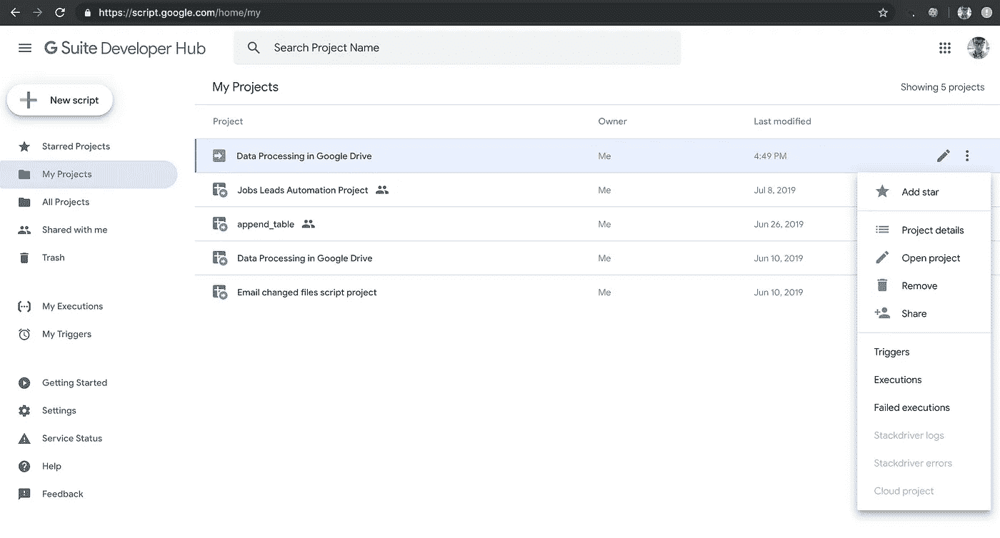

# 数据工程——如何使用 Google App 脚本构建 Google Drive 数据管道

> 原文：<https://towardsdatascience.com/data-engineering-how-to-build-a-google-drive-data-pipeline-with-google-app-script-d056958e6de6?source=collection_archive---------10----------------------->

## 通过 3 个简单的步骤从您的 Google Drive 获取数据


另一天，另一个管道。亲爱的读者朋友们，我是你们友好的邻里数据从业者，为你们带来了另一条数据管道，以满足你们所有的工程需求。让我们跳过关于如今数据有多重要的闲聊，因为我已经在我之前的所有[文章](/data-engineering-basics-of-apache-airflow-build-your-first-pipeline-eefecb7f1bb9)中多次提到它。**底线**，如果你不使用数据，你就错过了。现在，如果除了一张凌乱的桌子，还有什么东西是每个人都讨厌的，那就是一个凌乱的数据仓库。

> 拥有一张漂亮干净的桌子是没有意义的，因为这意味着你什么也没做。—加来道雄

请不要将这个概念应用于数据仓库。它实际上与引用的内容相反。

> 拥有一个混乱的数据仓库是没有意义的，因为这意味着你什么也做不了。真的，你可以以后再感谢我。

因此，当涉及到通过组织数据仓库的架构来为科学家和分析师保持数据仓库的功能时，数据工程师是至关重要的。必须构建干净的管道来维护来自各种来源的正确数据摄取，无论是来自组织本身还是来自外部来源。如果你自己是一名数据工程师，你今天会有所收获。即使你不是，也要倾听并欣赏工程师所做的事情。毕竟，正是他们为您提供了清晰易读的数据，并将其输入到您的复杂模型中。

在我的上一篇文章中，我谈到了如何建立一个 [Gmail 数据管道](/data-engineering-how-to-build-a-gmail-data-pipeline-on-apache-airflow-ce2cfd1f9282)。这是假设你通过 gmail 收件箱从外部来源获得常规数据。然而，如果出于某种原因，您的客户拒绝每周向您发送一封附有数据的电子邮件，该怎么办呢？相反，你的客户更喜欢通过一个共同的
**Google Drive** 文件夹定期与你分享数据。就像**将文件拖放**到他/她的浏览器中一样简单。在一分钟内，数据将被接收到您的数据仓库中，并生成有意义的见解/报告。那不是很酷吗？没有吗？就我一个人出去玩？那很有趣，因为我过去常常嘲笑那些讨厌的人的工作。看来我们没什么不同。

我经常被问到的问题是— **我为什么要关心**？
好吧，即使你现在没有得到这个问题，谁又能说你将来不会得到呢？此外，如果出现这种情况，你可以向你的客户提出这样的解决方案。这可能会也可能不会增加你的专业感。此外，它还会增加你的**酷点**，我们数据从业者对此无法满足。

考虑到谷歌通过整合大量技术(如谷歌文档、谷歌表单、谷歌照片、谷歌日历、谷歌一切)而几乎主导了在线存储市场，它也被许多评论网站评为顶级云存储服务之一。这里有一个的例子。

拜托，你得承认。你自己用谷歌驱动，不是吗？

但是不要相信我的话。以下是谷歌趋势统计数据的支持。


在 **Github** 中也有一堆与 Google Drive 相关的支持代码。我们正在寻找大约 6k 个存储库和价值 800 万的代码。所以不要担心开发人员，我们支持你。


更不用说它可以与 Google Bigquery 顺利集成，如果您已经将它用作数据仓库，这是一个优势。Google Drive 是愚蠢的证明，用户友好，几乎每个人都在使用。很快，您将能够使用这个云服务作为您的来源之一，通过 **3 个简单步骤**将数据摄取到您的数据仓库中。

# Google Drive 数据管道

*   自动从 Google Drive 文件夹中提取、转换和加载数据到您的首选数据仓库，最多一分钟即可完成
*   一个自动化系统，可以更好地将你的 Google Drive 文件组织到数据库中。只保留你需要的，其余的都扔掉。
*   愚蠢的证明。拖放。停止下载附件并手动上传到数据仓库。

我将使用**谷歌应用程序脚本**来执行这个管道。这样做的缺点是谷歌应用程序脚本无法与任何真正的工作管理系统相比，如 [Apache Airflow](/data-engineering-basics-of-apache-airflow-build-your-first-pipeline-eefecb7f1bb9) 。因此，你无法真正监控你的管道。但是，默认情况下，Google App Script 会在失败时向您的 Gmail 帐户发送电子邮件。Google App 脚本 UI 还提供了一个简单的脚本摘要来监控错误。


因此，我建议将这种解决方案用于具有最小复杂性的**简单管道**。这里没有任何写日志或发邮件的步骤。它只是抓取数据，执行一些转换，并将其加载到您的数据仓库中。简单快捷。

我也在用**谷歌大查询**作为我公司的数据仓库。这里的好处是 Google App Script 能够用 2-3 行代码连接到 Google Bigquery。你可以选择使用任何你喜欢的 WMS 和数据仓库，无论如何 Google Drive API 应该是可调用的。

# 第一步。设置您的 Google Drive

管道的第一步是建立一个 Google Drive 文件夹，我们从中提取数据。提取你的 Google Drive 中的所有文件是可能的。然而，我们只想要与管道本身相关的 **csv** 文件。因此，我们必须为每个管道创建一个 Google Drive 文件夹，以便数据可以与其他数据区分开来，这是为了避免将来出现任何不一致。相当直接。

进入你的谷歌硬盘。右键单击空白区域的任意位置，然后选择新建文件夹。将该文件夹命名为您想要命名的管道，这样就设置好了。在该文件夹中，创建一个名为“Processed”的文件夹来存储所有已处理的数据。现在，您应该有一个专门用于管道的文件夹，其中包含一个名为“已处理”的文件夹。


# 第二步。在 Google App 脚本中创建管道

戴上你的学习帽，因为我们将深入一点代码。我有没有提到谷歌应用脚本只使用 Javascript 作为他们的语言？如果这让你厌烦，克服它，因为你不会永远用 Python 编码。

进入你的[谷歌应用脚本主页](https://script.google.com/home)。
选择新脚本并开始编码。
在键入任何代码之前，我们必须启用一些 API，以允许 Google App 脚本连接到 Google Drive 和 Google BQ。在菜单栏上，选择:

资源->高级 Google 服务->打开 Bigquery 并驱动 API


```
// Replace this value with the project ID listed in the Google
  // Cloud Platform project.
var projectId = 'your project ID';
  // Create a dataset and table in the BigQuery UI ([https://bigquery.cloud.google.com](https://bigquery.cloud.google.com))
  // and enter its ID below.
  var datasetId = 'your dataset name';
  var tableId = 'your table name';
  var location = 'your bigquery location'//  defining the folder to store the csv file
//  folder for files to be saved in  
  var processedfolderId = 'your processed folder ID';  
  var folderId = 'your folder ID';
```

在这段代码中，我们定义了 GCP 项目、Google BQ 数据集、表和位置以及 Google Drive 文件夹。Google Drive 文件夹的 ID 可在此处找到:


```
function scan_files() {
  var folder = DriveApp.getFolderById(folderID);
  var processedfolder = DriveApp.getFolderById(processedfolderId);
  var files = folder.getFiles();
  while (files.hasNext()) {
    var file = files.next();
    if (file.getName().substring(0, 10) != 'processed_' || file.getName().substring(0, 7) != 'loaded_') {
      loadCSVfromdrive(file);
    }
  }
};
```

在这个块中，我们定义了一个由 Google App Script 定期运行的函数来扫描我们指定的文件夹中的文件。如果有已存在的文件，我们将把它传递给函数 **loadCSVfromdrive。**但是，如果文件以名称“processed_”或“loaded_”开头，我们将忽略该文件。我们将用这个前缀命名我们已经处理/接收到 BQ 中的所有 csv 文件，以区别于尚未加载的数据。我们也会将它们放入“已处理”文件夹中。

```
function loadCSVfromdrive(file) {
  var fileId = file.getId();
  var filename = file.getName();
  var csvData =Utilities.parseCsv(file.getBlob().getDataAsString());
  var headers = [list of headers];
  var length = csvData.length;// defining an array for each row of data
  abstractarray = [headers];
//looping through each row of data from the raw file , transforming //it and append it to the array
  for (var a = 1; a < csvData.length; a++){

// Transformation of data begins here (example below)
  var description = csvData[a][14] + " " + csvData[a][25] + " " + csvData[a][26] + " " + csvData[a][27]; 
  var reference = csvData[a][15];
  var transaction_type = csvData[a][21];
// Transformation of data ends here contents = [description, reference, transaction_type];
  abstractarray.push(contents);
  }// defining the contents of the csv, should be an array of arrays
  var csvContent = ''; abstractarray.forEach(function(infoarray, index) {
    dataString = infoarray.join(',');
    csvContent += index < abstractarray.length ? dataString + '\n'    :dataString;
    });// create a csv file which contents are the csv contents we defined //in the processed folder   
  filename_new = 'processed_' + filename
  file_new = processedfolder.createFile(filename_new, csvContent);
```

在这段代码中，我们定义了将要加载到 Google BQ 中的 CSV 文件的内容。这仅适用于在接收到数据仓库之前需要清理/转换的数据。如果您计划从 Google Drive 文件夹加载原始数据，您可能会忽略大部分代码块。与使用 **Python** 的 **Pandas** 相比，Javascript 必须逐行转换数据，这就是为什么我们使用 for 循环来转换每行的所有数据，并将该行附加到我们的 **csvcontent** 中。如果你知道如何在 Javascript 中像熊猫一样操作，请在我的 DMs 中滑动，因为我对 JS 相当陌生。我们还在转换后在处理过的文件夹中创建一个名为“processed_filename”的文件，以便与原始数据区分开来。

```
// Create the data upload job.
  var job = {
    configuration: {
      load: {
        destinationTable: {
          projectId: projectId,
          datasetId: datasetId,
          tableId: tableId
        },
        maxBadRecords: 0,
        fieldDelimiter: ',',
        skipLeadingRows: 0,
        writeDisposition: 'WRITE_APPEND',
        sourceFormat: "CSV"
      }
    }
  }; job = BigQuery.Jobs.insert(job, projectId, file_new);
    while(true) {
  jobstatus = BigQuery.Jobs.get(projectId,    job.getJobReference().getJobId(), {location : location})
    if(jobstatus.getStatus().getState() == "DONE") {
      break;}
    }// saving the loaded file as the name 'loaded' so that it 
//doesnt get loaded the next time
  DriveApp.getFileById(fileId).setName('loaded_' + file.getName());
  Logger.log(file_new)
}
```

我们正在这里设置装载作业。如果您在 Google Drive 中接收累积数据以覆盖您的数据仓库中的数据，您可以将 **writeDisposition** 参数更改为‘WRITE _ TRUNCATE’。成功加载数据后，我们将文件重命名为“loaded_filename ”,这样它就不会在将来被加载。如果出现任何问题，您也可以返回到该文件夹检查您的原始数据。这是管道的完整代码。

# 第三步。在 Google App 脚本中设置触发器

恭喜你，你已经到达了数据管道的最后一步。
别担心，从这里开始不会再有代码了。我们现在要做的就是设置**触发器**来运行我们的管道。
进入你的谷歌应用程序脚本主页。

我的项目->悬停在您的项目上->触发器



这应该会把你带到触发页面。
点击新建触发器并设置您的触发器。


如你所见，这是一个快速、简单且愚蠢的证明。像我承诺的那样。
记得选择 **scan_files** 功能作为要运行的功能。您可以选择函数运行的时间间隔。在 Google App Script 中，目前可用的最短时间间隔是以分钟为单位。即使对你来说，这也太短了。她就是这么说的。

# 恭喜

您已经成功构建了您的个人 Google Drive 数据管道。
数据团队是否要求将 Google Drive 中的一些数据输入到他们的模型中？你现在每分钟都可以这样做！自豪地拍拍自己的背。

我希望你今天学到了新东西。如果我激发了你对数据的兴趣，那么我就帮了大家一个忙，为数据行业招募了一名新人才。我们又不是已经饱和了。作为结束，我将再一次放弃引用。

> 成功没有秘诀。它是准备、努力和从失败中学习的结果。—科林·鲍威尔

## 订阅我的时事通讯，保持联系。

***感谢*** *的阅读！如果你想与我取得联系，请随时通过 nickmydata@gmail.com 或我的* [*LinkedIn 个人资料*](https://www.linkedin.com/in/nickefy/) *联系我。也可以在我的*[*Github*](https://github.com/nickefy)*中查看代码。*