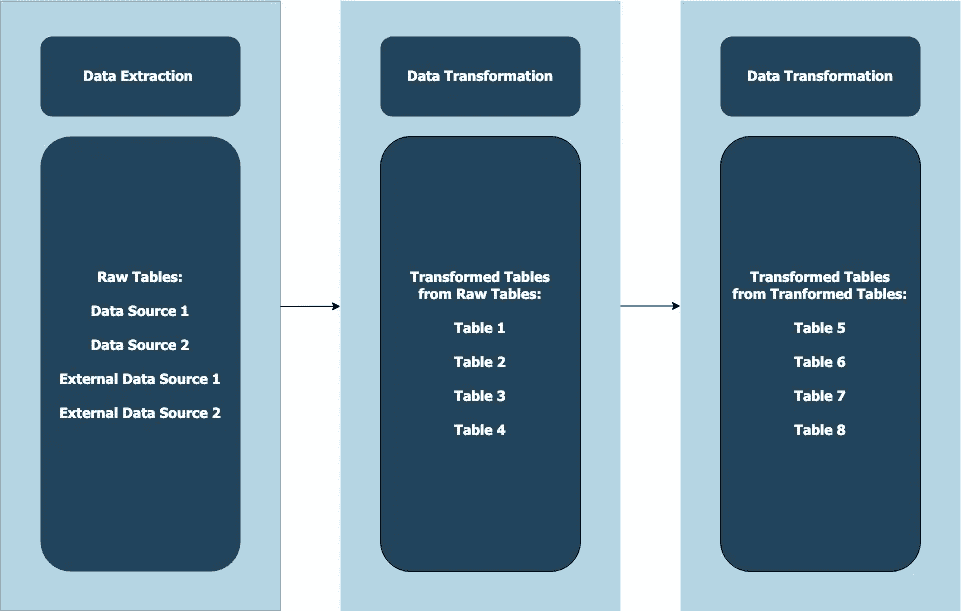
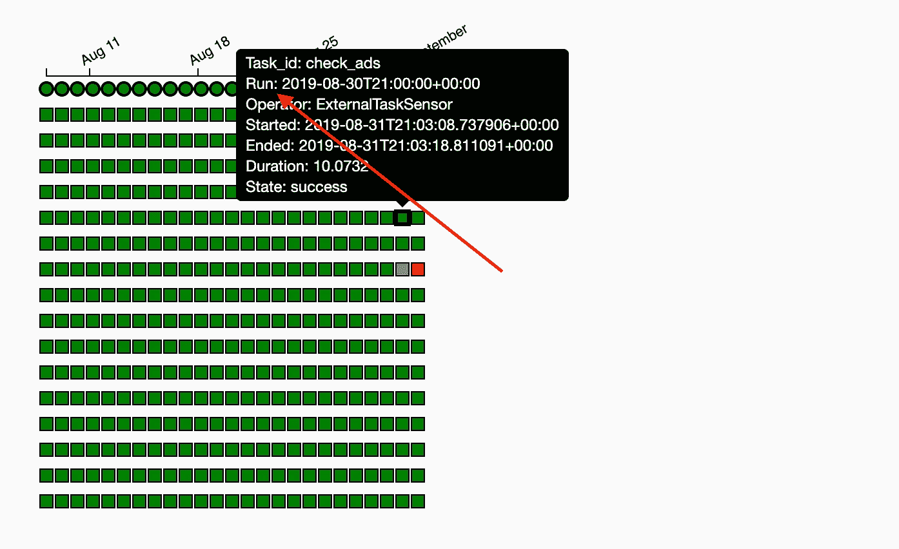
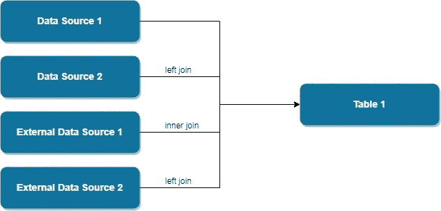

# 数据工程——如何在 Apache Airflow 中设置数据管道之间的依赖关系

> 原文：<https://towardsdatascience.com/data-engineering-how-to-set-dependencies-between-data-pipelines-in-apache-airflow-using-sensors-fc34cfa55fba?source=collection_archive---------7----------------------->

## 使用传感器设置数据管道之间的有效依赖关系，为数据团队建立坚实的基础


Photo by [Rodion Kutsaev](https://unsplash.com/@frostroomhead?utm_source=medium&utm_medium=referral) on [Unsplash](https://unsplash.com?utm_source=medium&utm_medium=referral)

亲爱的读者朋友们，又是我。那个写自己生活经历和一点点数据的家伙。
就一点点。
[文章](/data-engineering-how-to-build-a-google-drive-data-pipeline-with-google-app-script-d056958e6de6)在[文章](/data-engineering-how-to-build-a-gmail-data-pipeline-on-apache-airflow-ce2cfd1f9282)之后，我总是从数据在一个强大的组织中有多重要开始。大公司如何利用数据来影响他们的业务，影响我们的社会，进而为他们带来利润。数据可以用来拯救生命，看看这篇关于数据如何被用来预测癌细胞的[文章](https://www.analyticsvidhya.com/blog/2018/04/googles-machine-learning-model-can-detect-cancer-real-time/)就知道了。所以，请让我们跳过关于数据有多重要以及它如何总是正确的闲聊，就像你的妻子一样。

> 我们相信上帝。所有其他人必须带数据。爱德华·德明

在世界开始之前，只有黑暗。然后不知何故，有人说要有光，突然间所有的生命都活了过来。
同样，在没有任何数据之前，只有黑暗。然后，不知何故，数据工程师建立了惊人的管道将数据输入数据仓库，突然间，所有的数据科学家都提出了他们的模型。可用数据的基础很大程度上取决于工程师编写的管道结构。因此，我们使用正确的工具来优化我们的管道非常重要。

在我之前的[文章](/data-engineering-basics-of-apache-airflow-build-your-first-pipeline-eefecb7f1bb9)中，我谈到了 CRONJOBS 在为适当的数据仓库调度管道时不再可行。相反，工程师应该研究记录良好的工作流管理系统，这些系统可以提供巨大的好处，如监控、设置依赖关系，更不用说可以使用良好的 UI 了。我选择的 WMS 是 Apache Airflow，因为在研究了所有可用的 WMS 后，我的公司认为 Apache Airflow 是目前最适合我们仓库的。
我有没有提到 twitter 也在使用 Apache Airflow 进行数据仓储？
我还引导读者建立他们的第一个管道，谈论 Apache Airflow 的[基础以及它是如何工作的。这篇文章是对它的延伸，因为我将讨论设置管道之间的依赖关系，以及为什么它对您的数据仓库如此重要。](/data-engineering-basics-of-apache-airflow-build-your-first-pipeline-eefecb7f1bb9)

# 为什么重要？

每个数据仓库都各不相同。作为工程师，我们能做的最好的事情就是建立有效的管道来适应数据仓库本身的优点和缺点。每个数据仓库都从一个数据源获取数据，这个数据源可能是您的主数据库或它的克隆。根据您的公司，您可能会运行 ETL 管道将数据接收到您的数据仓库中。然而，使用 Google Bigquery 作为我公司的数据仓库，我们认为运行 ELT 管道速度更快，成本更低，因为 Google BQ 可以很好地处理转换。它还减轻了主数据库的从数据库的负担。我相信这不是我们公司独有的，现在在数据领域这是一种非常普遍的做法。通常的议程是从午夜开始的 X 个小时的**原始表**的纯**数据提取，导致这些表的转换再持续 X 个小时，以完成整个流水线。这是我做的一个形象化的展示。**



之所以这样设计管道，是因为第一级转换后的表来自并依赖于原始表提取的完成。然后，第二级转换表依赖于这些第一级转换表。因此，我们设置这些任务之间的依赖关系是很重要的。如果一个表的一个源表还没有被提取/转换，我们就不想执行这个表的转换。这将导致不正确的数据，而这正是数据工程师应该受到指责的地方。

# 传感器

如前所述，我们将使用阿帕奇气流作为我们的主要 WMS。通过这样做，我们可以有效地监控我们的工作流，能够跟踪失败的任务，如果有的话。如果你不知道如何操作气流，那么下面的内容对你来说就像是谜题，请先阅读阿帕奇气流的[基础知识。](/data-engineering-basics-of-apache-airflow-build-your-first-pipeline-eefecb7f1bb9)

传感器预装在气流中。顾名思义，它们感知气流中任何任务的完成状态，就这么简单。我们将使用传感器来设置我们的 does 管道之间的依赖关系，以便在依赖关系完成之前不会运行。不需要为此编写任何自定义操作符。以下是传感器的默认格式:

```
check_dependency =
ExternalSensor.ExternalTaskSensor(
task_id='name of the sensor',
external_dag_id='name of dag to be checked',
external_task_id= 'name of task to be checked',
execution_delta = time difference between execution times,
timeout = maximum running time of sensors)
```

我们将此代码块作为 DAG 中的一项任务来编写。
需要注意的两件事:

*   执行增量可能很棘手，它取决于任务的执行时间，而不是运行时间。这里有一个例子。



这里，执行时间是 2019 年 8 月 30 日晚上 9 点(不要与运行时间混淆，运行时间在这里也称为“开始”:2019 年 8 月 31 日晚上 9 点)。如果我们将传感器的执行时间(传感器 DAG 中的' **start_date** 的设置)设置为 2019-08-30 晚上 10 点，那么在这种情况下，执行增量将为 timedelta(小时=1)。

*   超时参数是必需的。当您的管道扩展时，将会有许多传感器运行来检查完井情况。如果没有设置超时，并且我们的一些依赖关系失败，传感器将无限期运行，并导致您的气流暂停。这是因为 airflow 只允许在一个实例上运行一定最大数量的任务，并且传感器被视为任务。如果你不知何故达到这个数字，气流将不会处理进一步的任务。因此，我们需要为传感器设置超时参数，这样，如果我们的依赖关系失败，我们的传感器就不会永远运行。

# 例子

在这个例子中，假设表 1 是来自原始数据源的一些连接的结果。在运行表 1 的转换之前，我们需要创建 4 个传感器来感知提取 Dag 的完成。



为了消除所有疑问，让我们假设所有提取 Dag:

*   每天运行
*   在晚上 9 点运行

我们将在表 1 的转换 DAG 中编写以下代码:

```
check_data_source_1 =
ExternalSensor.ExternalTaskSensor(
task_id='check_data_source_1',
external_dag_id='dag of data source 1',
external_task_id= 'last task of the dag',
execution_delta = timedelta(hours=1),
timeout = 300)check_data_source_2 =
ExternalSensor.ExternalTaskSensor(
task_id='check_data_source_2',
external_dag_id='dag of data source 2',
external_task_id= 'last task of the dag',
execution_delta = timedelta(hours=1),
timeout = 300)check_external_data_source_1 =
ExternalSensor.ExternalTaskSensor(
task_id='check_external_data_source_1',
external_dag_id='dag of external data source 1',
external_task_id= 'last task of the dag',
execution_delta = timedelta(hours=1),
timeout = 300)check_external_data_source_2 =
ExternalSensor.ExternalTaskSensor(
task_id='check_external_data_source_2',
external_dag_id='dag of external data source 2',
external_task_id= 'last task of the dag',
execution_delta = timedelta(hours=1),
timeout = 300)transform_table_1 = /* code for transformation of table 1 */check_data_source_1
check_data_source_2
check_external_data_source_1
check_external_data_source_2transform_table_1.set_upstream([check_data_source_1,check_data_source_2,check_external_data_source_1,check_external_data_source_2])
```

写完上面的代码后，在我们设置的四个依赖项完成之前，任务“transform_table_1”不应继续。一旦传感器启动，它们将在 5 分钟内感知依赖关系的完成。如果上述依赖关系未能完成，传感器将显示为故障，等待重试。

这是 DAG 的完整代码。

# 恭喜

您在实现干净数据方面又前进了一步。即使你不是数据工程师，这些知识对所有数据从业者都是有益的。此外，传感器可用于所有气流任务。

想在查询运行后发送电子邮件吗？使用传感器

想要在插入新文件后扫描某个共享的 google drive 吗？使用传感器

可能性是无限的。

结束注释:原谅我最近的缺席，我正在 Apache Beam 上实现流管道。有趣的东西！一旦完成，我会写下来的！

## [订阅我的时事通讯，保持联系。](https://www.nicholas-leong.com/sign-up-here)

***感谢*** *的阅读！如果你想与我取得联系，请随时通过 nickmydata@gmail.com 或我的* [*LinkedIn 个人资料*](https://www.linkedin.com/in/nickefy/) *联系我。也可以在我的*[*Github*](https://github.com/nickefy)*中查看代码。*