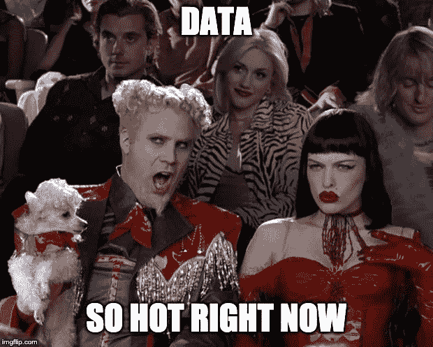
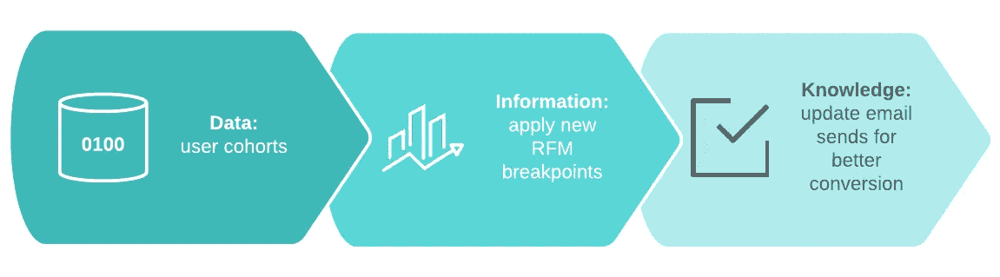

# 数据工程金块

> 原文：<https://towardsdatascience.com/data-engineering-nuggets-298f4935eef5?source=collection_archive---------34----------------------->

## *介绍杂乱无章的轮胎火灾，这是我的数据驱动思维*

Photo by [Pedro Henrique Santos](https://unsplash.com/@phcsantos?utm_source=medium&utm_medium=referral) on [Unsplash](https://unsplash.com?utm_source=medium&utm_medium=referral)

编写有意义的数据工程内容时的一个挑战是，受众来自如此多样化的背景。一个拥有数据工程师头衔的人很可能在到达这个职位时戴着各种不同的帽子，却发现“数据工程师”是他们所有人的最佳绰号。当面对一群这样的人时，什么能被认为是“常识”，什么不能被认为是“常识”，这是非常复杂的考虑到这一点，我在这里开始为收集数据团队相关的知识奠定基础。对于数据团队，我通常指的是组成大多数组织知识结构的分析师、数据工程师、数据科学家和商业智能专家的集合(尽管我的观点通常会偏离重点)。我们从实践中学到的一些经验教训是非常有价值和相关的，不管我们如何去理解它们，这就是我在这里要阐述的观点。我的希望是，它为我对那些使数据团队在今天取得成功的事情的理解描绘了一幅广阔的底漆。

# 数据团队必须有一个使命

在您签署任何供应商合同、启动您的第一个数据库或键入单个`git init`之前，您需要了解数据团队在您组织中的目的。像“成为一个数据驱动的组织”或可怕的“使用机器学习来减少辛劳”这样模糊的目标和令人恐惧的模糊指令，往好里说是毫无意义的，往坏里说是对你职业生涯的威胁。组织想要关注*内部分析*(围绕自身的准确报告)还是*商业智能*(围绕客户的准确报告)？*预测*(预测未来业务)或者*趋势分析*(寻找长期统计模式)？R *实时个性化*(应用速度数据科学)或*根本原因分析*(数据取证)？一个定义良好的任务是你的工作范围和支持用例的基础。当你选择使用什么技术，雇佣谁，以及如何定义你的工作“完成”时，这些将作为你的最高要求。

> **Meh 使命:**数据团队将支持组织变得更加数据驱动的目标，并使用机器学习将我们的业务提升到一个新的水平。
> 
> 是啊！使命:数据团队将构建和维护我们的“单一真实来源”数据系统，为企业利益相关方提供绩效洞察、产品和客户分析以及内部预测。该团队将制作和认证用于内部绩效指标、产品路线图&决策、产品和效率问题根本原因分析以及费用和销售预测的资产。

现在我们知道了我们要实现的目标。例如，这项任务的所有组成部分要么属于决策支持，要么属于监测或预测——高度容忍延迟的活动。在这种情况下，我们希望从数据团队获得的商业价值可以通过每天甚至每周的批处理来实现，因此在流式 NRT 解决方案上投入巨资可能是错误的答案。尽早并经常更新你的任务。当有疑问时，迫切要求澄清，尤其是当那些变化无常的高管人物给你模糊的指示时。如果你不清楚成功意味着什么，你就不会成功。

# 把你所做的当作软件

我绝不是这种思想流派的先驱，你可以阅读很多由比我聪明得多的[人写的关于数据工程即代码开发的文章。简而言之，我们生产的转换、提取负载、工件、模型和可视化是以编程方式应用业务逻辑的结果。这和驱动网站、商业软件、操作系统和 IOT 牙刷的代码是完全一样的功能。在其他应用业务逻辑所在的软件世界中，某些工具和技术(通常)被认为是该行业的基石，例如:](https://blog.getdbt.com/author/tristan/)

*   [源码控制](https://www.youtube.com/watch?v=w3jLJU7DT5E)
*   [测试驱动开发(TDD)](https://hackernoon.com/introduction-to-test-driven-development-tdd-61a13bc92d92)
*   [迭代交付](https://en.wikipedia.org/wiki/Iterative_and_incremental_development)
*   [持续集成&持续交付(CI/CD)](https://medium.com/@nirespire/what-is-cicd-concepts-in-continuous-integration-and-deployment-4fe3f6625007)

我们称之为“最佳实践”，现代软件开发人员已经将类似于`git commit`和`tox -e test`的命令深深地烙进了他们的记忆中。非常奇怪的是，数据团队经常被认为不受这些实践的约束，并且遵循一套完全不同的开发标准(或者根本没有标准)。这可能部分是由于这些不同的起源；沿着这条线的某个地方，一个业务用户变成了一个分析师，然后他变成了一个数据工程师，并且从来没有一个明确的时刻，软件团队的某个人觉得有必要说“你现在是工程软件，你需要开始使用 Git。”

所以这就是，毫不含糊地说。作为 2019 年现代数据团队的一员，你需要测试你的代码*和*你的数据工件。您需要使用源代码控制，并让您的工作接受同行评审。您需要学习如何以小增量提供价值，并在挖掘主题数据的细微差别时进行调整。你需要对真正的 SLA 负责。这些不是手动版本控制、单枪匹马的数据工程/科学、眼球问答和从 sql 终端直接对生产数据库运行代码的“替代方案”;在越野旅行中，骑马并不是飞机的“替代”交通方式。

当然，这个主题还有很多，在不久的将来，我将尽我所能在更多的文章中深入探讨*如何*最好地处理数据团队软件工作流。

# 数据不会告诉你它是错的

故事大概是这样的

善意的首席技术官(或首席执行官、首席信息官或其他人)决定公司需要数据驱动。“我们将不再在数据黑暗中运营！”这位高管英雄大声疾呼，于是他们召集了一支精锐的工程师团队，设计了一个包括数据湖、提取-加载管道、数据仓库和商业智能工具在内的架构。来自所有主要应用程序的原始数据被泵入湖中，一些`SELECT * FROM`查询被用来生成扁平的“分析表”，然后砰！你有这些中的一个:

We have graphs so we must be data driven, right?

这个团队做了其中一件事:

We did it! This data stuff is so easy.

太好了！

除了在“发布”后不久，用户开始注意到数据与之前的报告不太匹配。他们如何理解数据或提供许多超出他们已知的真实见解也没有意义。几件事情都是以**的方式**进行的。很快各部门开始比较笔记，差异的积压建立起来。在短短的几个月内，用户的信心直线下降，你的商业智能解决方案的光荣的白衣骑士变成了另一个“真理”,伴随着它应该取代的资源大军。

简而言之，可视化中的**数据不等于任务完成**。从数据源→数据湖→数据仓库→可视化移动数据可能会让你走完 10%的路程；另外 90%是解密部落知识、神奇的数字、与用户理解(或需要理解)输出的方式相冲突的交易和操作结构，开发和实现质量测试，以及跨数据集整合结构。这项工作就是将*数据*转换成*信息*。这是数据团队的大部分价值所在，也是我们如何真正定义“完成”的。

我们可以使用一些不同的工具来解决另外 90%的问题(即取证、转换、质量测试和数据整合)。我是 [Kimball 总线矩阵](https://www.kimballgroup.com/data-warehouse-business-intelligence-resources/kimball-techniques/kimball-data-warehouse-bus-architecture/)的忠实粉丝——它坚持下来是因为它有效。对于取证工作，我发现 DBA 伙伴关系和开发人员/利益相关者访谈是非常有价值的，但是没有什么比[亲自阅读应用程序代码](https://medium.com/@ethan.m.knox/data-engineers-read-the-code-yourself-ea241f1dd52a)更有价值。事实是，你的数据产品交付在迭代框架中是最成功的，这就是为什么对数据团队使用 UAT 开发过程绝对是我最喜欢的内部分析解决方案之一。

无论您如何着手，请记住，您向组织提交的最早的数据产品将决定您的团队的信心水平。从长远来看，尽最大努力开发经过适当研究、测试和“强化”的数据产品将会获得回报。

# 数据现在非常热门

Everybody wants a piece of that data goodness

截至 2019 年秋季，数据是商业术语的南瓜调味品。公司想要它，消费者担心谁拥有它，内容创建者不知道如何处理所有这些数据，政府想要监管它，谷歌和脸书交易大量的数据……每个重要人物都以这样或那样的方式与数据有关，或者看起来是这样。对于数据团队成员来说，这既创造了一些惊人的机会，也带来了一些令人严重担忧的趋势。

首先，好消息是: ***大家都喜欢你*** 。由于最近对数据的痴迷，我们正享受着来自商业同行的兴趣和支持的爆炸式增长。不是每天都有一个主要的成本中心能够在不被削减的情况下使他们的运营费用翻两三倍；然而，此时此刻，如果你说这是为了你一直在做的所有“机器学习”，有很多首席信息官会很乐意支付那个庞大的 AWS EMR 账单。由于这种数据狂欢的阴霾，我们从来没有像现在这样容易获得我们需要的东西，来构建能够以正确的方式影响业务的正确的东西。

现在是不太好的消息:**所有的繁荣都会破灭**。这种对数据的迷恋具备了 2005 年佛罗里达房地产泡沫的所有要素。如果你还记得很久以前，那是在英国《金融时报》做房地产经纪人的一段非常美好的时光。劳德代尔。到 2009 年末，就没那么多了。掌权的人，无论是首席执行官还是董事，甚至是董事会成员，他们都希望成为当今数据党的一员。因此，他们可能会参加数据团队会议，推动具有大量视觉 flash 的超大计划(通常没有与公司 okr 的关联)，并关注技术而不是结果(特别是当它涉及到他们听到其他高管提到的工具时)。来自整个组织的风险承担者可能会指出数据团队似乎是每个问题的显而易见的解决方案，但通常没有相应的行动计划。最终，分析水晶球和人工智能推动的大规模增长的承诺将恶化为巨额资本投资的后遗症，而这些投资几乎没有有形回报。当另一只鞋最终掉下时，数据团队会感到手头拮据，而此时游客早已转向下一个商业时尚。

那么有哪些方法可以防范繁荣呢？一个是肯定要 ***掌握自己的命运*** (后面会详细说明)。另一个警告你潜在危险情况的简单技巧是**听这个单词:**

That’s right. Beware the data.

奇怪的是，可操作的、有价值的数据团队工作很少在描述中包含“数据”这个词。请考虑以下情况:

> ***可操作:*** *我们需要 salesforce 中的用户群组，通过我们新的 RFM 断点进行划分，这样我们就可以在假期到来之前重新调整我们发送的电子邮件。*
> 
> ***绒毛:*** *我们的销量下降是因为我们没有 salesforce 的数据，所以我们没有任何见解。*

可操作的工作有一个清晰的策略，说明数据(salesforce 用户群)如何变成信息(应用新的 RFM 断点)如何变成功能知识(更新电子邮件以提高转化率)。

试图用绒毛做出同样的价值路径要困难得多，因为它依赖“数据”来解决问题。数据不能解决问题或做出决策。人们做那些事情。如果有疑问的人没有数据可以告知的行动计划，这些数据对他们没有任何用处(你也一样)。

# 掌握你的命运

很多年前，我卖摩托车，在我工作的经销店，我们有一种说法:*“你是销售员，还是接单员？”*接单员只是简单地传达他们的想法，盲目地将顾客带到那周广告中的自行车前，读出价格标签，填写文件，然后送他们离开。另一方面，*销售人员倾听顾客的意见，利用他们对机器和库存的了解，向顾客推荐最适合他们的自行车。接单员执行订单，销售人员 ***增值*** 。*

同样的规则也适用于现代数据团队。人们很容易相信利益相关者的话，认为填充几个 Adwords 数据表将解决所有营销困境，并保证任何有股权的人都能提前退休，这是很危险的。鉴于我们工作的复杂性(创建 EL 流程、建模、部署、可视化等),我们可能会被一种虚假的安全感所迷惑——因为我们正在努力做一些很难做的事情，我们必须做得很好，对吗？

这是它分解的地方。**当你致力于交付数据产品时，毫无价值的工作通常感觉就像是超级有价值的工作。**这意味着您可以夜以继日地辛勤工作，应用最前沿的分析并深入研究数据质量，以交付一组壮观的工件，这些工件(不是您自己的错)可能对业务完全没有价值。毫无疑问，这个价值就是你和你的工作将如何被企业所评判。对于成功的现代数据团队来说，不仅要投资工作质量，还要投资工作价值，这种转变是关键的一步。

因此，一定要质疑你的利益相关者。恳求他们帮助你理解需要完成数据工作的*原因*，以及它如何让业务变得更好。我曾经共事过的一位杰出的数据科学家会将这种宝石用于分析/报告工作:

> **您能告诉我您将根据此请求的结果做出什么决定吗？了解这些决策将有助于我们确保我们为您构建的(报告/数据/模型)能够满足您的需求。**

对于产品化的数据也可以提出同样的问题(“我们如何从这种产出中赚钱？”)和指标(“哪些组织 KPI 与这些指标相关联，如何相关联？”).最重要的是，如果答案不是你可以合理推后的，那就推后。没错——数据团队有责任确保他们在增加价值，即使这意味着(非常委婉地)告诉 CEO / CIO /总监你不同意的任何事情。有理由说，你的自我评估中的“胜利”一栏今年需要一些重大胜利，而“本小时发货的 10 大产品”仪表板不会让我们成为一个组织。你可能仍然需要制造一些无用的东西，偶尔运送一些低价值的工件来维持和平可能是很好的策略。但是，如果你发现自己在应该是“销售人员”的时候却一直扮演着“接单员”的角色，那么是时候开始寻找更好的工作了。在预算季节，没有人会急于为数据团队辩护，不管你在前一年按照要求成功完成了多少低价值的请求(这被称为高管健忘症)。

# 还有更多这是从哪里来的

到目前为止，我已经浏览了一些来之不易的现代数据课程；我的希望是在未来的几个月里，从过程和技术的角度进行更深入的探索，并分享一路上觉得有价值/有趣/值得的事情。