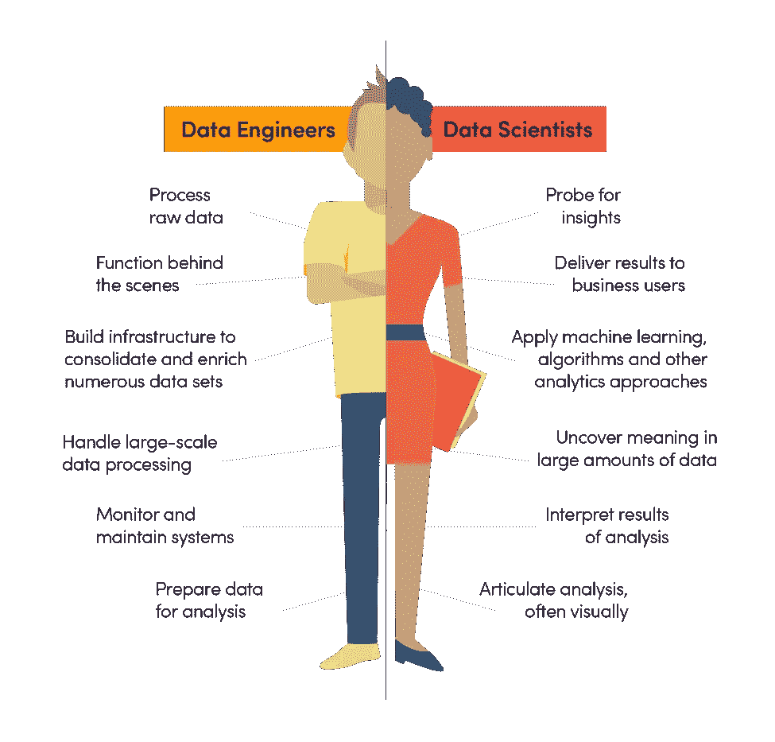

# 数据工程——数据科学的表亲，很麻烦

> 原文：<https://towardsdatascience.com/data-engineering-the-cousin-of-data-science-is-troublesome-3a9332b532ae?source=collection_archive---------11----------------------->

## 如何让你的分析师意识到扩展他们工具包的重要性？我想我已经找到答案了。

我们一直认为数据科学是“21 世纪最性感的工作”。当谈到从传统公司到分析公司的转型时，无论是公司还是数据科学家都希望尽快进入分析的奇妙世界。但是，总是这样吗？

# 麻烦的开始

自从我们，一个来自加州大学戴维斯分校的实习团队，开始与电动工具和相关服务的领先制造公司 Hilti 合作以来，我们已经提供了几个精彩的蓝图:定价自动化，倾向模型…与这样一个伟大的公司合作对我们来说是如此宝贵的机会，我们迫不及待地利用我们的分析技能来创造商业价值。但当我们开始挖掘数据时，我们发现，与电子商务公司等数据驱动型公司相比，我们很难直接从传统公司获得干净和结构化的数据。

由于我主要负责该项目的数据清理和工程设计，我目睹了我们如何因未准备好的数据而阻碍了分析进度。

I witnessed how we were hindered in the analytical progress due to the unready data

我们直接与财务团队合作，但另一个团队——定价运营团队——实际上负责数据库。一开始，这个过程严重滞后，因为我们几乎不能及时请求和查询数据或人员。此外，由于喜利得的销售数据非常敏感，并且该公司缺乏安全的数据传输方式，因此每次请求数据时都需要执行耗时的屏蔽过程。第三，薄弱的数据工程导致了几个参考表之间的不一致，我们几乎不能得到一个可靠的模型或结论。最后，我们必须处理各种数据类型:csv、JSON、SQLite 等……尽管这是一个很好的学习机会。

大约两个月后，我们准备好了所有的数据，讨论并解决了每一个异常情况。

# 潜水时间！

我们开发良好的可视化框架和模型迫不及待地想要品尝新鲜的数据。然而，最尴尬的事情发生在我们拿出第一份提案的实际数字时。

你猜怎么着，大数字似乎不匹配。快速讨论后，我们意识到我们根本没有收到完整的数据。我们只关注数据的细节，如异常和数据源之间的关系，但我们忘记了做基本的检查，如总和和计数。这是我将终生铭记的一课。真的！

# 为什么数据工程如此重要

我从数据工程戏剧中学到的最重要的事情是，在幕后工作的角色，例如数据工程师，实际上掌握着创新的大门。当传统公司考虑利用他们的数据时，最有效的第一步行动应该是改进数据工程过程。有了优秀的数据工程师，公司可以建立一个健康、可扩展的数据管道，让数据分析师更容易进行数据挖掘和寻找商业见解。

我还了解到，除了 SQL 和 Excel 等分析工具之外，为什么许多公司要求他们的数据分析师具备 Python 和 Scala 等编程相关工具的知识。通常，我们不能指望一个“全栈”的分析师，但我们必须有一个既能与工程人员沟通又能与管理人员沟通的人。虽然明确的工作分配对高效率很重要，但一个精通每一种数据工具的人确实是有吸引力的。

Full-stack…makes sense!

我期望自己在未来学习的是正面和背面的知识，如 Java、JavaScript、Kafka、Spark 和 Hive，我相信最终它们将成为我经验中的闪光点。