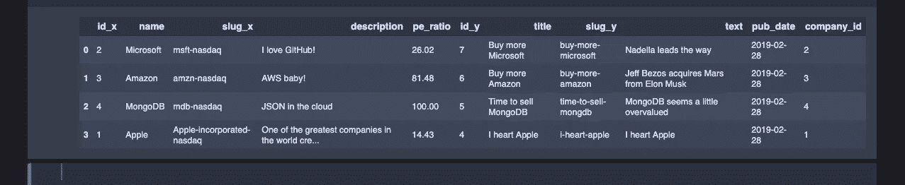

# 使用 Python、Django 和 PostgreSQL 的数据工程

> 原文：<https://towardsdatascience.com/data-engineering-with-python-django-and-postgresql-99409492769?source=collection_archive---------4----------------------->


今天的帖子将讨论数据科学中最困难的方面之一，它不涉及分析，而只是试图让数据科学的后端工作。我所说的后端指的是大多数数据科学家在工作中会用到的数据库系统。

我将回顾以下内容:

*   用关系数据库管理系统(RDBMS)构建一个绝对的准系统 Django 应用程序
*   演示附加到 Django 应用程序的 PostgresSQL 数据库的使用
*   如何在不同格式和平台之间移入和移出数据

虽然阅读本文不需要任何 Django 知识，但我认为重要的是要认识到大量数据收集是通过 web 应用程序进行的。

对于不熟悉 Django 的数据科学家来说，可以把它看作是一个构建 web 应用程序的框架，同时坚持“控制反转”的哲学。这意味着 Django 负责 web 应用程序的框架，而您负责在框架上充实实际内容。

对于不喜欢 Django 的读者，你可以跳到这篇文章末尾的标题为*“回报:Django 的对象关系映射器”*的部分。

## 我们的 Django 应用程序:“DoubleBagger”

我感兴趣的应用程序将被称为“DoubleBagger”，这是一个投资博客，人们可以在这里自助发表对苹果(股票代码:AAPL)或微软(股票代码:MSFT)等上市公司的买入/卖出意见。

这次我们将主要使用命令行+一个像 Sublime Text 这样的文本编辑器，而不是像我以前的文章那样使用 Jupyter 笔记本。

因为这是针对数据科学家的，我们将使用 [conda](https://conda.io/projects/conda/en/latest/user-guide/install/macos.html) 环境:

```
# I like to do things on my desktop
# From the terminal:$ cd desktop && mkdir doublebagger && cd doublebagger$ conda create -n doublebagger
$ conda activate doublebagger# You should now have the (doublebagger) conda environment activated
```

现在我们安装两个主要的包:Django 和 psycopg2，用于连接 PostgreSQL 数据库。Django 已经发布了 SQLite，它实际上可能适合许多组织和爱好者，但是我们将使用 Postgres 来代替。此外，我们将使用 Django 的旧版本(当前版本是 Django 2.1)。

```
$ (doublebagger) conda install Django==1.9.6 psycopg2
```

在验证您拥有这些包及其依赖项之后，创建一个源目录，我们将所有与“Doublebagger”相关的源代码放在这个目录中。

```
$ (doublebagger) mkdir src && cd src
```

我们用相同的命令以几乎相同的方式启动每个 Django 项目:

```
# Inside of src:
# don't forget the space and period at the end$ (doublebagger) django-admin startproject doublebagger_blog . 
```

django-admin startproject 命令为我们的项目创建了框架，现在如果您查看 src 文件夹中的内容，您应该会看到:

1.  doublebagger_blog:包含我们项目的项目配置，包括 settings.py 文件。
2.  manage.py:实用函数

现在我们可以在 Sublime Text 或您选择的任何其他编辑器中打开我们的 DoubleBagger 项目。您应该会看到完全相同的目录结构:


假设您的机器上已经安装了 postgres 数据库，我们实际上需要为 django 应用程序创建一个 postgres 数据库:

```
# from the command line:$ psql -d postgrespostgres=# CREATE DATABASE doublebagger;# That's it!
# quit by:postgres=# \q
```

*如果您没有 postgreSQL，您可以遵循这些[指令](https://medium.com/@viviennediegoencarnacion/getting-started-with-postgresql-on-mac-e6a5f48ee399)。

然后在 settings.py(使用 Sublime Text)中，我们更改默认配置以考虑我们刚刚创建的数据库。改变这一点:

```
# settings.pyDATABASES = {
    'default': {
        'ENGINE': 'django.db.backends.sqlite3',
        'NAME': os.path.join(BASE_DIR, 'db.sqlite3'),
    }
}
```

对此:

```
# Your 'User' is probably different depending on how you set up 
# postgres.  In many cases, it's just 'postgres'.
# Also depends if you set up a password with you postgres.DATABASES = {
    'default': {
        'ENGINE': 'django.db.backends.postgresql_psycopg2',
        'NAME': 'doublebagger',
        'USER': 'WhoeverOwnsTheDatabase',
        'PASSWORD': '',
        'HOST': '127.0.0.1',
        'PORT': '5432',
    }
}
```

*确保在文本编辑器中保存您的更改

现在，如果你回到命令行，我们可以像这样连接应用程序和 postgres 数据库:

```
# Still inside of your src where manage.py lives:$ (doublebagger) python manage.py migrate
```

如果一切顺利，您应该会看到类似这样的内容:


现在从同一个命令行:

```
$ (doublebagger) python manage.py runserver
```

并将您的浏览器指向:

```
127.0.0.1:8000
```

您应该会看到类似这样的内容:


image sponsored by fakedoors.com

这实际上是从 Django 的本地开发服务器上显示的假想 web 应用程序的主页，旨在模拟真实的 web 服务器。你可以用<control-c>退出开发服务器。</control-c>

这几乎是这个应用程序的全部了——甚至没有基本框架，甚至没有 hello world。

## 那么，我们为什么要费这么大的劲来做这件事呢？

因为 Django Models 为其用户提供了一个对象关系映射器(ORM ),允许我们在连接到 postgresSQL 数据库时使用 python 操作模型对象。这只是构成 pythonic 数据科学生态系统的绝对动物园的一个更复杂的层次和意识。

此时，我们需要考虑数据的组织。

我们的 web 应用程序将主要有两个主要组件或模型类:

*   帖子:关于是否投资特定公司的博客帖子
*   公司:博客文章中提到的公司的信息

帖子将包含以下信息:

*   帖子的标题
*   slug:基于标题的博客文章的唯一标识符)
*   文本:实际的博客文章文本
*   发布日期:文章发布的时间

公司将包含以下信息:

*   公司名称
*   slug:公司的唯一标识符
*   描述:该公司做什么
*   市盈率:公司相对于市场价格的估值指标

在我们将其转化为 Django 模型代码之前，我们需要先创建一个 Django 应用程序。

```
# We're going to call our app 'post'
# Inside of src from terminal:$ (doublebagger) python manage.py startapp post
```

现在，您应该可以在文本编辑器中看到 post 应用程序:


之后，我们必须在 settings.py 中的 INSTALLED_APPS 下添加我们的“post”应用程序:

```
# settings.pyINSTALLED_APPS = [
    'django.contrib.admin',
    'django.contrib.auth',
    'django.contrib.contenttypes',
    'django.contrib.sessions',
    'django.contrib.messages',
    'django.contrib.staticfiles',
    'post', 
]# Don't forget to save changes
```

现在，我们可以通过 post/models.py 为我们的数据编写组织代码:

```
# post/models.pyfrom __future__ import unicode_literalsfrom django.db import models# Create your models here.
class Post(models.Model):
 title = models.CharField(max_length=100)
 slug  = models.SlugField()
 text  = modelsle.TextField()
 pub_date = models.DateField()class Company(models.Model):
 name = models.CharField(max_length=100)
 slug = models.SlugField()
 description = models.TextField()
 pe_ratio = models.DecimalField(max_digits=7, decimal_places=2)
```


在这一点上，我们需要考虑的模型的最重要的方面之一是这两件事是如何相互关联的。如果我们看看上面所做的，从 SQL 的角度来看，Post 是一个表，Company 是它自己的表，下面的字段如 title、slug 和 pub_date 代表两个表的列。

对于 SQL，我们需要考虑我们的两个模型之间的关系是否是:

*   一对多或多对一
*   多对多

如果你考虑一下，我们这里有一个岗位和公司之间的**多对一**关系:

“一篇博文只能是一篇关于一家公司的投资论文，但一家公司可以有很多篇关于它的博文。”

因此，我们的 Post 模型将有一个[外键](https://docs.djangoproject.com/en/1.9/ref/models/fields/#django.db.models.ForeignKey)指向 Company。

Django 的美妙之处在于，它为我们处理了通常从零开始创建数据库模式的所有困难工作——不需要显式创建主键，不需要索引或多对多关系的连接表。

我们可以像这样添加外键:

```
# post/models.pyclass Post(models.Model):
 title = models.CharField(max_length=100)
 slug  = models.SlugField()
 text  = modelsle.TextField()
 pub_date = models.DateField()
 company = models.ForeignKey('Company') # Here
```

添加一些额外的参数和字符串方法，允许我们的模型对象被字符串名称引用，这是我们最终更新的 post/models.py:

```
# post/models.pyfrom __future__ import unicode_literalsfrom django.db import models# Create your models here.
class Post(models.Model):
 title = models.CharField(max_length=100)
 slug  = models.SlugField(max_length=50, unique_for_month='pub_date')
 text  = models.TextField()
 pub_date = models.DateField('date_published', auto_now_add=True)
 company = models.ForeignKey('Company')def __str__(self):
  return "{} on {}".format(
   self.title,
   self.pub_date.strftime('%Y-%m-%m'))class Meta:
  verbose_name = 'investment thesis'
  ordering = ['-pub_date', 'title']
  get_latest_by = 'pub_date'class Company(models.Model):
 name = models.CharField(max_length=100, db_index=True)
 slug = models.SlugField(max_length=50, unique=True)
 description = models.TextField()
 pe_ratio = models.DecimalField(max_digits=7, decimal_places=2)def __str__(self):
  return self.nameclass Meta:
  ordering = ['name']# Don't forget to save your changes
```

现在神奇的部分来了，Django 为我们创建了一个 postgreSQL 数据库。

回到命令行:

```
$ (doublebagger) python manage.py makemigrations# Then $ (doublebagger) python manage.py migrate# That's it!
```

您应该会看到类似这样的内容:


## 回报是:Django 的对象关系映射器(ORM)

现在，我们可以像数据科学家一样，只使用 Python 与 PostgreSQL 数据库进行交互！

从命令行:

```
$ (doublebagger) python manage.py shell
```

您应该看到一些让您想起 Python 解释器的东西，除了这个允许您使用 Django 的数据库:

```
>>> from datetime import date
>>> from post.models import Post, Company
```

让我们创建一个公司对象:

```
>>> Company.objects.create(name='Apple', slug='Apple-incorporated-nasdaq', description='One of the greatest companies in the world created by the amazing Steve Jobs.', pe_ratio=14.43)
```

您应该会看到这样的内容:

```
<Company: Apple>
```

不需要:

```
INSERT INTO company
(name, slug, description, pe_ratio)
VALUES
('Apple', 'Apple-incorporated-nasdaq', description='...', pe_ration=14.43);
```

更多公司:

```
>>> Company.objects.create(name='Amazon', slug='amzn-nasdaq', description='AWS baby!', pe_ratio=81.48)>>> Company.objects.create(name='Microsoft', slug='msft-nasdaq', description='I love GitHub!', pe_ratio=26.02)>>> Company.objects.create(name='MongoDB', slug='mdb-nasdaq', description='JSON in the cloud', pe_ratio=100)>>> Company.objects.all()# Output:[<Company: Amazon>, <Company: Apple>, <Company: Microsoft>, <Company: MongoDB>]
```

我们还可以做一些很酷的查询:

```
>>> Company.objects.get(slug__contains='mdb')# Output:<Company: MongoDB>
```

谁喜欢元组:

```
>>> Company.objects.values_list()# Output:[(3, u'Amazon', u'amzn-nasdaq', u'AWS baby!', Decimal('81.48')), (1, u'Apple', u'Apple-incorporated-nasdaq', u'One of the greatest companies in the world created by the amazing Steve Jobs, not so currently under Tim Cook.', Decimal('14.43')), (2, u'Microsoft', u'msft-nasdaq', u'I love GitHub!', Decimal('26.02')), (4, u'MongoDB', u'mdb-nasdaq', u'JSON in the cloud', Decimal('100.00'))]
```

我们还可以创建一个 Post 对象:

```
>>> Post.objects.create(title='I heart Apple', slug='i-heart-apple', text='I heart Apple', company_id=1)>>> Post.objects.create(title='Buy more Microsoft', slug='buy-more-microsoft', text="Nadella leads the way", company_id=2)>>> Post.objects.create(title='Buy more Amazon', slug='buy-more-amazon', text="Jeff Bezos acquires Mars from Elon Musk", company_id=3)>>> Post.objects.create(title='Time to sell MongoDB', slug='time-to-sell-mongdb', text="MongoDB seems a little overvalued", company_id=4)
```

我们还可以验证这些对象确实存在于 postgreSQL 数据库中:

```
$ psql -d postgres
postgres=# \c doublebagger
doublebagger=# \dt
doublebagger=# SELECT * FROM post_company;
```

您应该会看到类似这样的内容:


和一个 SQL 连接:

```
doublebagger=# SELECT * FROM post_company
doublebagger=# JOIN post_post ON
doublebagger=# post_company.id = post_post.company_id;
```


## 从 postgreSQL 到熊猫

使用 [sqlalchemy](https://www.sqlalchemy.org/) 我们可以直接从 pandas 访问 postgreSQL 对象:

如果你启动一台 Jupyter 笔记本:

```
import pandas as pd
from sqlalchemy import create_engineengine = create_engine('postgresql://sammylee@localhost:5432/doublebagger')posts = pd.read_sql('select * from post_post', engine)companies = pd.read_sql('select * from post_company', engine)posts_companies = pd.merge(companies, posts, left_on='id', right_on='company_id')posts_companies
```



现在，作为数据科学家，我们可以充分利用熊猫的力量和魔力做我们想做的任何事情。

虽然 web 开发框架的知识对于数据科学家来说不是必需的，但我认为退一步看看亚马逊森林是非常酷的，从 Django 到 postgreSQL 再到 pandas 都是数据科学。

## 还有一点

Django 有一个“包含电池”的理念，它提供了一个管理界面，基本上作为 postgreSQL 数据库的 GUI。我们所要做的就是在 post/admin.py 中添加一些行

```
# post/admin.pyfrom django.contrib import admin
from django.db import models# Register your models here.
from .models import Post, Companyclass MyCompanyAdmin(admin.ModelAdmin):
 model = Company
 list_display = ('name', 'slug', 'description', 'pe_ratio',)admin.site.register(Company, MyCompanyAdmin)
```

并在命令行上创建超级用户:

```
$ (doublebagger) python manage.py createsuperuser# Then create your credentials
# start up your local development server and head to your local host
# and append "/admin" to it
```


双重行囊者生活的代号[在这里](https://github.com/Captmoonshot/doublebagger)。