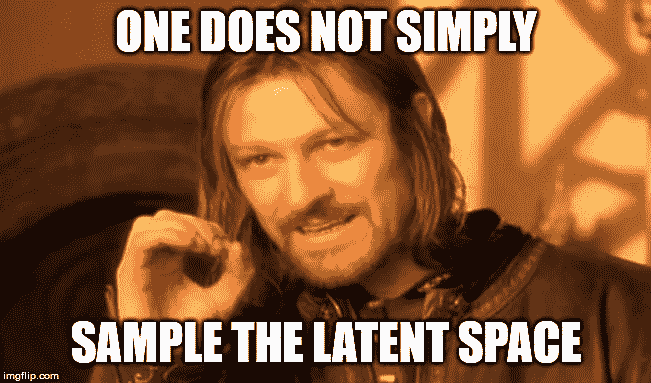
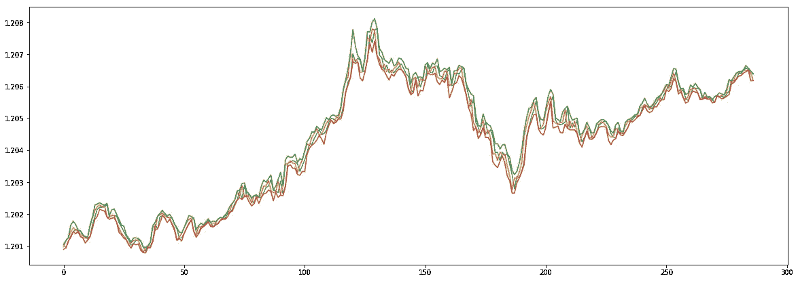
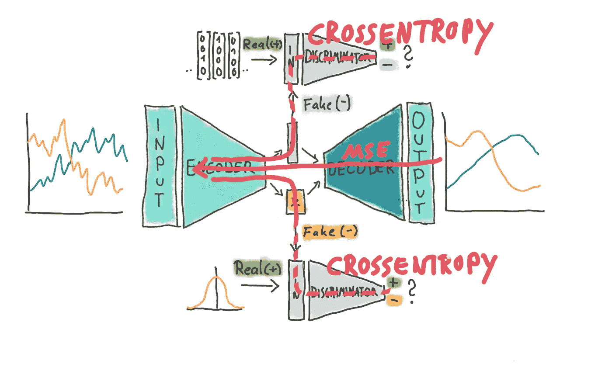
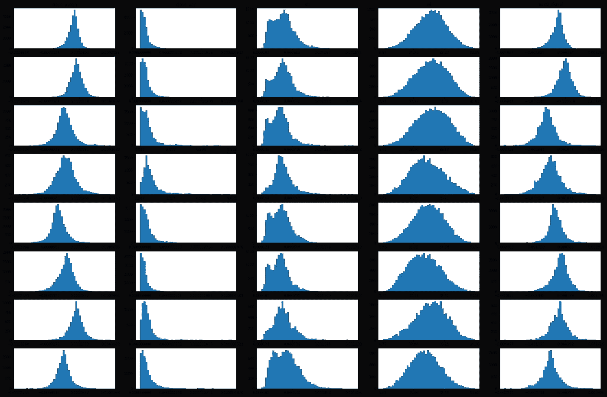
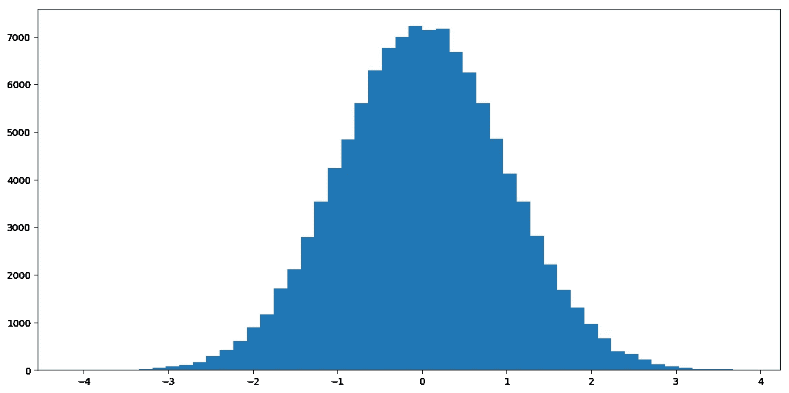

# 用对立的自动编码器进行数据探索

> 原文：<https://towardsdatascience.com/data-exploration-with-adversarial-autoencoders-311a4e1f271b?source=collection_archive---------3----------------------->

## 使用对立的自动编码器模型研究多元时间序列数据的非监督聚类的不同方法。

[Source: Pixabay](https://pixabay.com/photos/egypt-cairo-lamps-shining-bazaar-4269151/)

L 和许多人一样，我用*自动编码器*开始了我的深度学习之旅，因为它们是开发人工神经网络直觉的一个很好的切入点，并让你的头脑围绕你选择的深度学习框架。起初是一个没有多少相关用例的练习，如今已经找到了许多应用，结果是一把深度学习的瑞士军刀。自动编码器通常用于检测异常，学习可以输入到其他神经网络的低维表示，生成数据等等。在这篇文章中，我想向你介绍一种叫做[对抗性自动编码器](https://arxiv.org/abs/1511.05644)的特殊架构，以及随之而来的自动编码器的新应用，数据的*无监督聚类*，这将是我在这篇文章*中主要关注的。*我想讨论这样一个编码器的工作原理，并向您展示如何使用 *Keras* 轻松构建和训练它们，以及如何使用它们在一个涉及*外汇市场*数据的例子中聚类和探索*时间序列*。

# 引入对抗性自动编码器

当我第一次开始进入深度学习时，自动编码器让我着迷，我喜欢它的设置如此简单，以及用它们进行实验如何快速让你培养对人工神经网络的感觉。这个想法非常简单，训练一个神经网络模型，在网络的中间有一个信息瓶颈*太小，数据无法通过*的约束下，复制它的输入。这种限制要求自动编码器找到适合该瓶颈的输入数据的表示，以便随后尝试从该表示尽可能精确地再现它。它必须找到一个简洁的*代码——*因此得名自动编码器——它通常也被称为*潜在向量。*虽然这听起来非常简单*，*这种类型的神经网络允许你为任何类型的数据找到一个几乎任意低维的表示，同时你也获得了一个数据样本的不寻常或异常程度的度量，这取决于它的重建误差。

## 抽样问题

有一件事你不能用普通的自动编码器来做，那就是生成新数据。理论上，你可以把一些随机向量输入到解码器部分，得到新的猫图片或者你已经编码的任何东西。这不起作用的原因是，编码器产生的潜在表示不以任何方式分布，它可以通过简单的参数分布来表示，就像正态分布一样，您可以从中进行采样。相反，潜在空间经常出现*分裂*成代码空间中的不同域，如果你只是向解码器提供从像正态分布这样的随机变量中采样的随机向量，你很可能最终只生成垃圾。换句话说，你不知道如何为解码器选择随机值来产生高质量的猫图像。

为了解决这个问题，发明了[变分自动编码器](https://arxiv.org/abs/1312.6114)来训练编码器学习*潜在分布*的参数，然后可以从解码器采样并馈入解码器。问题仅仅在于它们往往难以训练，并且即使变型自动编码器在捕捉随机性质的数据的属性方面更好，并且在采样和生成数据方面具有更好的属性，但是它们产生的样本仍然经常包括较差的示例，主要是在输入数据的类别之间的边界上，如果存在的话。潜在空间仍然没有得到理想的分布，特别是如果数据不能被在变分推断过程中使用的高斯分布很好地近似。此外，有一件事你不能用变分编码器做，那就是让潜在的代表采取任何任意分布的性质，因为他们只学习多重高斯分布的性质。但是如果你想从贝塔分布或者均匀分布中取样呢？

## 规范代码

自从*生成对抗网络*和对抗训练方法的出现，神经网络不仅能够学习分类，还能够产生照片级的图像，现在甚至是视频。事实证明，在 *GANs* 中用于训练发电机的相同技术也可以用于调整你的神经网络的属性。敌对自动编码器背后的想法是，你训练编码器产生一个潜在的空间，看起来像你选择的先验分布。如果您的先验是正态高斯分布，那么编码器产生的潜在向量也将假定该分布，值的平均值为 0，标准偏差为 1，您可以轻松地从中进行采样。你基本上可以把任意的分布强加到潜在空间上，甚至是那些不能用参数化的方式表达的，只要你有一个从它们中取样的方法。

由于这是对抗训练中的传统，这是通过一个*鉴别器*实现的，这是一个不同的神经网络模型，它学习从目标*的*现实世界*示例中辨别网络的输出；*但是，鉴别器不是学习从真实的猫图片中辨别噪声，而是学习从先验分布中辨别潜在空间，并向编码器反馈潜在空间的分布有多错误。根据这种梯度形式的反馈，编码器学习按需要分配代码。

## 如何用它对数据进行聚类？

在关于对抗性自动编码器的[原始论文](https://arxiv.org/abs/1511.05644)的第 5 章和第 6 章中，作者概述了如何将他们的架构用于无监督聚类的方法。其思想是，除了潜在向量之外，编码器还将生成一个*分类向量*或所谓的*一个热编码的*向量，因此该向量的一个值为 1，所有其他值为 0。该向量也将被馈送到解码器中用于重建，使得它也可能携带关于输入数据的相关信息，基本上是用于重建的某种附加*提示*。这个想法是，这个提示对于*相似的*输入数据也是一样的，这些相似性是我们希望编码器找到并编码到类别中的。与经典的聚类算法相反，在经典的聚类算法中，预定义的参数决定了如何分离数据，编码器和解码器只在不同类别之间的界限上达成一致，这可能会导致有趣的结果。

为了让编码器产生一个分类向量，而不仅仅是另一个任意值的潜在向量，作者还使用了带有鉴别器的对抗训练，该鉴别器被教导来辨别向量是否是分类的。以与潜在向量相同的方式，鉴别器根据编码器产生的向量以及“先验分布”来训练，在这种情况下，先验分布是一束随机的独热向量。该鉴别器还将向编码器反馈向量遵循规则的程度，并通过使其成为编码器目标的一部分来满足鉴别器，它将学习创建分类向量。

Schematic of an Autoencoder that produces a regularized latent vector ***z*** and a categorical vector **c** with the help of two Discriminators

# 数据

因为 MNIST 手写数字数据集已经由作者在论文中完成了，并且在这一点上可能超出了理性的探索，所以我想尝试一些更有趣的东西。不，不是猫的照片，很不幸。我想在这里讨论的实验是我最近研究的，作为我个人探索建立算法交易系统的一部分，就像我之前的许多人一样，因为它提出了一个有趣的挑战。对于这个例子，我将使用外汇数据，特别是 2018 年的欧元兑美元汇率，以 5 分钟为间隔。你可以从互联网上的很多地方获得这种数据。我从一家名为 *Oanda* 的在线经纪商那里获得了我的 API，主要是因为我喜欢他们的 REST API，你可以通过一个免费的票据交易账户来使用它，以访问可用工具的所有历史市场数据。最后，无论您是使用外汇数据，还是将本文概述的相同策略应用于股票或加密或非金融时间序列数据，如物联网传感器或医疗数据，都无关紧要。你可以在文章末尾附上的笔记本中找到下载和预处理数据的代码。

One day of EUR-USD exchange data in 5-minute intervals with open, high, low and close prices.

The volume data for the above time period

我们将从原始交易数据中创建并最终提供给自动编码器的特征将是最高价、最低价和收盘价的对数回报、交易量，以及一些统计数据，如收盘价的滚动平均值、方差和偏斜度以及一些技术指标、*相对强弱指数*、*平均真实范围*和*移动平均收敛发散*信号线。除了包括包含关于趋势强度和方向、波动性和与平均值的偏差的指示的特征，以及具有编码器必须找到潜在相关性、模式和简洁表示的一些特征之外，没有做出选择的特定原因，并且仅在有噪声的回报数据上进行聚类不会产生最有意义的结果。当然，你还可以加入许多其他特性，或者添加信号和数据源。

An excerpt from one of the data frames with the raw features.

为了让编码器创建一个较低维度的表示，并将其重新创建为一个序列，我们需要处理固定长度的信号，因为时间分量在压缩中丢失，并且在构建编码器时需要明确定义序列长度，因此我决定将数据切割为 32 个时间步长的窗口。由于我们的数据特征在不同部分具有非常不同的值范围，如价格、交易量和指标，我们在每个窗口的基础上为每个通道执行 z 得分标准化，以将所有特征纳入相同的值范围，并保留局部模式，但不混合过去或未来的极值。这将是编码器将尝试聚类的数据，即以 5 分钟时间间隔的 32 个读数的序列中的局部运动，如下图所示。

A few frames of preprocessed data, as they will be fed to the autoencoder. The values are in a comfortable range for ANNs. We expect the encoder to find patterns in this mess of squiggly lines.

> **注意:**我已经讨论了很多关于如何预处理数据的问题，通过对整个数据或每个窗口进行标准化或规范化。我发现这很大程度上取决于。如果你要建立一个算法交易系统，你想把编码器的结果输入到一个分类器中。那么您可能也会在每个窗口的基础上进行标准化。这意味着编码器将通过这些局部模式对数据进行聚类。如果您有一个从不更改的数据集，并且您不关心未来的值，并且希望按全局属性对数据进行聚类，那么对整个数据进行规范化或标准化可能会更有意义。在进行了一些实验之后，我可以说这两种方法对于这种类型的数据会产生非常不同的聚类类型。

# 构建对抗性自动编码器

因为我们处理的是时间序列数据，所以我们将主要从循环层构建编码器和解码器。简单的 LSTM 不适用于对时间序列数据进行*编码的特定任务。经过一些试验后，我惊讶地发现，双向 LSTMs，另一方面，比我迄今为止尝试过的任何东西都要好，包括卷积网络。有些人还推荐卷积网络和递归网络的组合，无论如何，可能需要一些实验来找到适合您的数据类型的架构。*

编码器和解码器都主要由两个堆叠的双向 LSTM 组成，其中编码器的第二 LSTM 不返回序列，而仅返回其最后状态作为潜在表示和分类向量的基础。解码器由一个类似的反向设置组成，输入潜在向量和分类向量的组合，并尝试将其解码为尽可能匹配输入的序列。

鉴别器被设计成简单的*多层感知器*，由几个密集连接的层组成，因为它们只需要区分相当低维的向量的分布，所以你不能把它们做得太好，否则编码器将不能欺骗鉴别器，也不能正确地收敛于任何任务。这也考虑到对每个任务的损失进行加权，输入的重建将不得不产生梯度的大部分，否则编码器将不会学习到任何有用的东西。另一方面，你也不能让他们太弱，否则他们不会学会区分样本，也不会发生正则化。

下面是为编码器/解码器和鉴别器创建网络的代码。你可以看到，正如论文作者所建议的，我们只在编码器部分使用了批量标准化。我也尝试在解码器部分使用它，对于无监督聚类应用程序，我可以确认它只会恶化性能。您可以看到，分类向量将 softmax 作为激活函数，这有助于形成分类分布，而潜在向量是用线性函数激活的，因为它需要能够输出未绑定范围内的值，以便能够满足指定的分布。然后，简单地将潜在向量和分类向量连接起来，并对输入序列的长度重复该结果，从而解码器部分可以再次将其重建为相同长度的序列。我还在输入后添加了一个线性变换，因为我发现当使用整流器和负值输入时，它在一定程度上加快了训练速度。

The code to create the autoencoder model.

The code to create the discriminator models.

当训练自动编码器时，两个鉴别器的输出成为自动编码器损耗的一部分。他们的目标只是简单地总是 *1* ，对于*实数*，因为我们希望编码器学习一个表示，使鉴别器输出 *1* ，基本上是说“啊，是的，这是来自先前分布的样本”。二进制交叉熵作为损失函数工作得很好，如果编码器产生不满足鉴别器的潜在向量或分类向量，损失将产生梯度，这将使编码器学习理论上遵循规则的潜在和分类表示。

The Encoder is updated with gradients from the Decoders reconstruction loss (Mean Squared Error) and the Discriminators loss (Binary-Crossentropy)

下面是用于将编码器和鉴别器粘合到模型中的代码，然后我们可以按照上面的示意图进行训练。请注意我们是如何将鉴别器权重设置为*trainible = false*的，这在此时是必要的，因为我们将它们连接到自动编码器中，并且在训练编码器时，我们不希望鉴别器的权重发生变化。稍后在训练鉴别器时，我们会更改这个设置，但你必须在给它们接线时进行，否则 *Keras* 或者更确切地说 *TensorFlow* 会抱怨说*组可训练重量已经改变*。

The code to wire the autoencoder together with the discriminators and create an **adversarial autoencoder**.

# 训练编码器

为了训练这种设置，我们首先从训练鉴别器开始。为此，让编码器创建一批潜在的和分类的向量，并创建第二批向量，从先前的分布中取样。接下来，使用各自的标签训练这些批次的鉴别器，编码器输出的标签为 *fake (o)* ，先前样本的标签为 *real (1)* 。然后，您冻结该训练迭代的鉴别器的权重，因为您不希望在训练编码器时更新鉴别器，因为误差将*流经*它们。接下来，您对一批数据训练编码器，目标是尽可能准确地再现输入，同时还有另外两个目标来满足两个鉴别器，也就是 aka。对于*真实样本*，使它们输出 1。在重复了大约几千次随机小批量训练迭代之后，自动编码器开始在所有三个任务上收敛。

在训练过程中，您可能会注意到，只要编码器仍在学习编码和解码，鉴别器的精度只会缓慢下降，只有当来自该目标的梯度变得较浅或平稳时，编码器才会学习重新分配潜在空间和分类向量，这反过来会再次恶化编码/解码性能，这将使梯度朝着较低的重建误差变陡。这意味着学习过程通常遵循某种反馈循环，这也是由于鉴别器随着时间的推移变得越来越好，随着训练的进行，这种反馈循环将变得不那么强烈。

现在，当我们让上面代码中所示的训练循环总共运行 10，000 次迭代时，您可能会得到类似下图中的损失图，这些图来自我用包含的代码为本文训练的示例运行，我想在下面进一步讨论。

在图像中，您可以看到测试和验证集的重建损失在适当减少，因此看起来我们并没有过度拟合。分类向量鉴别器的精度在 50%到 70%之间，其中 50%是非常理想的，因为在这一点上，鉴别器在区分向量方面的表现并不比随机猜测好，这意味着编码器能够成功地欺骗它。潜在向量鉴别器的精度看起来并不那么高，在下降到大约 60 之后，我们可以看到它再次上升，因此看起来鉴别器比编码器略胜一筹，但我们也可以看到它再次缓慢下降，因此随着更多的训练，它可能会收敛。不理想，但对我们的目的来说足够好了。

From left to Right: Loss of Discriminators for Prior and Category and the Encoder/Decoder, including validation loss, after 10.000 iterations, So far we cannot see any overfitting, but loss for the discriminator converges slowly.

尽管我们可以看到准确性和重建损失降低，但在训练完成后直观地确认结果仍然是一个好主意，并查看几个示例以了解自动编码器是否真正学会了以合理的方式再现输入，以及我们是否实现了生成实际分类向量的目标。

下面是编码器产生的输入和输出的几个例子，以及潜在和分类向量。在示例中，您可以看到重构是输入的强去噪版本，几乎就像编码器将捕获输入的主要*频率成分*，这似乎是在代码空间的约束下近似再现此类噪声数据的最佳方法。此外，我们还可以确认，我们成功地尝试了正则化编码器，以产生用于我们的聚类的分类向量；它们似乎有一个接近 1 的值，其余的值在 0 附近徘徊，更好的是，分类向量似乎对于大多数示例都不同，这意味着编码器确实为不同的输入分配了不同的类别。误差图主要是来自未通过的输入信号的噪声，尽管我们可以看到，当突发尖峰出现且未得到正确编码时，一个通道或通道组合的误差有时会特别高，因为这可能是一种不常见或异常的模式。

A few samples from the autoencoder model. From left to right: Input data, latent vector, categorical vector, reconstructed data, and error.

# 数据聚类

既然 autoencoder 已经被训练好了，我们就可以用它来为我们所有的数据生成类标签，我们终于可以看看我一直向您保证的这些聚类了。首先，让我们看看这些类是如何分布的。分配给分类向量的大小不一定对应于自动编码器将识别的分类数。我经常会上 6 到 7 节课，有时是全部 8 节，有时只有 4 节。在运行了几个实验之后，我可以报告，聚类的数量和聚类的属性高度依赖于自动编码器超参数和架构、小批量大小和所使用的优化器，并且还显著地依赖于与编码器相比的鉴别器的强度。它似乎更依赖于网络的超参数，而不是数据本身。

The Histogram of classes discovered by the encoder.

在这个例子中，编码器似乎使用了所有 8 个类别来对输入数据进行分类，并且被识别的类别似乎或多或少地均匀分布，尽管我们已经可以看到，在我们的数据集中，类别 0 有点过多，而类别 1 有点不足。现在，让我们看看当我们在 2D 平面上对输入数据执行 t-SNE 时，编码器发现的类是否实际上形成了某种聚类。下图显示了编码器分配的类别标签实际上形成了大部分一致的聚类，但是一些聚类看起来更加分散，并且具有远离其聚类中心的样本，这在一定程度上可能是所使用的嵌入算法的副作用。

t-SNE scatterplot of input data, labeled by categories. From left to right with Perplexity of 10, 30 and 50

这里有一个替代方案，在相同的网络设置下，使用了稍大的批量，并使用 Adam 代替 Nadam 作为优化器。它在训练中以非常相似的方式收敛，但结果却大不相同。编码器只将数据分为 6 类，而不是全部 8 类。下面是直方图，我们可以看到所有的类分布相当均匀。

我发现分类向量的鉴别器越强，编码器对数据进行分类的类别就越少，而鉴别器越松，分类就越分散。这两个结果本身都是有效且有趣的。

我将继续主要关注产生 8 个类的示例，因为我喜欢这些结果，但我想展示对超参数进行小的更改，结果会有怎样的不同。

The Histogram of classes discovered by the encoder with a slight variation to the hyperparameters.

t-SNE scatterplot of alternative clusters, labeled by categories. From left to right with Perplexity of 10, 30 and 50

所以，现在我们有了一些类别，它们形成了彩色的斑点，但是这些类别是什么意思呢？好问题！与许多无监督聚类算法一样，这些结果更像是一种启发，让你思考和困惑你的数据，以及该算法在这里可能发现了什么，以便你可以进一步研究它们。我只想快速浏览一下这些类的一些属性。如果我们在处理和标准化之前将类别映射回原始输入窗口，并查看一些统计属性，我们可能会发现类别之间有趣的差异。

## 每类值的分布

首先，我想看看每一类的值在该类的所有帧上的直方图，看看我们是否能够发现分布中一些有趣的差异。当我们为输入数据的最重要通道创建直方图时，就像我们计算的指标一样，我们可以看到分布、不同均值、标准差和偏斜的属性之间的一些差异。

取决于聚类的结果，有时在一些信号的分布中存在很大差异，而有时在其他信号中差异更大。在这个例子中，ATR 信号通常具有有趣的形状分布，其中许多看起来有点像高斯混合，并且似乎每一类都有不同的均值。MACD 信号线似乎是不同类别的强大驱动力，因为我们可以看到，大多数值位于一个狭窄的范围内，每个类别的均值完全不同，类似的情况也可以说是关于收盘价格回报的分布。RSI 信号的分布看起来非常像适当的高斯分布，模式和偏斜在类别之间也略有不同。

Histograms of some channels of the input data, each row representing one of the 8 classes.

## 平均信号形状

在本文的前面，当谈到预处理输入数据时，我提到了我们希望编码器找到并压缩的局部模式。考虑到上面的直方图，看看每一类是否真的出现了共同的模式会很有趣。所以基本上，我想看看每个类的单个通道的值是如何随时间发展的。

为此，我们只需计算一个类中所有信号在每个时间步长上每个通道的平均值。实际上，我希望得到的大多是没有明显方向的曲线，对于原始的高、低和收盘回报信号来说，大多数情况都是这样，尽管对于某些类别来说，这些信号似乎平均起来是某种“波动”运动。更有趣的是滚动统计的信号和我们添加到原始数据中的技术指标，我们可以看到每个类别的明显趋势。对于一些类，一些通道向相反的方向移动，而在另一些类中，它们一起移动。此外，我们可以看到，对于数据中发现的所有类别，MACD 信号线和收盘价的移动平均值似乎高度相关，并以某种方式一起移动，ATR 和收盘价收益的方差似乎也是如此，这是有意义的，因为在这两种情况下，这些统计数据和指标对相同的事情，波动性和趋势做出了略有不同的陈述。

## 一个错误胜过千言万语

不管你打算用你的自动编码器做什么，你总是可以免费得到一件东西，那就是异常检测。一旦编码器被成功训练，重建中的大多数误差应该是输入数据中的噪声的结果。如果观察每个通道的重构误差值的分布，可以看到分布以零为中心，大多数通道的标准偏差相当低，但我们可以看到某些部分也有一些极值。因为编码器在潜在空间的约束和限制值范围的强加分布的附加约束下，学会最好地重构出现在大多数样本中的模式。仅在少数样本中出现的模式可能没有适当的编码，因为根本没有用于它们的空间，这导致重建质量差。这种重构误差可以很好地检测这些不常见的事件，并将其归类为数据集中的异常值或异常值。

下面你可以看到每个通道的误差值直方图。我们可以看到，所有通道的误差都集中在 0 附近，但具有不同的标准差。如果您想要检测数据中的异常或识别异常事件，您可以为每个通道选择一个阈值，当重构误差的峰值超过该阈值时，就表示发生了异常事件。

Histograms of reconstruction error for each channel.

由于我们还尽了最大努力对我们的数据进行聚类，因此您可以在更细粒度的规模上这样做，并为每个类中的每个通道选择不同的阈值。当我们查看按类划分的每个通道的误差直方图时，我们可以看到误差的分布在类之间有轻微的差异。

# 结论

使用对立的自动编码器对数据进行聚类无疑是您可以采用的更奇特的方法之一，即使对于包括时间序列和表格数据在内的许多问题可能有更传统的算法，当然也有许多其他情况可能不是这样，例如在处理图像数据时。

通常对于传统算法，您必须试验某些参数，如邻域需要多少个点，它们应该有多远，或者您期望有多少个聚类，然后检查结果是否令人满意。使用这种方法，您必须对架构和超参数进行试验，找到合适的方法比使用更简单和优化的算法要耗时得多。

考虑到您在这里做一些深度学习，整个例程比常规的非工厂聚类算法花费更长的时间，消耗更多的计算能力，但这种方法肯定非常有趣。更有可能的是，您构建 autoencoder 是出于不同的原因，而不仅仅是为了聚类，但是现在您应该知道如何不仅可以正则化潜在的表示，还可以让您的 autoencoder 同时对您的数据进行聚类。

## 代码空间怎么了？

一开始，我谈了很多关于编码器产生的代码空间，以及我们需要如何正则化它们等等，但是在所有关于分类向量的争论中，我从来没有向你们展示过在所有这些训练之后代码空间实际上发生了什么。查看来自潜在空间的值的直方图，我们可以清楚地看到构造良好的高斯分布。看起来正规化运作得很好。看起来，即使歧视者并不十分满意，但它似乎变得太挑剔了。潜在空间的 t-SNE 看起来也有点像 2D 高斯分布，如果你将标签添加到代码空间，你可以看到这里的聚类不太一致。

The distribution of activation values of the latent space, after the training. It looks like the regularization worked just fine since we wanted a normal distribution.

t-SNE of latent vectors labeled with the discovered classes. Looks like a 2D Gaussian Distribution.

*非常感谢您的阅读，下面是如约而至的 jupyter 笔记本。*