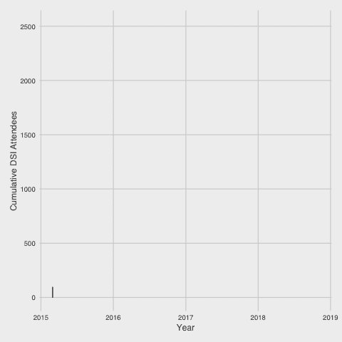
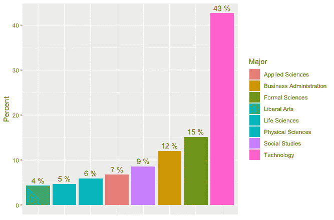
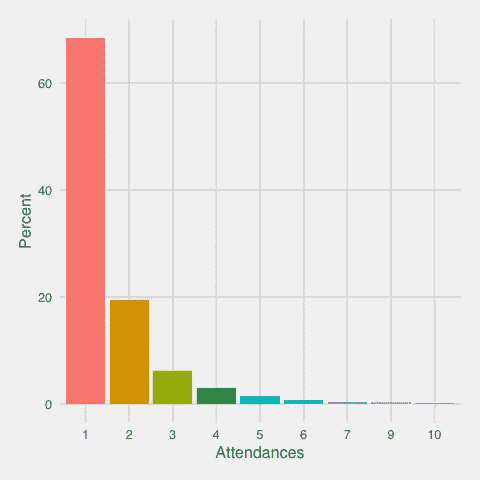
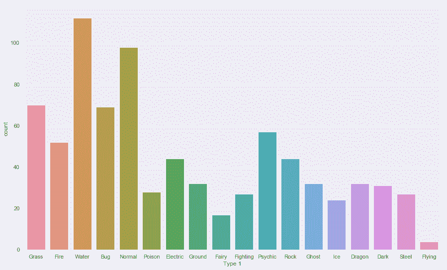

# 以数据为中心的组织决策:DSI 案例研究

> 原文：<https://towardsdatascience.com/data-focused-decision-making-for-organizations-a-dsi-case-study-5f332a01d80a?source=collection_archive---------17----------------------->

2018 年春末，我被选为 [DSI](http://www.dsiufl.org/) (数据科学与信息学)的主席，这是佛罗里达大学的数据科学学生团体。我们教授研习班(Python、R、NLP、ML，你能想到的都有)并发展数据科学社区。我当选后不久，就发生了这样的事:

> “如果我管理一个数据科学组织却不将数据科学应用于其中，我会是什么样的白痴呢？”

这篇文章的其余部分阐述了我们如何在整个 2018 年秋季，将组织从“我们只有很少的数据，我们确实拥有的数据无法使用”的状态带到“我们有一个有组织的有用的数据来源，并开始根据我们产生的见解采取行动。”在阅读数据科学相关帖子的这些年里，我经常感觉这种数据工程/收集/综合工作被低估了，所以我们开始吧！

## 数据来源

幸运的是，DSI 有为我们的研讨会创建签到表的历史，签到表上有参与者的详细信息，包括姓名、电子邮件、专业以及他们的编程经验。然而，我们在过去 3 年中保留的数据并没有考虑到分析，在数据清理过程之前，自动生成的 google sheets 看起来有点像这样。

有一年，DSI 以字符串形式跟踪参与者的班级(大一、大二等)，另一年以整数形式(1、2 等)跟踪参与者在佛罗里达大学的年数，但无法区分一年级研究生和一年级本科生，甚至还有三分之一保持学术地位(本科生对研究生)。我们跟踪了电子邮件 5(！！！！)不同的方式:email、Email、e-mail、Contact(电子邮件)和 E-mail。这些差异显然是多年来随着执行委员会的更替和新人创建签到表而产生的，这是有道理的，并且来自良好的直觉！但是最终数据是部分不可用的，因为它不是**分析优先。**

这里的教训是:**随着数据的增长，任何花费在数据意图上的时间都会以 10 倍的速度增长。** DSI 已经成为佛罗里达大学分析和教学的支柱，随着该组织的成熟，每年为一千多名学生提供服务，数据问题也随之增长。

## 标准化和自动化

标准化数据相当于问，在我们的例子中，我们想了解来我们工作室的人什么？要知道一个组织/公司关心什么，最简单的方法就是找出他们跟踪的内容。是用户增长吗？复读？人口特征？一旦您的组织走到一起并弄清楚了这一点，标准化就会自然而然地到来。

我们的解决方案？模板化表单和 R 包。该表单确保一次又一次地保存相同的数据，并且该包自动地抓取这些表并将数据拉在一起。新的执行委员会正在使用登录信息和数据库创建一个更好的解决方案，但 google sheets 和几个好的 R(或 Python)脚本应该可以在必要时使用。

最后，在这一点上，我们有了一个相对干净的数据集，其中包含了 DSI 多年来的历史，我们可以尝试使用这些数据来进行使命驱动的组织变革。在我看来，这是数据科学中最难的部分，因为你永远不知道你正在研究的东西是否有用。如果我们花了这么多时间，这么多努力，却一无所获呢？没有先验的方法知道数据的价值，只有后验的。这就是为什么讨论数据收集和清理如此重要，因为它占工作流程的 80%。DSI 没有业务端；我们教书和提供帮助是因为我们喜欢它，并发现它很有成就感，我们作为一个组织正在学习的这些课程，无论现在多么便宜，对工作中的年轻数据科学家来说都是无价的

## 探索性数据分析

回到分析:使用数据推进 DSI 的使命。这就引出了一个问题，DSI 的使命是什么？在 DSI 的最初几年，我们尽可能快地学习和教学。这种方式效果很好，因为在 DSI 的历史上，有大约 2500 名与会者。

这张图表是累计出席人数，但很明显，随着我们的内容和范围不断改善(由于反馈循环比佛罗里达大学几乎任何其他小组都短)，学生们将希望学习编程技能。DSI 与会者的细分是预期的，多数是技术专业，但也有大量来自社会研究，工程(正规科学)，商业等。

下一个可视化图是返回与会者的直方图，它真正打动了 DSI 执行委员会。很大一部分参加 DSI 的人只参加了一两次研讨会(总共 85%)。

这并不奇怪，因为没有足够的理由多次参加 Python 入门研讨会。作为一个在佛罗里达大学学习数据科学的地方，DSI 已经做了大量的工作，但还没有解决一个不同的问题:创建一个数据科学社区。这为用户保留创建了一个泄漏的用户桶，这不是我们的意图。

## 创建社区

创建一个社区是困难的，原因有几个，一个是只有好的度量标准的代理。拥有高回报率是一个社区所需要的全部证据吗？当然不是。对于社区来说，这似乎是一个必要但不充分的代理。

我们在 2018 年秋季采取了三项主要举措来尝试建立这个社区。首先，我们创建了 [Data Gator](https://datagatorcontest.github.io/portfolio/) ，这是用友与用友图书馆合作举办的第一次数据科学竞赛(如果你是用友学生，你应该参加！！).然后，每隔一周，我们想出了一个叫数据科学星期三的活动，我们的理论是:**社区=数据+咖啡+食物+时间。**我们会给学生提供食物和有趣的数据集，看看他们能想出什么。一个数据集专注于检测毒蘑菇，另一个数据集专注于玩堡垒之夜，其他数据集专注于自行车共享骑行，甚至还有一个数据集专注于口袋妖怪的统计数据，这产生了下图。

最后，在查看了我们研讨会的分类后，我们发现特定行业的研讨会首次参与者的比例更高(在我们的第一个自然语言处理研讨会中，我们有许多语言学博士学生，因为该部门没有教授 Python 课程)。然后，我们继续开发更多的利基研讨会，如数据科学的统计，一个精彩的 Tableau 研讨会，甚至一个精算师研讨会，以吸引校园的不同部分。

## 结果

在不到一个学期的时间里评估一个组织的变化是很困难的，而且可能是个坏主意。考虑到这一点，上学期出现了一些数字。【2018 年秋季是有史以来参加人数最多的 DSI 学期，参加两次以上研讨会的学生比例翻了一番。

我真的对这些结果感到兴奋，不仅因为这是一个在组织层面上以数据为中心的决策的潜在成功故事，而且因为在我的任期结束后，执行委员会必将把组织带向何方。

无论如何，这是一个更完整的故事，讲述了我们如何在一个学生组织中完成所有枯燥但最有效的数据工作，并通过查看一些漂亮的图表、明确定义我们想要的东西以及做出一些我们可以衡量的改变，看到了一些很好的初步结果。高管团队正在进行其他一些项目，包括为组织建立一个登录系统和适当的数据库，并尝试制作一个“我们应该订购多少披萨”模型来优化我们的预算。在用友没有比这更让我兴奋的群体了([在这里找到他们](http://www.dsiufl.org/)并在月底参加[年度研讨会](https://www.facebook.com/events/2128929027221555)，请关注这个空间！作为一名推销员，如果你是一名招聘经理，并且已经做到了这一步，那么恭喜你！你的奖励是这条建议:早点雇用这些人，因为我相信很快就会有一场对他们所有人的竞购战。

特别感谢 Delaney Gomen，他在数据清理中发挥了重要作用，也是许多可视化工作的幕后推手。这篇文章的一些内容，以演示的形式，可以在[这里](https://docs.google.com/presentation/d/e/2PACX-1vR7JO_vhkKZLtNnkbJcifKNdO0RjmnrfcbSyt2_ufJRJc7dZsPhAUMHKss5IaU7CS6n4dUy8GYHe9m9/pub?start=false&loop=false&delayms=3000&slide=id.p1)找到，来自我 2018 年秋天在用友的一次演讲，部分代码可以在[这里](https://github.com/dsiufl/Analyzing_DSI)找到。

在我的[网站](http://www.tylerjrichards.com/)上查看更多类似的分析工作，或者在 [twitter](https://twitter.com/tylerjrichards?lang=en) 上关注我。