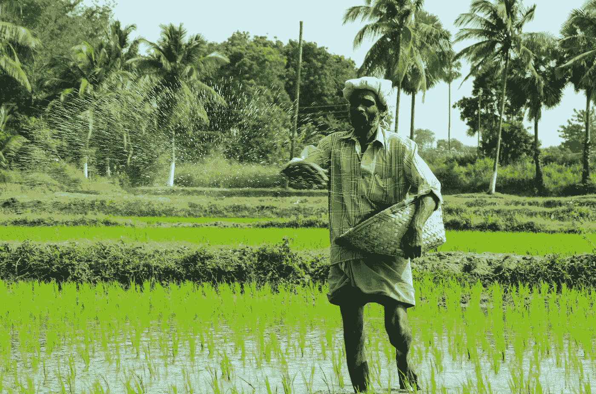
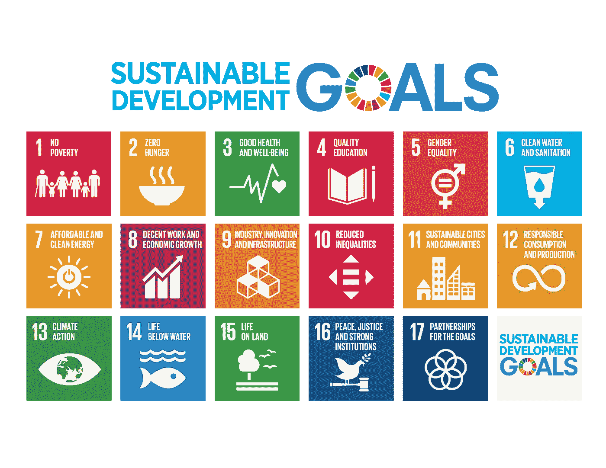

# 公益数据

> 原文：<https://towardsdatascience.com/data-for-public-good-1414cbc99335?source=collection_archive---------22----------------------->

## 利用数据促进社会和环境变化

Photo by [wilsan u](https://unsplash.com/@wilsanphotography?utm_source=medium&utm_medium=referral) on [Unsplash](https://unsplash.com?utm_source=medium&utm_medium=referral)

首先，我将说明我所说的“公共利益的数据”是什么意思，因为这里有几个术语(例如#data4good ),没有一个能准确表达这个概念。这是一个正式的定义:

> “公共利益数据:通过应用商业应用中常用的工具和技术，将数据用于公共利益”。

如果你对“公共利益”——一个在经济学中广泛使用的术语——感到好奇，这里有一个来自[维基百科](https://en.wikipedia.org/wiki/Public_good_(economics))的定义:

> “在经济学中，公益(……)是一种既不可排斥又不可竞争的商品，因为个人不能被排除在使用范围之外，也不能免费享用。”

公益数据一直都有，有什么新鲜的？随着最近大数据和数据科学的革命，在过去几年中，该领域发生了一些重大变化:

*   数据本身
*   方法和工具
*   政策应用

## **数据种类**

公共部门组织大多是在特定的基础上收集和分析数据。只有指定的国家机构(如统计局)每年持续收集、主持和传播数据(如人口普查、家庭调查、农业普查等)。).通常，这些数据集的要素和观测值数量有限，并且通常是从大量人群中获取的小样本。

这些数据收集工作几乎完全是政府的努力。由于缺乏必要的资源和专业知识，非政府组织很少涉足这一领域。他们的商业决策通常依赖于准定量方法或政府报告。

最近情况发生了变化。正在改变商业领域的大数据、数据科学和机器学习领域也在冲击公共部门企业。现在，人们越来越意识到数据在决策过程中的力量。数据的性质也在发生变化——例如，现在可以在社会、经济和环境系统的许多方面获得免费的遥感数据集。然而，公共部门管理和分析这些大量数据的能力没有多大变化，主要是因为缺乏计算资源和人力。

## 方法和工具

公共部门正在发生的第二种转变是采用新的方法和技术来收集、存储、访问和分析数据。最近，政府机构收集的有价值的数据和信息没有得到充分利用。只有少数人，大部分是学术研究人员，能够获得这些数据并将其用于学术研究。

Photo by [William Iven](https://unsplash.com/@firmbee?utm_source=medium&utm_medium=referral) on [Unsplash](https://unsplash.com?utm_source=medium&utm_medium=referral)

应用的工具和技术也受到限制。数据分析师会做基本的分析(一些描述性统计、频率/计数表、柱状图、时间序列图或饼状图),并把它们放入年度报告中，然后就完事了！政策决定充其量是由数据告知的*，而不是由数据*驱动的*。*

## 公共服务中的应用案例

数据科学在公共服务中的应用目前非常广泛，并且每天都在扩大。这里只是许多例子中的几个:

**犯罪管理:**当地执法机构往往没有社区犯罪管理的必要资源。新颖的[算法](https://www.bbc.com/news/business-46017239)现在正被用于结合历史犯罪率、社会经济数据和其他数据源来预测犯罪热点。这些新工具正在帮助执法部门有效地分配有限的资源，以确保社区的公共安全。

**农业:**机器学习一直是农业领域的[游戏规则改变者](/7-reasons-why-machine-learning-is-a-game-changer-for-agriculture-1753dc56e310)。通过自动化灌溉系统减少用水量、疾病检测、产量预测和杂草检测是改变农业的众多应用中的几个。

**医学:**斯坦福大学的[生物医学数据科学计划](http://med.stanford.edu/bdsi.html)总结了数据科学在医学领域的巨大潜力:

> “从治愈单个患者到治愈整个人群，我们正在引领一个更健康的世界。在这个世界中，您的数据不仅会改变您的健康，还会改变世界各地人们的健康。在那里，医生可以立即搜索数百万份医疗记录，找到对像你这样的病人有效的方法。在那里，新药被快速开发出来，现有药物的新用途被发现。我们最终可以预测人类和人群中的疾病，并在疾病发生前预防它。通过利用大规模计算和数据分析的力量，我们将让这个世界成为现实。”

**人道主义项目:**从地震后重建海地，到在利比里亚抗击埃博拉病毒，数据科学工具已经帮助世界各地的弱势人群从危机中恢复过来。预警系统也正在接受测试，以主动应对人类面临的一些重大挑战。

**社会项目:**查看[数据种类](https://www.datakind.org/projects)项目，找出数据科学可以帮助解决的广泛问题的巨大可能性。绘制贫困地图，预测人权侵犯，寻找失踪儿童，防止家庭火灾伤害，预测水需求…什么都不是！

**环境管理:**数据科学工具和技术正在为可持续环境管理带来巨大的潜力——从[通过分析大型数据集获得洞察力](https://www.sciencedirect.com/science/article/pii/S1364815218301269)，到预测下一场[森林火灾](https://www.fs.fed.us/science-technology/fire/forecasting)将在哪里发生，到使用遥感和深度学习对[土地使用](/land-use-land-cover-classification-with-deep-learning-9a5041095ddb)系统进行分类。

**野生动物监控:**野生动物研究人员和管理人员正在野外安装自动相机，拍摄动物照片。使用机器学习和云计算技术，数百万张这些[图像正在被处理](https://www.pnas.org/content/115/25/E5716)和分析，用于分类学分类、测量多样性和监测野生动物运动。

**全球发展:**数据和技术不断改变我们对一些最大的全球问题以及如何解决这些问题的认识。[衡量和监测](https://sdg-tracker.org/)可持续发展目标等全球议程的进展就是一个典型的例子。

## 结束注释

应对重大挑战需要付出巨大努力，但数据科学在公益领域的应用大多是由组织和个人资助的。但是有太多的问题等待解决。例如，联合国难民署的数据科学家概述了人道主义组织面临的 10 大数据科学挑战。这只是一个部门的 10 个大问题。社会各行各业还有很多人需要帮助。