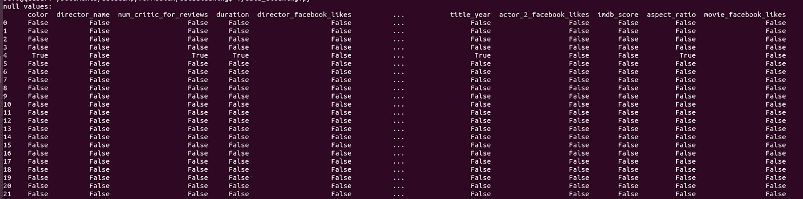
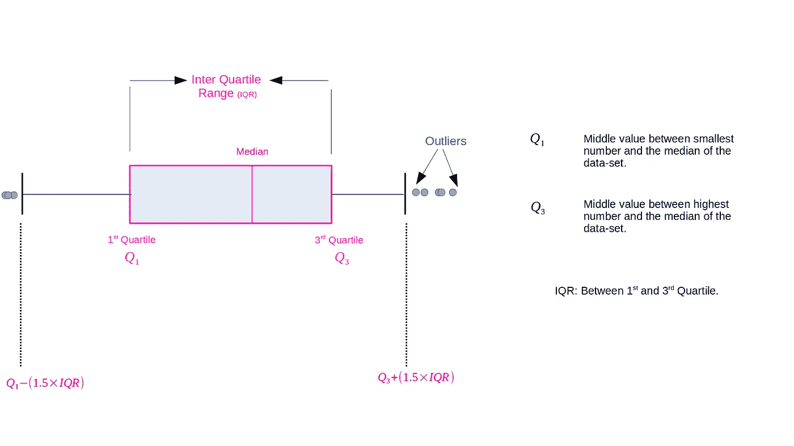
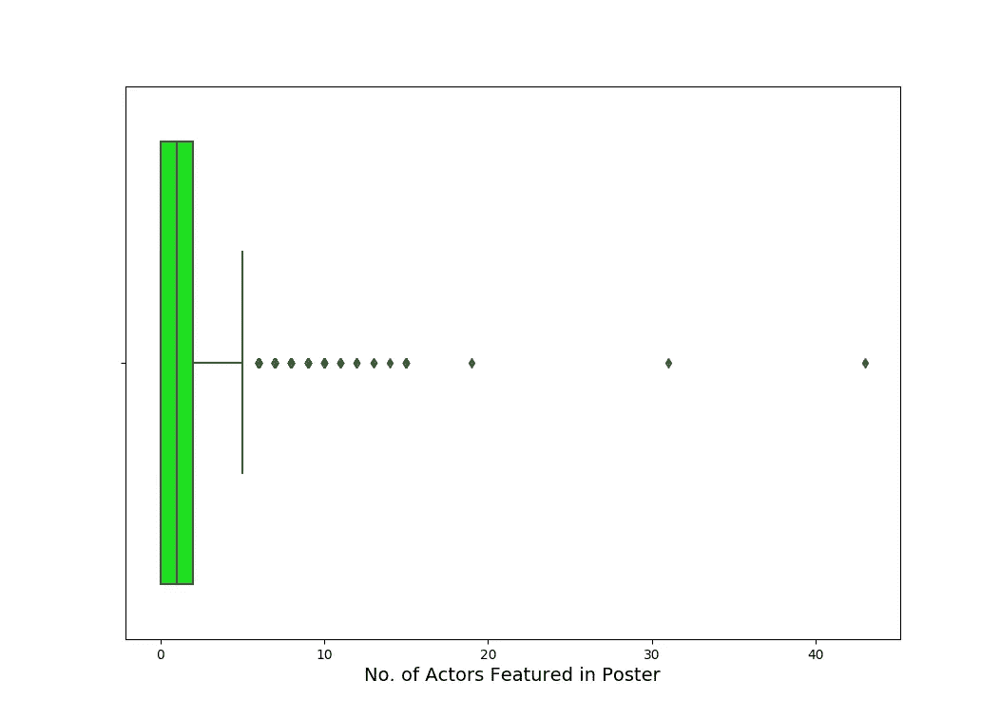
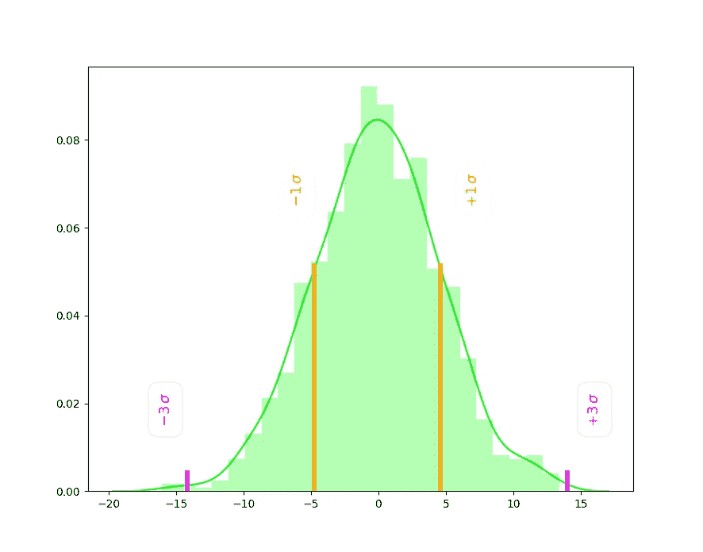
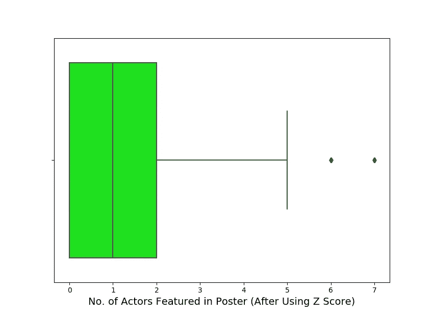

# 使用 Pandas 处理数据:清理和处理

> 原文：<https://towardsdatascience.com/data-handling-using-pandas-cleaning-and-processing-3aa657dc9418?source=collection_archive---------5----------------------->

## 掌握熊猫处理“脏数据”


Keep calm, learn Pandas! ([Source: Pixabay](https://pixabay.com/photos/animal-branch-cute-red-panda-1851593/))

在为一些老的 Kaggle 项目实践时，我意识到在应用机器学习算法之前准备数据文件要花很多时间。这篇文章回顾了一些关于[熊猫](https://pandas.pydata.org/)的初级到高级水平的数据处理技术，作为另一篇文章[的前奏，在另一篇文章](https://medium.com/swlh/practical-data-analysis-using-pandas-global-terrorism-database-20b29009adad)中，我使用了全球恐怖主义数据和熊猫的一些高级功能进行数据分析。这篇文章是关于数据清理和处理的。让我们立即开始吧！

在这篇文章中，我使用了 [IMDB movie-dataset](https://www.kaggle.com/carolzhangdc/imdb-5000-movie-dataset/kernels) 来介绍最相关的数据清理和处理技术。我们可以从了解以下数据集开始

```
movies_df = pd.read_csv("movie_metadata.csv")
print "data-frame shape: ", movies_df.shape >>> data-frame shape:  (5043, 28)
```

因此数据集有 5043 行，28 列，我们可以用

```
print "column names: ", movies_df.columns.values>>> column names:  
['color' 'director_name' 'num_critic_for_reviews' 'duration'
 'director_facebook_likes' 'actor_3_facebook_likes' 'actor_2_name'
 'actor_1_facebook_likes' 'gross' 'genres' 'actor_1_name' 'movie_title'
 'num_voted_users' 'cast_total_facebook_likes' 'actor_3_name'
 'facenumber_in_poster' 'plot_keywords' 'movie_imdb_link'
 'num_user_for_reviews' 'language' 'country' 'content_rating' 'budget'
 'title_year' 'actor_2_facebook_likes' 'imdb_score' 'aspect_ratio'
 'movie_facebook_likes']
```

在我们应用一些最大似然算法进行预测之前，比如说“imdb_score”，我们需要对数据集进行更多的调查，因为它不像[波士顿大厦数据集](https://scikit-learn.org/stable/modules/generated/sklearn.datasets.load_boston.html)那样得到很好的处理。首先，我将讨论如何处理丢失的数据。

## 处理缺失数据:DataFrame.isna()，DataFrame.fillna()

我们可以使用`[pandas.DataFrame.isna](https://pandas.pydata.org/pandas-docs/stable/reference/api/pandas.DataFrame.isna.html)()`来检测数组类对象的缺失值。这将返回一个大小相同的布尔对象，其中 NA 值(如 None 或`numpy.NaN`)被映射为 True，而其他所有值都被映射为 False。这与`[pandas.DataFrame.isnull(](https://pandas.pydata.org/pandas-docs/stable/reference/api/pandas.DataFrame.isnull.html))`如出一辙。

```
print "null values: \n", 
print movies_df.isna()
```

上述命令返回以下输出



Looking For Missing Data in data-frame

我们可以通过在前面的命令中添加一个`.sum()`来提取相关信息，而不是打印出带有 True/False 条目的数据帧。这样我们就可以找到每一列缺失值的总数。

```
print movies_df.isna().sum()>>>color                         19
director_name                104
num_critic_for_reviews        50
duration                      15
director_facebook_likes      104
actor_3_facebook_likes        23
actor_2_name                  13
actor_1_facebook_likes         7
gross                        884
genres                         0
actor_1_name                   7
movie_title                    0
num_voted_users                0
cast_total_facebook_likes      0
actor_3_name                  23
facenumber_in_poster          13
plot_keywords                153
movie_imdb_link                0
num_user_for_reviews          21
language                      12
country                        5
content_rating               303
budget                       492
title_year                   108
actor_2_facebook_likes        13
imdb_score                     0
aspect_ratio                 329
movie_facebook_likes           0
dtype: int64
```

添加另一个。sum()返回数据集中空值的总数。

```
print "total null values: ", movies_df.isna().sum().sum()>> total null values: 2698
```

移除包含 NA *的行的最简单的方法之一是* ***删除*** *它们，*当所有列都包含 NA 或任何列都包含 NA 时。让我们从删除任何列中包含 NA 值的行开始。

```
clean_movies_df = movies_df.dropna(how='any')print "new dataframe shape: ", clean_movies_df.shape
print "old dataframe shape: ">>> new dataframe shape:  (3756, 28)
old dataframe shape:  (5043, 28)
```

因此，删除任何列中包含 NA 值的行都会减少将近 1300 行。这对于行数较少的数据集非常重要，因为删除所有缺少值的行会导致我们丢失必要的信息。在这种情况下，我们可以使用指定的方法使用`[pandas.DataFrame.fillna(](https://pandas.pydata.org/pandas-docs/stable/reference/api/pandas.DataFrame.fillna.html))`方法向 ***填充 NA/NaN 值*** 。用某个固定值(例如 0)填充所有 NA/nan 的最简单方法。我们可以简单地通过

```
movies_df.fillna(value=0, inplace = True) 
```

我们可以选择一些特定的列，然后使用下面的`DataFrame.fillna()`方法，而不是用零填充所有缺失的值

```
movies_df[['gross', 'budget']] = movies_df[['gross', 'budget']].fillna(value=0)
```

对于“object”数据类型的列，例如“language”列，我们可以使用“no info”这样的词来填充缺少的条目。

```
movies_df['language'].fillna("no info", inplace=True)
```

填充缺失值的另一个`method`可以是`**ffill**`方法，它将上一个有效的观察传播到下一个。类似地`**bfill**`方法使用下一个观察来填补空白。

```
movies_df['language'].fillna(method='ffill', inplace=True)
```

另一个有效的方法是用 ***列的平均值来填充缺失值*** 如下

```
movies_df['budget'].fillna(movies_df[budget].mean(), inplace=True)
```

关于如何使用 Pandas 处理缺失值的更多细节，您可以查看 Pandas 用户指南中关于缺失数据的文档。

## 数据帧中的重复数据:DataFrame.duplicated()

除了丢失的数据，在一个数据帧中还可能有*重复行*。为了确定一个数据集是否包含重复的行，我们可以使用 Pandas[data frame . duplicated()](https://pandas.pydata.org/pandas-docs/stable/reference/api/pandas.DataFrame.duplicated.html)来处理所有的列或一些选定的列。`**pandas.Dataframe.duplicated()**`返回表示重复行的布尔序列。让我们首先找出这个电影数据集中有多少重复行。

```
duplicate_rows_df = movies_df[movies_df.duplicated()]print "number of duplicate rows: ", duplicate_rows_df.shape>>> 
number of duplicate rows:  (45, 28)
```

因此，每列中有 45 行存在重复的元素。我们也可以对单个列进行检查—

```
duplicated_rows_df_imdb_link= movies_df[movies_df.duplicated(['movie_imdb_link'])]print duplicate_rows_df_imdb_link.shape>>> 
(124, 28)
```

所以有 124 种情况下 imdb 链接是相同的，检查相同的另一种方法是使用`[**pandas.Series.unique()**](https://pandas.pydata.org/pandas-docs/stable/reference/api/pandas.Series.unique.html)`方法。让我们看看:

```
print len(movies_df.movie_imdb_link.unique())>>> 
4919
```

因此，唯一链接的总数是 4919，如果您注意到重复链接是 124，将它们相加得到(4919 + 124 = 5043)总行数。为了更好地分析，有必要选择唯一的行，这样至少我们可以删除所有列中具有相同值的行。我们可以简单地使用下面的`[**pandas.DataFrame.drop_duplicates()**](https://pandas.pydata.org/pandas-docs/stable/reference/api/pandas.DataFrame.drop_duplicates.html)`来完成

```
print "shape of dataframe after dropping duplicates", movies_df.drop_duplicates().shape >>> 
shape of dataframe after dropping duplicates (4998, 28)
```

## 宁滨数据:pandas.cut()

另一个非常重要的数据处理技术是 ***数据分桶或数据宁滨*** 。我们将在这里看到一个例子，宁滨·IMDb 使用`[**pandas.cut()**](https://pandas.pydata.org/pandas-docs/version/0.23.4/generated/pandas.cut.html)`方法得分。基于分数[0。,4., 7., 10.]，我想把电影放在不同的桶里['shyyyte '，'适中'，'好']。如你所知，得分在 0-4 之间的电影将被放入“shyyyte”桶中，以此类推。我们可以用下面几行代码做到这一点

```
op_labels = ['shyttte', 'moderate', 'good']
category = [0.,4.,7.,10.]movies_df['imdb_labels'] = pd.cut(movies_df['imdb_score'], labels=op_labels, bins=category, include_lowest=False)
```

这里创建了一个包含标签的新列“imdb_labels ”,让我们来看看——

```
print movies_df[['movie_title', 'imdb_score', 'imdb_labels']][209:220]>>>           movie_title     imdb_score     imdb_labels209     Rio 2               6.4            moderate
210     X-Men 2             7.5             good
211     Fast Five           7.3             good
212     Sherlock Holmes:..  7.5             good
213     Clash of the...     5.8            moderate
214     Total Recall        7.5             good
215     The 13th Warrior    6.6            moderate
216     The Bourne Legacy   6.7            moderate
217     Batman & Robin      3.7             shyttte
218     How the Grinch..    6.0            moderate
219     The Day After T..   6.4            moderate
```

为了充分利用`**pandas.cut()**`方法，您可以查看[文档](https://pandas.pydata.org/pandas-docs/version/0.23.4/generated/pandas.cut.html)。

## 检测数据集中的异常值:

大多数时候对于探索性数据分析(EDA)， ***离群点检测*** 是一个重要的环节，因为，特定特征的离群点可能会扭曲真实情况，所以我们需要忽略它们。具体来说，当我们想要应用机器学习算法进行预测时，离群值可能会造成严重破坏。同时异常值甚至可以帮助我们进行异常检测。因此，让我们看看如何使用熊猫来检测这个特定数据框架中的异常值。

***海风盒子剧情:***

*箱线图是一种基于中位数、四分位数和异常值的可视化数据分布的标准方法。*也许你已经知道这些量到底是什么，但我还是在下图中做了简短的回顾。



Figure 1: Schematic of Box Plot (Source: Author)

我们可以使用 python 数据可视化库 [Seaborn](https://seaborn.pydata.org/index.html) 来绘制这样的箱线图。让我们用方框图来描绘电影海报中的演员数量分布。

```
sns.boxplot(x=movies_df['facenumber_in_poster'], color='lime')
plt.xlabel('No. of Actors Featured in Poster', fontsize=14)
plt.show()
```

上面的代码产生了下面的图



Figure 2: Too many outliers in number of faces featured in movie poster

让我们检查一下电影海报中演员(面孔)数量最多的电影。

```
print movies_df[['movie_title', 'facenumber_in_poster']].iloc[movies_df['facenumber_in_poster'].idxmax()]>>>
movie_title             500 Days of Summer 
facenumber_in_poster                     43
```

因此，电影'[夏日 500 天](https://en.wikipedia.org/wiki/500_Days_of_Summer)'中出现了最多的面孔(43 张)。让我们用`[**pandas.DataFrame.describe()**](https://pandas.pydata.org/pandas-docs/stable/reference/api/pandas.DataFrame.describe.html)`的方法来看看这个专栏‘face number _ in _ poster’的一个基本统计细节。

```
print movies_df['facenumber_in_poster'].describe()>>>count    5030.000000
mean        1.371173
std         2.013576
min         0.000000
25%         0.000000
50%         1.000000
75%         2.000000
max        43.000000
```

有了这个，可能盒子的情节对你来说更有意义。

另一种检测异常值的方法是使用 Z 分数。让我们看看它是如何工作的。

***Z 得分和离群值:***



Figure 3: 1σ and 3σ Standard deviation on a normal distribution with 0 μ. (Source: Author)

***Z 得分是一个数字(无量纲的),表示一个数据点相对于平均值的标准偏差。* Z 得分可以简单地定义为—**

***Z =(X-μ)/σ，其中μ为总体均值，σ为标准差，X 为总体中的一个元素。***

为了绘制下图，我使用了正态分布`[numpy.random.normal(](https://docs.scipy.org/doc/numpy/reference/generated/numpy.random.normal.html))`，在正态分布中，几乎所有的值(约 99.7%)都落在平均值的 3 σ偏差范围内(此处的图μ = 0)。我们可以使用 Z 得分来拒绝异常值的方法是考虑 Z 得分 3 个单位以内的数据点。可以使用下面的`scipy.stats`为所有包含“非对象”类型数据的列完成此操作。

1.检查数据框**(**[**data frame . dtypes**](https://pandas.pydata.org/pandas-docs/stable/reference/api/pandas.DataFrame.dtypes.html)**)中所有列的数据类型。**

```
print "data types: \n", movies_df.dtypes>>>
data types: 
color                         object
director_name                 object
num_critic_for_reviews       float64
duration                     float64
director_facebook_likes      float64
actor_3_facebook_likes       float64
actor_2_name                  object
actor_1_facebook_likes       float64
gross                        float64
genres                        object
actor_1_name                  object
movie_title                   object
num_voted_users                int64
cast_total_facebook_likes      int64
actor_3_name                  object
facenumber_in_poster         float64
plot_keywords                 object
movie_imdb_link               object
num_user_for_reviews         float64
language                      object
country                       object
content_rating                object
budget                       float64
title_year                   float64
actor_2_facebook_likes       float64
imdb_score                   float64
aspect_ratio                 float64
movie_facebook_likes           int64
```

2.创建一个新的数据框，排除所有“对象”类型列[**data frame . select _ dtypes**](https://pandas.pydata.org/pandas-docs/stable/reference/api/pandas.DataFrame.select_dtypes.html)

```
print "shape before :", movies_df.shapemovies_df_num = movies_df.select_dtypes(exclude=['object'])print "shape after excluding object columns: ", movies_df_num.shape>>>shape before : (3756, 28)
shape after excluding object columns:  (3756, 16)
```

3.从每列中选择位于 Z 得分 3 个单位内的元素

```
movies_df_Zscore = movies_df_num[(np.abs(stats.zscore(movies_df_num))<3).all(axis=1)]print "shape after rejecting outliers: ", movies_df_Zscore.shape>>>shape after rejecting outliers:  (3113, 16)
```



Figure 4: Box plot of number of faces featured in a movie poster. After applying the Z score method.

我们可以通过再次绘制“facenumber_in_poster”的方框图来检查上述步骤的效果。这里我们可以看到与图 2 相比的不同之处，在图 2 中，我们有一个考虑了“facenumber_in_poster”列中所有元素的方框图。

这些是人们可以准备用于分析的数据和应用机器学习算法进行预测的一些方法。有效地准备数据集对全面分析有很大帮助，我希望这篇文章能帮助你更有条理地准备数据集以供进一步分析。根据问题和数据集的不同，你可能需要决定、选择和重复这些过程来解释什么是影响，所以，祝你好运探索你的数据集。

保持坚强，干杯！！

这篇文章使用的代码可以在我的 [Github](https://github.com/suvoooo/Machine_Learning/tree/master/datacleaning) 上找到。

*在*[*Linkedin*](https://www.linkedin.com/in/saptashwa/)*找我。*