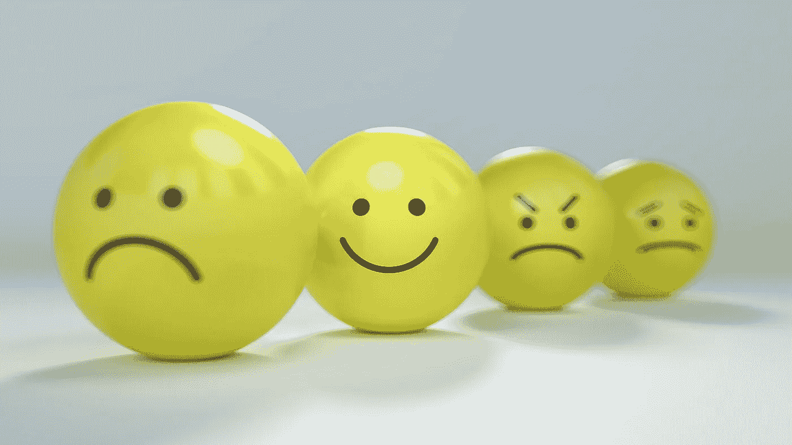
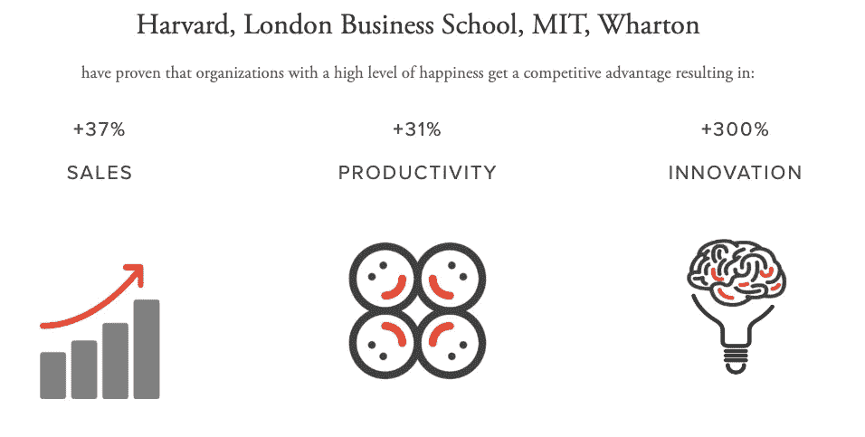
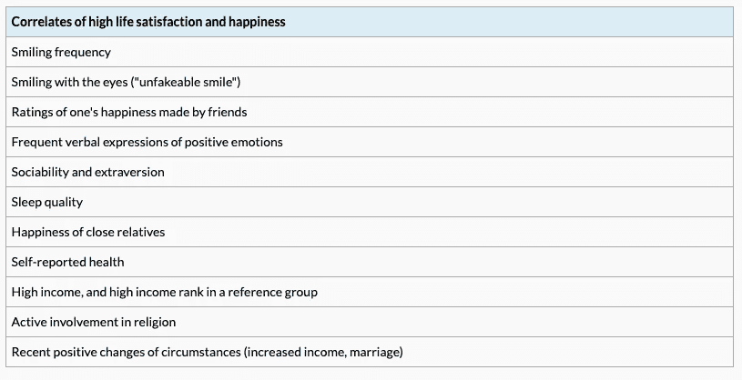
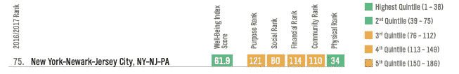
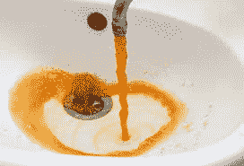
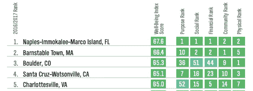
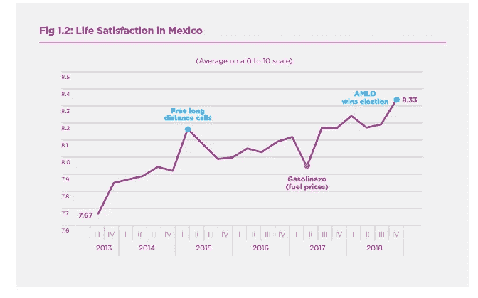
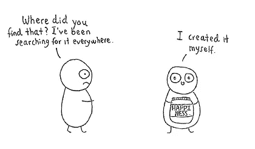

# 数据快乐

> 原文：<https://towardsdatascience.com/data-happy-bac9dffeadb5?source=collection_archive---------23----------------------->

## 测量抽象

联合国可持续发展解决方案网络为他们的年度[世界幸福报告](https://worldhappiness.report/)积累了大量关于世界情感状态的数据。但是，谁在乎我们的感受呢？有的人只在乎事实；不是感情。那些资本主义猪可能有兴趣听听*这些*由咨询机构 happy Places to Work 的首席执行官西尔维娅·加西亚吹捧的事实，该机构向通过更快乐的员工寻求更高利润和增长的企业提供文化审计服务。

Hapine$$ is Profitable

# 量化一种情绪

许多研究都在努力衡量幸福，但如何衡量呢？情感是不可估量的，主观的，抽象的。幸福可以通过一个人的幸福状态、生活满意度，甚至是他们大脑中特定神经递质的水平来感知——T4、血清素和多巴胺。我读过的几乎所有报告都采用了最常见的方法，即总结自我报告的幸福度调查。谁比你自己更了解你的幸福状态？在 2017 年[,盖洛普](https://wellbeingindex.sharecare.com/wp-content/uploads/2018/03/Gallup-Sharecare-State-of-American-Well-Being_2017-Community-Rankings_vFINAL.pdf)在全国范围内进行了 160，498 次电话采访，他们声称他们的数据反映了 95%的美国成年人口。

根据盖洛普的 [2017 年美国福祉状况报告](https://wellbeingindex.sharecare.com/wp-content/uploads/2018/03/Gallup-Sharecare-State-of-American-Well-Being_2017-Community-Rankings_vFINAL.pdf)，幸福是可以衡量的(也是可以预测的？)具有 5 个属性:

## **目的:享受你的日常生活，并有动力去实现目标**

## **社交:拥有支持和爱的关系**

## **财务:管理预算以减轻压力**

## **社区:感到安全、自豪，并喜欢你居住的地方**

## **身体:健康、精力充沛**

虽然这些措施可能是有效的，但从调查中收集的自我报告的信息可以预见是不可靠的。问题和答案都是主观的。Michael Argyle 等人(1999)解释说，从调查中获得的数据无法解释超过 15%的生活满意度变化。这意味着我们无法用调查数据预测个人的健康状况。更客观的衡量标准，如整个人口的健康状况，显示了预测未来福祉的能力。根据克拉克等人(2018 年)的说法，心理健康“比身体健康更能解释福祉的变化”，这一发现得到了《世界幸福报告》的证实。

尽管为了衡量幸福而对自我报告的调查提出了批评，Ortiz-Espina 和 Roser 的认为，“基于调查的幸福和生活满意度的测量确实提供了一个合理一致和可靠的主观幸福感的画面。”看看那篇文章。有一些豪华的可视化，和全球范围的数据。

Kahneman 和 Krueger (2006)的下表列出了研究人员发现的与自我报告的幸福和生活满意度有关的其他变量。

# 国家调查结果

*我住在布鲁克林，所以这是从纽约的角度来看。查看完整的* [*报告*](https://wellbeingindex.sharecare.com/wp-content/uploads/2018/03/Gallup-Sharecare-State-of-American-Well-Being_2017-Community-Rankings_vFINAL.pdf) *找到你所在州的排名。*

盖洛普的结果将纽约市置于第二分位数的底部，总体排名第 75 位(满分 186 分)。纽约市的优势在于身体素质，在社会和社区方面做得相当好，但在财务和目标方面有困难。

More butta, more betta.

25 个最幸福社区中，有 17 个在五个州:加利福尼亚、科罗拉多、佛罗里达、北卡罗来纳和弗吉尼亚。

惊讶吗？

幸福感得分最低的社区是:史密斯堡、阿肯色州-俄克拉荷马州；俄亥俄州坎顿-马西隆；北卡罗莱纳州的山核桃树-雷诺尔-摩根顿；密西西比州格尔夫波特-比洛克西-帕斯卡古拉；密歇根州的弗林特。

并不奇怪。

你住在哪里不会导致你快乐或不快乐，但有一些不可否认的相关性。生活在人口高度密集的地区会让你在身体和财务方面的幸福感得分更高，但农村居民通常比城市居民的社区得分更高。

在盖洛普幸福评估的所有衡量指标中，佛罗里达州那不勒斯-伊莫卡利-马可岛排名前 2。该镇已团结起来，在学校和企业中推广更健康的饮食习惯，举办大型锻炼活动，城市健康计划已使医疗费用远低于全国报告的医疗通货膨胀率。他们发现了预防肥胖、阻止吸烟、减少孤独感、解决精神疾病和早期戒毒等先发制人的方法，这些方法比任何反应性治疗都更有效。

下图显示了墨西哥一段时间内的平均生活满意度。生活满意度的飙升可以归因于全国性的事件，如 2015 年与免费长途电话重合的幸福感急剧增加，以及 2017 年汽油价格飙升时生活满意度的下降。

2019 [World Happiness Report](https://worldhappiness.report/ed/2019/#read)

# 用数据科学预测幸福

数据科学正在创新新的更客观的方法来衡量人类的情感和健康。新技术已经开发出通过测量与表情、步态和声音相关的面部特征来远距离检测身份和情绪状态的方法。一个名为 [FaceReader](https://www.noldus.com/human-behavior-research/products/facereader?gclid=Cj0KCQjwtr_mBRDeARIsALfBZA4UWLvMUP37tgNfXbE3DTjr_KoetvLnkw47mcSG68RGYHMyBGjtkokaAozQEALw_wcB) 的新商业软件使用一种在超过 10，000 张脸上训练的人工神经网络算法来预测愤怒或快乐等情绪，准确率很高(这两种情绪的准确率超过 90%)。

情感分析也可以用来从书面文本中预测幸福感和情绪。对一篇文章中表达的观点进行计算机识别和分类，尤其是为了确定作者对特定主题或产品的态度是积极的、消极的还是中立的。情绪分析已被用于股票市场价格的预测建模，但也有可能被用于预测福祉。

我们的工作场所文化、我们居住的地方以及时事都对我们的整体幸福感有影响。但是许多人认为他们的快乐来自内心的控制。他们相信他们对自己的幸福负责。大卫·斯坦德尔·拉斯特在他的 TED 演讲中说，感恩是幸福的关键。“如果我们心存感激，我们就不会害怕。如果我们不恐惧，我们就不暴力。”他强调正念和总是活在当下是幸福的秘诀。[丹尼尔·吉尔伯特](https://www.youtube.com/watch?v=4q1dgn_C0AU)说，“我们内心有我们一直在追逐的商品。”在他的演讲中，他比较了合成幸福和自然幸福，并揭示了两者之间没有太大的区别。他认为幸福可以自我制造。听听他的 TED 演讲，了解一些关于幸福和生活满意度的有趣事实。

不管你目前在世界幸福报告上的排名如何，我希望有一天你能发现自己带着微笑醒来，并让自己无条件地快乐。

Wednesday emerging from the Harmony Hut

m .阿盖尔、d .卡内曼、e .迪纳和 n .施瓦茨(1999 年)。快乐心理学的基础。拉塞尔·塞奇基金会。

克拉克、A. E .、弗雷什、莱亚德、r .和沃德(2018 年)。幸福的起源:生命过程中的幸福科学。普林斯顿大学出版社。

卡尼曼博士和克鲁格博士(2006 年)。主观幸福感测量的发展。《经济展望杂志》，第 20 卷第 1 期，第 3-24 页。