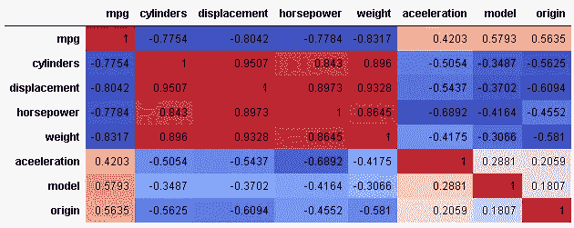

# 提高模型性能的数据插补

> 原文：<https://towardsdatascience.com/data-imputation-to-improve-model-performance-c4eb2a9954ad?source=collection_archive---------27----------------------->

## 最终是小步骤产生巨大的影响

在执行任何机器学习项目时，数据插补是数据准备阶段的重要部分。用纯粹的统计学术语来说，它是一个用一些有意义的替代物代替缺失数据的过程。

例如，请看下面的样本数据，它是从 Kaggle 中选取的自动数据集的子集。


Source: [https://www.kaggle.com/uciml/autompg-dataset](https://www.kaggle.com/uciml/autompg-dataset)

有 6 行缺少马力特性的数据。所以作为数据准备阶段的一部分，我们需要去掉缺失的数据。

有两种方法可以消除丢失的数据:

1.  我们可以从实际数据集中删除所有 6 行。
2.  为丢失的数据添加一些有意义的替代数据。

随便猜！！！哪种方法可以提高模型的准确性？保持你的好奇心，让我们来探索答案。

是时候让我们的手接触代码，并找出哪一个在模型准确性方面更好。

加载数据集:

```
auto_data = pd.read_csv('/kaggle/input/auto-mpg.data', delim_whitespace = True, header = None,
                       names = [
                                'mpg',
                                'cylinders',
                                'displacement',
                                'horsepower',
                                'weight',
                                'aceeleration',
                                'model',
                                'origin',
                                'car_name'
    ])
```

下面是数据集的样子:

```
auto_data.head()
```

Out[4]:


我们可以检查每一列的数据类型:

```
auto_data.info()
```


如您所见，马力列有数值，但数据类型为对象。所以稍微偏离一下主题，我们需要改变列的数据类型。

```
auto_data['horsepower'] = pd.to_numeric(auto_data['horsepower'], errors='coerce')auto_data.info()
```


此外，car_name 特性并没有增加多少价值，因为在 398 行数据集中有 305 个唯一值。因此，为了简单起见，我们将从数据集中删除特征 car_name。

```
auto_data = auto_data.drop(['car_name'], axis=1)
auto_data.head()
```


现在，我们都可以尝试这两种方法来处理缺失数据。

首先，我们将删除马力特性缺少值的行，并评估模型性能指标。

```
auto_data_final = auto_data.dropna(axis=0)
auto_data_final[auto_data_final.isnull().any(axis=1)]
```


执行上述步骤后，我们已经成功地从数据集中删除了所有丢失的值。

下一步是将数据集分成训练/测试集，并进行模型训练。

```
from sklearn.model_selection import train_test_split
from sklearn.svm import SVRX = auto_data_final.drop('mpg', axis=1)
y = auto_data_final['mpg']X_train, X_test, y_train, y_test = train_test_split(X, y, train_size=0.8, test_size=0.2, random_state =0)model = SVR(kernel='linear', C=1.0)
model.fit(X_train, y_train)
```


这是捕捉模型训练的一些重要性能指标的好时机。

获得预测的均方误差(MSE)。

```
model.coef_
```


获得对测试数据的预测:

```
y_predict = model.predict(X_test)
```

计算均方误差:

```
from sklearn.metrics import mean_squared_errormodel_mse = mean_squared_error(y_predict, y_test)
print(model_mse)
```


将数字记在某处，我们将对处理缺失数据的第二种方法(即数据插补)重复相同的步骤。

为清晰起见，让我们总结一下第一种方法中包含的所有步骤:

a.已加载数据集。

b.已将马力特征转换为数字。

c.已删除汽车名称功能。

d.删除所有丢失数据的行。

e.将数据集分成训练/测试集。

f.使用训练集训练模型。

g.评估训练集和测试集上模型性能度量。

对于方法 2(数据插补)，除步骤(d)外，我们需要重复上述所有步骤。步骤(d)将由几个子步骤代替。

假设前 3 个步骤很容易重做，那么我们可以直接从步骤(d)替换开始。

数据插补有多种方式，下面是其中一种。我们需要考虑到解释的方式并不完美，只是试图传达数据插补的重要性。

正如我们所知，完整数据集中只有 6 行缺少马力特性的数据。


Source: [https://www.kaggle.com/uciml/autompg-dataset](https://www.kaggle.com/uciml/autompg-dataset)

我们可以寻找相关矩阵，并检查是否可以从现有特征中导出马力值。

```
# Check the correlation matrix to derive horsepower feature by help of other feature
corr = auto_data.corr()
corr.style.background_gradient(cmap='coolwarm').set_precision(4)
```



相关矩阵表明，马力特征与气缸、排量和重量等特征有很强的相关性。

为简单起见，我们将考虑气缸特性来推导马力特性下的所有缺失值。

丢失的数据行有 4 列或 6 列。因此，计划将实际数据集中所有行分别分组为 4/6 缸，然后得出马力特性任何缺失值。

```
auto_data_4_cylinders = auto_data[auto_data['cylinders'] ==4]
print(len(auto_data_4_cylinders))
auto_data_4_cylinders.head()
```


绘制直方图以了解功能马力的数据分布:

```
%matplotlib inlineauto_data_4_cylinders['horsepower'].plot.hist(bins=10, alpha=0.5)
```


由于直方图似乎是正态分布，我们可以选择平均值作为我们的插补策略。

```
import numpy as np
from sklearn.impute import SimpleImputerimp_mean = SimpleImputer(missing_values=np.nan, strategy='mean')auto_data_4_cylinders['horsepower'] = imp_mean.fit_transform(auto_data_4_cylinders[['horsepower']])
```

检查是否已移除所有 NaN:

```
auto_data_4_cylinders[auto_data_4_cylinders.isnull().any(axis=1)].head()
```


对 6 缸自动数据下的缺失数据重复相同的技术。

```
auto_data_6_cylinders = auto_data[auto_data['cylinders']==6]
auto_data_6_cylinders.head()
```


绘制直方图以了解功能马力的数据分布:

```
%matplotlib inline
auto_data_6_cylinders['horsepower'].plot.hist(bins=10, alpha=0.5)
```


似乎如果我们从我们的数据集中排除 160，那么其余直方图将看起来像正态分布，我们可以选择平均值作为插补策略。

打印插补的目标行:

```
auto_data_6_cylinders[auto_data_6_cylinders.isnull().any(axis=1)].head()
```


现在将插补策略应用于目标行:

```
import numpy as np
from sklearn.impute import SimpleImputermean_imp = SimpleImputer(missing_values=np.nan, strategy='mean')mean_imp.fit(auto_data_6_cylinders[auto_data_6_cylinders['horsepower'] < 160][['horsepower']])auto_data_6_cylinders['horsepower'] = mean_imp.transform(auto_data_6_cylinders[['horsepower']])
```

检查是否已移除所有 NaN:

```
auto_data_6_cylinders[auto_data_6_cylinders.isnull().any(axis=1)]
```


由于我们删除了所有 NaN，所以现在是时候将所有数据集合并在一起了。

```
auto_data_others = auto_data[~auto_data['cylinders'].isin((4,6))]
print(len(auto_data_others))auto_data_final = pd.concat([auto_data_others, auto_data_4_cylinders, auto_data_6_cylinders], axis=0)
print(len(auto_data_final))
```


下一步是将数据集分成训练/测试集，并进行模型训练。

```
from sklearn.model_selection import train_test_splitX = auto_data_final.drop('mpg', axis=1)
y = auto_data_final['mpg']X_train, X_test, y_train, y_test = train_test_split(X, y, train_size=0.8, test_size=0.2, random_state =0)from sklearn.svm import SVRmodel = SVR(kernel='linear', C=1.0)
model.fit(X_train, y_train)
```

现在，我们将使用插补策略准备的数据来捕获模型再训练的一些重要性能指标。

```
model.coef_
```


获得预测的均方误差(MSE)。

```
y_predict = model.predict(X_test)from sklearn.metrics import mean_squared_errormodel_mse = mean_squared_error(y_predict, y_test)
print(model_mse)
```


如我们所见，我们能够通过简单的数据插补技术最小化均方误差(MSE ),这是评估训练模型时的性能指标之一。

所以回到方法的问题，我们可以说数据插补方法在给定的数据集上效果更好。

你可以参考下面 kaggle 上的笔记本以获得完整的代码示例:

[](https://www.kaggle.com/shshankar1/svm-for-linear-regression-predict-automobile-mpg) [## 线性回归 SVM 预测汽车 MPG

### 使用来自[私有数据集]的数据

www.kaggle.com](https://www.kaggle.com/shshankar1/svm-for-linear-regression-predict-automobile-mpg)