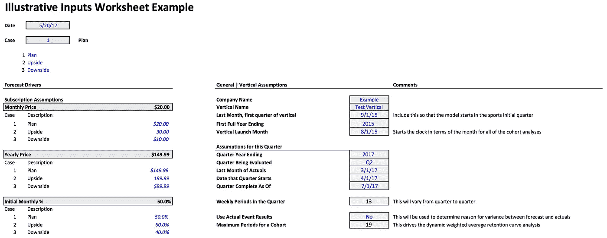
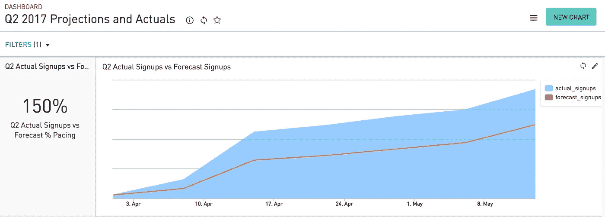

# 基于数据的滚动预测

> 原文：<https://towardsdatascience.com/data-informed-rolling-forecasts-5dce48edb683?source=collection_archive---------18----------------------->

## 在初创企业中利用数据科学工具与财务部门合作，并推动以产品为导向的增长。

Credit: Periscope Data. BI dashboard with dynamic filters.

*注:这篇文章最初发表在我的博客***上，是我在 FloSports 担任产品副总裁时写的。目标是展示正确的数据科学工具和对基本业务驱动因素的理解如何支持产品和财务之间的协作，以加速产品导向的增长。在最初出版时，我们是一家 B 系列运动技术公司，在其生命周期的各个阶段拥有近 25 种不同的运动。**

*我在 FloSports 倡导的一项新举措是我所谓的“数据通知滚动预测”。在这篇文章中，我将从宏观层面介绍这是如何实现的，以及[潜望镜数据](https://www.periscopedata.com/)如何在帮助我们实现调步仪表板方面发挥宝贵的作用——只需要有限的工程时间。*

*以下是我完成这项工作所必需的材料清单:*

1.  *了解您的业务和经济模式的关键驱动因素*
2.  *一个可查询的数据库(我们的报告仓库位于 Redshift 上)来进行历史基准测试*
3.  *促进数据库查询和提取的商业智能工具*
4.  *自下而上的财务模型模板，理想情况下基于场景和案例(例如，仅从现有业务相对于现有业务的增长加上完成业务的高概率)，该模板基于#2 的历史实际情况，并预测下一季度的预期结果*
5.  *商业智能工具，有助于创建进度控制面板*

***第 1 部分:了解关键驱动因素和基准测试***

*当我刚到 FloSports 的时候，我的第一个行动项目之一是了解我们现有的 KPIs 这包括从理解什么，为什么，以及如何跟踪度量的一切。我们从头构建了一个数据仓库，我们将 ETL 到新红移仓库中的初始数据源是我们的 Stripe 支付数据。为此，我们采访了一位数据科学顾问。鉴于他参与帮助我们准备 B 轮融资，他对我们的业务很熟悉。作为该流程的一部分，在不涉及太多细节的情况下，我们制定了所有现有订阅计划的内容，以及我们的订阅者展示的计划和运动。在此基础上，我们定义了我们的用户类型和计划间隔。例如，我们根据支付的类型，结合用户在我们公司的生命周期中所处的阶段，制定了不同的用户类型。例如:*

*   ***新功能:**用户首次为某项运动的订阅付费*
*   ***重新激活:**在先前取消之前已经是订户的订户返回并为特定运动的订阅付费*
*   ***循环:**用户为他/她的特定体育项目订阅支付循环费用*

*[聚合事实表。](http://www.kimballgroup.com/data-warehouse-business-intelligence-resources/kimball-techniques/dimensional-modeling-techniques/aggregate-fact-table-cube/)鉴于我们的运动和计划产品的范围，查询可能会变得相当复杂，特别是对于有多年历史和来自新老用户的大量活动的运动。鉴于此，我们最常见的报告用例通常被转换成聚合事实表。这些通常结合了两个、三个或更多不同的数据源。我们为关键性能指标构建了聚合事实表，包括订阅者瀑布(月粒度)和支付(日粒度)。利用这些数据丰富的事实表和 Periscope Data 等灵活的 BI 工具，我们能够创建一个可按运动项目过滤的历史基准仪表板。我们将此提供给相关的业务涉众，他们可以基于选择的过滤器请求数据，并下载 CSV 以加载到财务模型中。*

***第 2 部分:构建自下而上的财务模型模板***

*鉴于我们有 25 个运动项目的现实，我为每个运动项目建立自下而上的财务预测模型的主要目标之一是使模型具有动态性和灵活性。这有助于有限的，如果有的话，为每个运动重新布线的模型，因为模型灵活的不同的发射日期和历史表现，例如，子保留，为每个运动。*

*一些运动已经存在好几年了，而另一些只有几个月的历史数据。我没有按照一项运动的历史来构建每一个模型，也没有每个季度都需要重新构建每一个模型，而是花了大量的前期时间来弄清楚如何最好地调整模型。我们通过所有 15+工作表动态反馈的示例包括:*

*   *订户群组保留瀑布*
*   *所有历史队列的加权平均保留曲线，根据衰减率预测未来流失*
*   *历史计划选择组合，例如，每月/每年%*
*   *随着时间的推移，订阅者螺旋上升—开始加上新的较少搅动等于结束(每月谷物)；(也有助于 MRR 的计划提供和运动)*
*   *基于历史分组及其预计经常性付款的季度每周预测；我们将这些预测的经常性付款与预测的新的和重新激活的用户付款相结合*

*模型的灵活性通常是通过确定哪些输入驱动因素需要动态公式来实现的；在本例中，输入如*垂直发布月、上个月的实际值和季度开始日期*允许我将模型与每项运动的独特方面区分开来。这也让我可以根据每项运动的历史来定制模型，只需最少的手动重新布线。*

**

*Example Control Sheet with Dynamic Drivers by Business Unit (sport in our case).*

*对于那些熟悉金融建模的人来说，你知道你可以利用场景和案例来对各种潜在的结果敏感化。一个例子是，“如果我们在季度的第二个月完成一笔大的配股交易会怎么样”，而我们所有的关键输入，例如每月价格，保持不变。为了说明这种可能性，我们将使用 Excel 中的 offset 函数创建一个场景，允许我们选择是否希望这种潜在结果的影响改变某些输入，然后流过模型。除此之外，我们可以将“大型新活动”场景与“牛市”案例结合起来→“如果我们结束了大型活动，并且由于这项运动的现场活动时间表更加强劲，该季度的年度混合百分比比我们以往看到的高 500 个基点，会怎么样？”*

*虽然每项运动都有一个单独的模型，但我在每个模型中添加了一个工作表，该工作表以行(周)和列(指标)的形式汇总了各种工作表中的所有关键报告指标，然后可以作为一个可查询的平面表→将所有这些模型的表合并到一个 CSV 中，作为我们调整仪表板的数据源。通过这样做，我们实现了以下目标:*

*   *反映季度目标的可视化效果(可下载数据)；业务用户更容易看到全面的目标和每个目标的驱动因素*
*   *一个进度控制面板，提供关于运动进度与预测进度的洞察，包括净收入、注册、订户和流失。*

***第 3 部分:利用正确的 BI 工具，即潜望镜数据 FTW***

*我以前写过关于[潜望镜的数据缓存](https://www.periscopedata.com/blog/building-the-periscope-cache-with-amazon-redshift.html)的文章，事实证明它在这种情况下非常有用。我们在几个方面使用了 Periscope 的数据缓存。例如，我们实现了跨数据库连接——一个数据源在 MySQL 中，另一个在 Postgres 中，第三个来自平面 CSV 文件。通过组合这些不同的来源，我们创建了一个强大的、不需要数据工程的仪表板。这个仪表板满足了我们的一个 sports 的用户属性报告请求，所需时间大约是整合我们专有的 ETL 工作流所需时间的 1/20。*

*Periscope 的缓存也有助于我们快速构建新数据源的概念证明(POC ),并接收来自业务利益相关者的反馈；我们总是在请求数据工程将新的数据源添加到我们的 ETL 工作流之前构建这些。此外，对于不太熟悉请求他们的当前状态数据流程成为我们的 ETL 和 BI 报告流程的一部分的业务用户，Periscope 的缓存为我们提供了一种低开销的方式来证明他们的报告想法。在对概念验证进行迭代，然后确保需求准备就绪之后，这提高了工程人员理解如何对数据建模以及如何将新的源合并到我们的整个仓库工作流和模式中的效率。*

*我们使用 Periscope 构建的季度仪表板是一个高度可定制的业务用户报告工具，可以显示每日、每周、每月和每季度的进度可视化和表格。这为版权收购团队、营销人员、管理层和数据分析师团队提供了关于我们在哪些方面超出或落后于季度绩效目标的可见性，此外，我们使用仪表板的报告来触发需要额外调查的领域。一些例子包括:*

*   *一个事件超出其注册预测 1.5 倍；我们是否通过现场活动漏斗看到了更好的转化？在影响访问者转化为付费用户方面，哪些内容看起来效果不错？*
*   *我们看到了比预期更高的保留率；这项运动做得好的地方是什么，它是否可以转移到其他运动中，我们如何做得更多？*

*Q2 2017 仪表板注册步调的净化图:*

**

*Example of Pacing Dashboard tracking overall signups relative to forecast and trend by week intra-quarter.*

*我喜欢这种工作，因为它结合了我的金融建模背景和数据分析。同样令人欣慰的是，在定义和验证业务逻辑以及获得正确的数据策略方面所做的努力确实可以支持产品导向的增长。Periscope Data 的工作人员是一路走来的好伙伴，最终是这种高度迭代、低开销方法成为可能的原因！*

*如果你喜欢这篇文章，如果你能点击“拍手”图标让我知道并帮助增加我的作品的发行量，那将是非常棒的。*

*你也可以在推特上联系我， [@kevinboller](https://twitter.com/kevinboller) ，我的个人博客可以在这里找到。感谢阅读！*