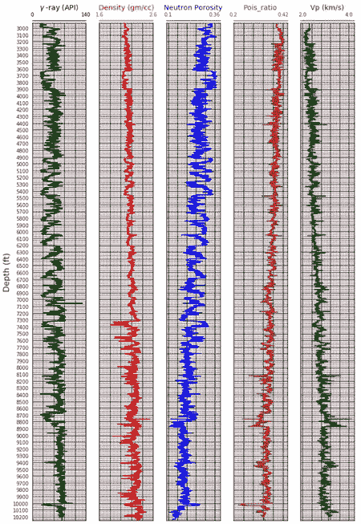
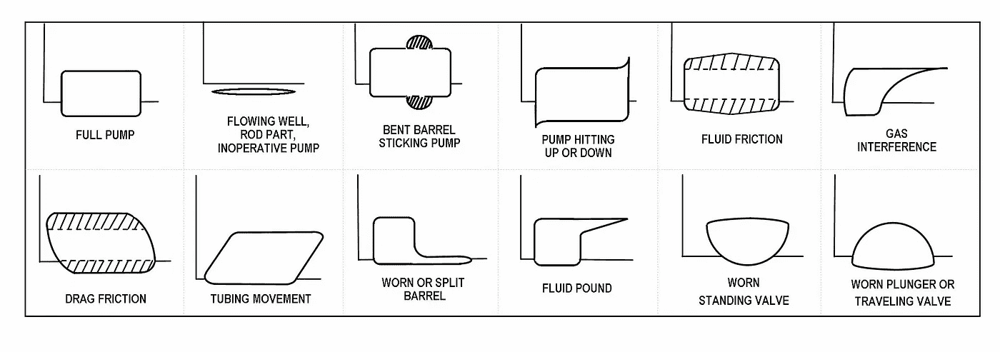

# 数据是新的石油，即使在石油和天然气行业也是如此

> 原文：<https://towardsdatascience.com/data-is-the-new-oil-even-in-the-oil-and-gas-industry-a3daa58d743d?source=collection_archive---------7----------------------->

## 来自 2019 年 SPE 数据科学大会的见解

数据科学和机器学习一直是互联网、金融、营销等行业重大转变的背后力量。石油和天然气行业也不例外，在 21 世纪初就很快熟悉了这一概念，并将其应用于上游、中游和下游行业，以获取宝贵的见解。因此，对业内公司来说，精确的数据仍然是一笔宝贵的资产。克莱夫·亨比(Clive Humby)曾著名地将数据比作新的石油，指出其内在价值在精炼后闪闪发光。

> “数据是新的石油。它很有价值，但如果不提炼，就不能真正使用。它必须转化为气体、塑料、化学物质等，以创造一个有价值的实体，推动盈利活动；因此，必须对数据进行分解和分析，使其具有价值。”
> 
> —克莱夫·亨比

在德克萨斯州休斯顿石油工程师协会(SPE)数据分析小组组织的 2019 年数据科学大会上，精炼数据和精炼油之间的比较有了新的意义。数据科学大会于 2019 年 4 月 4 日举行，425 名专业人士满座，抓住了人工智能传播带来的兴奋感，并在整个 O&G 行业组织了数据分析。

**SPE 数据分析小组负责人 Suri Bhat** 介绍了第二届年度 DSC 的主题:*“用先进的数据科学解决方案改造 G 行业的上游”，*并强调了将人工智能融入石油和天然气行业的重要性，因为每个石油生产商都要处理数 Pb 的数据。根据 [2017 年世界经济论坛报告，](https://www.weforum.org/whitepapers/digital-transformation-initiative)从 2016 年到 2025 年，数字化转型将产生价值 1.7 万亿美元的价值，从而减少 120 万吨碳排放。

> “数字化转型给该行业带来的估计价值约为 1.7 万亿美元，从而减少 120 万吨碳排放。”

售罄的会议有一个良好的技术和商业演示的组合，学生/行业海报会议，公司展台展示他们的服务，以及大量的网络机会。

## 断层和测井解释中的深度学习

每个演讲者都单独展示了人工智能目前被广泛应用的项目。与上游石油工业相关的作业与资源勘探和评估、油田开发、钻井和完井、油藏管理以及生产和设施作业有关。地球科学和勘探领域正在积极利用机器学习进行自动测井解释和勘探。

Typical Log Data (obtained from [source](/machine-learning-applied-to-geophysical-well-log-data-58ebb6ee2bc6))

一个特定的行业项目使用贝叶斯状态空间模型和蒙特卡罗模拟处理实时地层解释。另一个项目利用人工智能通过神经网络进行故障解释。无监督学习以前也曾用于测井解释。地震测井中缺失的三维数据为进一步解释模拟合成数据带来了独特的挑战。利用真实数据和合成数据，从而减少实现地学结论所需的时间。粒度预测也正在使用卷积神经网络进行分析，该网络具有来自微电阻率测井和多个其他输入的数据。

## 使用神经网络的实时扭矩和阻力计算

在钻井中，需要分析上下文数据(以每日钻井日志报告的形式)和结构化视觉数据(通过测井获得并在电子钻井记录仪中捕获)。由于钻井作业的时间限制性质，需要做出实时决策。为此，公司正在使用神经网络，并分析钻机状态以实现实时数据可视化，并预测钻井关键性能指标。现在，通过估计钻柱和井筒之间的摩擦系数和法向接触力，可以使用人工智能实时计算任意给定井中钻柱上的扭矩和阻力。

另一个运营商正在利用泵冲洗的历史数据，并在冲洗发生时向钻机运营商实施智能手机警报系统。井底钻具组合(BHA)承受各种应力，尤其是在水平井段，在给定操作参数(钻井角度、方向和深度目标、预期钻进速度)、地层特性(岩石的磨损性和能力、井内压力状态)和钻井参数(钻柱重量、应用的 RPM 范围、扭矩和预期的冲击模式)的情况下，拥有正确的钻具组合非常重要。人工智能目前正被用来实时选择正确的 BHA。

## 预测油井生产剖面的特征提取模型

油气生产优化分析涉及时间序列预测和递归神经网络。主要的 KPI 包括石油产量和气油比的预测。一个特殊项目使用特征提取模型，使用计算井底压力，节流器，井口温度和邻近油井数据来预测每日石油产量。裂缝参数也被用于产量递减曲线预测。另一个项目利用深度学习和神经网络对抽油杆示功图进行模式识别。[油井中断引起的产量变化也可以使用中断时间序列建模(ITS)](https://github.com/JReileyClark/SPE-GCS-2019/) 进行建模。

Dynamometer Cards (obtained from [Sage Technologies, Inc.](http://www.sageoiltools.com/products/dynamometer.html))

## 解决双头怪物:使用人工智能和数据民主化证明合理的投资回报

在主要石油生产商正在解决的主要问题中，说服高层管理人员相信人工智能的长期好处被证明是最具挑战性的。这部分是因为 O&G 行业的扩张性经营规模减缓了新技术的采用。每个部门内部产生的数据量是惊人的，而这还只是上游行业！在平面文件、非结构化数据、空间和时间数据、可视化地震和测井数据、四维和五维数据方面，数据类型也有很大差异。数据科学技术的引入将通过基准和统计分析、人工智能、机器学习、优化、空间和时间分析提高其价值。然而，让每个人都参与进来是一个挑战。高层管理需要更可靠的概念验证研究来增加业务价值。一位高管评论说，由于行业现状，80%的数据科学和机器学习项目最终都没有实施。剩下的 20%确实提供了商业价值，其中 85%的时间和资源花在正确定义问题上，剩下的是纯粹的数据科学。

> 数据使用和分析方面的企业标准的管理和传播已经开始，会议使最佳做法得以分享。

尽管在扭转石油和天然气行业的巨大趋势方面存在这些挑战，但是已经采取了许多战略计划来简化和标准化数据科学流程。一家特定的运营公司已经开始通过规范性指导和技术监督来支持公民数据科学家，并在公司内部更加关注人工智能技能的发展。企业标准的管理和传播已经开始，会议使最佳做法得以分享。然而，合作和创新是关键，需要促进来自更大行业和外部的公开对话。AlphaX Decision Sciences 的首席执行官萨米·哈伦(Sammy Haroon)对人工智能技术和 T2 产业进行了比较。他强调开源是人工智能成功和采用速度的关键，并谈到这个领域更需要数据民主化。

## 机会是广阔的

除了演讲嘉宾和专题小组成员的丰富内容，上游行业很少有数据公司展示他们的服务。互动海报展示环节不仅吸引了来自美国各地的学生和行业专业人士，还吸引了来自巴基斯坦和挪威的学生和专业人士！强调了人工智能在行业中的一些突出应用:使用计算机视觉和神经网络的崩落检测分析，使用机器学习的渗透率预测，工作流描述和数据争论程序，以应用数据分析改进钻井作业，时间序列压裂数据用于预测完井事件，以及使用人工智能从勘探和生产文件中提取和构建数据，等等。

人工智能在石油和天然气领域的发展是不可避免的，为这些工作雇用合适的人对公司的成功至关重要。2019 年 SPE 数据科学大会为与会者提供了一个宝贵的机会，让他们能够成功地交流和了解这些行业关注的问题，并相应地制定解决方案。跨职能的数据科学家需要接受这样的培训，机会是巨大的。套用一位高管在大会上的话:“这个领域的数据是一笔宝贵的资产，数据科学家和机器学习专家将留在这里。”