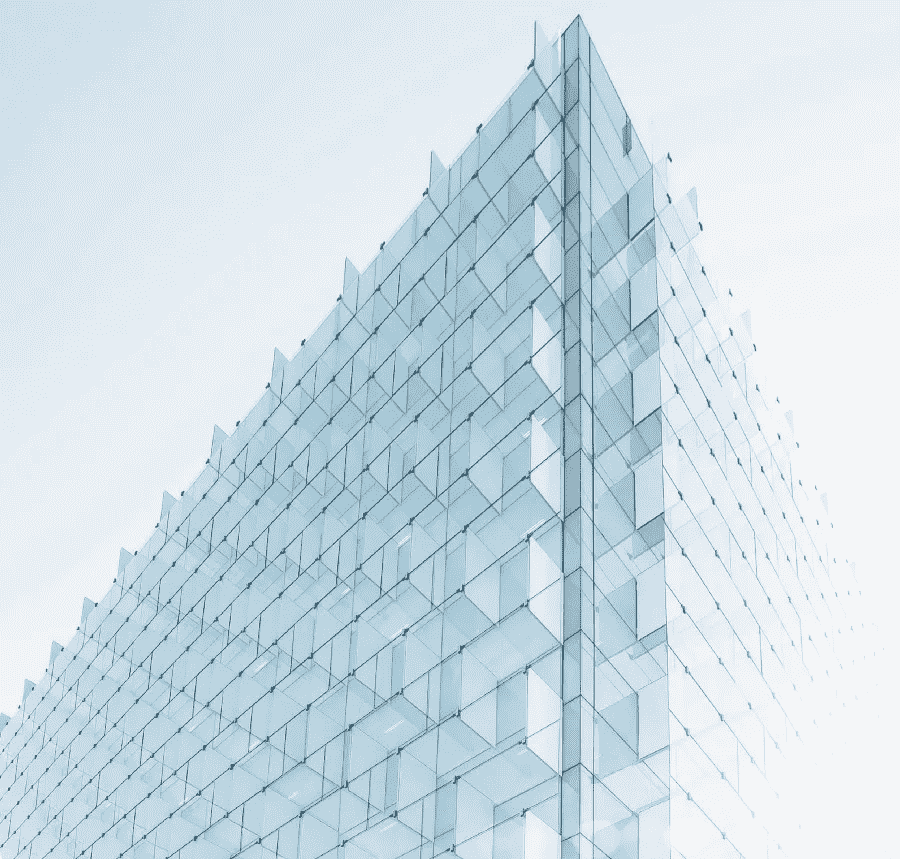
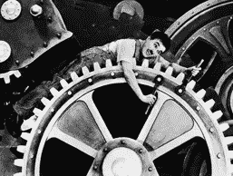

# 数据对于 21 世纪就像混凝土对于 20 世纪一样

> 原文：<https://towardsdatascience.com/data-is-to-the-21st-century-what-concrete-was-to-the-20th-6d6432120fbf?source=collection_archive---------29----------------------->

Photo by [Joel Filipe](https://unsplash.com/photos/jU9VAZDGMzs?utm_source=unsplash&utm_medium=referral&utm_content=creditCopyText) on [Unsplash](https://unsplash.com/search/photos/building?utm_source=unsplash&utm_medium=referral&utm_content=creditCopyText)

那些在 20 世纪建造大城市中心的人是在大量新技术的推动下做到这一点的。电力、汽车、混凝土和电梯都推动了新的生活方式，使城市和郊区与之前的城市和郊区有了根本的不同。

新的生活空间是围绕汽车的优势而建立的，它们伸向更高的天空，它们使人们能够通过电力将生活从传统的时钟中解放出来。这对人类心理产生了深远的影响——我们的文化发生了转变，我们的工作生活变得不同，我们的期望也发生了变化。随着新技术(喷气式飞机、计算机)继续驱动我们生活的物理布局，我们将自己塑造成新的世界，并不断变化。

在 21 世纪，我们已经可以看到，驱动技术集群(越来越快的电信网络、传感器、自动化、机器人和人工智能)正在创造新的数字世界结构，人类将按照这种结构塑造自己。我们现在选择花费时间的结构是由数据构建的。这包括痴迷的 Instagrammer 或在线游戏玩家，以及等待下一份零工经济工作的工人和通过虚拟现实会议系统合作的专业人士。

随着算法的进一步推出和数据聚合的大规模回归，我们将发现越来越多的生活被缓和、改变和影响，就像“软件吞噬世界”一样。曾经，企业通过闪亮的实体形象来定义自己——零售商店骄傲地站在大街上——现在，推动企业成功的是数据驱动的 UX 个性化。精心制作的反馈回路确保用户被温和地拉拢到最佳路径。优步的司机评级、Twitter 上的点赞和转发、Apple watch 上的健康数据，都是数据驱动的个性化反馈的例子，我们下意识地根据这些反馈塑造自己。

语言上的相似之处令人着迷。我们谈论建造建筑物的建筑师和工程师——现在用同样的词语来描述那些建造我们新的软件家园的人。

与此同时，流向位置良好的土地的巨大经济回报现在流向了战略数据集。开采水泥的艰难任务现在有了血汗工厂的数据标签。风险资本家和企业家捕捉金融想象力的方式曾经是房地产大亨可以做到的。

Charlie Chaplin being data processed

这对我们意味着什么？如果我们将要生活在一系列的算法中，那么我们将改变我们的生活来匹配它们。我们的祖先对汽车做了同样的事情——新交通工具的经济利益意味着社会让个人屈从于新的范式。乱穿马路成了一种犯罪。行人知道他们的位置。我们仍然接受每年数百万人死亡，因为这种交换似乎是值得的。

我们将为我们将要生活的新数据结构做同样的事情。总的来说，我们的生活会变得更好——就像 20 世纪是 19 世纪的进步一样(有一些明显的军事技术驱动的例外，也可能与我们即将到来的时代相似)。

但是我们将生活在数字建筑中。随着 AR 和 VR 的起飞，它们将变得越来越真实。重要的聚会将在我们曾经拥有会议室的虚拟现实中举行。娱乐将把我们拖入沉浸式的互动世界，有些人将挣扎着浮出水面。购物将在网上自动完成。

相比之下，我们周围的建筑会显得越来越单调、沉闷和空旷。直到，在某个阶段，本世纪中叶对“真实”的渴望将把这一切带回到焦点…