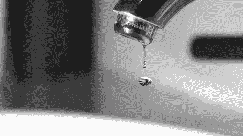

# 机器学习中的数据泄漏

> 原文：<https://towardsdatascience.com/data-leakage-in-machine-learning-10bdd3eec742?source=collection_archive---------10----------------------->

## 如何防止降低模型质量和/或导致不一致结果的问题

[https://media.giphy.com/media/EHcpe9guGONCU/giphy.gif](https://media.giphy.com/media/EHcpe9guGONCU/giphy.gif)

# 介绍

当训练机器学习模型时，我们通常会瞄准在某些指标上得分最高的模型，例如准确性。自然地，当我们训练一个在我们的验证或测试数据集上表现很好的模型时，我们选择它作为一个表现良好的模型，并生产/最终确定它。

但是，您是否遇到过这样的情况:一个模型在测试期间表现良好，但在实际使用中却无法达到相同的性能水平？例如，您的模型在测试期间是否达到了 99%的准确性，但是一旦它被生产出来并作用于真实数据，它就无法达到那个性能水平？

测试性能和真实性能之间的这种差异通常可以用一种叫做**数据泄漏**的现象来解释。

# 数据泄露

数据泄漏是指机器学习模型的创建者犯下的错误，其中他们意外地在测试和训练数据集之间共享信息。通常，当将数据集划分为测试集和训练集时，目标是确保两者之间没有数据共享。这是因为测试集的目的是模拟真实世界中看不见的数据。然而，当评估一个模型时，我们确实可以完全访问我们的训练集和测试集，所以由我们来确保训练集中没有数据出现在测试集中。

数据泄漏通常会导致测试集的性能达到不切实际的高水平，因为模型是基于它在训练集中已经看到的数据(在某种程度上)运行的。该模型有效地记忆训练集数据，并且能够容易地正确输出那些测试数据集示例的标签/值。显然，这并不理想，因为它误导了评估模型的人。当这种模型用于真正看不见的数据时，性能会比预期的低得多。

# 数据泄露的原因

现在我将提到一些数据泄漏的常见原因。在训练你自己的模型时，避免这些情况是很重要的。一般来说，您应该避免对您的训练集做任何涉及测试集知识的事情。

## 预处理

人们犯的一个很常见的错误是在机器学习的数据预处理步骤中泄露信息。重要的是，这些转换只知道训练集，即使它们也应用于测试集。例如，如果您决定将运行 PCA 作为预处理步骤，那么您应该只让 PCA 模型适合训练集。然后，要将它应用到您的测试集，您只需在测试集上调用它的`transform`方法(在 scikit-learn 模型的情况下)。相反，如果您在整个数据集上安装您的预处理器，您将从测试集中泄漏信息，因为预处理模型的参数将与测试集的知识相适应。

## 复制

另一个错误是数据重复，当您的数据集来自嘈杂的真实数据时，这种错误尤其常见。当数据集包含几个具有相同或接近相同数据的点时，会出现这种情况。例如，如果您的数据集包含消息平台上的用户消息，重复的消息可能对应于向许多用户发送相同消息的垃圾邮件发送者。在这种情况下，您可能会遇到数据泄漏，这仅仅是因为您的训练集和测试集可能包含相同的数据点，即使它们可能对应于不同的观察值。这可以通过在分割成训练集和测试集之前消除数据集的重复来解决。您可以通过删除完全重复的内容，或者使用模糊匹配方法(例如通过编辑文本数据的距离)来删除近似匹配的内容。

## 时态数据(隐式泄漏)

即使您没有明确地泄漏信息，如果您的测试和训练集之间存在依赖关系，您仍然可能会遇到数据泄漏。一个常见的例子是时间数据，即时间是一个相关因素的数据，如时序数据。考虑下面的玩具例子:你的训练集由两个数据点 **A** 和 **C** 组成，你的训练集由一个数据点 **B** 组成。现在，假设这些数据点的时间顺序是 **A** → **B** → **C** 。在这里，我们很可能通过创建训练集和测试集的方式造成了数据泄漏。通过在点 **C** 上的训练和在点 **B** 上的测试，我们创建了一个不切实际的情况，在这种情况下，我们根据相对于测试集时间点的未来知识来训练我们的模型。因此，我们已经泄露了信息，因为在现实世界的场景中，我们的模型显然不知道未来。为了解决这个问题，您应该确保您的测试序列分割也是跨时间分割的。因此，训练集中的所有内容都应该出现在测试集中的所有内容之前。这将创建一个更加真实的训练环境，并允许您正确地评估您的模型，就像它正在处理输入的真实世界数据一样。