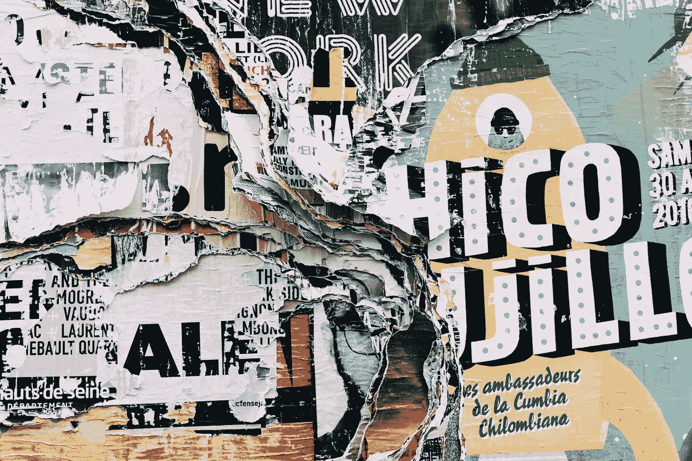
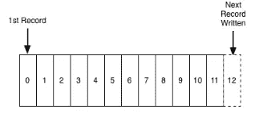
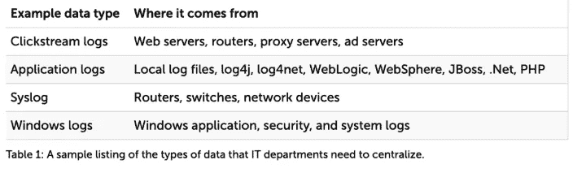
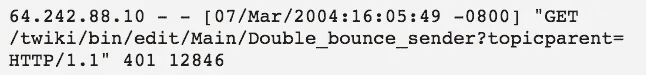

# 数据日志:数据的统一抽象

> 原文：<https://towardsdatascience.com/data-logs-datas-unifying-abstraction-1c38403a24c7?source=collection_archive---------28----------------------->

Photo by [Alice Donovan Rouse](https://unsplash.com/@alicekat?utm_source=unsplash&utm_medium=referral&utm_content=creditCopyText) on [Unsplash](https://unsplash.com/s/photos/art?utm_source=unsplash&utm_medium=referral&utm_content=creditCopyText)

日志是按时间排序的记录序列。它被配置为允许越来越多的记录被附加到末尾:

日志记录了所有的事情。计算环境中有各种各样的日志:

服务器日志很重要。他们跟踪访问互联网内容和应用的设备。

当您的设备访问一个网站时，托管该网站的服务器会从您的设备获取并保留一系列详细信息，包括设备访问了哪些资源(网页)、设备访问这些资源的时间以及访问这些资源的设备的 IP 地址。

这些日志的标准被称为“通用日志格式”，如下所示:

这可能看起来不多，但从这些日志中，您可以推断出访问资源的设备的配置文件，它如何浏览您的网站，将它们与特定的地理位置联系起来，等等。

这是一个名为“点击流数据”的用户跟踪日志集合。对于脸书、网飞和优步等面向消费者的技术公司而言，点击流日志是它们的命脉。早在 2010 年，脸书就在收集这些数据，并使用 Flume(Hadoop 的开源日志流解决方案)来收集这些数据，并将其传输到各种系统进行分析。每个公司都用日志做东西:优步、Airbnb、网飞，以及几乎每一个电子商务公司。

到目前为止，收集最多日志的组织会胜出，因为从表面上看，研究这些日志可以让他们了解用户在什么时候做了什么，并调整网站以允许用户做更多的事情。

> 完成更多购买。完成更多的 MOOC 课程。
> 将免费用户转化为付费用户。
> 想办法让更多的用户点击“喜欢”按钮。

然后，这些组织可以撰写漂亮的博客文章，介绍他们为收集这些日志而构建的所有数据工程平台，以及他们能够在这些平台上进行分析的数据科学。

真正的幕后赢家是参与处理日志数据的组织。例如，*杰伊的公司，*为 Kafka 提供支持，Kafka 是一种流处理解决方案，在过去五年左右的时间里真正起飞。但是还有数百家公司专门研究点击流处理工具链的每一个组成部分。围绕收集、存储和分析日志数据的需求，整个行业已经发展起来。看看今年的数据就知道了。

所有这些(日志收集、数据科学、工具货币化)对于收集日志的组织和构建工具来收集日志的公司来说都非常令人惊讶，直到最近发生了一些事情。

> 首先，剑桥分析公司丑闻——不知何故做了不可思议的事，至少改变了部分反对脸书的主流情绪。这意味着媒体最近报道了越来越多关于科技巨头的负面文章，这反过来又导致了立法者的负面抱怨。例如，就在两年前，看到任何人谈论拆分科技巨头都令人难以置信，更不用说作为总统平台的积极组成部分了。
> 
> 其次，GDPR 登陆了——在欧洲，这是一件大事。谷歌已经因为违反它被罚款了。较小的公司举步维艰。第三方广告和跟踪已关闭。

在美国，除了在人们的收件箱里乱丢通知之外，GDPR 并没有产生太大的影响。但是 CCPA 会。CCPA 是加利福尼亚州的隐私法，将于明年 1 月生效。

该法案是目前各州颁布的最强的隐私立法，在隐私数据方面给予消费者更多的权力。随着各种主要科技巨头总部设在加利福尼亚州，包括谷歌和脸书(这两家公司最近都遭受了数据泄露)， *AB 375* 准备对数据隐私产生深远的影响。 *AB 375* 将于 2020 年 1 月 1 日全面生效。

届时，在加州运营的公司基本上必须能够完全告知消费者他们在收集什么，并允许他们通过删除所有数据来选择退出。这意味着删除成千上万的日志，并弄清楚如何重新搭建日志收集系统的平台，以便能够删除数据。

CCPA 的天才之处在于，如果一个大型组织在加州运营，那么它很可能在其他各州也有运营。天哪，很难在州/辖区级别分离混合的日志数据，这意味着要么公司将迁移其总部，要么必须遵守 CCPA 对其所有数据的更严格的法规。

日志是个有趣的东西——一方面，它们非常有用。另一方面，因为它们被设计成指数级增长，永远不会减少，而且它们似乎无处不在，就像你无法摆脱的面包屑。跟踪、存储、清理、绑定到其他数据，以及同样重要的用于数据科学目的的采样，都是一个巨大的麻烦。

CCPA 本质上给这个日志存储和分析系统带来了压力。

在我看来，我们将要看到的结果是，收集更多的日志是不好的。保留的越多，要删除的就越多。你就越需要回馈给顾客。GDPR 揭露的这类违规行为的责任就越大。

公司和工程师仍然在谈论收集和分析日志的复杂方法，黑客新闻充满了围绕分布式流收集和分析系统的讨论。但是，主流媒体开始谈论一些其他的东西——日志收集如何在社交上影响我们，以及如何解散从事这种日志收集的科技公司。

日志还不是一种责任形式，但很快就会成为。正是这一点，比任何复杂的流架构都更值得公司认真思考。

这里的问题(从我作为一名付费数据科学家的角度来看)是——这对数据科学意味着什么？迄今为止，数据科学的迅猛发展一直基于解码日志以获取用户行为的艺术。这是否意味着数据科学以及支持它的工具生态系统正在消失？

我不这么认为，但我认为数据科学在未来五到十年的发展将与前十年有根本的不同。

如果数据科学的第一个十年是关于收集和分析一切，那么第二个十年将是关于如何对收集和分析的数据进行深思熟虑和有选择性的处理。*

我想在这里提两个思路作为起点。采样的艺术，以及删除和隐藏用户数据的艺术。

首先是抽样——早在 2000 年，Jakob Nielsen 就在一篇令人惊讶的、非常被低估的文章中谈到了为什么只需要五个用户来执行测试。乍一看，这似乎有些疯狂。你怎么可能推断出脸书的 10 亿用户，在地理、经济和种族上的多样性，会在网站上做什么呢？我不知道五个是否足够，但这篇文章背后的指导原则是，一旦用户超过一定数量，你收集的数据只是额外的噪音，这是正确的。真正的挑战将是如何收集足够的数据，使其在统计上有效，而不是多收集一个日志。

其次，删除和隐藏数据的能力将变得更加重要——我还没有看到任何关于如何正确配置系统以增量方式删除数据的讨论。但是这将变得非常重要，因为，如果你从不收集它，你就永远不能放弃这些数据。Snapchat 的想法是正确的，我(乐观地)期待更多短暂的数据收集工具出现。

我实际上看到更多的是围绕类似于**差分隐私**的讨论，或者在使用用户数据进行统计分析时隐藏用户数据的做法——在谷歌(谷歌在这方面有很大的既得利益)正在真正起飞。差分隐私本质上是将白噪声——虚假数据——添加到真实数据集中，直到真实数据在统计上仍然有效，但你无法从中推断出任何一个真实用户。

随着 CCPA 的到来和组织开始处理日志问题，请继续关注。