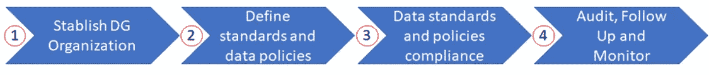
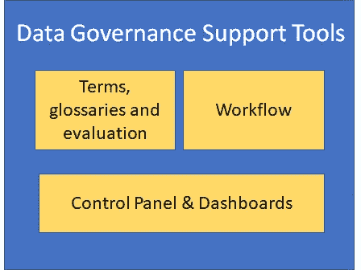
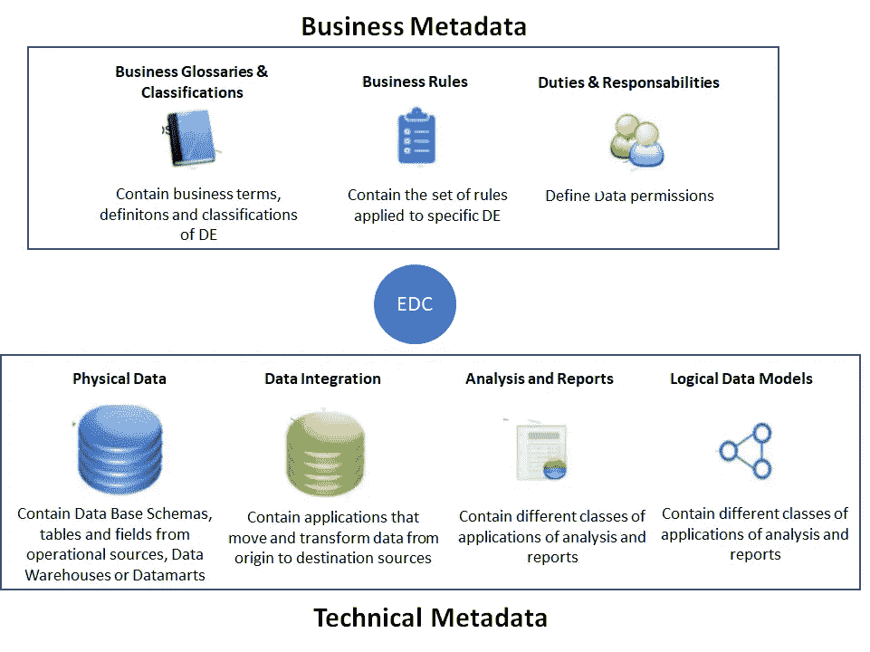
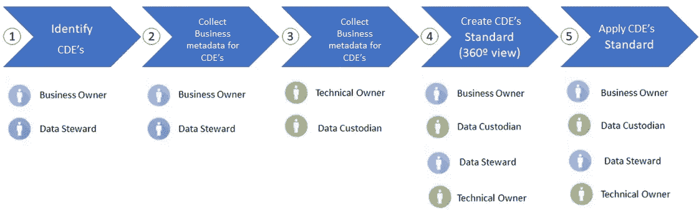
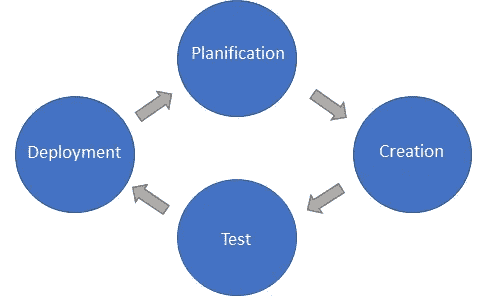
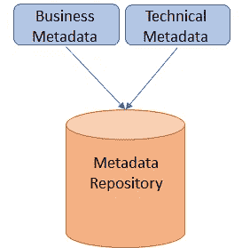

# 数据管理策略:第 1 部分

> 原文：<https://towardsdatascience.com/data-management-strategy-part-1-146c7e93fbbb?source=collection_archive---------5----------------------->

## 数据治理和元数据管理

Picture from [Unsplash](https://unsplash.com/photos/oyXis2kALVg)

# 介绍

这是一系列文章的第 1 部分，这些文章涉及在一个有抱负的数字组织中执行和实施成功的数据管理策略。

你可以在这里找到这个系列[的介绍。](/data-management-strategy-d3ce6db599c1)

在本文中，我们将关注以下主题:

*   数据治理
*   元数据管理

这些是每个数据管理计划的关键方面，我们将深入讨论每一个方面。具体来说，我们将从以下几个方面来探讨这些问题:

*   相关人员(组织)
*   流程(活动)
*   技术(技术解决方案在每个阶段必须具备的最低要求)

所以，事不宜迟，让我们投入进去吧！

# 数据治理

数据治理是数据管理策略中最基本的功能，因为它是其他功能的中心和领导者。

这里，我们应该区分两个经常被误解的概念:

*   数据治理负责*定义*数据管理策略
*   数据管理是*执行*既定策略

虽然数据治理是一个技术性较低的功能，但它可以利用元数据和建模工具的力量来定义数据管理的某些方面。这些工具将用于更好地理解将要使用的数据和数据流的整体架构。

根据 DAMA 的说法，数据治理指的是对组织内使用的数据的可用性、可用性、完整性和安全性的一般管理。

数据治理包括:

*   管理机构(理事会)
*   一套标准和政策
*   实施这些标准和政策的计划。

数据治理计划在整个组织中建立流程，以在系统和应用程序中提供标准，例如术语定义和一致的业务规则。

它确定参与需求定义的合适人员，并建立数据标准和数据使用的定义。

数据治理确保在整个组织中定义和应用相同的数据标准和策略。

## 数据管理的一般原则

为了确保整个企业符合定义的标准，必须建立一个数据治理组织。

数据治理的组织涉及多个级别的业务和技术角色的组合:

*   **发起人**:为数据治理工作提供领导和资金
*   **数据管理委员会**:鼓励控制和流程的采用和实施
*   **角色**:为数据
    标准建立角色并明确定义职责；明确定义并发布的标准和政策
*   **监督**:建立跟踪、审计和报告符合标准和政策的过程。
*   **变更控制**:建立评估、批准和沟通标准和政策变更的过程。
*   **高管支持**:确保高管参与并与数据治理计划保持一致。

# 数据治理流程

Figure by Author

## 1.数据治理组织的建立

*   确定数据治理计划的执行发起人
*   建立数据治理委员会
*   让数据治理计划的主要利益相关者(数据所有者、管理者、保管者、架构师)参与进来

## 2.定义标准和数据策略

*   定义数据标准
*   定义数据策略

## 3.数据标准和政策合规性

*   在整个组织中应用标准和数据策略

## 4.定义标准和数据策略

*   定期执行审计和控制操作
*   数据治理控制性能的监控和测量。

# 数据治理的技术工具

元数据支持和数据质量支持工具用于实现数据治理。市场上很少有被认为是特定的工具。

数据治理的一个重要功能是设计可用于实现数据标准和策略的工作流。

另一个重要功能是设计仪表板，用于监控和控制数据治理活动。

Figure by Author

# [计]元数据

元数据管理是成功的数据管理策略的另一个关键功能。在彻底讨论之前，让我们先介绍一下元数据的概念及其不同类型:

## 元数据基本概念:

根据[维基百科](https://en.wikipedia.org/wiki/Metadata)的定义，元数据是“提供关于其他数据的信息的数据信息”。换句话说，它是关于数据的数据，提供关于该数据的一个或多个方面的信息的数据。

元数据用于总结有助于跟踪和使用数据的基本信息。

作为一个例子，我们可以考虑一个数字图像。它的元数据可以是图像的大小、分辨率、存储位置、生成时间等等。

元数据概念中有两个基本组成部分:数据元素(DE)和关键数据元素(CDE)。

## 数据元素

数据元素(DE)是由一组属性组成的数据的原子单位:

*   定义
*   识别
*   表现
*   允许值

## 关键数据元素(CDE)

关键数据元素是对特定业务领域或业务流程的成功至关重要的数据元素。

**数据元素成为关键的标准是什么？**

*   业务数据对于组织的负责人来说至关重要。
*   关键业务流程数据及其组成部分，例如联系客户。
*   高级业务报告中使用的关键数据。
*   公司重要事物的唯一标识符，如客户 ID。

# 元数据管理

它涉及管理关于其他数据的数据，如数据模型和结构，而不是内容。它包括管理关于不同模型的数据结构及其关联的信息，例如:

*   词汇表中的商业术语
*   数据逻辑模型或数据库表和列中的属性，以及它们的关联

有业务和技术元数据，下图总结了它们的特征:

Picture by Author

## **业务元数据**

它们从业务使用的角度描述数据元素，包括诸如带有术语和定义、同义词、首字母缩写词、业务规则和职责的业务术语表等信息。我们所说的业务元数据是指:

*   商业术语表和分类
*   商业规则
*   责任

**元数据管理中的角色**

有几个角色参与其中:

*   **业务所有者**:最终负责数据的定义、质量和数据价值。他们负责确认数据的使用符合一般数据策略。(数据治理)。他们还负责驱动活动和
    数据管理流程。
*   **数据管理员**:或 Data Stewart 负责数据的运营监控、与整个组织内各领域专家的互动，以及确定标准化、测量和监控数据质量的
    方法。它负责确认已经定义了数据标准。并且已经实施了流程和实践
*   **技术负责人**:是技术专家，最终负责确保来自系统的数据按照定义的数据标准进行管理和使用。包括遵守商业规则、政策和程序。
*   **数据保管人:**是负责系统中数据安全管理的技术专家。它负责确认定义的数据标准得到应用。

## **技术元数据**

它们从技术角度描述数据元素，包括逻辑数据模型、源和目标系统、表和字段结构以及系统依赖关系等信息。

操作元数据告知应用程序的轴心:频率、记录帐户、分析的组件和用于审计目的的其他统计数据。

## CDE 标准报

技术和业务元数据代表 CDE 标准，这意味着关键数据元素从技术和业务角度得到了充分描述。

CDE 标准也被称为 CDE 的 360 度视角。通过获得 CDE 的 360°视图，为整个组织的数据管理提供了最佳条件，这是数据管理的最终目标。

一旦做到这一点，就有可能回答如下问题:

*   CDE 的定义是什么？
*   谁拥有 CDE 的生意？
*   CDE 存放在哪里？
*   在哪些报告中使用了 CDE？
*   CDE 的最终来源是什么系统？

## 元数据管理流程

Figure by Author

元数据流程活动涵盖了 DM 中现有人员、流程和技术视角内的流程视角。

**1。——辨认 CDE 的**

它包括通过与利益相关者的访谈来分析业务需求和确定最相关的 CDE 的活动。

**2。-收集 CDE**的业务元数据

对于相关的 CDE 定义业务术语，同义词、首字母缩写词、定义和分类法也定义了业务规则，并负责任地确定这些规则。

**3。-收集 CDE**的技术元数据

对于相关的 CDE，确定数据系统中的 CDE 表示，确定数据源和数据谱系。

**4。-创建 CDE 标准(360°视角)**

为了让 CDE 创建业务和技术元数据之间的关联，验证 CDE 数据标准。

**5。-应用 CDE 标准**

确保符合 CDE 标准，以确保管理每个 CDE 并由定义的标准(数据治理)使用。

## 系统开发的生命周期

指计划、创建、测试和部署信息的过程。

重要的是，来自系统开发生命周期的元数据必须得到定义，并成为元数据功能流程的一部分。

Figure by Author

## 元数据的技术工具

最低技术要求是:

*   建立和部署集中式元数据存储库的能力。
*   能够通过词汇表的层次结构定义一致的术语、有效定义、有效值和数据域。
*   能够通过数据建模工具、商业智能工具和 ETL 从最流行的数据库管理系统(Oracle、SQLServer、NoSQL)中提取元数据。
*   能够管理来自多个来源和技术的元数据版本。

Figure by Author

# 结论

这是数据管理策略系列的第 1 部分，在下一篇文章中，我们将讨论数据质量和数据架构的功能。

如果到目前为止你已经喜欢这个系列，不要错过这里的[介绍](/data-management-strategy-d3ce6db599c1)并且不要忘记留下掌声，所以这将激励我继续制作内容并且它将到达更多的人:)

*如果你喜欢这个帖子，你可以看看我关于数据科学和机器学习的其他帖子* [*这里*](https://medium.com/@rromanss23) *。*

*如果你想了解更多关于机器学习、数据科学和人工智能的知识* ***请在 Medium*** *上关注我，敬请关注我的下一篇帖子！*