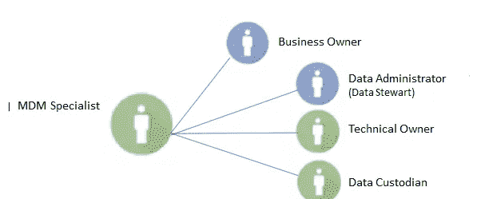

# 数据管理策略:第 3 部分

> 原文：<https://towardsdatascience.com/data-management-strategy-part-3-f1ba544be2dc?source=collection_archive---------13----------------------->

## 数据集成、安全性和主数据

Picture from [Unsplash](https://unsplash.com/photos/mcSDtbWXUZU)

# 介绍

这是一系列文章的第 3 部分，这些文章涉及在一个有抱负的数字组织中执行和实施成功的数据管理策略。

你可以在这里找到这个系列[的介绍。](/data-management-strategy-d3ce6db599c1)

在本文中，我们将关注以下主题:

*   数据集成
*   数据安全
*   主数据

这些是每个数据管理计划的关键方面，我们将深入讨论每一个方面。具体来说，我们将从以下几个方面来探讨这些问题:

*   相关人员(组织)
*   流程(活动)
*   技术(技术解决方案在每个阶段必须具备的最低要求)

所以，没有进一步的行动，让我们投入进去吧！

# 数据集成

数据集成是指将数据从源数据系统转移到目标数据系统的过程和技术。在这个过程中，数据被转换成信息以满足业务需求。

这些数据必须可以在需要时从任何来源获得，并具有所需的功能。

## 数据集成场景— ETL

ETL(提取、转换和加载)指的是数据集成方法，其中数据从源系统中提取，然后经过转换过程，最后加载到目标系统中。

典型的 ETL 场景通常用在数据仓库系统中。

Figure by Author

## 数据集成场景— ELT

EL-T(提取、加载和转换)指的是数据集成方法，其中数据从源系统中提取，然后不经转换就加载到目标系统中。数据转换稍后在目标系统中执行。ELT 场景是大数据/Hadoop 系统的典型场景。

**传统 ETL 架构**

*   性能下降
*   成本更高
*   转换硬件

Figure by Author

**ODI — ELT 架构**

*   更好的性能
*   单负载
*   没有额外的硬件成本

## 数据集成中的批处理与实时

## 一批

*   在批处理中，在一次执行中收集一大组事务并处理数据。
*   由于数据量很大，所以必须在资源不太忙的时候执行这个过程(这个步骤通常在晚上进行)。
*   批处理会延迟对数据的访问，需要密切监控，并且数据可能在一段时间内不可用。
*   由于数据访问的延迟，在处理完成之前，知识会丢失。
*   批处理过程中出现的问题会延迟整个过程，因此您需要人员支持来监控它的运行。

## 实时

*   实时处理按需处理小组事务。
*   实时处理的优势在于，它可以用更少的资源提供对数据运行的即时访问，并提高正常运行时间。
*   借助实时数据集成，您可以在交易发生时了解自己的业务。
*   如果出现错误，可以立即处理。
*   实时处理设计更加复杂。
*   虽然实时处理系统需要更多的努力来设计和实现，但对企业的好处是巨大的。

## 数据集成角色

数据集成专家主要负责执行与数据集成相关的活动。他们将与业务负责人、数据经理、技术负责人、数据保管人、MDM 专家和数据架构师密切合作。

他的主要职责涉及数据集成应用程序的设计和实现，包括映射规范的定义、数据集成作业的设计和实现…

Figure by Author

# 数据集成工具

对每个数据集成技术工具的最低要求是:

*   能够执行批处理和实时处理。
*   能够执行数据更改检测(识别修改的记录)。
*   能够执行结构化和非结构化数据的强大转换。
*   整体错误处理操作的能力。

Figure by Author

# 主数据和参考数据

## 主数据

主数据指的是在整个组织内符合和共享的数据。例如:客户数据、员工、产品…

## 参考数据

参考数据是主数据的子集，指的是定义其他数据字段可以使用的一组允许值的数据。例如:国家代码、工业活动分类…

这些数据的功能保证了这些数据的集中管理，这些数据由不同的部门共享。

## 主数据管理

每个成功的主数据管理都有 3 个关键步骤:

1.  识别可能匹配的记录
2.  主数据管理应用业务规则来组合和合并记录
3.  主数据管理人员创建具有可信属性的主记录

## 参考数据管理

每个成功的主数据管理都有 3 个关键步骤:

1.  参考数据管理确定要搜索的记录
2.  参考数据管理为搜索提供参考表
3.  参考数据管理根据业务标准更新记录

区分主数据和参考数据的标准是:

Table by Author

## 主数据和参考数据管理角色

主数据管理(MDM)专家是负责执行与主数据和参考数据管理相关的活动的主要角色。尽管这是一个特定于主数据和参考数据管理的角色，但主数据管理专家与业务所有者、数据管理员、技术所有者和数据保管者密切合作。

MDM 专家的主要职责与 MDM 产品的设计和实现相关(例如，定义 MDM 中的属性、创建 MDM 映射文档等)。

Figure by Author

## 主数据和参考工具

每个主数据和参考工具必须具备的最低要求是:

*   支持多个领域，如客户、产品、位置和帐户。
*   有效管理领域之间的关系，例如从客户到产品。
*   主数据实体的分类、分组和层次结构。
*   识别重复数据及其级联消除的强大算法。
*   能够根据组织要求轻松配置关键数据元素以识别数据匹配。
*   通过创建单个数据记录或黄金记录，能够配置业务规则以使信息尽可能保持最新。

Figure by Author

# 数据安全

数据安全(数据保护或数据隐私)，是指保护机密信息免受内部和外部未经授权的访问所必需的流程、政策和技术。

机密信息的示例:医疗保健号、出生日期、种族、信用卡号、销售计划…

**数据治理**指的是如何构建内容的规则。

**数据安全**指的是如何保护和使用内容的规则。

## 敏感信息与非敏感信息

**非敏感信息**

*   公共信息:已经在公共领域的信息(例如，性犯罪者登记和选民登记档案)。
*   常规业务信息:不受任何特殊保护的业务信息，通常可以与公司内外的任何人共享。

**敏感信息**

*   个人和私人信息:指属于私人的信息，但此人可能出于个人或业务原因选择与他人共享(例如，ss 号码)。
*   商业机密信息:披露后可能影响公司的信息(销售和营销计划)。
*   机密信息:通常是指许多国家政府强制实施的特殊安全法规中的机密信息。

## 数据安全流程

每个成功的数据安全流程的四个建议步骤是:

1.  **定义数据安全政策**
    确定与数据隐私相关的要求，定义数据保护政策，定义数据安全实施指南。

**2。提供技术支持**
实施适当的技术工具以支持数据保护政策的实施

**3。实施数据安全政策**
并对人员进行适当培训

**4。监督和控制数据安全策略的应用**
确保数据保护策略中定义的标准适用于整个组织

## 数据安全角色

It 是负责实施数据保护策略的关键角色。虽然这一职能专门针对数据安全，但数据隐私官将与所有其他数据管理职能密切合作。

主要职责包括:

*   制定和实施数据安全政策
*   就所有个人数据的处理提供信息和指导。
*   为员工制定“最佳实践”指南。
*   向员工提供培训
*   处理、协调和回应所有信息请求

Figure by Author

## 数据安全的技术工具

**电子邮件保护**

*   入站邮件过滤
*   自动过滤和删除垃圾邮件
*   B2B 通信的附件和加密分析

**杀毒**

*   为员工提供互联网接入
*   可在网络中的所有计算机上执行

**防火墙**

*   提高组织中计算机网络安全性的硬件系统

**加密 Wi-Fi**

*   如果公司中有 Wi-Fi 网络配置，则必须对网络进行加密，只有授权人员才能使用访问代码进行访问。

**云中的数据存储**

*   在云端保存和处理文档
*   启用云安全工具，让多个用户能够更轻松地从移动设备或远程位置访问文档和文件。

**安全网络访问**

*   保护和访问组织中的互联网
*   保护服务器和系统免受黑客攻击非常重要。

# 结论

这是关于如何在组织中实施成功的数据管理策略的最后一篇文章。如果你喜欢这篇文章，不要错过这里的介绍。

*如果你喜欢这篇文章，那么你可以看看我关于数据科学和机器学习的其他文章* [*这里*](https://medium.com/@rromanss23) *。*

*如果你想了解更多关于机器学习、数据科学和人工智能的知识* ***请关注我的 Medium*** *，敬请关注我的下一篇帖子！*