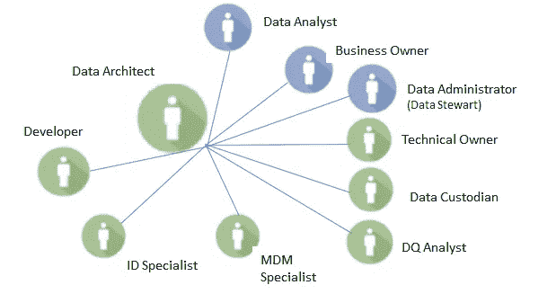

# 数据管理策略:第 2 部分

> 原文：<https://towardsdatascience.com/data-mangement-strategy-part-2-fe23192a0eca?source=collection_archive---------18----------------------->

## 数据质量和架构

Picture from [Unsplash](https://unsplash.com/photos/LqKhnDzSF-8)

# 介绍

这是与在一个有抱负的数字组织中实施和实现成功的数据管理策略相关的系列文章的第 2 部分。

你可以在这里找到这个系列[的介绍。](/data-management-strategy-d3ce6db599c1)

在本文中，我们将关注以下主题:

*   数据质量
*   数据架构
*   数据集成

这些是每个数据管理计划的关键方面，我们将深入讨论每一个方面。具体来说，我们将从以下几个方面来探讨这些问题:

*   相关人员(组织)
*   流程(活动)
*   技术(技术解决方案在每个阶段必须具备的最低要求)

所以，没有进一步的行动，让我们投入进去吧！

# 数据质量

实现数据质量不是一件容易的事情，特别是当数据来自多个来源、采用不同的技术格式和处于非常不同的环境中时。这是当前大多数组织的现实。

在我们需要的地方、时间和方式拥有它们通常是一个挑战。此外，数据通常是“脏的”:充满错误、遗漏或干扰。这些错误可能意味着信息和电信项目以及公司数据开发的失败。

不幸的是，这个数据层是一个经常被忽视或忽略的关键组件。确保组织中数据的质量、完整性和准确性应该是任何数据管理战略的主要目标之一，因为这是实现战略目标的一个关键因素。

糟糕的数据质量会带来实实在在的经济影响。数据的提取、转换和加载过程(ETL)可能会占用数据项目开发时间的 80%。此外，拥有不能准确代表现实的数据，意味着基于这些数据开发的任何应用程序实际上都是无用的。

出于所有这些原因，理解数据策略这一方面的至关重要性至关重要。你的数据质量就是你从中获得的一切的质量。

## 数据质量管理

数据质量管理指的是组织使用的方法、政策和流程，以确保公司内系统和数据流中数据的以下一些关键属性。

应对每个关键数据元素或 CDE 提出以下问题，以满足数据质量要求:

*   准确吗？→准确性
*   是否有效？→有效性
*   是最新的吗？→当前
*   完成了吗？→完整性
*   是独一无二的吗？→单一性
*   符合吗？→一致性

并非所有数据质量维度都适用于所有关键数据元素或 CDE(例如，出生日期将定义有效性和完整性维度的数据质量)。

## 数据质量维度

为了深入探索前面的数据维度，我们应该更全面地定义它们。

数据质量维度指的是可以评估并用于衡量数据质量的数据方面或属性。有 6 个关键维度:

**精度**

这意味着数据准确地代表了真实世界。例如:拼写错误。

**有效期**

这意味着数据符合其定义的辛塔克斯(格式、类型和范围)。例如:不正确的客户性别和类型值。

**电流**

从时间的角度来看，数据代表现实。它们是最新的可用信息。例如:7 月 1 日发生的客户地址变更，并在 7 月 15 日引入系统。

**完整性**

这意味着就业务重要性而言，数据是完整的。例如:缺少邮政编码的客户地址。

**单一性**

数据被正确识别并只登记一次。例如:唯一的客户用不同的 id 在数据库中注册了两次。

**一致性**

数据在整个数据集中以相同的方式表示。例如:删除客户的帐号，但有一个采购订单与该帐户相关联。

## 数据质量规则

它们是业务规则，目标是确保数据维度在准确性、有效性、完整性、唯一性和一致性方面的合规性。

让我们看一个客户的 CDE 出生日期的例子:

Figure by Author

## 数据质量过程

Figure by Author

**定义 DQ 要求**

*   执行数据分析以帮助发现数据频率和格式。
*   可以使用专门的工具或查询语言对数据源(SQL)进行数据分析。
*   数据质量问题可能在分析过程中被发现，但是分析的目的是发现用于数据质量评估的信息。

**DQ 评价**

*   为准确性、有效性、完整性等定义数据质量规则。以及质量阈值。
*   通过遵守现有数据集中的数据质量规则来执行数据质量评估。
*   识别数据质量问题并更新问题记录。

**DQ 问题求解**

*   对于在数据质量评估期间发现的问题，执行根本原因分析(RCA)以确定问题的根本原因。
*   通过消除问题的根本原因来解决问题。
*   如有必要，审查数据策略和程序。

**DQ 监控**

定义和开发数据质量 KPI 仪表板，以执行数据的跟踪和监控。

## 数据质量的主要角色

数据质量分析师代表数据质量的关键角色，负责执行与数据质量流程相关的活动。

虽然它是唯一的特定数据质量角色，但它将与业务所有者、数据管理者、技术所有者和数据保管者密切合作。

除其他外，其职能包括定义数据质量规则、分析结果、分析、评价、调查数据质量问题的原因等。

Figure by Author

## 确保数据质量的技术工具

最低要求是:

*   能够执行数据分析，包括数据集的统计分析。
*   能够为关键数据的质量控制定义和执行数据质量规则。
*   存储数据质量评估和结果的能力。
*   执行解决和发现问题过程的能力。
*   能够创建和可视化数据质量记分卡。

Figure by Author

# 数据架构

数据架构指的是模型、策略、规则或标准，这些模型、策略、规则或标准控制着收集什么数据，如何在组织的系统中存储、组织和使用这些数据。它涵盖了每个功能如何适应整体数据管理框架。

Figure by Author

## 数据架构角色

数据架构师主要负责设计数据架构。尽管这个角色特定于数据架构，但是数据架构师将与所有其他数据管理角色密切合作。

这个角色的主要职责包括跨数据架构层设计和优化数据架构。

数据架构师还提出支持企业架构和数据管理功能所需的技术。

Figure by Author

# 结论

这就是数据管理策略系列的第 2 部分。我们将在下一篇文章中继续探索更多关于数据架构和主要数据集成工具的内容。

如果你已经喜欢这个系列，不要错过这里的介绍。

*如果你喜欢这篇帖子，那么你可以看看我在数据科学和机器学习方面的其他帖子***。**

**如果你想了解更多关于机器学习、数据科学和人工智能的知识* ***在 Medium 上关注我*** *，敬请关注我的下一篇帖子！**