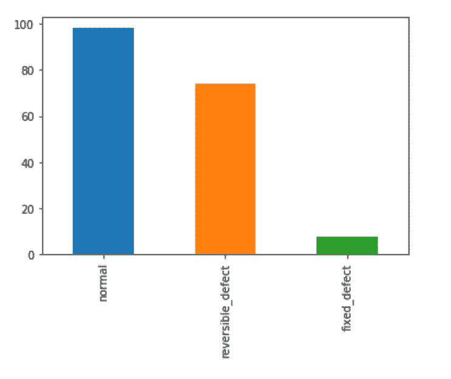
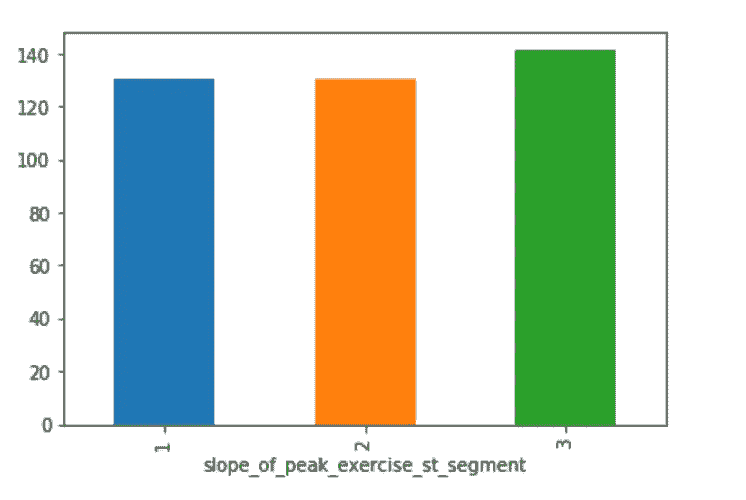
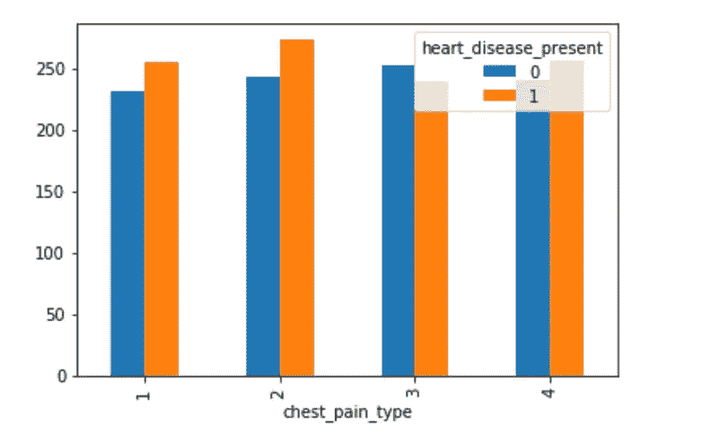
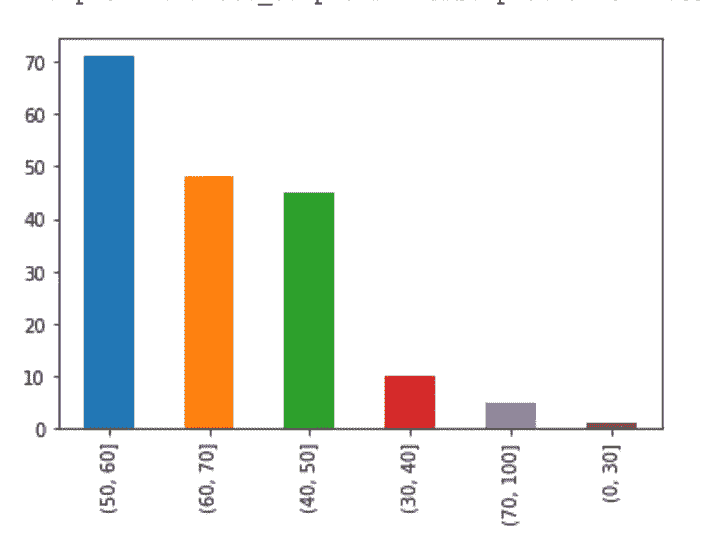

# 熊猫机器学习的数据处理

> 原文：<https://towardsdatascience.com/data-manipulation-for-machine-learning-with-pandas-ab23e79ba5de?source=collection_archive---------7----------------------->

## 熊猫提供的用于机器学习项目的一些数据工具的介绍


Photo by [Michael Fenton](https://unsplash.com/photos/0ZQ8vojHNuc?utm_source=unsplash&utm_medium=referral&utm_content=creditCopyText) on [Unsplash](https://unsplash.com/search/photos/heart?utm_source=unsplash&utm_medium=referral&utm_content=creditCopyText)

python 熊猫库是一个开源项目，提供了各种易于使用的数据操作和分析工具。在实际建立任何模型之前，任何机器学习项目都必须花费大量时间来准备数据，分析基本趋势和模式。在接下来的文章中，我想简单介绍一下 pandas 中的各种工具，这些工具用于在开始建模之前处理、清理、转换和分析数据。

在整篇文章中，我将使用来自 drivendata.org 的数据集[这里](https://www.drivendata.org/competitions/54/machine-learning-with-a-heart/data/)。这也可以从克利夫兰心脏病数据库下载。训练数据包括两个单独的 csv 文件，一个包含关于许多患者的特征，第二个包含二进制标签“heart_disease_present ”,其表示患者是否患有心脏病。

## 导入数据

Pandas 提供了从各种来源读取数据的工具。因为我使用的数据集是一个 csv 文件，所以我将使用 read_csv 函数。这个函数有大量的[选项](https://pandas.pydata.org/pandas-docs/stable/reference/api/pandas.read_csv.html#pandas.read_csv)用于解析数据。对于大多数文件来说，默认选项很好——这里就是这种情况。

```
import pandas as pdtrain_values = pd.read_csv('train_values.csv')
train_labels = pd.read_csv('train_labels.csv')
```

为了分析数据，我需要将 train_values 和 train_labels 合并到一个数据帧中。Pandas 提供了一个合并功能，可以连接列或索引上的数据帧。在下面的代码中，我使用 patient_id 执行内部合并，将正确的值与正确的标签连接起来。

```
train = pd.merge(train_values, train_labels, left_on='patient_id', right_on='patient_id', how='inner')
```

## 缺失数据

Pandas 提供了许多处理缺失数据的功能。首先，我们可以使用`isna()`函数来了解我们的数据中有多少缺失值。

它的基本功能是查看每一行和每一列中的每一个值，如果缺少就返回`True`，如果没有就返回`false`。因此，我们可以编写一个函数，返回每一列中缺失值的分数。

```
train.apply(lambda x: sum(x.isna()/len(train)))
```

在该数据集中，实际上不存在任何缺失值。但是，如果有，我们可以使用`DataFrame.fillna()`替换为另一个值，或者使用`DataFrame.dropna()`删除包含缺失值的行。

使用`fillna()`时，你有很多选择。您可以用静态值替换，该值可以是字符串或数字。您也可以用平均值之类的计算来替换。根据数据类型和丢失值的数量，很可能必须对不同的列使用不同的策略。在下面的代码中，我演示了如何使用其他一些方便的熊猫函数，`select_dtypes`和`DataFrame.columns`，只用平均值填充数值。

```
train[train.select_dtypes(include=['int64', 'float64']).columns] = train[train.select_dtypes(include=['int64', 'float64']).columns].apply(lambda x:x.fillna(x.mean()))
```

## 可视化数据

在熊猫身上绘图并不特别，但是如果你想从数据中快速识别一些趋势，这通常是最有效的方法。

基本的绘图功能只是在系列或数据帧上调用`plt.plot()`。pandas 中的绘图引用了 matplotlib API，因此您需要首先导入 matplotlib 来访问它。该功能支持许多不同的可视化类型，包括线形图、条形图、直方图、箱线图和散点图。pandas 中的绘图功能真正有用的地方是当您将它与其他数据聚合功能结合使用时。下面我举几个例子。

将`value_counts()`与柱状图选项结合使用，可快速显示分类特征。在下面的代码中，我用这种方法查看了 thal(流向心脏的血液量)的分布。

```
import matplotlib.pyplot as plt
% matplotlib inlinetrain['thal'].value_counts().plot.bar()
```



使用 groupby 函数，我们可以通过峰值运动 st 段斜率来绘制平均静息血压。

```
train.groupby("slope_of_peak_exercise_st_segment")['resting_blood_pressure'].mean().plot(kind='bar')
```



Pandas 数据透视表也可以用来提供聚合数据的可视化。在这里，我比较了胸痛类型的平均血清胆固醇毫克每分升，以及与心脏病的关系。

```
import numpy as nppd.pivot_table(train, index='chest_pain_type', columns= 'heart_disease_present', values= "serum_cholesterol_mg_per_dl", aggfunc=np.mean).plot(kind= 'bar')
```



## 特征转换

Pandas 还有许多功能，可用于您可能需要进行的大多数功能转换。

例如，最常用的机器学习库要求数据是数值型的。因此，有必要转换任何非数字特征，一般来说，最好的方法是使用热编码。熊猫对此有一种方法叫做`get_dummies`。该函数在应用于一列数据时，会将每个唯一值转换为一个新的二进制列。

```
train = train.drop('patient_id', axis=1)
train = pd.get_dummies(train, columns=train.select_dtypes('object').columns)
```

可能需要为机器学习转换特征的另一种方式是宁滨。这个数据集中的一个例子是年龄特征。将年龄分组到模型要学习的范围(或箱)中可能更有意义。熊猫还有一个功能`pd.cut`可以用来做这个。

```
bins = [0, 30, 40, 50, 60, 70, 100]
train['age_group'] = pd.cut(train['age'], bins)
train['age_group'].value_counts().plot(kind='bar')
```



这只是对 pandas 中用于机器学习项目早期阶段的一些功能的介绍。数据操作和分析以及熊猫图书馆本身还有很多方面。这通常是一个非常耗时的阶段，我发现 pandas 提供了各种各样的功能和工具，可以帮助提高这个过程的效率。