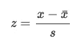

# R 中的数据操作

> 原文：<https://towardsdatascience.com/data-manipulation-in-r-5540ed13ac5f?source=collection_archive---------21----------------------->

## 查看 R 中操作数据的主要函数，例如如何对数据框进行子集化、创建新变量、记录分类变量和重命名变量


Photo by [Campaign Creators](https://unsplash.com/@campaign_creators?utm_source=medium&utm_medium=referral)

# 介绍

并非所有数据框都像您预期的那样整洁。因此，在[将数据集导入 RStudio](https://statsandr.com/blog/how-to-import-an-excel-file-in-rstudio/) 后，大多数情况下，您需要在执行任何统计分析之前准备好数据集。当数据质量很差时，数据处理有时甚至会比实际分析花费更长的时间。

数据操作包括广泛的工具和技术。我们在这里详细介绍了您在 r 中的项目最有可能需要的操作。如果您发现其他数据操作很重要，以便我可以添加它们，请不要犹豫让我知道(例如作为本文结尾的评论)。

在本文中，我们展示了在 r 中操作数据的主要函数。我们首先在向量、[因子](https://statsandr.com/blog/data-types-in-r/#factor)和列表上说明这些函数。然后我们举例说明在 r 中操作数据帧和日期/时间的主要函数。

# 向量

# 串联

我们可以用`c()`连接(即组合)数字或字符串:

```
c(2, 4, -1)## [1]  2  4 -1c(1, 5 / 6, 2^3, -0.05)## [1]  1.0000000  0.8333333  8.0000000 -0.0500000
```

请注意，默认情况下，R 显示 7 位小数。可以用`options(digits = 2)`(两位小数)修改。

也可以创建一系列连续的[整数](https://statsandr.com/blog/data-types-in-r/#integer):

```
1:10##  [1]  1  2  3  4  5  6  7  8  9 10# is the same than
c(1, 2, 3, 4, 5, 6, 7, 8, 9, 10)##  [1]  1  2  3  4  5  6  7  8  9 10# or
c(1:10)##  [1]  1  2  3  4  5  6  7  8  9 10
```

# `seq()`和`rep()`

`seq()`允许制作一个由序列定义的向量。您可以选择增量:

```
seq(from = 2, to = 5, by = 0.5)## [1] 2.0 2.5 3.0 3.5 4.0 4.5 5.0
```

或者它的长度:

```
seq(from = 2, to = 5, length.out = 7)## [1] 2.0 2.5 3.0 3.5 4.0 4.5 5.0
```

另一方面，`rep()`创建一个向量，它是数字或字符串的重复:

```
rep(1, times = 3)## [1] 1 1 1rep(c("A", "B", "C"), times = c(3, 1, 2))## [1] "A" "A" "A" "B" "C" "C"
```

您也可以创建一个数字和字符串重复的向量:

```
rep(c("A", 2, "C"), times = c(3, 1, 2))## [1] "A" "A" "A" "2" "C" "C"
```

但是在这种情况下，数字 2 也将被视为一个字符串(而不是一个[数字](https://statsandr.com/blog/data-types-in-r/#numeric)),因为向量中至少有一个字符串。

# 分配

在 R 中有三种分配对象的方法:

1.  `<-`
2.  `=`
3.  `assign()`

```
# 1st method
x <- c(2.1, 5, -4, 1, 5)
x## [1]  2.1  5.0 -4.0  1.0  5.0# 2nd method
x2 <- c(2.1, 5, -4, 1, 5)
x2## [1]  2.1  5.0 -4.0  1.0  5.0# 3rd method (less common)
assign("x3", c(2.1, 5, -4, 1, 5))
x3## [1]  2.1  5.0 -4.0  1.0  5.0
```

也可以将一个向量指定给另一个向量，例如:

```
y <- c(x, 10, 1 / 4)
y## [1]  2.10  5.00 -4.00  1.00  5.00 10.00  0.25
```

# 向量的元素

我们可以通过在方括号中指定向量的位置来选择向量的一个或多个元素:

```
# select one element
x[3]## [1] -4# select more than one element with c()
x[c(1, 3, 4)]## [1]  2.1 -4.0  1.0
```

注意，在 R 中，索引的编号从 1 开始(不像其他编程语言那样从 0 开始)，所以`x[1]`给出了向量`x`的第一个元素。

我们也可以使用[布尔值](https://statsandr.com/blog/data-types-in-r/#logical)(即`TRUE`或`FALSE`)来选择向量的一些元素。该方法仅选择与`TRUE`相对应的元素:

```
x[c(TRUE, FALSE, TRUE, TRUE, FALSE)]## [1]  2.1 -4.0  1.0
```

或者我们可以把元素撤回来:

```
x[-c(2, 4)]## [1]  2.1 -4.0  5.0
```

# 类型和长度

向量的主要类型有[数字](https://statsandr.com/blog/data-types-in-r/#numeric)、[逻辑](https://statsandr.com/blog/data-types-in-r/#logical)和[字符](https://statsandr.com/blog/data-types-in-r/#character)。关于每种类型的更多细节，参见 R 中不同的[数据类型。](https://statsandr.com/blog/data-types-in-r/)

`class()`给出矢量类型:

```
x <- c(2.1, 5, -4, 1, 5, 0)
class(x)## [1] "numeric"y <- c(x, "Hello")
class(y)## [1] "character"
```

正如您在上面看到的，只有当 vector 的所有元素都是数字时，它的类才会是数字。只要一个元素是一个字符，向量的类就是一个字符。

```
z <- c(TRUE, FALSE, FALSE)
class(z)## [1] "logical"
```

`length()`给出一个向量的长度:

```
length(x)## [1] 6
```

所以要选择一个向量的最后一个元素(以动态的方式)，我们可以使用`length()`和`[]`的组合:

```
x[length(x)]## [1] 0
```

# 寻找向量类型

我们可以用`is.type`函数族找到向量的类型:

```
is.numeric(x)## [1] TRUEis.logical(x)## [1] FALSEis.character(x)## [1] FALSE
```

或者用更通用的方式使用`is()`功能:

```
is(x)## [1] "numeric" "vector"
```

# 类型和长度的修改

我们可以用`as.numeric()`、`as.logical()`和`as.character()`功能改变矢量的类型:

```
x_character <- as.character(x)
x_character## [1] "2.1" "5"   "-4"  "1"   "5"   "0"is.character(x_character)## [1] TRUEx_logical <- as.logical(x)
x_logical## [1]  TRUE  TRUE  TRUE  TRUE  TRUE FALSEis.logical(x_logical)## [1] TRUE
```

也可以改变它的长度:

```
length(x) <- 4
x## [1]  2.1  5.0 -4.0  1.0
```

如你所见，向量的第一个元素是守恒的，而所有其他元素都被移除了。在本例中，第一个 4 是因为我们指定了长度 4。

# 数值运算符

基本数值运算符如`+`、`-`、`*`、`/`和`^`可以应用于向量:

```
x <- c(2.1, 5, -4, 1)
y <- c(0, -7, 1, 1 / 4)x + y## [1]  2.10 -2.00 -3.00  1.25x * y## [1]   0.00 -35.00  -4.00   0.25x^y## [1]  1.00e+00  1.28e-05 -4.00e+00  1.00e+00
```

也可以计算矢量的最小[、最大](https://statsandr.com/blog/descriptive-statistics-in-r/#minimum-and-maximum)、和、积、累积和以及累积积:

```
min(x)## [1] -4max(x)## [1] 5sum(x)## [1] 4.1prod(x)## [1] -42cumsum(x)## [1] 2.1 7.1 3.1 4.1cumprod(x)## [1]   2.1  10.5 -42.0 -42.0
```

也可以应用以下数学运算:

*   `sqrt()`(平方根)
*   `cos()`(余弦)
*   `sin()`(正弦)
*   `tan()`(相切)
*   `log()`(对数)
*   `log10()`(以 10 为底的对数)
*   `exp()`(指数型)
*   `abs()`(绝对值)

```
cos(x)## [1] -0.5048461  0.2836622 -0.6536436  0.5403023exp(x)## [1]   8.16616991 148.41315910   0.01831564   2.71828183
```

如果需要四舍五入，可以使用`round()`、`floor()`和`ceiling()`功能:

```
round(cos(x), digits = 3) # 3 decimals## [1] -0.505  0.284 -0.654  0.540floor(cos(x)) # largest integer not greater than x## [1] -1  0 -1  0ceiling(cos(x)) # smallest integer not less than x## [1] 0 1 0 1
```

# 逻辑运算符

R 中最常见的逻辑运算符是:

*   否定:`!`
*   比较:`<`、`<=`、`>=`、`>`、`==`(相等)、`!=`(不同)
*   还有:`&`
*   或者:`|`

```
x## [1]  2.1  5.0 -4.0  1.0x <= c(1, 6, 3, 4)## [1] FALSE  TRUE  TRUE  TRUEx <= 1## [1] FALSE FALSE  TRUE  TRUE(x == 1 | x > 4)## [1] FALSE  TRUE FALSE  TRUE!(x == 1 | x > 4)## [1]  TRUE FALSE  TRUE FALSE
```

# `all()`和`any()`

顾名思义，如果所有元素都满足条件，`all()`将返回`TRUE`，而如果 vector 的任何元素都满足条件，`any()`将返回`TRUE`:

```
x## [1]  2.1  5.0 -4.0  1.0x <= 1## [1] FALSE FALSE  TRUE  TRUEall(x <= 1)## [1] FALSEany(x <= 1)## [1] TRUE
```

# 字符串向量上的操作

您可以将至少两个向量粘贴在一起:

```
code <- paste(c("BE", "BE", "FR", "EN", "BE"), 1:5, sep = "/")
code## [1] "BE/1" "BE/2" "FR/3" "EN/4" "BE/5"
```

参数`sep`代表`separator`，允许指定用于分隔每个字符串的字符或符号。

如果不想指定分隔符，可以使用`sep = ""`或`paste0()`功能:

```
paste(c("BE", "BE", "FR", "EN", "BE"), 1:5, sep = "")## [1] "BE1" "BE2" "FR3" "EN4" "BE5"paste0(c("BE", "BE", "FR", "EN", "BE"), 1:5)## [1] "BE1" "BE2" "FR3" "EN4" "BE5"
```

要找到包含给定字符串的元素的位置，使用`grep()`函数:

```
grep("BE", code)## [1] 1 2 5
```

为了根据开始和结束位置提取字符串，我们可以使用`substr()`函数:

```
substr(code,
  start = 1,
  stop = 3
) # extract characters 1 to 3## [1] "BE/" "BE/" "FR/" "EN/" "BE/"
```

使用`sub()`功能，用另一个字符串替换向量中存在的字符串:

```
sub(
  pattern = "BE", # find BE
  replacement = "BEL", # replace it with BEL
  code
)## [1] "BEL/1" "BEL/2" "FR/3"  "EN/4"  "BEL/5"
```

使用`strsplit()`功能根据特定符号分割字符串:

```
strsplit(c("Rafael Nadal", "Roger Federer", "Novak Djokovic"),
  split = " "
)## [[1]]
## [1] "Rafael" "Nadal" 
## 
## [[2]]
## [1] "Roger"   "Federer"
## 
## [[3]]
## [1] "Novak"    "Djokovic"strsplit(code,
  split = "/"
)## [[1]]
## [1] "BE" "1" 
## 
## [[2]]
## [1] "BE" "2" 
## 
## [[3]]
## [1] "FR" "3" 
## 
## [[4]]
## [1] "EN" "4" 
## 
## [[5]]
## [1] "BE" "5"
```

要将字符向量转换为大写和小写:

```
toupper(c("Rafael Nadal", "Roger Federer", "Novak Djokovic"))## [1] "RAFAEL NADAL"   "ROGER FEDERER"  "NOVAK DJOKOVIC"tolower(c("Rafael Nadal", "Roger Federer", "Novak Djokovic"))## [1] "rafael nadal"   "roger federer"  "novak djokovic"
```

# 顺序和向量

我们可以从最小到最大或者从最大到最小对向量的元素进行排序:

```
x <- c(2.1, 5, -4, 1, 1)
sort(x) # smallest to largest## [1] -4.0  1.0  1.0  2.1  5.0sort(x, decreasing = TRUE) # largest to smallest## [1]  5.0  2.1  1.0  1.0 -4.0
```

`order()`给出应用于向量的排列，以便对其元素进行排序:

```
order(x)## [1] 3 4 5 1 2
```

可以看到，向量的第三个元素最小，第二个元素最大。这由输出开始时的 3 和输出结束时的 2 表示。

像`sort()`一样，也可以添加`decreasing = TRUE`参数:

```
order(x, decreasing = TRUE)## [1] 2 1 4 5 3
```

在这种情况下，输出中的 2 表示向量的第二个元素最大，而 3 表示第三个元素最小。

`rank()`给出了元素的等级:

```
rank(x)## [1] 4.0 5.0 1.0 2.5 2.5
```

向量的最后两个元素的秩为 2.5，因为它们是相等的，并且它们在第一个秩之后但在第四个秩之前。

我们也可以颠倒元素(从最后一个到第一个):

```
x## [1]  2.1  5.0 -4.0  1.0  1.0rev(x)## [1]  1.0  1.0 -4.0  5.0  2.1
```

# 因素

[R](https://statsandr.com/blog/data-types-in-r/#factor)中的因子是具有一系列级别的向量，也称为类别。因素对于[定性](https://statsandr.com/blog/variable-types-and-examples/#qualitative)数据很有用，如性别、公民身份、眼睛颜色等。

# 创造因素

我们用`factor()`函数创建因子(不要忘记`c()`):

```
f1 <- factor(c("T1", "T3", "T1", "T2"))
f1## [1] T1 T3 T1 T2
## Levels: T1 T2 T3
```

我们当然可以从现有的向量中创建一个因子:

```
v <- c(1, 1, 0, 1, 0)
v2 <- factor(v,
  levels = c(0, 1),
  labels = c("bad", "good")
)
v2## [1] good good bad  good bad 
## Levels: bad good
```

我们还可以通过添加`ordered = TRUE`参数来指定级别的顺序:

```
v2 <- factor(v,
  levels = c(0, 1),
  labels = c("bad", "good"),
  ordered = TRUE
)
v2## [1] good good bad  good bad 
## Levels: bad < good
```

请注意，级别的顺序将遵循在`labels`参数中指定的顺序。

# 性能

要了解级别的名称:

```
levels(f1)## [1] "T1" "T2" "T3"
```

对于级别数:

```
nlevels(f1)## [1] 3
```

在 R 中，第一级始终是参考级。该参考水平可通过`relevel()`进行修改:

```
relevel(f1, ref = "T3")## [1] T1 T3 T1 T2
## Levels: T3 T1 T2
```

您会看到“T3”现在是第一个，因此也是参考电平。更改参考级别会影响它们在统计分析中的显示或处理顺序。例如，将[箱线图](https://statsandr.com/blog/descriptive-statistics-in-r/#boxplot)与不同的参考电平进行比较。

# 处理

要了解每个级别的频率:

```
table(f1)## f1
## T1 T2 T3 
##  2  1  1# or
summary(f1)## T1 T2 T3 
##  2  1  1
```

请注意，相对频率(即比例)可通过组合`prop.table()`和`table()`或`summary()`找到:

```
prop.table(table(f1))## f1
##   T1   T2   T3 
## 0.50 0.25 0.25# or
prop.table(summary(f1))##   T1   T2   T3 
## 0.50 0.25 0.25
```

记住，一个因子在 R 中被编码为一个数字向量，即使它看起来像一个字符向量。我们可以用`as.numeric()`函数将一个因子转换成它的等值数字:

```
f1## [1] T1 T3 T1 T2
## Levels: T1 T2 T3as.numeric(f1)## [1] 1 3 1 2
```

用`as.factor()`或`factor()`函数可以将数值向量转换成因子:

```
num <- 1:4
fac <- as.factor(num)
fac## [1] 1 2 3 4
## Levels: 1 2 3 4fac2 <- factor(num)
fac2## [1] 1 2 3 4
## Levels: 1 2 3 4
```

`factor()`的优点是可以为每个级别指定一个名称:

```
fac2 <- factor(num,
  labels = c("bad", "neutral", "good", "very good")
)
fac2## [1] bad       neutral   good      very good
## Levels: bad neutral good very good
```

# 列表

列表是一个向量，它的元素可以有不同的性质:向量、列表、因子、数字或字符等。

# 创建列表

功能`list()`允许创建列表:

```
tahiti <- list(
  plane = c("Airbus", "Boeing"),
  departure = c("Brussels", "Milan", "Paris"),
  duration = c(15, 11, 14)
)
tahiti## $plane
## [1] "Airbus" "Boeing"
## 
## $departure
## [1] "Brussels" "Milan"    "Paris"   
## 
## $duration
## [1] 15 11 14
```

# 处理

有几种方法可以从列表中提取元素:

```
tahiti$departure## [1] "Brussels" "Milan"    "Paris"# or
tahiti$de## [1] "Brussels" "Milan"    "Paris"# or
tahiti[[2]]## [1] "Brussels" "Milan"    "Paris"# or
tahiti[["departure"]]## [1] "Brussels" "Milan"    "Paris"tahiti[[2]][c(1, 2)]## [1] "Brussels" "Milan"
```

要将列表转换为向量:

```
v <- unlist(tahiti)
v##     plane1     plane2 departure1 departure2 departure3  duration1  duration2 
##   "Airbus"   "Boeing" "Brussels"    "Milan"    "Paris"       "15"       "11" 
##  duration3 
##       "14"is.vector(v)## [1] TRUE
```

# 获取对象的详细信息

`attributes()`给出元素的名称(它可以用在每个 R 对象上):

```
attributes(tahiti)## $names
## [1] "plane"     "departure" "duration"
```

`str()`给出关于元素的简短描述(也可用于每个 R 对象):

```
str(tahiti)## List of 3
##  $ plane    : chr [1:2] "Airbus" "Boeing"
##  $ departure: chr [1:3] "Brussels" "Milan" "Paris"
##  $ duration : num [1:3] 15 11 14
```

# 数据帧

R 中每个导入的文件都是一个数据帧(至少如果你不使用包[将你的数据导入 R](https://statsandr.com/blog/how-to-import-an-excel-file-in-rstudio/) )。数据框是列表和矩阵的混合:它具有矩阵的形状，但是列可以有不同的类。

记住，**数据帧**的黄金标准是:

*   **列**代表**变量**
*   **线**对应于**观察值**和
*   每个**值**必须有自己的**单元格**


Structure of a data frame. Source: R for Data Science by Hadley Wickham & Garrett Grolemund

在本文中，我们使用数据框架`cars`来说明主要的数据操作技术。请注意，数据框是默认安装在 RStudio 中的(因此您不需要导入它)，我在整篇文章中使用通用名称`dat`作为数据框的名称(参见此处的为什么我总是使用通用名称而不是更具体的名称)。

以下是整个数据框:

```
dat <- cars # rename the cars data frame with a generic name
dat # display the entire data frame##    speed dist
## 1      4    2
## 2      4   10
## 3      7    4
## 4      7   22
## 5      8   16
## 6      9   10
## 7     10   18
## 8     10   26
## 9     10   34
## 10    11   17
## 11    11   28
## 12    12   14
## 13    12   20
## 14    12   24
## 15    12   28
## 16    13   26
## 17    13   34
## 18    13   34
## 19    13   46
## 20    14   26
## 21    14   36
## 22    14   60
## 23    14   80
## 24    15   20
## 25    15   26
## 26    15   54
## 27    16   32
## 28    16   40
## 29    17   32
## 30    17   40
## 31    17   50
## 32    18   42
## 33    18   56
## 34    18   76
## 35    18   84
## 36    19   36
## 37    19   46
## 38    19   68
## 39    20   32
## 40    20   48
## 41    20   52
## 42    20   56
## 43    20   64
## 44    22   66
## 45    23   54
## 46    24   70
## 47    24   92
## 48    24   93
## 49    24  120
## 50    25   85
```

该数据帧有 50 个带有 2 个变量的观察值(`speed`和`distance`)。

您可以分别使用`nrow()`和`ncol()`检查观察值和变量的数量，或者使用`dim()`同时检查两者:

```
nrow(dat) # number of rows/observations## [1] 50ncol(dat) # number of columns/variables## [1] 2dim(dat) # dimension: number of rows and number of columns## [1] 50  2
```

# 行名和列名

在操作数据框之前，了解行和列的名称很有意思:

```
dimnames(dat)## [[1]]
##  [1] "1"  "2"  "3"  "4"  "5"  "6"  "7"  "8"  "9"  "10" "11" "12" "13" "14" "15"
## [16] "16" "17" "18" "19" "20" "21" "22" "23" "24" "25" "26" "27" "28" "29" "30"
## [31] "31" "32" "33" "34" "35" "36" "37" "38" "39" "40" "41" "42" "43" "44" "45"
## [46] "46" "47" "48" "49" "50"
## 
## [[2]]
## [1] "speed" "dist"
```

要只知道列名:

```
names(dat)## [1] "speed" "dist"# or
colnames(dat)## [1] "speed" "dist"
```

并且只知道行名:

```
rownames(dat)##  [1] "1"  "2"  "3"  "4"  "5"  "6"  "7"  "8"  "9"  "10" "11" "12" "13" "14" "15"
## [16] "16" "17" "18" "19" "20" "21" "22" "23" "24" "25" "26" "27" "28" "29" "30"
## [31] "31" "32" "33" "34" "35" "36" "37" "38" "39" "40" "41" "42" "43" "44" "45"
## [46] "46" "47" "48" "49" "50"
```

# 子集 a 数据帧

# 首次或最后一次观察

*   要仅保留前 10 个观察值:

```
head(dat, n = 10)##    speed dist
## 1      4    2
## 2      4   10
## 3      7    4
## 4      7   22
## 5      8   16
## 6      9   10
## 7     10   18
## 8     10   26
## 9     10   34
## 10    11   17
```

*   要仅保留最后 5 次观察:

```
tail(dat, n = 5)##    speed dist
## 46    24   70
## 47    24   92
## 48    24   93
## 49    24  120
## 50    25   85
```

# 随机观察样本

*   要抽取 4 个观察值的样本而不替换:

```
library(dplyr)
sample_n(dat, 4, replace = FALSE)##   speed dist
## 1     7   22
## 2     8   16
## 3    20   48
## 4    10   18
```

# 基于行号或列号

如果您知道要保留哪些观察结果或列，则可以使用行号或列号对数据框进行分组。我们用几个例子来说明这一点:

*   保留第三次观察的所有变量:

```
dat[3, ]
```

*   为所有观察值保留第二个变量:

```
dat[, 2]
```

*   您可以混合使用上述两种方法，只保留第 3 次观察的第 2 个变量:

```
dat[3, 2]## [1] 4
```

*   保持几次观察；例如观察结果 1 至 5、所有变量的第 10 和第 15 个观察结果:

```
dat[c(1:5, 10, 15), ] # do not forget c()##    speed dist
## 1      4    2
## 2      4   10
## 3      7    4
## 4      7   22
## 5      8   16
## 10    11   17
## 15    12   28
```

*   删除观察结果 5 至 45:

```
dat[-c(5:45), ]##    speed dist
## 1      4    2
## 2      4   10
## 3      7    4
## 4      7   22
## 46    24   70
## 47    24   92
## 48    24   93
## 49    24  120
## 50    25   85
```

*   提示:如果只保留最后一次观察，请用`nrow()`代替行号:

```
dat[nrow(dat), ] # nrow() gives the number of rows##    speed dist
## 50    25   85
```

这样，无论观察多少次，你都会选择最后一次。使用一段代码而不是特定值的技术是为了避免“硬编码”。通常不建议硬编码(除非您想要指定一个您确信永远不会改变的参数)，因为如果您的数据框改变了，您将需要手动编辑您的代码。

正如您现在可能已经知道的，您可以通过运行`dataset_name[row_number, column_number]`来选择数据集的观测值和/或变量。当行(列)号为空时，选择整个行(列)。

请注意，上述所有示例也适用于矩阵:

```
mat <- matrix(c(-1, 2, 0, 3), ncol = 2, nrow = 2)
mat##      [,1] [,2]
## [1,]   -1    0
## [2,]    2    3mat[1, 2]## [1] 0
```

# 基于变量名

要根据名称而不是列号选择数据集中的一个变量，请使用`dataset_name$variable_name`:

```
dat$speed##  [1]  4  4  7  7  8  9 10 10 10 11 11 12 12 12 12 13 13 13 13 14 14 14 14 15 15
## [26] 15 16 16 17 17 17 18 18 18 18 19 19 19 20 20 20 20 20 22 23 24 24 24 24 25
```

如果您打算修改数据库的结构，强烈建议使用第二种方法访问数据框中的变量，而不是第一种方法。事实上，如果在数据框中添加或删除一列，编号将会改变。因此，变量通常是通过其名称而不是位置(列号)来引用的。此外，更容易理解和解释写有变量名的代码(用一个简洁但清晰的名字调用变量的另一个原因)。我仍然使用列号的原因只有一个；如果变量名称预期会改变，而数据帧的结构不会改变。

为了选择变量，也可以使用强大的`dplyr`包中的`select()`命令(由于`head()`命令，为了简洁起见，仅显示前 6 个观察结果):

```
head(select(dat, speed))##   speed
## 1     4
## 2     4
## 3     7
## 4     7
## 5     8
## 6     9
```

这等同于删除距离变量:

```
head(select(dat, -dist))##   speed
## 1     4
## 2     4
## 3     7
## 4     7
## 5     8
## 6     9
```

# 基于一个或多个标准

您也可以根据一个或多个标准对数据框进行子集化，而不是根据行/列号或变量名对数据框进行子集化:

*   只保留速度大于 20 的观察值。第一个参数引用数据框的名称，而第二个参数引用子集标准:

```
subset(dat, dat$speed > 20)##    speed dist
## 44    22   66
## 45    23   54
## 46    24   70
## 47    24   92
## 48    24   93
## 49    24  120
## 50    25   85
```

*   仅保留距离小于或等于 50 **且**速度等于 10 的观测值。注意平等标准的`==`(而非`=`):

```
subset(dat, dat$dist <= 50 & dat$speed == 10)##   speed dist
## 7    10   18
## 8    10   26
## 9    10   34
```

*   使用`|`只保留距离小于 20 **或**速度等于 10 的观测值；

```
subset(dat, dat$dist < 20 | dat$speed == 10)##    speed dist
## 1      4    2
## 2      4   10
## 3      7    4
## 5      8   16
## 6      9   10
## 7     10   18
## 8     10   26
## 9     10   34
## 10    11   17
## 12    12   14
```

*   要过滤掉一些观察结果，使用`!=`。例如，保持速度不等于 24 和距离不等于 120 的观察值(由于`tail()`命令，为了简洁起见，只显示最后 6 个观察值):

```
tail(subset(dat, dat$speed != 24 & dat$dist != 120))##    speed dist
## 41    20   52
## 42    20   56
## 43    20   64
## 44    22   66
## 45    23   54
## 50    25   85
```

注意，也可以用`split()`对数据帧进行子集化:

```
split(dat, dat$factor_variable)
```

上述代码会将您的数据框分割成几个数据框，每个数据框对应因子变量的一个级别。

# 创建一个新变量

通常，可以通过基于初始数据框中的其他变量创建新变量来增强数据框，或者通过手动添加新变量来增强数据框。

在这个例子中，我们创建了两个新变量；一个是速度乘以距离(我们称之为`speed_dist`)，另一个是速度的分类(我们称之为`speed_cat`)。然后，我们用 4 个变量显示这个新数据框的前 6 个观察值:

```
# create new variable speed_dist
dat$speed_dist <- dat$speed * dat$dist# create new variable speed_cat
# with ifelse(): if dat$speed > 7, then speed_cat is "high speed", otherwise it is "low_speed"
dat$speed_cat <- factor(ifelse(dat$speed > 7,
  "high speed", "low speed"
))# display first 6 observations
head(dat) # 6 is the default in head()##   speed dist speed_dist  speed_cat
## 1     4    2          8  low speed
## 2     4   10         40  low speed
## 3     7    4         28  low speed
## 4     7   22        154  low speed
## 5     8   16        128 high speed
## 6     9   10         90 high speed
```

注意，在编程中，字符串通常用引号括起来(如`"character string"`)，R 也不例外。

# 将连续变量转换为分类变量

将[连续变量](https://statsandr.com/blog/variable-types-and-examples/#continuous)转换为分类变量(也称为[定性变量](https://statsandr.com/blog/variable-types-and-examples/#qualitative)):

```
dat$speed_quali <- cut(dat$speed,
  breaks = c(0, 12, 15, 19, 26), # cut points
  right = FALSE # closed on the left, open on the right
)dat[c(1:2, 23:24, 49:50), ] # display some observations##    speed dist speed_dist  speed_cat speed_quali
## 1      4    2          8  low speed      [0,12)
## 2      4   10         40  low speed      [0,12)
## 23    14   80       1120 high speed     [12,15)
## 24    15   20        300 high speed     [15,19)
## 49    24  120       2880 high speed     [19,26)
## 50    25   85       2125 high speed     [19,26)
```

例如，当年龄(连续变量)被转换为代表不同年龄组的定性变量时，这种转换通常在年龄上进行。

# 行中的总和与平均值

在使用李克特量表(除其他外，用于心理学)的调查中，通常情况下，我们需要根据多个问题计算每个受访者的分数。分数通常是所有感兴趣问题的平均值或总和。

这可以通过`rowMeans()`和`rowSums()`来完成。例如，让我们计算变量`speed`、`dist`和`speed_dist`的平均值和总和(当然，变量必须是数字，因为总和和平均值不能在定性变量上计算！)并将它们存储在变量`mean_score`和`total_score`下:

```
dat$mean_score <- rowMeans(dat[, 1:3]) # variables speed, dist and speed_dist correspond to variables 1 to 3
dat$total_score <- rowSums(dat[, 1:3])head(dat)##   speed dist speed_dist  speed_cat speed_quali mean_score total_score
## 1     4    2          8  low speed      [0,12)   4.666667          14
## 2     4   10         40  low speed      [0,12)  18.000000          54
## 3     7    4         28  low speed      [0,12)  13.000000          39
## 4     7   22        154  low speed      [0,12)  61.000000         183
## 5     8   16        128 high speed      [0,12)  50.666667         152
## 6     9   10         90 high speed      [0,12)  36.333333         109
```

# 列中的总和与平均值

也可以用`colMeans()`和`colSums()`按列计算平均值和总和:

```
colMeans(dat[, 1:3])##      speed       dist speed_dist 
##      15.40      42.98     769.64colSums(dat[, 1:3])##      speed       dist speed_dist 
##        770       2149      38482
```

这相当于:

```
mean(dat$speed)## [1] 15.4sum(dat$speed)## [1] 770
```

但是它允许一次对几个变量进行处理。

# 分类变量和标签管理

对于分类变量，使用因子格式并命名变量的不同级别是一个很好的实践。

*   对于本例，让我们根据距离创建另一个名为`dist_cat`的新变量，然后将其格式从数字改为因子(同时还指定级别的标签):

```
# create new variable dist_cat
dat$dist_cat <- ifelse(dat$dist < 15,
  1, 2
)# change from numeric to factor and specify the labels
dat$dist_cat <- factor(dat$dist_cat,
  levels = c(1, 2),
  labels = c("small distance", "big distance") # follow the order of the levels
)head(dat)##   speed dist speed_dist  speed_cat speed_quali mean_score total_score
## 1     4    2          8  low speed      [0,12)   4.666667          14
## 2     4   10         40  low speed      [0,12)  18.000000          54
## 3     7    4         28  low speed      [0,12)  13.000000          39
## 4     7   22        154  low speed      [0,12)  61.000000         183
## 5     8   16        128 high speed      [0,12)  50.666667         152
## 6     9   10         90 high speed      [0,12)  36.333333         109
##         dist_cat
## 1 small distance
## 2 small distance
## 3 small distance
## 4   big distance
## 5   big distance
## 6 small distance
```

*   要检查变量的格式:

```
class(dat$dist_cat)## [1] "factor"# or
str(dat$dist_cat)##  Factor w/ 2 levels "small distance",..: 1 1 1 2 2 1 2 2 2 2 ...
```

如果您只需要格式化有限数量的变量，这就足够了。但是，如果您需要对大量的分类变量执行此操作，那么多次编写相同的代码很快就会变得非常耗时。正如您所想象的，使用`within()`命令格式化许多变量而不必逐个为每个变量编写完整的代码是可能的:

```
dat <- within(dat, {
  speed_cat <- factor(speed_cat, labels = c(
    "high speed",
    "low speed"
  ))
  dist_cat <- factor(dist_cat, labels = c(
    "small distance",
    "big distance"
  ))
})head(dat)##   speed dist speed_dist  speed_cat speed_quali mean_score total_score
## 1     4    2          8  low speed      [0,12)   4.666667          14
## 2     4   10         40  low speed      [0,12)  18.000000          54
## 3     7    4         28  low speed      [0,12)  13.000000          39
## 4     7   22        154  low speed      [0,12)  61.000000         183
## 5     8   16        128 high speed      [0,12)  50.666667         152
## 6     9   10         90 high speed      [0,12)  36.333333         109
##         dist_cat
## 1 small distance
## 2 small distance
## 3 small distance
## 4   big distance
## 5   big distance
## 6 small distancestr(dat)## 'data.frame':    50 obs. of  8 variables:
##  $ speed      : num  4 4 7 7 8 9 10 10 10 11 ...
##  $ dist       : num  2 10 4 22 16 10 18 26 34 17 ...
##  $ speed_dist : num  8 40 28 154 128 90 180 260 340 187 ...
##  $ speed_cat  : Factor w/ 2 levels "high speed","low speed": 2 2 2 2 1 1 1 1 1 1 ...
##  $ speed_quali: Factor w/ 4 levels "[0,12)","[12,15)",..: 1 1 1 1 1 1 1 1 1 1 ...
##  $ mean_score : num  4.67 18 13 61 50.67 ...
##  $ total_score: num  14 54 39 183 152 109 208 296 384 215 ...
##  $ dist_cat   : Factor w/ 2 levels "small distance",..: 1 1 1 2 2 1 2 2 2 2 ...
```

或者，如果您想在不改变标签的情况下将几个数值变量转换成分类变量，最好使用`transform()`函数。我们用来自`[{ggplot2}](https://statsandr.com/blog/graphics-in-r-with-ggplot2/)`包的`mpg`数据帧来说明该功能:

```
library(ggplot2)
mpg <- transform(mpg,
  cyl = factor(cyl),
  drv = factor(drv),
  fl = factor(fl),
  class = factor(class)
)
```

# 记录分类变量

如果您对当前标签不满意，可以对分类变量的标签进行重新编码。在本例中，我们将标签更改如下:

*   “小距离”变成“短距离”
*   “大距离”变成了“大距离”

```
dat$dist_cat <- recode(dat$dist_cat,
  "small distance" = "short distance",
  "big distance" = "large distance"
)head(dat)##   speed dist speed_dist  speed_cat speed_quali mean_score total_score
## 1     4    2          8  low speed      [0,12)   4.666667          14
## 2     4   10         40  low speed      [0,12)  18.000000          54
## 3     7    4         28  low speed      [0,12)  13.000000          39
## 4     7   22        154  low speed      [0,12)  61.000000         183
## 5     8   16        128 high speed      [0,12)  50.666667         152
## 6     9   10         90 high speed      [0,12)  36.333333         109
##         dist_cat
## 1 short distance
## 2 short distance
## 3 short distance
## 4 large distance
## 5 large distance
## 6 short distance
```

# 更改参考水平

对于某些分析，您可能想要更改级别的顺序。例如，如果您正在分析关于对照组和治疗组的数据，您可能希望将对照组设置为参考组。默认情况下，级别按字母顺序排序，如果从数值更改为因子，则按其数值排序。

*   要检查级别的当前顺序(第一个级别为参考级别):

```
levels(dat$dist_cat)## [1] "short distance" "large distance"
```

在这种情况下，“短距离”是第一个级别，它是参考级别。这是第一个级别，因为在创建变量时，它最初被设置为等于 1 的值。

*   要更改参考电平:

```
dat$dist_cat <- relevel(dat$dist_cat, ref = "large distance")levels(dat$dist_cat)## [1] "large distance" "short distance"
```

大距离现在是第一级，因此也是参考级。

# 重命名变量名

要重命名变量名，如下所示:

*   距离→距离
*   速度 _ 距离→速度 _ 距离
*   距离 _ 猫→距离 _ 猫

使用`dplyr`包中的`rename()`命令:

```
dat <- rename(dat,
  distance = dist,
  speed_distance = speed_dist,
  distance_cat = dist_cat
)names(dat) # display variable names## [1] "speed"          "distance"       "speed_distance" "speed_cat"     
## [5] "speed_quali"    "mean_score"     "total_score"    "distance_cat"
```

# 手动创建数据框

尽管大多数分析是在导入的数据框上执行的，但也可以直接在 R:

```
# Create the data frame named dat with 2 variables
dat <- data.frame(
  "variable1" = c(6, 12, NA, 3), # presence of 1 missing value (NA)
  "variable2" = c(3, 7, 9, 1)
)# Print the data frame
dat##   variable1 variable2
## 1         6         3
## 2        12         7
## 3        NA         9
## 4         3         1
```

# 合并两个数据帧

默认情况下，合并是在公共变量(同名的变量)上完成的。但是，如果它们没有相同的名称，仍然可以通过指定名称来合并这两个数据框:

```
dat1 <- data.frame(
  person = c(1:4),
  treatment = c("T1", "T2")
)dat1##   person treatment
## 1      1        T1
## 2      2        T2
## 3      3        T1
## 4      4        T2dat2 <- data.frame(
  patient = c(1:4),
  age = c(56, 23, 32, 19),
  gender = c("M", "F", "F", "M")
)dat2##   patient age gender
## 1       1  56      M
## 2       2  23      F
## 3       3  32      F
## 4       4  19      M
```

我们想通过主题编号来合并两个数据帧，但是这个编号在第一个数据帧中被称为`person`，在第二个数据帧中被称为`patient`，所以我们需要指出它:

```
merge(
  x = dat1, y = dat2,
  by.x = "person", by.y = "patient",
  all = TRUE
)##   person treatment age gender
## 1      1        T1  56      M
## 2      2        T2  23      F
## 3      3        T1  32      F
## 4      4        T2  19      M
```

# 从另一个数据框添加新观测值

为了从另一个数据框中添加新的观测值，这两个数据框需要具有相同的列名(但它们的顺序可以不同):

```
dat1##   person treatment
## 1      1        T1
## 2      2        T2
## 3      3        T1
## 4      4        T2dat3 <- data.frame(
  person = 5:8,
  treatment = c("T3")
)dat3##   person treatment
## 1      5        T3
## 2      6        T3
## 3      7        T3
## 4      8        T3rbind(dat1, dat3) # r stands for row, so we bind data frames by row##   person treatment
## 1      1        T1
## 2      2        T2
## 3      3        T1
## 4      4        T2
## 5      5        T3
## 6      6        T3
## 7      7        T3
## 8      8        T3
```

如您所见，数据帧`dat1`的末尾添加了 5 至 8 人的数据(因为`rbind()`函数中`dat1`在`dat3`之前)。

# 从另一个数据框添加新变量

也可以使用`cbind()`功能向数据帧添加新变量。与`rbind()`不同，列名不必相同，因为它们是相邻添加的:

```
dat2##   patient age gender
## 1       1  56      M
## 2       2  23      F
## 3       3  32      F
## 4       4  19      Mdat3##   person treatment
## 1      5        T3
## 2      6        T3
## 3      7        T3
## 4      8        T3cbind(dat2, dat3) # c stands for column, so we bind data frames by column##   patient age gender person treatment
## 1       1  56      M      5        T3
## 2       2  23      F      6        T3
## 3       3  32      F      7        T3
## 4       4  19      M      8        T3
```

如果只想添加另一个数据框中的特定变量:

```
dat_cbind <- cbind(dat2, dat3$treatment)dat_cbind##   patient age gender dat3$treatment
## 1       1  56      M             T3
## 2       2  23      F             T3
## 3       3  32      F             T3
## 4       4  19      M             T3names(dat_cbind)[4] <- "treatment"dat_cbind##   patient age gender treatment
## 1       1  56      M        T3
## 2       2  23      F        T3
## 3       3  32      F        T3
## 4       4  19      M        T3
```

或者更简单地用`data.frame()`功能:

```
data.frame(dat2,
  treatment = dat3$treatment
)##   patient age gender treatment
## 1       1  56      M        T3
## 2       2  23      F        T3
## 3       3  32      F        T3
## 4       4  19      M        T3
```

# 缺少值

缺失值(在 RStudio 中用 NA 表示，表示“不适用”)对于许多分析来说通常是有问题的，因为包括缺失值的许多计算结果都有缺失值。

例如，具有至少一个 NA 的系列或变量的平均值将给出 NA 结果。上一节创建的数据帧`dat`用于本例:

```
dat##   variable1 variable2
## 1         6         3
## 2        12         7
## 3        NA         9
## 4         3         1mean(dat$variable1)## [1] NA
```

`na.omit()`函数避免 NA 结果，就像没有丢失值一样:

```
mean(na.omit(dat$variable1))## [1] 7
```

此外，大多数基本函数都包含一个处理缺失值的参数:

```
mean(dat$variable1, na.rm = TRUE)## [1] 7
```

`is.na()`表示某个元素是否为缺失值:

```
is.na(dat)##      variable1 variable2
## [1,]     FALSE     FALSE
## [2,]     FALSE     FALSE
## [3,]      TRUE     FALSE
## [4,]     FALSE     FALSE
```

请注意，字符串形式的“NA”不会被视为缺失值:

```
y <- c("NA", "2")is.na(y)## [1] FALSE FALSE
```

要检查矢量或数据帧中是否至少有一个值缺失:

```
anyNA(dat$variable2) # check for NA in variable2## [1] FALSEanyNA(dat) # check for NA in the whole data frame## [1] TRUE# or
any(is.na(dat)) # check for NA in the whole data frame## [1] TRUE
```

尽管如此，对于某些类型的分析来说，使用 NAs 的数据帧仍然存在问题。有几种方法可以去除或估算缺失值。

# 删除 NAs

一个简单的解决方案是删除至少包含一个缺失值的所有观察值(即行)。这是通过仅保留完整案例的观察结果来实现的:

```
dat_complete <- dat[complete.cases(dat), ]
dat_complete##   variable1 variable2
## 1         6         3
## 2        12         7
## 4         3         1
```

删除有缺失值的观测值时要小心，尤其是缺失值不是“随机缺失”的情况。这并不是因为删除它们是可能的(也是容易的),而是因为您应该在所有情况下都这样做。然而，这超出了本文的范围。

# 估算 NAs

除了删除至少有一个 NA 的观测值之外，还可以对它们进行估算，也就是说，用变量的中值或众数等值来替换它们。这可以通过包`imputeMissings`中的命令`impute()`轻松完成:

```
library(imputeMissings)dat_imputed <- impute(dat) # default method is median/mode
dat_imputed##   variable1 variable2
## 1         6         3
## 2        12         7
## 3         6         9
## 4         3         1
```

当使用中值/众数方法(默认)时，字符向量和因子用众数估算。数字和整数向量用中位数估算。再次，小心使用插补。其他软件包提供更先进的插补技术。然而，我们保持这篇文章简单明了，因为高级插补超出了 r。

# 规模

[缩放](https://statsandr.com/blog/do-my-data-follow-a-normal-distribution-a-note-on-the-most-widely-used-distribution-and-how-to-test-for-normality-in-r/#probabilities-and-standard-normal-distribution)(也称为标准化)当一个数据帧的变量具有不同的单位时，变量通常用在主成分分析(PCA) [1](https://statsandr.com/blog/data-manipulation-in-r/#fn1) 之前。请记住，缩放变量意味着它将计算该变量的平均值和标准差。然后，通过减去该变量的平均值并除以该变量的标准偏差来“缩放”该变量的每个值(即每行)。形式上:



其中 xbar 和 s 分别是变量的平均值和标准差。

使用`scale()`缩放 R 中的一个或多个变量:

```
dat_scaled <- scale(dat_imputed)head(dat_scaled)##       variable1  variable2
## [1,] -0.1986799 -0.5477226
## [2,]  1.3907590  0.5477226
## [3,] -0.1986799  1.0954451
## [4,] -0.9933993 -1.0954451
```

# 日期和时间

# 日期

在 R 中，默认的日期格式遵循 ISO 8601 国际标准的规则，该标准将一天表示为“2001–02–13”(yyyy-mm-DD)。 [2](https://statsandr.com/blog/data-manipulation-in-r/#fn2)

日期可以由字符串或数字定义。比如 2016 年 10 月 1 日:

```
as.Date("01/10/16", format = "%d/%m/%y")## [1] "2016-10-01"as.Date(274, origin = "2016-01-01") # there are 274 days between the origin and October 1st, 2016## [1] "2016-10-01"
```

# 英国泰晤士报(1785 年创刊)

日期和时间向量的示例:

```
dates <- c("02/27/92", "02/27/99", "01/14/92")
times <- c("23:03:20", "22:29:56", "01:03:30")x <- paste(dates, times)
x## [1] "02/27/92 23:03:20" "02/27/99 22:29:56" "01/14/92 01:03:30"strptime(x,
  format = "%m/%d/%y %H:%M:%S"
)## [1] "1992-02-27 23:03:20 CET" "1999-02-27 22:29:56 CET"
## [3] "1992-01-14 01:03:30 CET"
```

找到更多关于如何用`help(strptime)`表达日期和时间格式的信息。

# 从枣中提取

我们可以提取:

*   平日
*   月份
*   四分之一
*   年

```
y <- strptime(x,
  format = "%m/%d/%y %H:%M:%S"
)y## [1] "1992-02-27 23:03:20 CET" "1999-02-27 22:29:56 CET"
## [3] "1992-01-14 01:03:30 CET"weekdays(y, abbreviate = FALSE)## [1] "Thursday" "Saturday" "Tuesday"months(y, abbreviate = FALSE)## [1] "February" "February" "January"quarters(y, abbreviate = FALSE)## [1] "Q1" "Q1" "Q1"format(y, "%Y") # 4-digit year## [1] "1992" "1999" "1992"format(y, "%y") # 2-digit year## [1] "92" "99" "92"
```

# 导出和保存

如果复制粘贴还不够，您可以用`save()`保存一个 R 格式的对象:

```
save(dat, file = "dat.Rdata")
```

或者使用`write.table()`或`write.csv()`:

```
write.table(dat, "filename", row = FALSE, sep = "\t", quote = FALSE)
```

如果您需要将每个结果发送到一个文件而不是控制台:

```
sink("filename")
```

(别忘了用`sink()`阻止它。)

# 寻求帮助

您总能找到一些关于以下方面的帮助:

*   一个功能:`?function`或`help(function)`
*   一包:`help(package = packagename)`
*   一个概念:`help.search("concept")`还是`apropos("concept")`

否则，谷歌就是你最好的朋友！

感谢阅读。我希望这篇文章能帮助你在 RStudio 中操作数据。现在您已经知道了如何将数据帧导入 R 以及如何操作它，下一步可能是学习如何在 R 中执行[描述性统计。如果您正在使用 R 寻找更高级的统计分析，请参阅所有关于 R](https://statsandr.com/blog/descriptive-statistics-in-r/) 的文章。

和往常一样，如果您有与本文主题相关的问题或建议，请将其添加为评论，以便其他读者可以从讨论中受益。

1.  主成分分析(PCA)是一种用于探索性数据分析的有用技术，允许更好地可视化具有大量变量的数据框架中存在的变化。当有许多变量时，数据不容易用原始格式表示出来。为了应对这种情况，PCA 采用具有许多变量的数据帧，并通过将原始变量转换成较少数量的“主成分”来简化它。第一个维度包含数据框中的最大方差，依此类推，维度之间不相关。请注意，PCA 是对数量变量进行的。 [↩︎](https://statsandr.com/blog/data-manipulation-in-r/#fnref1)
2.  请注意，每个软件的日期格式不尽相同！例如，Excel 使用不同的格式。 [↩︎](https://statsandr.com/blog/data-manipulation-in-r/#fnref2)

# 相关文章

*   [R 中的数据类型](https://statsandr.com/blog/data-types-in-r/)
*   [如何在 RStudio 中导入 Excel 文件？](https://statsandr.com/blog/how-to-import-an-excel-file-in-rstudio/)
*   [如何安装 R 和 RStudio？](https://statsandr.com/blog/how-to-install-r-and-rstudio/)
*   [手工假设检验](https://statsandr.com/blog/hypothesis-test-by-hand/)
*   [R 中的方差分析](https://statsandr.com/blog/anova-in-r/)

*原载于 2019 年 12 月 24 日*[*https://statsandr.com*](https://statsandr.com/blog/data-manipulation-in-r/)*。*