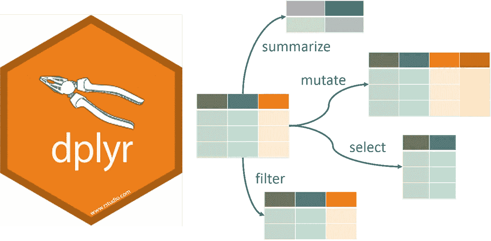
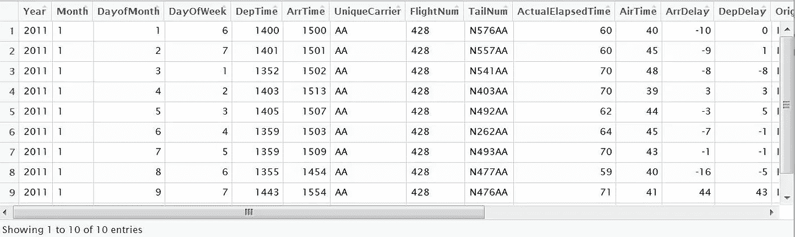
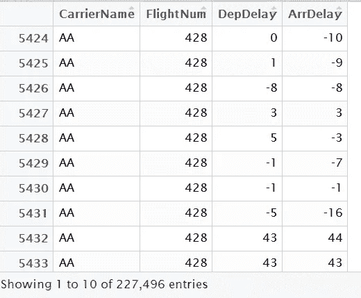
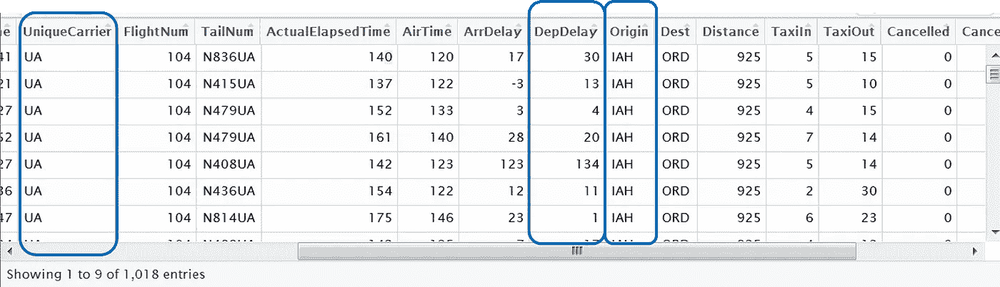
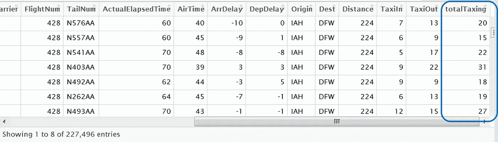
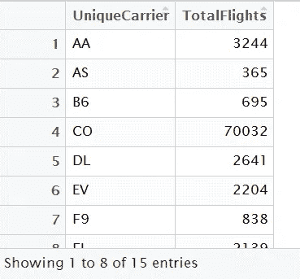
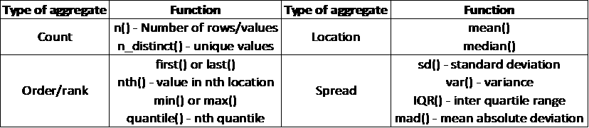

# 用 dplyr 实现 R 中的数据操作

> 原文：<https://towardsdatascience.com/data-manipulation-in-r-with-dplyr-3095e0867f75?source=collection_archive---------28----------------------->



面对现实吧！在从数据到洞察的旅程中，我们的大部分时间和精力都花在了数据操作和清理上。如果您使用 R 作为数据分析工作流的一部分，那么 *dplyr* 包就是一个救命稻草。 *Dplyr* 的创建是为了利用编码的速度和简单性的优势实现高效的数据操作。

使用“动词”函数和链接(管道操作符)可以更容易地执行复杂的数据操作步骤。在本文中，我们将研究 dplyr 中的主要函数及其用法。在深入细节之前，让我们先来看一个简单的例子，突出显示 *dplyr* 的功能。为了说明这一点，我们使用了“hflights”数据集，其中包括 2011 年从德克萨斯州休斯顿出发的所有航班的数据。

假设您想要对数据执行以下操作—

*   步骤 1:过滤从 IAH 机场始发的航班
*   第二步:统计每个航空公司的总航班数和延误航班数
*   步骤 3:将其转换为千分之一延迟(DPH)度量
*   第四步:按 DPH 降序排列结果

```
dresult<-d%>%
  filter(Origin == "IAH")%>%
  mutate(FDelayed = if_else(DepDelay>0,TRUE,FALSE,missing=NULL))%>%
  group_by(UniqueCarrier)%>%
  summarise(No=n(),NumDelayed=sum(FDelayed,na.rm=TRUE))%>%
  mutate(DPH=100*(NumDelayed/No))%>%
  arrange(desc(DPH))
```

如您所见，这 5 行代码很快就给了我们想要的答案。现在让我们后退一步，看看每个主要的功能。

**切片功能**

slice()函数将根据“行位置”处理采样或过滤行。它将执行与内置 head()函数类似的功能，但允许更大的灵活性，因为您可以指定数据集中任意行的范围。

```
d1 <- slice(hflights,1:10)*slice(hflights, -1, -10)*
```



slice()

> Q uicktip:使用负数“排除”行。示例:排除前 10 行，保留数据集中的其余行。

**选择功能**

select()函数将优化您的列选择。您还可以在 select 函数中更改列名。也可以在 select 函数中重命名列。也可以通过在列名前使用“-”来删除列。

```
d2 <- select(d,CarrierName=UniqueCarrier,FlightNum,DepDelay,ArrDelay)
```



select()

## 滤波函数

filter()函数类似于 SQL 的“where”子句。它返回符合给定过滤标准的行的子集。逻辑和布尔运算符包括(，！=，==，|，&，is.na()，！is.na()，%in%)可以用在 filter 语句中。

```
d3 <- filter(d,Origin == "IAH" & DepDelay>0 & UniqueCarrier=="UA")
```



**变异函数**

mutate()函数基于现有变量在数据框中创建新变量。与 *base R* 不同，如果您在同一个 mutate()中创建多个变量，任何先前创建的变量都可以引用它上面的变量。

```
d4 <- mutate(d, totalTaxing = TaxiIn+TaxiOut)
```

> Quicktip : mutate()添加新变量并保留现有变量，而 transmute()添加新变量并删除现有变量



**分组依据和汇总功能**

group_by()函数用于对一列中具有相似值的行进行分组。这通常与 sum()、average()、median()等聚合函数一起使用。Summarize()函数将多个值压缩成一个值。

```
d6 <- d%>%
  group_by(UniqueCarrier)%>%
  summarise(TotalFlights=n())
```



常用的汇总函数包括以下几种—



**排列功能**

arrange()函数将根据列值对数据框中的行进行排序。这类似于 SQL 中的“order by”。

```
d5 <- arrange(d4,desc(ArrDelay))
```

到目前为止，我们已经单独研究了每个函数。对于 R 和 dplyr，“管道”的概念是一个游戏改变者！

> 将命令“管道化”在一起可以创建简洁的 R 代码，这使得编写起来更容易，也更容易理解。

它是如何工作的？每个“转换”(过滤、变异、选择等)的结果集将被传递给它下面的下一个“管道”函数；避免了将来自每个步骤的数据保存到新的或现有的数据框中的需要。

起初有点混乱，但是只要稍加练习，您将很快掌握 dplyr 最有用的组件。你可能会发现，你写的每一个 R 脚本/笔记本，用 dplyr 都会更好。您的 R 数据处理将更加简洁、易于理解，开发时间也将大大缩短。

所以，下一次您想在 R 中执行数据操作时， *dplyr* 是最好的选择！

本文由 [Suraj Thatte](https://medium.com/u/e5075a23c116?source=post_page-----3095e0867f75--------------------------------) 和@Rucha Jogaikar 共同撰写。