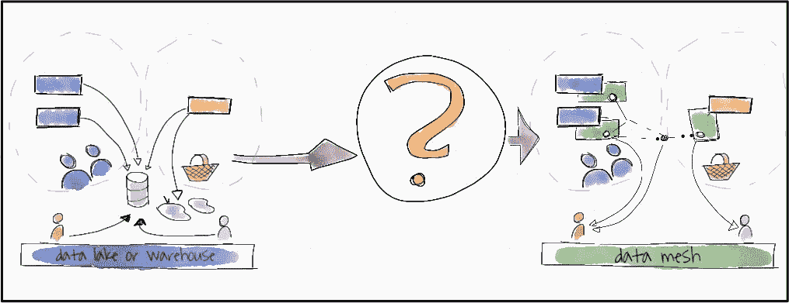
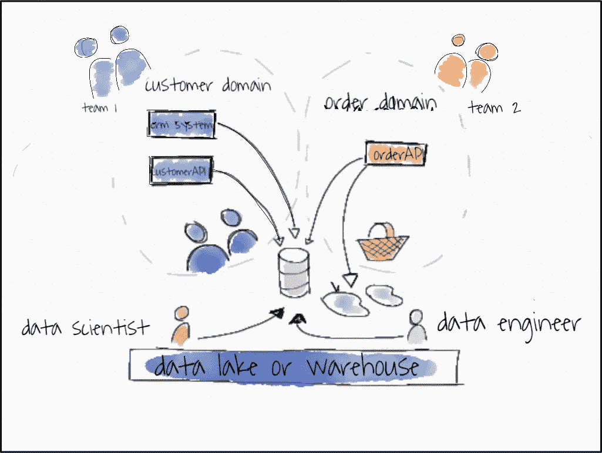
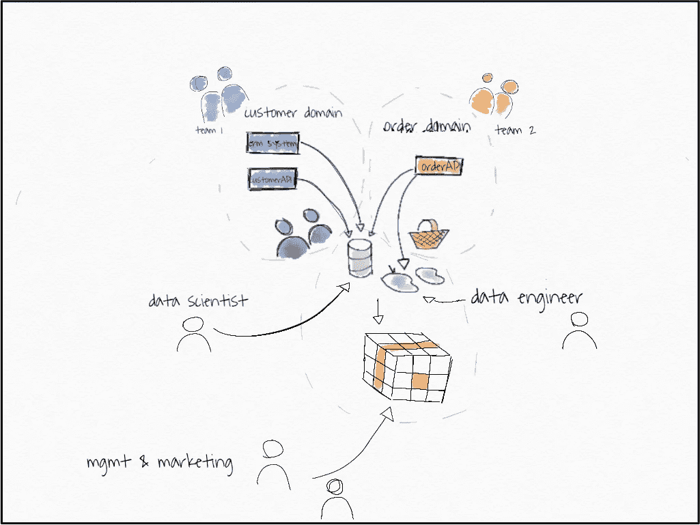
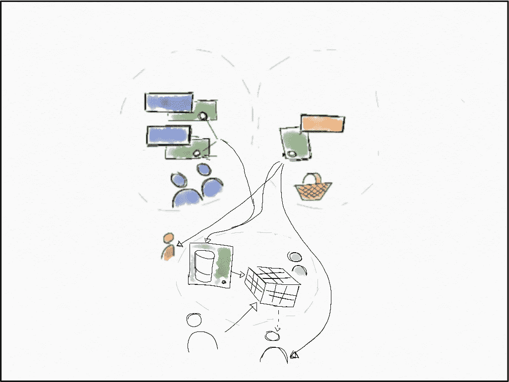
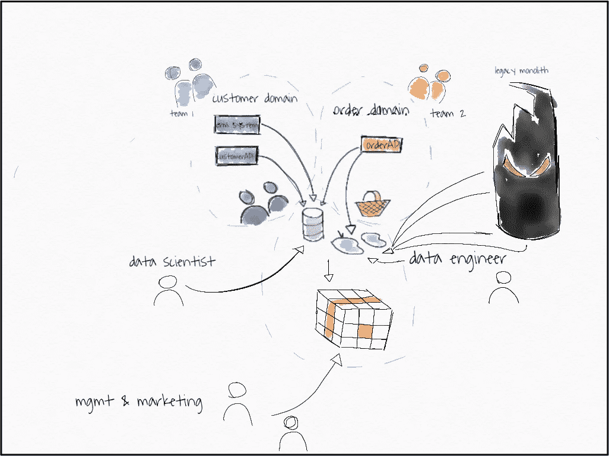
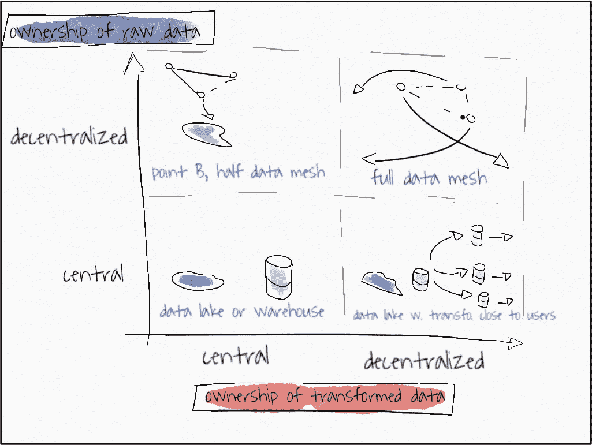

# 已应用数据网格

> 原文：<https://towardsdatascience.com/data-mesh-applied-21bed87876f2?source=collection_archive---------0----------------------->

## 逐步从单一数据湖转移到分散的 21 世纪数据网格。

*(另查看后续文章:* [*三种数据网孔*](/theres-more-than-one-kind-of-data-mesh-three-types-of-data-meshes-7cb346dc2819) *)*

*Left: data lakes with central access, on the right: user accessing data from teams domain teams providing a great data product. (all images by the author)*

21 世纪的数据格局是什么样的？ThoughtWorks 的扎马克·德格哈尼(Zhamak Deghani)给出了一个美丽的、对我来说令人惊讶的答案:这是一种**去中心化**的模式，与我们目前在几乎任何公司看到的模式都非常不同。答案叫做“**数据网格**”。

如果您像我一样感受到您公司当前数据架构的痛苦，那么您希望迁移到数据网格。但是怎么做呢？这就是我在这篇文章中探索的。

但是首先，简单回顾一下[数据网格](https://martinfowler.com/articles/data-monolith-to-mesh.html)。

**Twitter 数据网格摘要**

现代软件开发需要一种去中心化的数据方法。数据生成团队必须将数据视为产品；他们需要为它服务；分析团队和软件团队需要改变！

**更长的摘要**

[DDD](https://domainlanguage.com/ddd/) ，微服务& DevOps 在过去十年中改变了我们开发软件的方式。然而，分析部门的数据却赶不上这一速度。为了在一个采用现代开发方法的公司中加快基于数据的决策，分析软件团队需要改变。

(1)软件团队必须将*数据视为产品*，他们*为其他所有人*服务，包括分析团队

(2)分析团队必须以此为基础，停止囤积数据，而是按需获取数据

(3)分析团队必须开始将他们的*数据湖/数据仓库也视为数据产品*。

如果这个简短的总结吸引了你，让我带你看看如何从你当前的起点实际到达一个数据网格。我们将走过一个例子，途中经过遗留的巨石、数据湖和数据仓库。我们一步一步地从我们的“旧”系统转移到这个新系统。

Sid note:*称数据湖为“古老”对您来说可能有点奇怪，对我来说也是如此。时任 Pentaho 首席技术官/创始人的詹姆斯·迪克森(James Dixon)仅在 10 年前就提出了数据湖的概念。然而，围绕数据湖的核心转变，即软件、DevOps、DDD、微服务也是在过去十年才出现的。因此，我们确实需要迎头赶上，因为在这些趋势根本改变我们开发软件的方式之前，中央全能数据湖是一个老问题的答案。此外，无所不能的数据湖并不是 Dixon 最初想象的那样。*

我们从一个电子商务企业的典型微服务架构的例子开始。

1.  我们展示了这个例子如何使用数据湖/数据仓库架构(A 点)，
2.  然后与数据网格体系结构进行比较(C 点)
3.  然后以那个例子为例，但是添加一个“数据湖作为数据节点”(B)，因为这确实是我们从 A 到 c 的方式。
4.  我们考虑应该启动我们从 A 到 c 的迁移的难点。
5.  我们从 A -> B -> C 一步一步来。
6.  我们考虑先移动哪些部分的细节。
7.  我们考虑可能出现的问题以及如何处理它们。
8.  我们考虑解决这个问题的另一种方法。

## **采用数据网格架构的电子商务微服务架构**

E-commerce business modeled with three operational microservices.

这是一个基本的微服务架构，有两个域，一个是包含客户 API 和 CRM 系统的“客户域”，另一个是包含订单 API 的“订单域”。这些服务是运营服务，他们运营电子商务网站。这些 API 允许您在 order API 上创建订单，在 CRM 系统中的 customer API leads 上创建客户，检查信用额度等等。它们可能是 REST APIs，结合一些事件流，一些发布-订阅系统，具体的实现并不重要。

S*id note:对我们来说，订单和客户是不同的领域。这意味着这些领域的语言可能不同。从团队 2(订单团队)看到的“客户”只有一个含义，即由 customer_id 标识的人，他刚刚在网站上购买了一些东西。在团队 1 中，意义可能有所不同。他们可能会认为客户是 CRM 系统中的一个实体，它可以将状态从一个单纯的“领导”更改为“购买”客户，只有第二个客户是团队 2 方已知的。*

团队 1 拥有客户领域。他们对这个领域了如指掌。他们知道什么是销售线索，从销售线索到实际客户的过渡状态如何等等。另一方面，团队 2 了解订单领域的一切。他们知道取消的订单是否可以恢复，网站上的订单漏斗是什么样子，等等。团队可能对其他领域有所了解，但不是所有的细节。他们不拥有他们。

这两个领域都会产生大量的副产品数据。组织中的许多人需要这些数据。让我们来看看其中的一些:

*   **数据工程师**:既需要订单&客户数据做一些转换，生成 OLAP 立方体基础数据，模块化数据；他还需要数据来测试&理解它，然后再开始他的转换工作。
*   **的营销人员**:每天都需要按项目类别查看订单，以扩展他们的活动。
*   **数据科学家**:正在构建推荐系统，因此需要所有最新的订单数据来训练他的系统。
*   **管理层**:想要总体增长的汇总概览。

满足这些需求的数据湖/数据仓库解决方案将如下所示。

数据工程师的核心团队很可能通过 ETL 工具或流解决方案提供所有数据。他们将有一个中央数据湖或数据仓库，以及一个用于营销和管理的 BI 前端。

数据科学家可能直接从数据湖中获取数据，这可能是他们访问数据的最简单方式。

这种架构可能会带来哪些问题？

*   这种架构在数据工程团队中产生了一个中心瓶颈
*   它可能会导致**领域知识**在通过其中心枢纽的途中丢失，
*   并使所有这些不同的、异构的需求的优先级排序变得困难。

## 到目前为止一切顺利。数据网格方法怎么样？

这是一个具有数据网格架构的电子商务网站。

*Green: new data-APIs. Bottom: Mgmt with straight BI tool access, marketing with data form data-API, left: data scientist with data from data-API*

什么变了？首先，数据科学家和营销人员可以从源域访问数据！但是还有更多。

注意:数据网格架构的关键是获取数据。可发现、可寻址、可信任、自描述、可互操作&安全。

下面我提几点。

**让我们一步一步地了解这些要点**

*   **客户域**:客户域获得了两个新的只读“数据 API”。可能只有一个或两个 API，这对本例来说并不重要。在这两种情况下，客户域将确保从 CRM 系统和客户 API 中链接“客户”的概念。
*   **订单域**:订单域获得了一个新的数据 API，order-data-API。
*   **客户数据 API 数据**示例:客户数据 API 可能有多个端点:

> **所有客户/:** 为每行一个“客户”提供数据。
> 
> **stats/** :提供统计数据，如“客户数:1000，销售线索数:4000；客户电话:1，500，SME 中的客户联系人:500，SME 中的客户:600”
> 
> 更多端点。

*   **订单数据 API 数据**的例子:订单数据 API 可能有多个端点；

> **allOrderItems/:** 每行提供一个订单行项目。
> 
> **allBuckets/:** 每行提供一个存储桶，这是订单项目的集合。
> 
> **stats/:** 提供“订单:100 万，2019 年订单:60 万平均桶量:30 美元”等统计数据；stats 端点可能接受日期范围、年份等参数

*   数据 API 是只读的。其他人不是。* Data APIs 将数据作为他们的产品，非常完美。您可以将 SLA 绑定到它们，检查它们的使用情况。API 被建模为它们自己的 API，我们不会滥用订单 API 作为数据 API。因此，我们可以分别关注不同的用户。
*   *-data-API 可以以任何合理的形式实现，例如:

> -作为位于 AWS S3 存储桶中的 CSV/parquet 文件(端点由子文件夹分隔，API 由顶级文件夹分隔)(**可寻址**)
> 
> -通过 JSON/ JSON 行作为 REST APIs
> 
> -通过中央数据库和模式。(是的，我明白“中央”并不是“分散的”)

*   模式位于数据旁边。(**自述**)。
*   CRM 系统可以同时被视为操作 API 和数据 API，但是你真的想要包装它以符合你设定的标准。否则，您将失去数据网格体系结构的任何好处。
*   所有的数据 API 应该有相同的格式。这使得消费变得非常容易！(**互操作&安全**)
*   通过 Confluence 页面或任何更高级的表单或数据目录可以发现数据 API，我们知道哪个团队拥有该数据，并可以在下游使用它。(**可发现的**
*   有一个**新域名**。数据工程师刚刚获得了他自己的商业智能建模数据领域。他知道他只为一个利益相关者服务。这个领域被包装成一个服务，只为一个利益相关者服务。通过这种方式，数据工程师可以集中精力，并适当地对建模数据的管理需求进行优先级排序。
*   营销团队可以直接从数据源访问他们的“按类别排序的订单数据”，因为它是特定于领域的。
*   BI 系统来源于数据库，我们将其包装为数据服务。为什么？因为我们只为管理层服务，他们只想要模型化和连接的数据，而我们无法从 API 中获得这些数据，这很好。总体增长听起来像是一个实体，与其中一个领域无关，而是跨领域的。

## **让我们来看看数据用户的要求和变化**

*   **数据工程师:**数据工程师已经从数据 API 接收了大部分建模数据。这意味着，**没有领域知识丢失**。他有 SLA 来查看并确切地知道他将得到什么。他可以轻松地使用一种用于两种 data-* API 的标准 API 以任何方式组合数据，并将其放入自己的数据服务中。他确切地知道应该向谁索取某个特定的数据，并且所有的数据都记录在同一个地方。
*   **营销人员:**可以直接从订单来源获取他们需要的数据，即使数据工程师数据服务部门不会(目前不会)？)提供该信息。因此，如果他们想要更改数据，他们可以直接去找有领域知识的人。如果他们想加入“漏斗数据”，他们可以问真正知道那是什么的团队！
*   **数据科学家:**可以直接进入 order-data-API，该 API 经过测试&对他将一直进行的大量读取具有 SLA。数据在一秒钟内就存在了，不需要侵入数据库，这是我不止一次看到的。它已经可以生产了，可以马上集成到推荐系统中。数据科学家很容易实现他们的 CD4ML 版本。
*   **管理层:**仍然通过他们的商业智能系统获得他们的汇总视图。但是根据领域的不同，可能的改变可以在三个地方实现，而不仅仅是一个地方。中央数据团队不再是瓶颈。

数据团队仍然在那里，但是可能的负载被适当地分配给分散的参与者，无论如何这些参与者更适合这项工作。但是，数据团队也有自己的服务。那看起来会是什么样子呢？让我们看看数据湖是如何融入数据网格的&可能的棘手问题。如果你从一个状态开始，会有一个重要的过渡状态。

## **我们的数据湖，只是另一个节点**

有三种情况 a，现在不一定是中央，数据湖或数据仓库仍然有意义:

*   如果我们想要结合两个数据域来建模中间的东西，这不能发生在一个域中，而应该发生在一个新的域中。
*   如果我们想整合市场数据等外部数据。外部数据通常不符合我们的标准，所以我们需要以某种方式包装它们。
*   如果我们从 A 点转移到 C 点，我们不仅会丢掉数据湖，还会降低它的复杂性。

## **痛点**

什么时候应该考虑迁移到数据网格？首先，如果你对你的结构满意，如果你对你的公司使用数据做决策的方式满意，那就不要。但是，如果您感到以下任何痛苦，解决方案就是数据网格。

1.  如果你有**领域复杂性**和**微服务** / **领域驱动设计**，你可能会觉得事情太“复杂”了，一个中央团队无法立刻提供这些数据。
2.  如果是这样的话，您会认为将数据导入数据仓库的成本很高，因此您会拒绝导入对个人用户有价值的数据源。这些应该单独提供，并且是“作为数据网格节点划分出来”的完美候选。
3.  你还没有形成数据->信息->洞察力->决策->行动返回数据的闭环。
4.  你的数据->数据速度在****连续智能周期中是以周&月计量的，而不是天或小时。****
5.  ****你已经在将“数据转换尽可能地靠近数据用户”；这是我们目前正在做的事情，通常这是数据->信息->洞察力->决策->行动->数据管道出现瓶颈的迹象。这可以被认为是一个中间阶段，详见最后一段。****

## ******从单一数据湖到数据网******

****让我们现实一点。数据仓库或数据湖，以及负责导入和建模数据的中央分析团队。一个遗留的整体，团队从那里导入数据，没有 API，可能有直接的数据库访问和大量的 ETL 作业、表等。也许我们在新的领域有了一些新的微服务…让我们保持简单但通用。****

****S *IDENOTE:我喜欢 Michael Feathers 对遗留代码的定义:没有测试的代码。这就是我的意思，庞大，丑陋，不愉快的代码，没有人喜欢与它一起工作。*****

********

****记住，我们的目标是一步一步地获取所有的数据。****

******步骤 1:(可寻址数据)重新路由数据湖数据&更改 BI 工具访问。******

****所有的数据目前都是通过数据湖消费和服务的。如果我们想改变这一点，我们首先需要转动那里的**大开关**，同时为未来的迁移固定**可寻址性的标准化**。****

****为此，让我们尝试使用 S3 桶。因此，我们将标准化定义为:****

> ****示例:{name}-data-service 可通过以下方式访问:****
> 
> ****-S3://same thinghere/data-services/{ name }****
> 
> ****具体来说，所有服务都至少有一个端点，即默认的数据端点。其他端点是子文件夹，如:****
> 
> ****-S3://same thinghere/data-services/{ name }/default****
> 
> ****-S3://same thinghere/data-services/{ name }/{ endpoint 1 }****
> 
> ****-S3://same thinghere/data-services/{ name }/{ endpoint 2 }****
> 
> ****模式版本位于:****
> 
> ****-S3://same thinghere/data-services/{ name }/schemata/v 1 . 1 . 1 . datetos？？？****
> 
> ****我们使用“vX”格式的语义版本。Y.Z "，日期精确到秒。****
> 
> ****数据文件以“vX.Y.Z.datapart01？？?"，每个文件限 1000 行，方便消费。****

****我们将数据湖重新路由到它的新“地址”,并更改 BI 工具访问。****

> ****S3://same thinghere/data-services/data-lake/default****
> 
> ****S3://same thinghere/data-services/data-lake/growth data****
> 
> ****S3://same thinghere/data-services/data-lake/modeled data****
> 
> ****???****

****这对组织的其他人来说没有任何改变，我们需要给他们访问权限。****

******第二步:(可发现性)创建一个空间来寻找我们的新数据-*来源。******

****我们可以通过在我们的知识管理系统(即 confluence/您的内部 wiki……)中创建一个页面来实现最简单的可发现性。****

****好的，现在除了现在使用数据湖的人之外，新的人可以找到数据。现在，我们可以开始向我们的数据网格添加节点，我们可以选择任何一种方式，通过推出一种全新的微服务，或者通过打破那些令人讨厌的旧传统碎片之一。****

****我们先考虑微服务案例。****

******第三步:推出新的微服务。******

****推出服务的目的是将所有权交给创建数据的领域团队，这样，例如，您可以将分析团队中的某个人加入负责的领域团队。暂且以“订单团队”为例。****

****我们创建新的 order-data-API。确定一组基本的 SLA，并确保遵守您为数据湖设定的标准。我们现在有两种数据服务:****

> ****S3://same thinghere/data-services/data-lake/default****
> 
> ****S3://same thinghere/data-services/data-lake/growth data****
> 
> ****S3://same thinghere/data-services/data-lake/modeled data****
> 
> ****S3://same thinghere/data-services/order-data/default****
> 
> ****S3://same thinghere/data-services/order-data/allorderitems****
> 
> ****S3://same thinghere/data-services/order-data/stats****

****将新服务放入发现工具中。****

****第二种选择是让中央分析团队创建这个数据服务，在这种情况下，所有权仍然存在。但至少我们把服务分开了。****

******第四步:拿出一件遗产。******

****遗留系统通常没有崭新的微服务好用。通常，您会有一些数据库表，您甚至不知道从这些表中获取数据，从一些服务器或任何其他形式的遗留系统中获取一些 CSV，这些系统没有良好的文档记录和标准化的接口。****

****这没关系。你可以暂时保持这种状态。您已经有了某种将数据导入到数据仓库或数据湖的方法，所以将其分离出来，并将其表示为数据服务。****

****例如，您可以从:****

> ****源数据库— ETL 工具→数据湖中的原始数据→数据湖中的转换数据****

****总结前两个阶段，并使用标准化:****

> ****(源数据库— ETL 工具→数据湖中的原始数据→ S3 桶)=新数据服务****
> 
> ****(新数据服务的 S3 桶)— ETL 工具→将数据导入数据湖→转换数据湖中的数据****

****这样，当您转移服务时，领域团队只需要切换主干，依赖用户已经可以切换到使用数据的新方式，甚至在领域团队取得所有权之前。****

******步骤 5:(可发现性)切换可发现性& BI 工具源。******

****现在开始将你的数据服务推向普通受众，以获得快速反馈，让营销团队找到你突破的来源。然后将 BI 工具切换到两个数据服务，而不是一个。****

****然后，您可以考虑关闭 data-lake-service 中对订单数据的支持。****

******第六步:转移所有权。******

****如果您在这里，那么恭喜您，您已经突破了中央数据湖的第一部分，现在您需要确保，在新功能请求进入这些服务之前，所有权也已转移。您可以通过以下方式做到这一点:****

*   ****通过将一些人和服务一起迁移到领域团队****
*   ****也许可以为新服务建立一个新团队****
*   ****通过简单地将服务迁移到领域团队****

******第七步:继续。******

****包，包，包，爆发越来越多的服务。优雅地推出旧的部分并用新的 API 替换它们。开始收集分布式服务的新功能请求。****

****现在，您的中央数据湖将变得非常小，只包含连接和建模的数据，如果您开始转移人员，您的数据团队也将如此。****

****第八步:(TSIS)让它可信、自描述、可互操作且安全。****

****构建公共数据平台。这可能意味着每个人都可以将文件放在正确位置的库，或者任何其他更复杂的工具集。无论团队中有什么重复，你都可以将其中的大部分集中起来。例如，如果您很快注意到 AWS S3 文件不容易被营销和销售人员访问，您可能会决定从 S3 转换到可以通过 EXCEL 等访问的中央数据库。****

****在这种情况下，您会希望有一个库，通过简单的升级来实现这种转换，而不会给团队带来太多麻烦。例如，在 AWS 设置中，您可以创建一个带有通用“数据-服务-发货人”的 lambda 函数，它负责:****

1.  ****获取*版本化模式，并将它们映射到中央数据库中的数据库模式*。****
2.  ****将*数据发送到数据库中适当的模式*中。****

****这样，领域团队除了升级他们的“库”之外，几乎没有其他工作。其他选项可能包括创建一个通用的 REST API，您可以用信号通知数据及其位置，并让 API 处理其余部分，如转换 CSV、parquet 等。转换成单一格式。****

## ******我先选择哪部分数据爆发？******

****因此，就像微服务一样，一旦你感到某种“痛苦”，从整体开始的最佳方式是分解零件。但是我们先从哪一部分开始呢？这是一个基于三点考虑的判断:****

1.  ******成本**:数据爆发有多难？****
2.  ******好处**:数据多久改变一次？****
3.  ******好处**:数据对您的业务有多重要？****

****好处间接表明，你将能够收集多少真实数据服务的用例，因为改变数据意味着数据服务的改变，而数据的重要性意味着许多人将希望从该数据服务中获得洞察力。****

****如果你权衡这些事情，你会得出不同的结论。例如，在我们的例子中，客户域可能是一个很好的起点，因为这样的数据很可能会经常改变。然而，有时它没有订单数据重要，另一方面，订单数据可能很难分解，这取决于您已经在订单数据之上放置了多少个 ETL 作业。****

****如果你有一个开始的地方，在你的道路上仍然有垫脚石。****

## ******垫脚石******

****目前，作为副产品提供数据的团队没有动力去恰当地保护这些数据，主要是因为没有来自这些数据的潜在“利益相关者/消费者”的直接反馈。****

****这是必须改变的事情，你必须把它作为一个核心部分来对待。这可能就是为什么 Zhamak Deghani 建议您采用特定的用例，确定用户，并组建一个新的团队来专门负责特定的用户。另一方面，我不明白为什么当前的订单团队不能担当这个角色。没错，这种转变有点困难，但对公司必须花费的资源来说更容易，而且可能更容易销售。****

****如果您无法让数据生成团队加入这一行列，您有两种选择:****

1.  ****创建一个新团队，并采用一个用例****
2.  ****使用您现有的中心团队来承担这一角色，并收集数据。检查对数据服务的需求及其创造的价值，然后决定将它推向何处。****

****最后，让我们探索一下这种架构的可能替代方案。****

## ******有替代方案吗？******

****我试图提出一个替代方案，但意识到它更像是一个不同实现的矩阵。****

****数据网格的关键概念是分散所有权，我们可以说，因为领域团队通常认为他们的数据是副产品，他们并不真正拥有它。因此，数据湖是原始数据的集中所有权。****

****如果我们现在区分原始数据和转换数据，我们可以看到四种可能的不同数据架构。我们还可以看到从数据湖转移到数据网格的 2-3 种不同方式。****

********

*****Ownership of raw & transformed data can both be central or decentralized. This produces four quadrants with a variety of solutions.*****

****我们上面描述了从“数据湖”到“B 点”然后到完整数据网格的移动。****

****然而，第二种选择是首先实现分散的“转换数据的所有权”,然后可能考虑迁移到完整的数据网格。****

******分散的转换数据所有权会是什么样子？******

*   ****数据湖仍然可以导入所有“原始数据”****
*   ****然后，接近决策者的有数据知识的用户可以访问原始数据，并在本地桌面 ETL 解决方案中进行转换。****
*   ****原始数据也可以被推送到分散的数据仓库中，在那里离用户更近的“某人”可以对数据进行基本的 ETL。****
*   ****当然，每个部门都可以有自己的小数据团队为该部门做 ETL。****

******区别在哪里？**在这种情况下，您可以收集大量需求，并细化各部门对数据的确切用例。像市场营销这样的部门通常更接近领域，然后是中间的数据团队，所以你会在**“领域语言”**问题上获得一些优势，但不是全部。您还将保持原始数据消费的中心瓶颈，并且不将“数据作为产品”推给领域团队。我认为这两者在未来都是必要的。****

*****对如何建立伟大的数据公司、伟大的数据密集型产品、成为伟大的数据团队感兴趣，还是对如何利用开源构建伟大的东西感兴趣？然后考虑加入我的* [*免费简讯《三个数据点周四》*](http://thdpth.com/) *。它已经成为数据初创企业、风投和数据领导者值得信赖的资源。*****

******结尾******

****我试着写一篇比扎马克·德格哈尼更短的帖子，但似乎没有成功。我只能在以下四个地方找到关于数据网格体系结构的信息:****

*   ****扎马克·德加尼斯的文章位于[马丁·福勒的网站](https://martinfowler.com/articles/data-monolith-to-mesh.html)****
*   ****Zhamak 出现在 ThoughtWorks 播客[第 30 集](https://www.thoughtworks.com/podcasts/episodes)中，其中他们还提到了“将转型推向最终用户”的概念****
*   ****数据工程播客第 90 集，以数据网格为特色****
*   ****以数据网格为特色的[软件工程每周播客](https://softwareengineeringdaily.com/2019/07/29/data-mesh-with-zhamak-deghani/)****