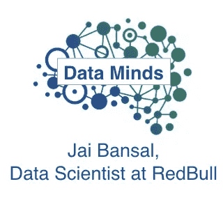

# 数据头脑:Jai bans al——红牛的数据科学家

> 原文：<https://towardsdatascience.com/data-minds-jai-bansal-data-scientist-at-red-bull-afdb141a0e26?source=collection_archive---------23----------------------->

## ***Data Minds 是一个介绍从事数据工作的专业人士的系列。在这个系列中，你将了解他们的故事，他们的日常生活，以及给别人的建议和忠告。***

红牛在全球所有能量饮料公司中的市场份额最高，仅在 2018 年就售出了 67.9 亿罐。可以想象，这意味着他们产生了大量的数据。从司机上传以验证交付的图像，到业务运营的数据。 [Jai Bansal](https://www.linkedin.com/in/jaibansal) 在过去的两年半时间里一直在红牛担任数据科学家，之前曾在一家初创公司工作过两年。在这篇文章中，我们讨论了他是如何进入数据科学的，在一个数据文化处于萌芽状态的公司是什么样的，花 50%的时间学习的重要性，以及给其他希望进入数据科学的人的一般提示。

**从经济学到数据科学**

当 Jai 2010 年在南加州大学攻读经济学硕士学位时，数据科学这个术语还没有流行起来。这个术语是两年前(2008 年)由领英和脸书的早期数据科学负责人 DJ Patil 和 Jeff Hammerbacher 创造的。

在学校时，杰有广泛的兴趣。他知道自己喜欢数学，有 r 方面的经验。但除此之外，他不具备你今天可能会期望的实用数据科学技能。当他在校外找到第一份工作时，这种情况很快就改变了。当时，他知道自己不想继续在学术界工作，所以他在一家初创公司找到了一个与数据相关的职位，并进行了面试。他意识到，与其等待“完美”的角色，不如开始工作，获取行业经验，宜早不宜迟。

被迫学习所有有效的行业工具，他很快发现自己在用消防水管喝水。虽然在这家初创公司工作并不总是最好的经历，但它确实让他磨练了自己，获得了宝贵的经验。他确保积极主动地接受公司的各种项目，让自己获得日后职业生涯所需的广泛接触。

在那里呆了两年后，他意识到是时候改变了。他面试并加入了红牛，成为他们在北美首批为数不多的数据科学家之一。

**红牛的数据科学**

由于红牛的数据科学团队仍处于早期阶段，从创业环境中转型并不困难。新生的数据文化给了团队很多机会变得灵活和有经验。

他有机会参与的一些早期项目从修补卷积神经网络到建立预测模型以帮助部门更有效地进行规划。

杰最早学到的一课就是解决正确的问题。他分享说，在项目上花费太多时间而没有得到利益相关者的反馈或认可，往往会导致资源的巨大浪费。他提倡一种精益创业的方法，在投入额外的时间到项目中之前快速迭代并获得反馈。

Jai 的另一项工作是与关键部门合作，寻找和选择相关项目。找出企业利益相关者的动机(提示:削减成本、增加收入和增加利润)，以及与他们合作确定值得追求的战略目标，是他工作的一大部分。在具有早期数据文化的公司中尤其如此，利益相关者可能不总是立即看到数据科学家的价值。Jai 还致力于公司内部的数据传播工作。他负责他们的 R analytics 培训，并为一份内部通讯撰稿。

根据项目和所处的阶段，他花 70%的时间编写代码，另外 30%的时间做推广或展示他的成果。然后进一步细分为 30%的特别请求(类似于 SQL 查询)，40%的个人项目，以及 30%与团队中其他数据科学家的团队项目。他根据项目用 SQL、R 或 Python 编码。

**给别人的建议**

Jai 给希望进入数据科学的人的最大建议是热爱学习，并确保你总是在工作中学习。数据科学是一个不断变化的领域，因此跟上最新发展非常重要。他的个人目标是把 50%的工作时间花在推动他学习的项目上，另外 50%花在他以前做过的重复性工作上。与你的经理一起工作，制定一个长期的学习计划是另一个很好的建议，可以确保你对自己的未来发展进行投资。

除此之外，杰强调了非技术技能的重要性。能够与非技术利益相关者有效沟通对建立信任大有帮助。没有什么比被技术术语搞得不知所措更让人听不进去了。也就是说，花时间教育你的利益相关者也很重要。解释你的预测模型的潜在概念的能力可能是降低人们采用它的阻力的一个很好的方法。

最后，请务必记住，您和您的数据科学团队是一个更大整体的一部分。将业务放在第一位，理解利益相关者的痛苦，将有助于创造一个信任和协作的环境。虽然在深度学习模型上工作可能更能激发智力，但事实上，从更简单的模型开始并以此为基础进行构建可能更有用。