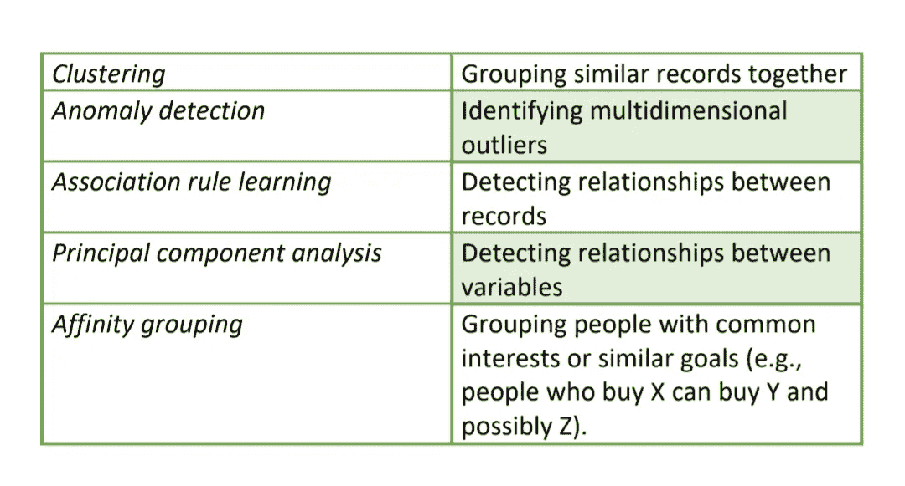
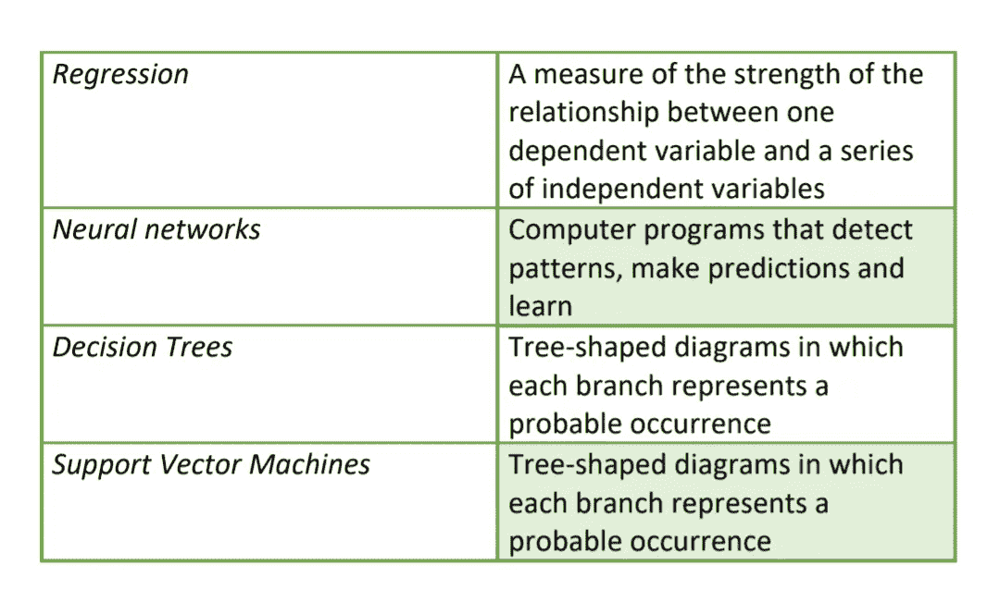
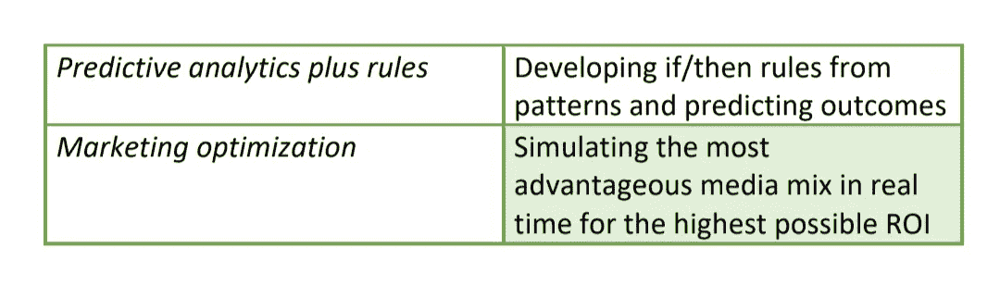

# 用于可持续数据管理的数据挖掘

> 原文：<https://towardsdatascience.com/data-mining-for-sustainable-data-management-659e7c7ea41e?source=collection_archive---------19----------------------->

在当今快速发展的技术世界中，当智能手机、平板电脑、个人电脑已经成为人类生活不可分割的一部分时，实现信息和数据的力量是最重要的理念。如今，我们生活在“信息时代”，数据量呈爆炸式增长；过去两年中创建的数据比人类历史上所有的数据都要多。数据分析和数据挖掘背后的巨大潜力，未来必须吸收数据挖掘技术的实施，以实现可持续的数据管理。

> 数据正以前所未有的速度增长，到 2020 年，地球上每个人每秒将产生大约 1.7 兆字节的新信息。

然而，目前只有不到 0.5%的数据被分析和使用。数据挖掘处于以下两个方面的交汇点:

# 数据挖掘

数据挖掘是数据科学领域中的一个总括术语，是对大型数据集进行排序以识别其中的模式并建立相互关系来通过数据分析解决问题的过程。数据挖掘是在大型数据集中发现有趣的、意想不到的或有价值的结构。

1.  统计学:对数据关系的数值研究
2.  人工智能:由软件和/或机器显示的类似人类的智能
3.  机器学习:可以从数据中学习以预测未来趋势的算法

# **对数据挖掘的需求**

数据挖掘捕获大量数据，以便识别这些数据的洞察力和洞察力。在目前的情况下，数据行业的需求正在迅速扩大。非常重要的是，不要错过我们分析数据并将其转化为有意义的信息。

> 到 2020 年，我们累积的数字世界中现有的数据超过 4.4 吉字节，将增长到 44 吉字节或 44 万亿吉字节。

这些数据的可持续管理极其重要。每个数据集对它的分析都非常重要，可以预见商业趋势、预测销售、预测成本等。

# 数据挖掘的重要性

仅非结构化数据就占数字世界的 90%。但是更多的信息并不一定意味着更多的知识。数据挖掘允许:

1.  浏览数据中所有混乱和重复的噪音
2.  理解什么是相关的，然后充分利用这些信息来评估可能的结果
3.  加快做出明智决策的步伐

随着数据挖掘技术不断发展以跟上无限可用数据的步伐，数据需要可持续的治理。

# **可持续数据管理**

数据治理是关于如何更好地控制和管理数据以实现战略、改善结果和降低风险。它可以被认为是既满足了当代人的需求，又不损害后代人满足自身需求的能力。成功的数据管理组织在各个层面创造了关于其数据的价值、效用和相关性的机构意识和知识。数据挖掘是数据分析的基石，有助于开发能够发现数百万条记录之间联系的模型。

# **用于可持续数据管理的数据挖掘**

作为一门综合学科，数据挖掘代表了在不同分析能力中使用的各种方法或技术，这些分析能力解决了组织的各种需求，提出了不同类型的问题，并使用不同级别的人工输入或规则来做出决策。遵循以下程序:

1.  ***需求收集:*** 数据挖掘项目从需求收集和理解开始。需求范围是从业务角度定义的。一旦定义了范围，我们就进入下一阶段
2.  ***数据挖掘:*** 在这里，根据项目的需求，对数据进行收集、评估和挖掘。了解问题和挑战，并将其转化为元数据。在这一步中，数据挖掘统计用于识别和转换数据模式
3.  ***数据准备*** *:* 将数据转换成对建模步骤有意义的信息。ETL 过程——提取、转换和加载可以在此步骤中使用。他们还负责创建新的数据属性。这里，使用各种工具以结构化格式呈现数据，而不改变数据集的含义
4.  ***建模:*** 为这一步准备好最好的工具，因为这在数据的完整处理中起着至关重要的作用。应用所有建模方法以适当的方式过滤数据。建模和评估是相互关联的步骤，同时进行以检查参数。一旦最终建模完成，最终结果就是经过质量验证的
5.  ***评价:*** 这是建模成功后的过滤过程。如果对结果不满意，则再次将其转移到模型中。根据最终的结果，再次检查需求，以确保没有未分析的点被遗漏。采矿专家在最后判断完整的结果。
6.  ***部署:*** 这是完整流程的最后阶段。以电子表格或图表的形式向供应商提供数据

在数据被分类之后，用于最终数据表示建模的不同技术可以被分类为:

> 描述性建模
> 
> 预测建模
> 
> 规范建模

## **A .描述性建模:**

它将发现并关注历史数据中共享的相似性或分组，以确定成功或失败背后的原因。示例:根据产品偏好或情感对客户进行分类。

## **B** 。**预测建模:**

这种建模更深入地对未来的事件进行分类或估计未知的结果，例如，使用信用评分来确定个人偿还贷款的可能性。预测建模还有助于发现客户流失、活动响应或信用违约等情况

## **C .规定性建模:**

随着来自 web、评论字段、书籍、电子邮件、pdf、音频和其他文本来源的非结构化数据的增长，文本挖掘作为数据挖掘的相关学科的采用已经显著增长。迫切需要成功地解析、过滤和转换由此获得的非结构化数据，以便将其包括在预测模型中，从而提高预测精度。规范建模着眼于内部和外部变量和约束，以推荐一个或多个行动方案。

数据挖掘不应被视为一个独立的实体，因为预处理(数据准备、数据探索)和后处理(模型验证、评分、模型性能监控)在该过程中同样重要。

# **应用领域**

用于可持续数据管理的数据挖掘服务可用于以下功能:

1.  研究和调查
2.  信息采集
3.  客户意见
4.  数据扫描
5.  信息提取
6.  数据预处理
7.  Web 数据
8.  对手分析
9.  新闻
10.  在线研究
11.  更新数据
12.  销售预测
13.  商业趋势
14.  客户细分

## 使用数据挖掘进行可持续数据管理将:

1.  通过可持续的实践减少不受管理的数据增长的后果
2.  通过统一数据保护降低数据存储成本
3.  借助全球数据可见性降低数据丢失或被盗的风险
4.  通过全面的企业数据治理确保法规遵从性
5.  拥抱更清洁的数字环境，创造更清洁的自然环境

# 结论

在这个技术趋势的世界里，数据挖掘是一个快速发展的行业。每个人都需要以适当的方式和正确的方法管理数据，以便获得有用和准确的信息。

数据挖掘现在就在这里，我们需要向下挖掘并到达矿！

我希望这篇文章能有所帮助！快乐阅读！干杯！