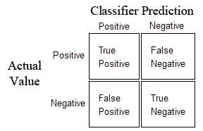
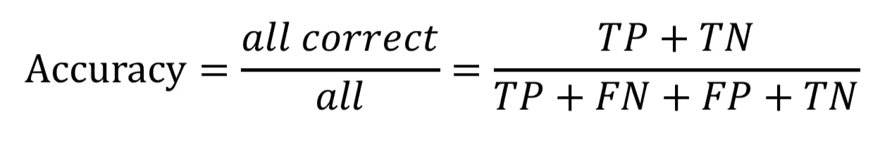
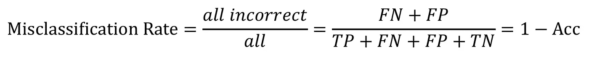
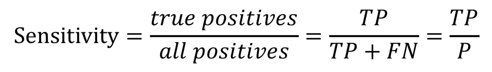
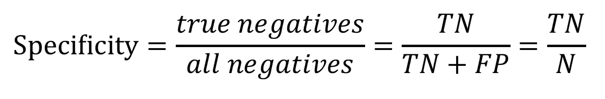
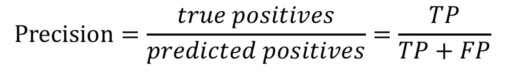

# 数据模型—分类评估指标简介

> 原文：<https://towardsdatascience.com/data-models-introduction-to-classification-evaluation-metrics-7862ba451da4?source=collection_archive---------24----------------------->

很多时候，当人们想到建模数据时，他们会直接想到回归模型，以根据收集的数据生成某些目标变量的预测。然而，分类模型对于基于数据生成预测也非常有用，只是方式不同。回归模型用于预测连续分布的目标变量，这些变量有无数个结果。回归问题的示例包括预测待售房屋的价格、预测给定日期的温度以及预测 NBA 球员在下一场比赛中的得分。在分类数据模型中，我们试图预测的目标变量具有离散分布，该分布具有有限数量的结果。分类问题的例子包括预测哪个候选人将赢得选举，以及预测一周中哪一天的销售额最高。在这篇文章的剩余部分，我将关注二元分类模型，它预测两个可能结果中最可能的结果。

**分类预测评价指标**

在回归数据模型中，模型的性能是通过使用某种度量(如均方误差和决定系数)将观察值与预测值进行比较来确定的。使用一组独特的度量标准来评估分类模型的性能，每个度量标准都是根据问题的上下文来选择使用的。此外，使用预测评估度量来计算分类度量，预测评估度量只能在预测离散目标变量时考虑。

真阴性(TN):预测一个事实上是负面的负面结果。
【假阴性】(FN):预测一个事实上并不消极的消极结果。
真阳性(TP):预测一个事实上是积极的积极结果。
假阳性(FP):预测一个实际上并不积极的积极结果。

这些值的标准表示形式是混淆矩阵，它表示真阴性、假阴性、真阳性和假阳性预测的数量。

Confusion matrix representation from Towards Data Science.

**分类模型绩效评估指标**

二元分类问题的一个经典例子是预测某人是否怀孕。在这种情况下，您可以将一个人怀孕定义为积极结果，将一个人没有怀孕定义为消极结果。确定哪种情况是积极的还是消极的取决于评估模型预测的人，这需要在评估模型之前明确指定。继续以怀孕为例，如果某人确实怀孕了，而您的分类模型预测他们没有怀孕，则该预测将被视为假阴性。此外，如果某人实际上没有怀孕，而您的分类模型预测他们怀孕了，则该预测将被视为假阳性。真正的正面和负面预测是在正确预测某人是否怀孕的情况下。要使用一个数字来总结分类模型的性能，有许多可用的指标。

**准确率**:有多少结果预测正确？

**误分类率**:有多少结果预测错误？

**灵敏度/回忆**:模型预测为阳性的结果有多少实际上是阳性的？

Note that sensitivity and recall are synonyms in this context.

**特异性**:模型预测为阴性的结果有多少实际上是阴性的？

**精度**:模型正确预测了多少正面结果？

**将所有这些放在一起**

根据您试图解决的分类问题的上下文，优化模型的最重要的性能评估指标可能会有所不同。在怀孕的例子中，预测某人没有怀孕，而实际上他们已经怀孕了，这比预测某人怀孕了而实际上他们并没有怀孕，这是一个更严重的错误。在度量标准中，这意味着导致假阳性的严重性不如导致假阴性的严重性。如果有人在怀孕时不认为自己怀孕了，他们可能会从事对胎儿有害的活动。因此，响应这种特定分类问题的模型构建应该以最小化假阴性为目标进行优化。最小化假阴性的分类性能度量是灵敏度，因此应该优化模型以产生尽可能低的灵敏度。在创建二元分类模型时使用这些度量将极大地提高模型相对于手头问题的质量。