# 〠 ❤︎ ✔︎趋势 YouTuBe 视频统计中熊猫的数据预处理

> 原文：<https://towardsdatascience.com/data-pre-processing-with-pandas-on-trending-youtube-video-statistics-%EF%B8%8E-%EF%B8%8E-c7ce698fbdcb?source=collection_archive---------22----------------------->

本文的目的是提供一个标准化的数据预处理解决方案，可以应用于任何类型的数据集。您将学习如何将数据从最初的原始形式转换为另一种格式，以便为探索性分析和机器学习模型准备数据。

# 数据概述

*   这个数据集是来自美国的热门 YouTube 视频的每日记录。
*   数据包括视频标题、频道标题、发布时间、标签、视图、喜欢和不喜欢、描述和评论计数等。
*   数据集的形状是 16580 行* 16 列。

# 数据预处理路线图

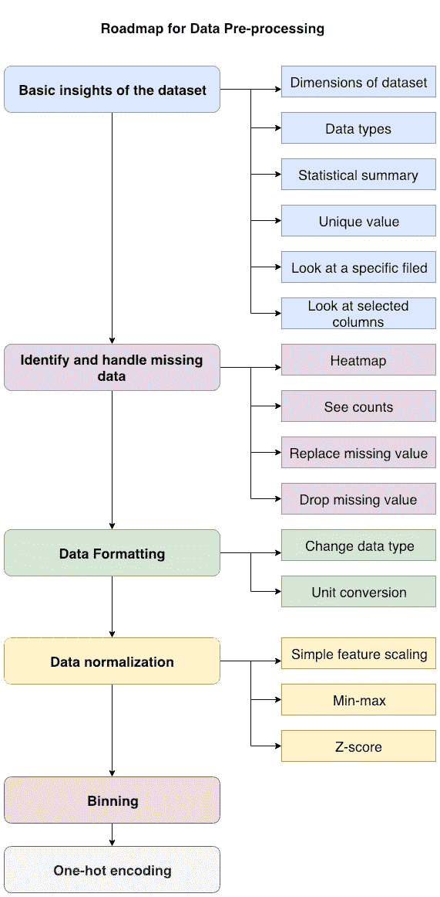

# **数据预处理源代码**

## 数据集的基本观点

```
# A quick look at the dataset. Return 5 random rows.
df.sample(5)
```

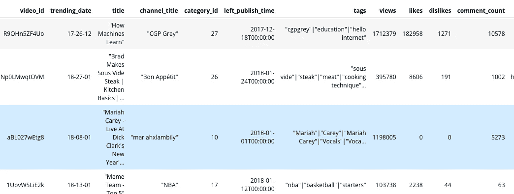

```
# Return data types
df.dtypes
```

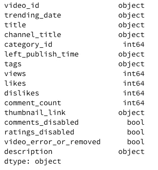

```
# Dimensions of dataset
df.shape
```

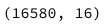

```
# Statistical summary
df.describe()
```

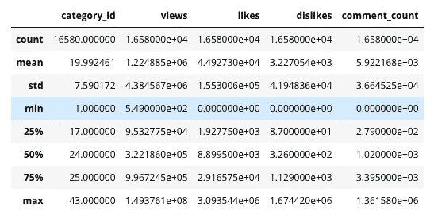

```
df_summary = df.describe(include="all")
df_summary
```

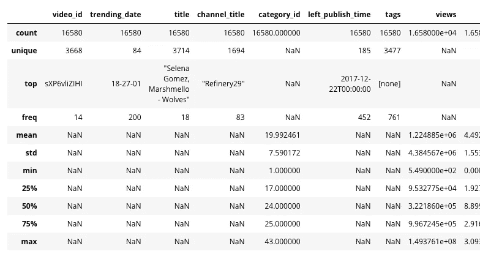

*   “top”是最常出现的项目
*   “频率”是热门项目显示的次数
*   “NaN”表示无法对该类数据进行计算

```
# Unique value: value counts of a specific column
df['category_id'].value_counts()
```


上图显示了“category_id”列中的唯一值。值“24”的计数是 3911。

```
# Look at a specific field
df.iloc[23,5]
```

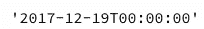

```
# Look at selected columns
columnWeCareAbout=['title','views','likes','dislikes','comment_count']
df[columnWeCareAbout].sample(5)
```

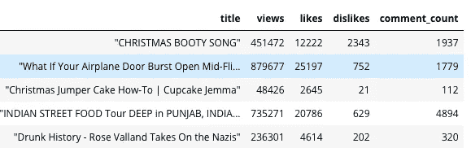

## 识别和处理丢失的数据

```
# Use heatmap to check missing data
sns.heatmap(df_summary.isnull(), yticklabels=False, cbar=False, cmap='viridis')
```

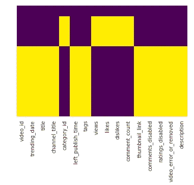

```
# See counts of missing value
for c in df_summary.columns:
    print(c,np.sum(df_summary[c].isnull()))
```

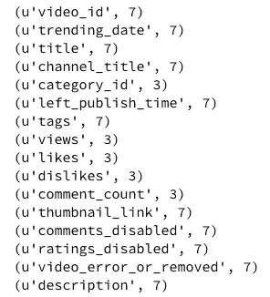

```
# Replace missing data
df_summary['views'].fillna(df_summary['views'].mean(), inplace=True)
```

以上代码用平均值填充缺失的数据。你可以在实际案例中考虑插值、中值或其他方法。

```
# Drop a column most value are missing
df_summary.drop(['thumbnail_link'], axis=1, inplace=True)sns.heatmap(df_summary.isnull(), yticklabels=False, cbar=False, cmap='viridis')
```

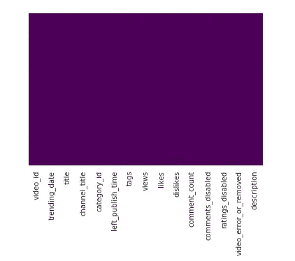

No missing value detected

## 数据格式编排

```
# Change data type if needed
df['left_publish_time'] = pd.to_datetime(df['left_publish_time'], format='%Y-%m-%dT%H:%M:%S')
```

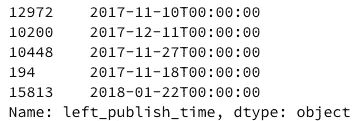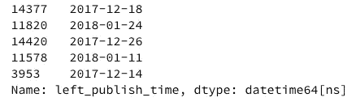

Change type from object to datetime

```
# Unit conversion# conversion factor
conv_fac = 0.621371# calculate miles
miles = kilometers * conv_fac
```

## 数据标准化

```
# Number in different range which influence the result differently
df[['views','likes','dislikes','comment_count']].head()
```

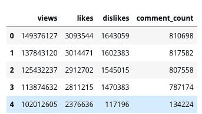

```
# Simple feature scaling
df['views'] = df['views'] / df['views'].max()
df[['views','likes','dislikes','comment_count']].head()
```

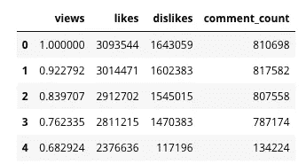

New values in column “views”

```
# Min-max
df['likes'] = (df['likes'] - df['likes'].min()) / (df['likes'].max() - df['likes'].min())
df[['views','likes','dislikes','comment_count']].head()
```

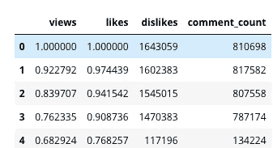

Normalized value in column “likes”

```
# Z-score
df['dislikes'] = (df['dislikes'] - df['dislikes'].mean()) / df['dislikes'].std()
df['comment_count'] = (df['comment_count'] - df['comment_count'].mean()) / df['comment_count'].std()df[['views','likes','dislikes','comment_count']].head()
```

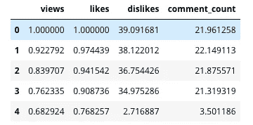

## 扔掉

*   将值分组到箱中
*   将数值转换成分类变量
*   “喜欢”是数字，我们希望将其转换为“低”、“中”、“高”，以更好地表示视频的受欢迎程度

```
binwidth = int(max(df['likes'])-min(df['likes']))/3
binwidth
```

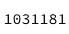

```
bins = range(min(df['likes']), max(df['likes']),binwidth)
group_names = ['Low','Medium','High']
df['likes-binned'] = pd.cut(df['likes'], bins, labels=group_names)
df['likes-binned']
```

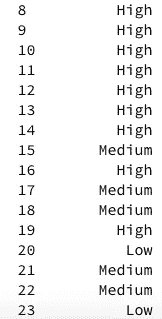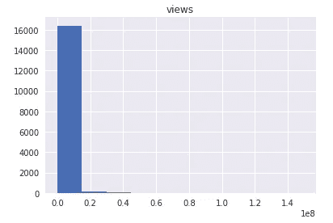

Visualizing binned data

## 一键编码

*   为每个独特的类别添加虚拟变量
*   在每个类别中分配 0 或 1
*   将分类变量转换为数值

```
df['category_id'].sample(5)
```

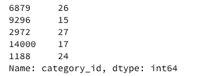

```
category = pd.get_dummies(df['category_id'], drop_first=True)
category.head()
```

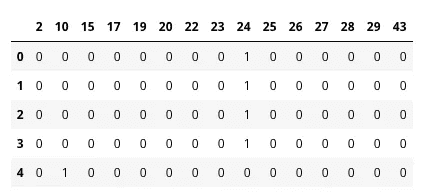

```
# Add dummy values into data frame
df = pd.concat([df, category], axis=1)
df.sample(5)
```

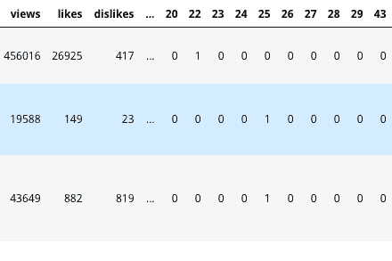

## 应用 IF 条件

```
# Add a column base on the conditions# df.loc[df.column_name condition, 'new column name'] = 'value if condition is met'df.loc[ df['likes'] > 1000 | df['views'] > 10000, 'popularity'] = 'Yes'  
df.loc[ df['likes'] <= 1000 & df['views'] <= 10000, 'popularity'] = 'No'
```

恭喜你。您完成了一篇冗长的文章，现在您知道了一个标准化的数据预处理解决方案，可以应用于任何类型的数据集。你的数据科学家难题又多了一块！源数据可以在这个[链接](https://www.kaggle.com/datasnaek/youtube-new)找到。

测验:为什么我们需要数据标准化？

下一步:探索性数据分析(EDA ),熊猫对 YouTuBe 视频统计数据进行趋势分析