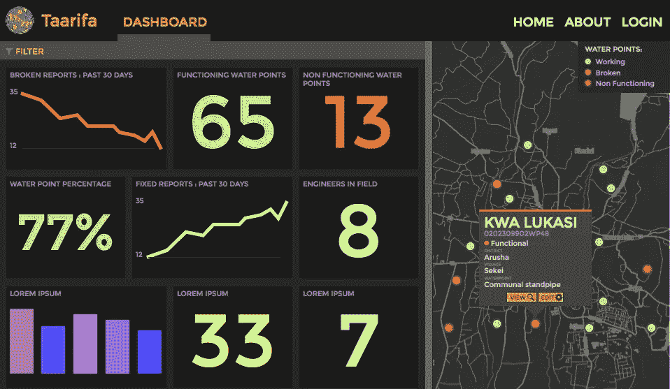
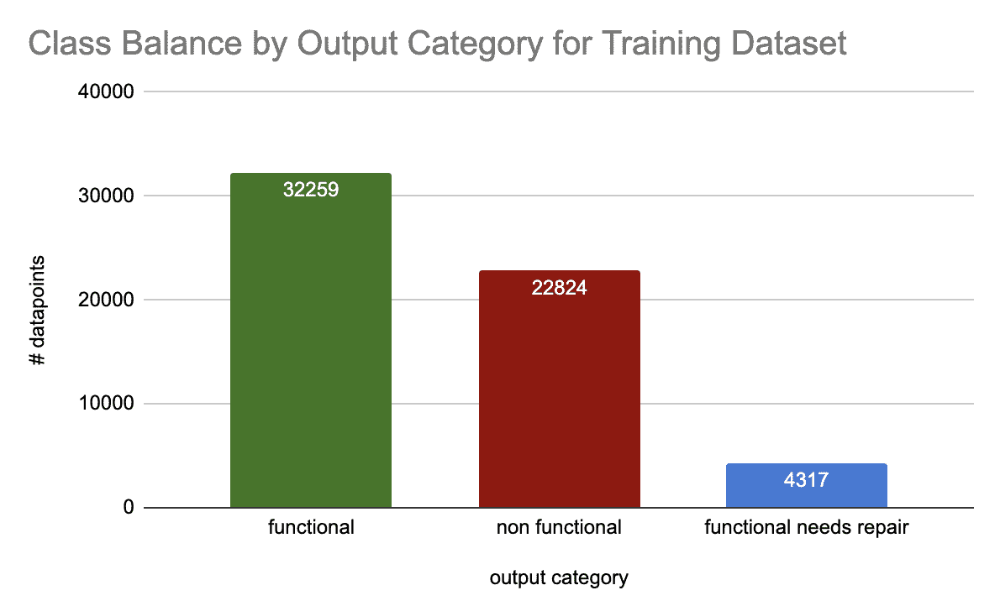
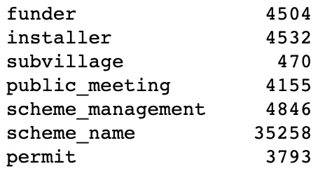
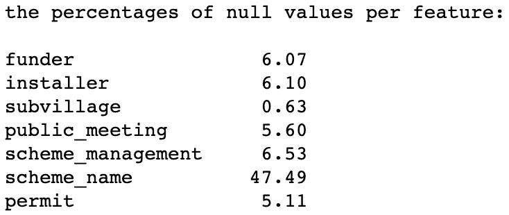
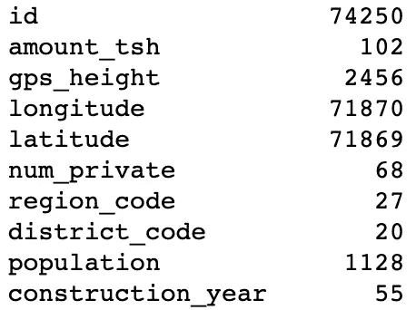
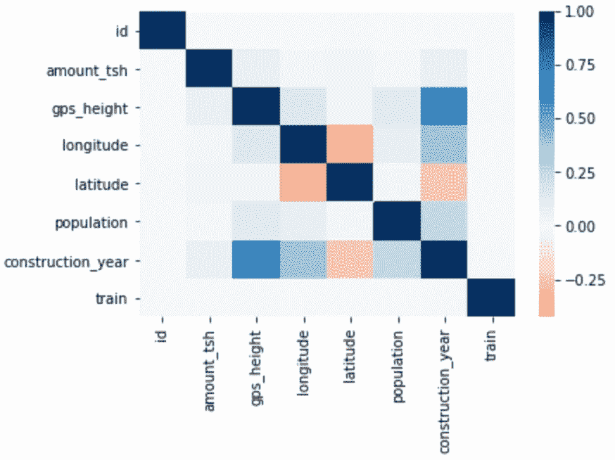
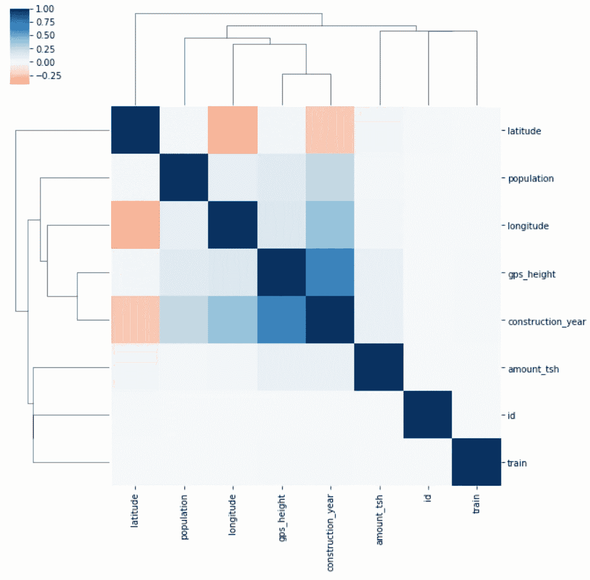

# 数据科学的数据预处理和探索性数据分析(EDA ):应对 Taarifa 挑战

> 原文：<https://towardsdatascience.com/data-preprocessing-and-eda-for-data-science-50ba6ea65c0a?source=collection_archive---------7----------------------->

## 我们如何使用不同的数据预处理和探索性数据分析(EDA)技术为预测建模准备数据？

# 介绍

**数据预处理**和**探索性数据分析(EDA)** 是任何数据科学项目必不可少的任务。在本文中，我们将查看一个样本数据集，挑战并应用一些数据预处理和 EDA 技术。

请注意，数据预处理和 EDA 是不同的术语，但有许多重叠的子任务，通常可以互换使用。

数据集和原始代码可以通过[这个 GitHub 链接](https://github.com/AntonioStark/Taarifa-Water-Pumps)访问。

# 挑战

我将在这篇文章中使用的挑战来自[Drivendata.org](http://www.drivendata.org)。你可以把它想象成一场挑战社会影响的游戏。你仍然可以获得同样的奖金和格式良好的数据集，额外的好处是你将对世界产生积极的影响！

我们在本文中使用的特殊挑战称为“ [**向上泵:数据挖掘地下水位**](https://www.drivendata.org/competitions/7/pump-it-up-data-mining-the-water-table) ”面临的挑战是**创建一个模型，该模型将预测特定水泵(“water point”)**的状况，因为它有许多属性。


This is a water pump, or a water point. Each data point we’re looking at in this article corresponds to an actual waterpoint in Tanzania. Photo credits to [Taarifa](http://taarifa.org/)

数据由 [**Taarifa**](http://taarifa.org/) 提供，这是一个开源 API，收集这些数据并呈现给世界。如果你对他们的工作和他们的数据点代表什么感兴趣，一定要去看看他们的网站(还有 [GitHub](https://github.com/taarifa/TaarifaAPI) ！)



This is what the Taarifa API looks like. Don’t worry; we’re not going to do anything about it today.

# 数据

这些数据集描述了超过 74，000 个数据点，代表了 Taarifa 数据目录中的一个水点。59，400 个数据点(整个数据集的 80%)在训练组中，而 14，850 个数据点(20%)在测试组中。

训练数据点有 40 个特征，一个特征是其当前功能的标签。所有数据点都有一个特征，那就是水点的 ID。

有三个数据集，两个用于训练组，一个用于测试组。

```
train_values is a dataset of 59400 data points of 40 features train_labels is a dataset of 59400 data points of 2 features test_values is a dataset of 14850 data points of 40 features
```

## 输出类别

训练数据集带有**三个标签**:“功能性”、“功能性-需要修复”和“非功能性”。标签显示了该供水点的状况。我们的工作是预测测试数据集中的水点的状况。



如上所示，“功能性”占训练数据集的 54.3%，“功能性-需要修复”占 7.3%，“非功能性”占 38.4%。输出似乎有点不平衡**，但我们还不确定这种不平衡是否会很明显。我们将在建模部分回到这个问题。**

## **组合数据**

**为了有效地预处理数据，并将预处理措施应用于所有数据点，我们组合了训练和测试数据集。**

```
# 'status_group' column is assigned the status of each waterpoint, 'test' if unknown (i.e. the waterpoint belongs to the test dataset)
train_values['status_group']=train_labels.status_group
test_values['status_group']=['test']*test_values.shape[0]# 'train' column discerns if the waterpoint belongs to the training group or the testing group
train_values['train']=[True]*train_values.shape[0]
test_values['train']=[False]*test_values.shape[0]df = pd.concat([train_values,test_values])
```

****

**You can see how we now have a “status_group” and “train” columns. You can view the first five rows of your dataset using the df.head() function**

****

**In a similar manner, you can view the last five rows of the dataset using the df.tail() function. You can see that the status_group is ‘test’ for the testing dataset, denoted by the feature train = False.**

# **EDA/数据预处理**

**现在我们有了一个合并的数据集，我们可以在它上面做一些 EDA 魔术。**

## **删除缺少太多值的要素**

**任何数据集中的首要任务之一就是找出是否有缺失值。由于该数据集的要素数量超出了我们的预期，我们将删除缺失值过多的要素。让我们看看每个要素有多少个缺失值。**

```
nulls = df.isnull().sum()# this will show only features that have nonzero missing values
nulls[nulls!=0]
```

****

**Number of missing values for features that have missing values**

**似乎有相当多的特征缺少数据点！让我们看看它们在整个数据集中所占的百分比。**

```
nulls_percentage = nulls[nulls!=0]/df.shape[0]*100
print('the percentages of null values per feature:\n')
print(round(nulls_percentage,2))
```

****

**The percentage of missing values in each feature**

**看起来具有**任何**缺失值的特征具有**大量的**缺失值。对于' scheme_name '，它几乎丢失了一半的数据！因此，如果要素包含任何缺失值，则消除整个要素是安全的。我们可以通过在 **dropna** 函数中标记 how =‘any’来注意到这一点。**

```
features_original = df.shape[1]
df.dropna(axis='columns',how='any',inplace=True)
features_reduced = df.shape[1]
print('number of features reduced from %d to %d'%(features_original,features_reduced))
```

## **识别数字但分类的特征**

**识别分类特征的一个不太好的方法是检查它的值是否是**非数字的**。但是有一些特征**的类别是数值**。这意味着数值的大小没有内在的意义，即特征是分类的而不是顺序的(即有顺序)。**

**很多时候，我们不能确定一个数字特征是有序的还是分类的。我们不得不询问那些实际给数据点分配数字的人，看看他们是否有内在的意义。**

**但是通过观察每个特征出现了多少个“唯一的”数字，我们可以猜测一个数字特征是否是绝对的。**

```
df.select_dtypes(include='number').nunique()
```

****

**The number of unique values per numerical feature**

**在这里，我们可以看到有五个要素的唯一值数量异常少。这表明这些数值实际上代表分类值。**

**查看数据集文档，我们发现五个特征中的三个:‘num _ private’，‘region _ code’，‘district _ code’是**地理代码**，其数值与我们的挑战无关。让我们将它们转换成字符串，以便在接下来的章节中使用它们。**

```
df['num_private'] = df.num_private.astype(str)
df['region_code'] = df.region_code.astype(str)
df['district_code'] = df.district_code.astype(str)
```

## **删除类别过多的分类要素**

****分类特征**与**太多的分类**通常对预测模型没有用。让我们来看看每个分类特征有多少个类别。**

```
uniques = df.select_dtypes(exclude='number').nunique()
uniques
```

****

**The number of unique values per nonnumerical feature**

**我们有一些特征，它们的类别数量不足以证明它们是一个“分类”变量。假设我们有超过 74，000 个数据点，一个有超过 740 个类别的**的特性，平均每个类别的**将少于 100 个数据点**。让我们来看看哪些功能有超过 740 个独特的类别。****

```
uniques[uniques>740]
```

****

**Features with more than 740 unique values**

**只有两个功能有超过 740 个类别:“wpt_name”和“ward”我们可以简单地用熊猫拖放功能来拖放它们。**

```
df.drop(columns=['wpt_name','ward'],inplace=True)
```

## **移除值太少的分类要素**

**我们还有很多功能。我们希望**减少分类特征**，因为一旦我们应用**一键编码**，它们将会增加特征的数量。**

**另一种类型的分类特征通常是无用的**特征，其类别很少出现**。让我们找到这样的特征。**

**在上一节中，我们删除了每个类别的“平均”数据点少于 100 个数据点的特性。这里，我们将删除每个类别的**“最小”数据点**小于 100** 的特征。****

```
thresh = 100for col in df.select_dtypes(exclude='number').columns:
    value_counts = df[col].value_counts()
    if value_counts.min(axis=0) < thresh:
        df.drop(columns=col,inplace=True)
```

**有 10 个特征的每个类别的最小数据点少于 100。让我们快速回顾一下，看看保留了哪些非数字特性，以及每个特性有多少个类别:**

```
df.select_dtypes(exclude='number').nunique()
```

****

**The number of categories per categorical feature left in our dataset**

## **丢弃不相关的特征(并绘制相关热图)**

**好的，让我们快速检查一下我们还剩下哪些功能:**

```
print('total number of features: %d\n'%(df.shape[1]))
df.dtypes
```

****

**The features left in our dataset**

**老实说，当我们还没有运行任何模型(并看到它们的结果)时，我们不能十分确定哪些特性将是“不相关的”。当特征的组合，而不是单个特征，可能是找到正确分类方案的关键时，尤其如此。**

**让我们看看是否有“完全不相关”的功能，当删除时，可能不会影响其他功能。这仍然不能保证这个特性和其他特性结合起来就没有用，但是可以指引我们找到一些有希望的。**

**就像在，让我们画一些相关热图！**

**请注意，我们现在只能绘制数字特征的关联热图。有一种方法可以绘制分类变量的相关热图，但这种方法要麻烦得多。**

```
import seaborn as snssns.heatmap(df.corr(), cmap='RdBu',center=0)
plt.show()
```

****

**Correlation heat map for numerical features.**

**似乎有一些功能相对于其他功能来说没有价值。我们先把特征排序一下，看看是哪些。**

```
sns.clustermap(df.corr(), cmap='RdBu',center=0)
```

****

**The cluster map of the correlations of numerical features**

**因此特征‘amount _ TSH’和‘id’似乎与其他特征相对不相关，可以安全地忽略。注意，‘amount _ TSH’是‘水点可用的水量’，而‘id’是，你知道，水点的 ID。这两个似乎都不是特别有价值，所以让我们把它们扔掉吧。**

**看看类别的数量，我们还看到特征‘recorded _ by’是只有一个类别的分类特征。那肯定是没用的，所以我们也可以把那个去掉。**

**还要认识到，特性“train”只是为了跟踪数据集分组，所以我们不必关心这个。**

```
df.drop(columns = ['amount_tsh','id','recorded_by'],inplace=True)
```

## **一键编码**

**既然我们认为剩下的所有特性都是“有价值”的，我们可以继续进行一次性编码了！请记住，这将增加数据集的要素总数。**

```
columns_categorical = ['basin','region','extraction_type_group','extraction_type_class','management','management_group','payment','payment_type','quality_group','quantity','quantity_group','source_type','source_class']df = pd.get_dummies(df,columns=columns_categorical)
```

**在一次性编码之后，我们看到我们的**特征数量从 20 增加到了 114。****

## **普通格式**

**最后要做的一件事是为“status_group”特性提供普通性。虽然这是一个绝对的特征，但它也有规律可循。即**有一个顺序关系**功能>功能需要修复>非功能。一种快速而肮脏的方法是用数字值替换字符串值。**

**Pandas 确实支持类别类型系列的内部订购功能，但它确实有点麻烦，所以我们在这里不做了。但严格来说，用熊猫给出的条例法更准确，尤其是类别之间的“距离”可能不相等的时候。通过给出数字，我们可以说“功能性”和“功能性需求修复”之间的差异与“功能性需求修复”和“非功能性”之间的差异是一样的。**

```
status_group_dict = {'functional':2,'functional needs repair':1,'non functional':0}
df.status_group = df.status_group.replace(status_group_dict)
```

**就是这样！现在，我们有了一个格式优美的数据集，我们现在可以将它放入一些模型中，以生成一些预测。如果你只是对数据预处理和 EDA 感兴趣，你可以在这里结束。如果你想看看这个清理过的数据集如何用于预测建模和多类分类，你可以点击查看[的那篇文章。](https://medium.com/@antoniostark/a4d2c428a2eb?)**