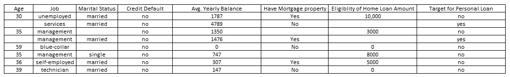
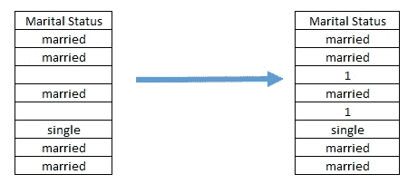
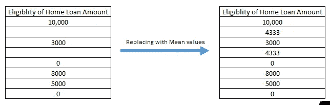
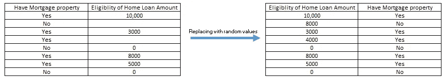
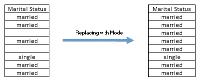
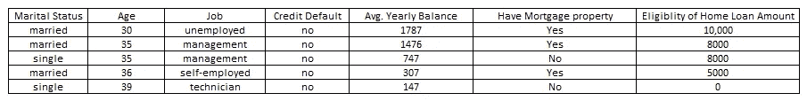
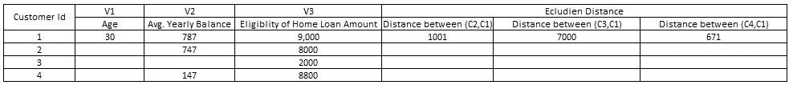

# 数据预处理——艺术还是科学

> 原文：<https://towardsdatascience.com/data-preprocessing-art-or-science-7d13ae5663fa?source=collection_archive---------23----------------------->

## 缺失值插补

## 数据预处理(第 1 部分)

大多数人都说任何分析模型的核心是模型构建，但我宁愿说它的数据预处理，而不是模型构建。一个人只能建立模型，一旦他/她处理了数据或干净的数据。所有可用的原始数据都是不完整的，在做任何进一步的分析之前需要清理，因为有一种说法是，如果输入是错误的，输出只会产生误导。

数据预处理是在执行任何任务之前清理数据以使其更有意义的过程，因此，它成为任何分析任务(无论是描述性分析还是预测性分析)的重要组成部分。

**如何进行数据预处理:**

无用或多余的字段

缺少值

极端值

数据转换

让我们用示例数据信息来详细讨论这些。

Sample data for Personal Laon user prediction

1) **冗余字段:**在开始任何种类的预处理或数据分析之前，必须非常仔细地观察数据。深入数据预处理之前要检查的事项:

a)如果发现重复记录，需要删除。

b)需要检查数据格式，有时你需要考虑几个变量到文本中，但那可能会变成数字。

c)寻找相关变量，如果发现高度相关或完全相关的变量，那么保留两个变量就变得多余，因此可以删除一个变量。堆图，相关矩阵用于检查这一点。

2) **缺失值:**数据集经常会有一些数据缺失的变量，我们不知道如何处理这些缺失值。一个简单的方法是删除这样的行或列。但是不知道这样做是否正确，因为数据集可能很小，删除这些值可能会丢失最重要的信息。

> 事实上，Gallit Shmueli、Nitin Patel 和 Peter Bruce 指出，如果 30 个变量的数据集中有 5%的数据值缺失，并且缺失值均匀分布在整个数据中，则几乎 80%的记录至少会有一个缺失值，因此通过简单地删除有缺失数据的行，我们会剩下 20%的数据，因此删除数据始终不是一个解决方案。

现在的解决方案是用一些值替换缺失值，这叫做**“缺失值插补”**。以下是将 wrt 值输入数据类型的几种方法。

2.1) **用某个常数或零替换缺失值:**一种处理缺失值的方法是用某个常数或零替换缺失值，但这样做，你创建了一个新的类或变量，你可以确定它是否存在，因此这不是估算缺失值的好方法。

Replace missing value with some random value

因此，如果我们在婚姻状况中输入一些随机 1，那么它是一个单独的类别，没有任何解释，对于连续变量也是一样，它不会给出太多信息。

2.2) **当变量为连续变量时，替换缺失值:**有多种方法可以对连续变量的数据进行插补。下面列出了其中的一些。

a) ***带均值/中值*** :您可以通过相应变量的均值/中值估算您的缺失值。这种方法的优点是，它是一种更快的估算数据的方法，当您有小数据集时工作得相当好，但是建模完全是关于数据的可变性，数据点彼此之间有多远或多近，所以如果您用平均值或模式估算数据，它会失去数据的可变性，可能工作得不好。此外，它不能用于分类变量。

Mean Imputation

同样，可以进行中位数插补。

b) ***从分布*** 中随机选择值:另一种输入连续变量的方法是从该变量的观测分布中随机选择值。这种方法的好处是，与均值/中值替换法相比，中心和扩散的度量更接近原始值。

Replace missing value with the random value from distribution

在这种情况下，如果您看到，根据随机值，第二次记录的房屋贷款金额的合格性为 8000，而客户没有抵押财产，因此该值没有意义，因此使用该方法时需要非常小心，因为这不会在插补时考虑其他变量。

c) ***线性回归:*** 另一种估算连续数据的方法是通过线性回归。在这种情况下，您要进行插补的变量成为您的目标变量，而 rest 成为您的响应变量(我们在此过程中不考虑实际的目标变量，因为它会在以后的建模中产生偏差)。一旦我们创建了这样的数据，逐步过程就被用于开发线性回归，并且在回归参数被估计之后，缺失值的预测就实现了。

现在，如果您必须估计一个记录的两个/多个变量，那么我们将使用以下方法:

第一步:建立回归模型来估算第一个变量，不要将第二个变量作为预测变量。

第二步:构建一个回归模型来估算第二个变量，包括第一步中找到的第二个变量的值。

2.3) **当变量为分类变量时，替换缺失值:**有多种方法可以估算连续变量的数据。下面列出了其中的一些。

**a)** ***带模式:*** 分类变量可使用该变量内的模式(频率最高的值)进行估算。这是为分类变量估算值的最简单方法，但这一过程可能会在数据中产生偏差，因为您将在变量内所有缺失的空间中估算相同的值。

在这个变量中，大部分缺失值变成了已婚值，如果大部分数据变成了两类中的一类，那么这个变量可能会提供更多的信息。

**b)** ***使用决策树或逻辑回归:*** 为分类变量估算缺失数据的另一种方法是通过决策树。同样，在这种情况下，您要进行插补的变量成为您的目标变量，而 rest 成为您的预测变量(我们在此过程中不考虑实际的目标变量，因为它会在以后的建模中产生偏差)。一旦我们创建了这样的数据，您就可以运行 *CART* 算法来寻找规则，并在此基础上对分类变量进行插补。

比方说，在我们的案例中，我们想要估算婚姻状况，那么我们将考虑这样的数据，其中婚姻状况成为目标变量，其余的其他变量成为预测变量。此外，丢失的值行将从变量中删除。

New data for Decision tree imputation

因此，决策树将为您提供规则，如年龄> 35 岁，工作=管理，信用违约=否，那么 96%的数据是已婚的，4%是单身的。因此，缺失的值可以通过查看其他变量的信息来替换，准确率为 96%。

**c)** ***用 K 近邻替换缺失值(KNN):*** KNN 是最常用的估算缺失值的方法之一。它既可以用于连续变量，也可以用于分类变量。KNN 算法对相似性度量起作用，例如*欧几里德距离、余弦距离、汉明距离、*等。KKN 的基本方法是试图在所有的观察值中找出最近邻来进行距离度量的插补。具有最低距离值的观察值被认为是邻居，然后取 K 个邻居的平均值来估算缺失值，以使其更加精确。k 可以取任何值作为前 3 个邻居、5 个邻居等等。

在下面的例子中，我们有 4 个客户 id 和 3 个变量(这里，为了便于解释，我考虑了一个唯一的连续变量，以便使用欧几里德距离来寻找距离，否则也可以使用分类变量。

Sample data for Decision Tree imputation

因此，已经计算了三个客户中的每一个客户到 C1 的距离，对于距离计算来说，缺失数据的变量将被丢弃，而剩余的变量将被取出，该距离将从每个邻居开始计算。我们可以看到，客户 4 与客户 1 的距离最短，因此客户 4 和客户 1 被视为彼此最近的邻居，因此可以估算值。此外，我们可以取 5 个最近的邻居，而不是取一个最近的邻居，并且可以估算平均值。

现在，有两种策略来识别谁将充当观察的邻居，然后执行最近邻居计算:一种是完全案例策略，另一种是不完全案例策略。

1.  *完整案例策略:*案例可以充当邻居当且仅当它包含所有属性。在我们的案例中，完全案例战略将把 C1 视为邻国。
2.  *不完整事例策略:*当且仅当事例包含要估算的事例具有值的所有属性的值以及要估算的属性的值时，事例才能充当邻居。就我们而言，C1、C2 和 C4 可以成为邻居。

但是必须意识到，当数据太大时，这个过程是非常耗时的。

因此，缺失值可以通过多种技术和方法进行插补，插补方法没有对错之分，只是哪种方法最适合您的数据集，并能给出最准确的结果。没有办法替换丢失空间中的精确数据，但是可以尝试替换多少相近的值。

以上是关于数据预处理的第 1 部分，我已经谈到了数据冗余和缺失值插补，在数据预处理的第 2 部分，我将讨论异常值和数据转换。