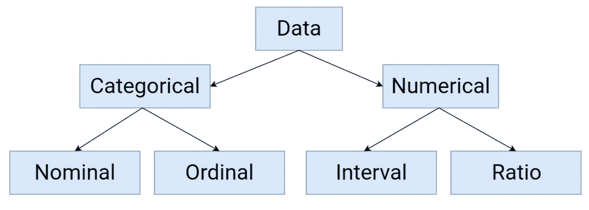
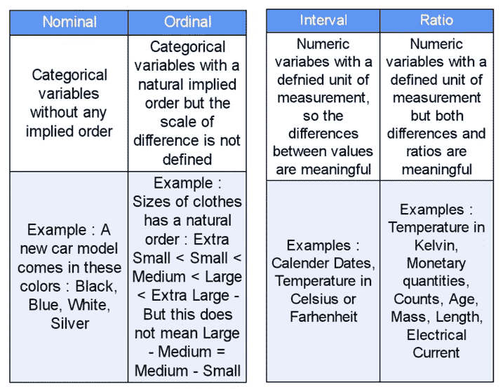
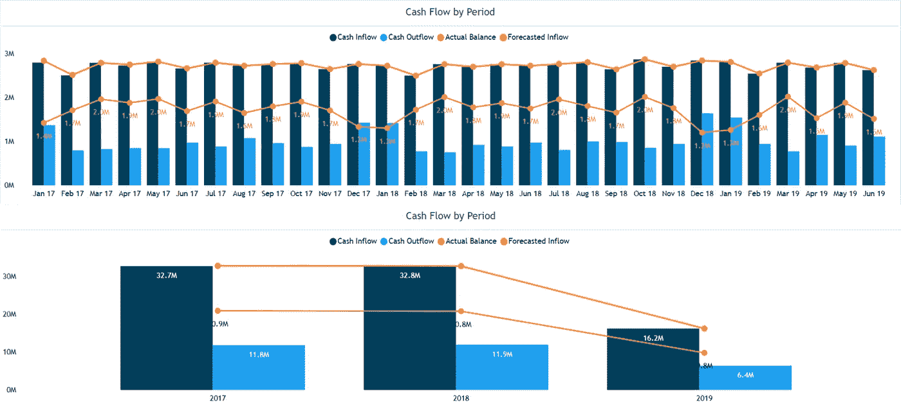
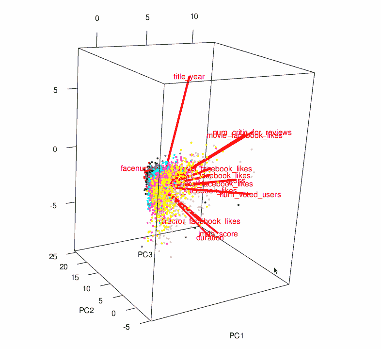
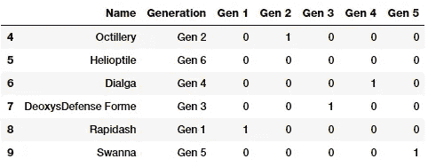

# 数据预处理:概念

> 原文：<https://towardsdatascience.com/data-preprocessing-concepts-fa946d11c825?source=collection_archive---------1----------------------->

Photo by [Michael Dziedzic](https://unsplash.com/@lazycreekimages?utm_source=medium&utm_medium=referral) on [Unsplash](https://unsplash.com?utm_source=medium&utm_medium=referral)

## 机器学习

## 在当今世界，数据被真正视为一种资源。根据世界经济论坛，到 2025 年，全球每天将产生约 463 的数据！但所有这些数据都足够适合机器学习算法使用吗？我们如何决定？在本文中，我们将探讨数据预处理的主题——转换数据，使其成为机器可读的…

本文的目的是介绍数据预处理中使用的概念，这是机器学习过程中的一个主要步骤。让我们从定义它是什么开始。

> ***什么是数据预处理？***

当我们谈到数据时，我们通常会想到一些包含大量行和列的大型数据集。虽然这是一种可能的情况，但并不总是如此——数据可能有许多不同的形式:结构化的表格、图像、音频文件、视频等..

机器不理解自由文本、图像或视频数据，它们理解 1 和 0。因此，如果我们放上所有图像的幻灯片，并期望我们的机器学习模型仅仅通过它来训练，这可能还不够好！

> 在任何机器学习过程中，数据预处理都是对数据进行转换或*编码*的步骤，以使其达到机器可以轻松解析的状态。换句话说，数据的*特征*现在可以很容易地被算法解释。

> ***机器学习中的特性***

数据集可以被看作是数据对象*的集合，数据对象*通常也被称为记录、点、向量、模式、事件、案例、样本、观察或实体。
数据对象由许多*特征*描述，这些特征捕捉对象的基本特征，如物理对象的质量或事件发生的时间等..特性通常被称为变量、特征、字段、属性或维度。

根据[维基百科](https://en.wikipedia.org/wiki/Feature_(machine_learning))，

> 特征是被观察现象的一个单独的可测量的属性或特征

例如，颜色、里程和功率可以被认为是汽车的特征。我们在处理数据时会遇到不同类型的特征。

Statistical Data Types | *Image by Author*

功能可以是:

*   **分类:**其值取自一组定义的值的特征。例如，一周中的天数:{星期一，星期二，星期三，星期四，星期五，星期六，星期天}是一个类别，因为它的值总是取自这个集合。另一个例子是布尔集合:{True，False}
*   **数值:**取值连续或整数值的特征。它们用数字来表示，并拥有数字的大部分性质。例如，你一天走的步数，或者你开车的速度。

Feature Types | Image by Author

现在我们已经讨论了基础知识，让我们从数据预处理的步骤开始。请记住，并不是所有的步骤都适用于每个问题，它高度依赖于我们正在处理的数据，因此对于您的数据集，可能只需要几个步骤。一般来说，它们是:

*   数据质量评估
*   特征聚合
*   特征采样
*   降维
*   特征编码

> ***数据质量评估***

因为数据通常来自多个来源，这些来源通常不太可靠，并且格式也不尽相同，所以在处理机器学习问题时，我们一半以上的时间都花在了处理数据质量问题上。期望数据完美是不现实的。可能由于人为错误、测量设备的限制或数据收集过程中的缺陷而出现问题。让我们来看看其中的一些问题和处理方法:

1.**缺失值** :
数据集中缺失值是很常见的。这可能发生在数据收集期间，或者可能是由于某些数据验证规则，但无论如何，必须考虑缺失值。

*   消除有缺失数据的行:
    简单且有时有效的策略。如果许多对象缺少值，则失败。如果一个特征有大部分缺失值，那么该特征本身也可以被消除。
*   估计缺失值:
    如果只有合理百分比的值缺失，那么我们也可以运行简单的[插值方法](https://en.wikipedia.org/wiki/Interpolation)来填充这些值。然而，处理缺失值的最常见方法是用各自特征的平均值、中值或众数来填充它们。

Photo by [Firmbee.com](https://unsplash.com/@firmbee?utm_source=medium&utm_medium=referral) on [Unsplash](https://unsplash.com?utm_source=medium&utm_medium=referral)

2.**不一致的值** :
我们知道数据可以包含不一致的值。最有可能的是，我们已经在某个时候面临这个问题。例如，“地址”字段包含“电话号码”。这可能是由于人为错误，或者可能是从手写表单扫描时信息被误读。

*   因此，总是建议执行数据评估，例如了解要素的数据类型，以及它是否对所有数据对象都相同。

3.**重复值** :
数据集可能包含彼此重复的数据对象。这可能发生在同一个人不止一次提交表单的时候。术语“重复数据删除”通常指处理重复数据的过程。

*   在大多数情况下，当运行机器学习算法时，重复项被删除，从而不会给该特定数据对象带来优势或*偏差*。

> ***特征聚合***

执行特征聚合以获取聚合值，从而更好地观察数据。考虑交易数据，假设我们有一个产品的日常交易，记录了该产品一年中在不同商店位置的每日销售。将交易汇总到单个商店范围的每月或每年的交易将有助于我们减少特定商店每天发生的数百或数千笔交易，从而减少数据对象的数量。

*   这导致内存消耗和处理时间的减少
*   聚合为我们提供了数据的高级视图，因为组或聚合的行为比单个数据对象更稳定

Aggregation from Monthly to Yearly | Image by Author

> ***特征采样***

抽样是选择我们正在分析的数据集子集的一种非常常见的方法。在大多数情况下，考虑到内存和时间的限制，使用完整的数据集可能会变得过于昂贵。使用采样算法可以帮助我们减少数据集的大小，从而可以使用更好但更昂贵的机器学习算法。

这里的关键原则是，采样应该以这样的方式进行，即生成的样本应该具有与原始数据集大致相同的属性，这意味着样本具有代表性。这包括选择正确的样本量和采样策略。
*简单随机抽样*表明选择任何特定实体的概率相等。它也有两个主要变化:

*   **无替换采样**:当每个项目被选中时，它将从构成总数据集的所有对象集中删除。
*   **替换采样**:项目被选中后，不会从总数据集中删除。这意味着他们可以不止一次被选中。

Data Sampling | Image by [IStock](http://istock.com)

虽然简单随机抽样提供了两种很好的抽样技术，但是当数据集包含的对象类型在比例上变化很大时，它可能无法输出一个有代表性的样本。当样本需要正确表示所有对象类型时，这可能会导致问题，例如，当我们有一个*不平衡的*数据集时。

> 不平衡数据集是指一个类的实例数量明显高于另一个类，从而导致不平衡并产生更少的类。

在样本中充分代表稀有类是至关重要的。在这些情况下，我们可以使用另一种抽样技术，称为*分层抽样*，它从预定义的对象组开始。分层抽样也有不同的版本，最简单的版本建议从所有组中抽取相同数量的对象，即使这些组的大小不同。欲了解更多关于采样的信息，请查看由[团队 AV](https://medium.com/u/c7c686fcd4b?source=post_page-----fa946d11c825--------------------------------) 撰写的这篇文章。

 [## 8 种抽样技术的数据科学家指南

### 概述抽样是一个流行的统计概念-了解它是如何工作的在这篇文章中，我们还将讨论八…

www.analyticsvidhya.com](https://www.analyticsvidhya.com/blog/2019/09/data-scientists-guide-8-types-of-sampling-techniques/) 

> ***降维***

大多数真实世界的数据集都有大量的要素。例如，考虑一个图像处理问题，我们可能要处理数千个特征，也称为*维度*。顾名思义，降维旨在减少特征的数量——但不仅仅是通过从*特征集*中选择一个特征样本，这是另一回事——特征子集选择或简单的特征选择。

从概念上讲，*维度*是指数据集所在的几何平面的数量，它可能很高，以至于无法用笔和纸来可视化。这种平面的数量越多，数据集的复杂性就越大。

**维度的诅咒** 这是指随着数据维度的增加，数据分析任务通常会变得更加困难。随着维度的增加，数据所占据的平面数量增加，从而给数据增加了越来越多的稀疏性，这很难建模和可视化。

Representation of components in different spaces | Image by [NYC DS Academy](https://nycdatascience.com/blog/student-works/web-scraping/movie-rating-prediction/)

2D 说，降维本质上是将数据集映射到一个更低维度的空间，这个空间很可能是一些现在可以可视化的平面。用于此目的的技术的基本目标是通过创建由旧特征组合而成的新特征来降低数据集的维度。换句话说，高维特征空间被映射到低维特征空间。[主成分分析](https://en.m.wikipedia.org/wiki/Principal_component_analysis)和[奇异值分解](https://en.m.wikipedia.org/wiki/Singular_value_decomposition)是两种被广泛接受的技术。

降维的几个主要好处是:

*   如果数据集的维度较低，数据分析算法会工作得更好。这主要是因为现在已经消除了不相关的特征和噪声。
*   建立在低维数据之上的模型更容易理解和解释。
*   数据现在也变得更容易可视化了！为了可视化的目的，特征总是可以成对或成组出现，如果特征集不是很大，这更有意义。

> ***特征编码***

如前所述，数据预处理的整个目的是*编码*数据，以便使其达到机器现在可以理解的状态。

> 特征编码基本上是对数据执行转换，以便它可以容易地被接受为机器学习算法的输入，同时仍然保留其原始含义。

执行特征编码时，需要遵循一些通用规范或规则。对于连续变量:

*   **Nominal** :可以进行任何一对一的映射，并保留其含义。例如，像在[一键编码](https://en.wikipedia.org/wiki/One-hot)中的值的排列。
*   **序数**:值的保序变化。借助于一个新的函数，小、中、大的概念可以得到同样好的表示，即<new _ value = f(old _ value)>——例如，{0，1，2}或者可能是{1，2，3}。

One-hot encoding of the data | Image by Author

对于数值变量:

*   **区间**:简单的数学变换，如使用等式<new _ value = a * old _ value+b>，a 和 b 为常数。例如，单位的零值大小不同的华氏温标和摄氏温标可以用这种方式编码。
*   **比率**:这些变量可以缩放到任何特定的度量，当然，同时仍然保持其值的意义和比率。在这种情况下，简单的数学转换也可以工作，比如转换< new_value = a*old_value >。因为，长度可以用米或英尺来计量，货币可以用不同的货币来兑换。

> ***训练/验证/测试分割***

完成特征编码后，我们的数据集就可以用于令人兴奋的机器学习算法了！
但是在我们开始决定应该使用哪种算法之前，总是建议将数据集分成 2 部分，有时是 3 部分。机器学习算法，或任何这方面的算法，必须首先根据可用的数据分布进行训练，然后进行验证和测试，然后才能部署来处理现实世界的数据。

**训练数据**:这是你的机器学习算法实际训练建立模型的部分。模型试图*学习*数据集及其各种特征和复杂性，这也提出了[过拟合 v/s 欠拟合](https://en.wikipedia.org/wiki/Overfitting)的问题。

**验证数据**:这是数据集的一部分，用于验证我们的各种模型拟合。简而言之，我们使用验证数据来选择和改进我们的模型超参数。该模型不*学习*验证集，而是使用它来达到超参数的更好状态。

**测试数据**:这部分数据集用来测试我们的模型假设。在模型和超参数确定之前，它是不可触及的，也是不可见的，只有在模型应用于测试数据之后，它才能获得在真实数据上部署时性能的准确度量。

Data Split into parts | Image by Author

**拆分比率**:数据按照*拆分比率*进行拆分，拆分比率高度依赖于我们正在构建的模型类型和数据集本身。如果我们的数据集和模型需要大量的训练，那么我们会使用更大的数据块来进行训练(通常是这样)，例如，对文本数据、图像数据或视频数据的训练通常涉及数千个特征！
如果模型有很多可以调整的超参数，那么为验证集保留更高百分比的数据是明智的。超参数数量较少的模型易于调整和更新，因此我们可以保持一个较小的验证集。
像机器学习中的许多其他事情一样，分割比率高度依赖于我们试图解决的问题，并且必须在考虑关于模型和手头数据集的所有各种细节之后决定。

在本文中，我想对数据预处理的概念做一个扎实的介绍，这是任何机器学习过程中的一个关键步骤。我希望这对你有用。
如果有任何反馈请在评论里告诉我！

如果你想看到更多这样的文章，请前往数据科学门户网站

 [## 数据科学门户

### 大家好，欢迎来到数据科学门户。这个空间致力于学习和理解所有令人兴奋的…

thedatascienceportal.com](https://thedatascienceportal.com/) 

感谢阅读！