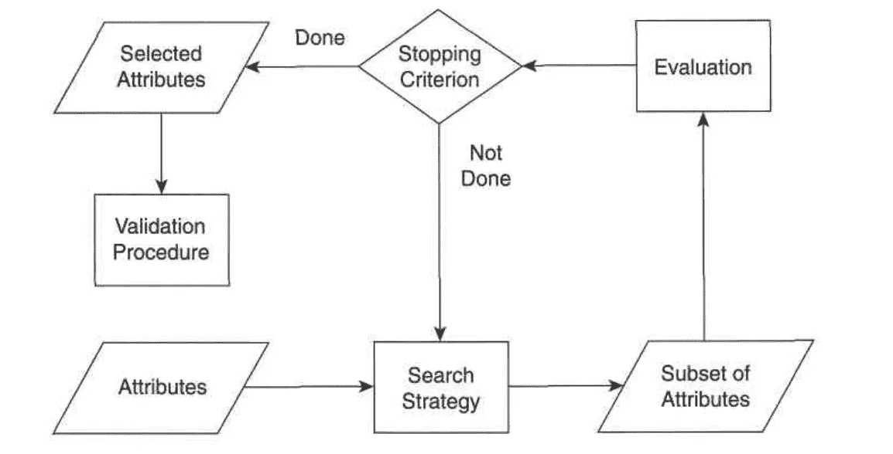
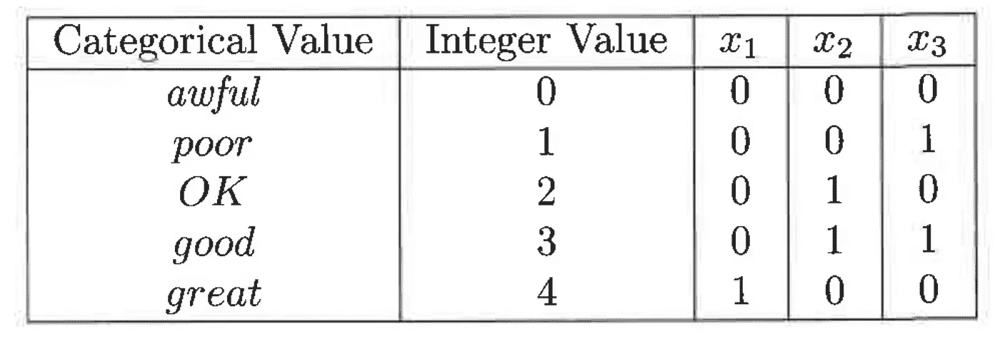
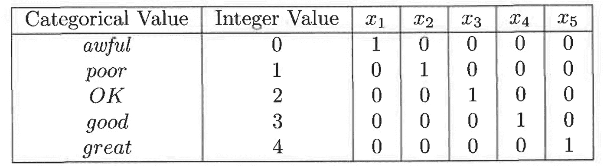

# 数据挖掘和机器学习中的数据预处理

> 原文：<https://towardsdatascience.com/data-preprocessing-in-data-mining-machine-learning-79a9662e2eb?source=collection_archive---------3----------------------->

## 有了详细的概念…

Video version of the story, if you are into that sort of thing | Part 1

Video version of the story, if you are into that sort of thing | Part 2

在 [*我之前的一个帖子*](/measures-of-proximity-in-data-mining-machine-learning-e9baaed1aafb) 中，我讲过数据挖掘中的 ***接近度的度量&机器学习*** 。这个就继续那个，如果还没看的话，这里看一下**以便对我在文章中要讲的话题和概念有一个恰当的把握。**

**数据预处理是指使数据更适合数据挖掘的步骤。用于数据预处理的步骤通常分为两类:**

1.  **为分析选择数据对象和属性。**
2.  **创建/更改属性。**

> **请容忍我的概念部分，我知道这可能有点无聊，但如果你有强大的基础，那么没有什么可以阻止你成为一名伟大的数据科学家或机器学习工程师。**

**在本次讨论中，我们将讨论以下数据预处理方法:**

*   **聚合**
*   **抽样**
*   **降维**
*   **特征子集选择**
*   **特征创建**
*   **离散化和二值化**
*   **变量变换**

> ****什么是聚合？****

**→简单来说，它是指将两个或多个属性(或对象)组合成一个属性(或对象)。**

*****聚合*** 的用途如下:**

**→ **数据缩减:**减少对象或属性的数量。这导致更小的数据集，因此需要更少的内存和处理时间，因此，聚合可以允许使用更昂贵的数据挖掘算法。**

**→ **规模的变化:**通过提供数据的高级视图而不是低级视图，聚合可以充当范围或规模的变化。举个例子，**

*   **聚集成地区、州、国家等的城市。**
*   **天数累计成周、月和年。**

**→ **更“稳定”的数据:**聚合数据往往可变性更小。**

> ****什么是采样？****

**→抽样是选择要分析的数据对象子集的常用方法。**

**→取样的关键是使用具有代表性的样品**。**如果样本具有与原始数据集大致相同的(感兴趣的)属性，则该样本具有代表性。如果数据对象的均值(平均值)是感兴趣的属性，那么如果样本的均值接近原始数据的均值，则样本是有代表性的。**

## **取样类型**

*   ****简单随机抽样**:**

**→选择任何特定项目的概率相等**

**→ **无替换抽样:**当每一项被选中时，就从总体中删除。**

**→ **替换抽样:**当对象被选作样本时，它们不会从总体中删除。在替换取样中，同一物体可以被多次拾取。**

*   ****分层抽样:**把数据分成几个分区，然后从每个分区抽取随机样本。**
*   ****渐进采样:**恰当的样本量可能难以确定，因此有时会使用*自适应或渐进采样*方案。这些方法从小样本开始，然后增加样本量，直到获得足够大的样本。**

> ****什么是降维？****

**→降维一词通常是指那些通过创建旧属性组合而成的新属性来降低数据集维度的技术。**

*   ****目的:****

**→避免[维数灾难](/types-of-data-sets-in-data-science-data-mining-machine-learning-eb47c80af7a)。要了解这方面的更多信息，请访问我之前的一篇详细解释它的文章[。](/types-of-data-sets-in-data-science-data-mining-machine-learning-eb47c80af7a)**

**→减少数据挖掘算法所需的时间和内存。**

**→使数据更容易可视化。**

**→可能有助于消除不相关的特征或减少噪音。**

*   ****技法:****

**→ [主成分分析](https://www.youtube.com/watch?v=kw9R0nD69OU)**

**→ [奇异值分解](https://www.youtube.com/watch?v=mBcLRGuAFUk)**

**这里提到的技术非常广泛，可以在本文中讨论。你可以在网上了解更多。我在这两个网站上都添加了 YouTube 链接，如果你想看这些视频并学习的话。**

> ****什么是特征子集选择？****

**→这是通过仅使用可用特征的子集来降低数据维数的另一种方法。虽然这种方法似乎会丢失信息，但如果存在冗余和不相关的特征，情况就不是这样了。**

*   ****冗余功能:****

**→复制一个或多个其他属性中包含的大部分或全部信息。示例:产品的购买价格和支付的销售税金额。**

*   ****无关特性:****

**→不包含对手头的数据挖掘任务有用的信息。例子:学生的 ID 通常与预测学生 GPA 的任务无关。**

**虽然通过使用常识或领域知识可以立即消除一些不相关和冗余的属性，但是选择最佳的特征子集通常需要系统的方法。选择功能的理想方法是尝试将所有可能的功能子集作为感兴趣的数据挖掘算法的输入，然后选择产生最佳结果的子集。**

**有三种标准的特征选择方法: ***嵌入、过滤和包装。*****

## **嵌入式方法**

**特征选择作为数据挖掘算法的一部分自然发生。具体来说，在数据挖掘算法的操作过程中，算法本身决定使用哪些属性，忽略哪些属性。**

## **过滤方法**

**使用一些独立于数据挖掘任务的方法，在运行数据挖掘算法之前选择特征。例如，我们可能选择那些成对[相关性](/measures-of-proximity-in-data-mining-machine-learning-e9baaed1aafb)尽可能低的属性集。**

## **包装方法**

**这些方法使用目标数据挖掘算法作为黑盒，以类似于上述理想算法的方式找到属性的最佳子集，但是通常不枚举所有可能的子集。**

## **特征子集选择过程的流程图**

****

**Introduction to Data Mining — Pang-Ning Tan, Michael Steinbach, Vipin Kumar**

> ****什么是特征创建？****

**→它包括创建新属性，这些属性可以比原始属性更有效地捕获数据集中的重要信息。**

## **三种通用方法:**

*   ****特征提取****

**→从原始数据中创建一组新的特征称为特征提取。考虑一组照片，其中每张照片根据是否包含人脸来分类。原始数据是一组像素，因此不适合许多类型的分类算法。然而，如果数据被处理以提供更高级的特征，例如与人脸的存在高度相关的某些类型的边缘和区域的存在或不存在，那么一组更广泛的分类技术可以被应用于这个问题。**

**→这种方法具有高度的领域特异性。**

*   ****特征构造****

**→有时原始数据集中的特征具有必要的信息，但其形式不适合数据挖掘算法。在这种情况下，由原始特征构建的一个或多个新特征可能比原始特征更有用。**

**→示例:用质量除以体积得到密度**

*   ****将数据映射到新空间****

**→完全不同的数据视图可以揭示重要而有趣的特征。例如，考虑通常包含周期性模式的时间序列数据。如果只有一个周期模式并且没有太多噪声，那么该模式很容易被检测到。另一方面，如果存在许多周期性模式，并且存在大量噪声，则这些模式很难被检测到。然而，这种模式通常可以通过对时间序列应用傅立叶变换来检测，以便改变到频率信息明确的表示。**

> ****什么是离散化和二值化？****

## **[数]离散化**

**→离散化是将连续属性转化为有序属性的过程。**

**→潜在的无限数量的值被映射到少数类别中。**

**→分类中常用离散化。**

**→如果自变量和因变量都只有几个值，许多分类算法效果最好。**

## ****二值化****

**→二进制化将连续或分类属性映射成一个或多个二进制变量**

**→通常用于关联分析**

**→通常将连续属性转换为分类属性，然后将分类属性转换为一组二元属性**

**→关联分析需要不对称的二元属性**

**→示例:眼睛颜色和高度测量为{低、中、高}**

## **一个分类属性到三个二元属性的转换**

****

**Introduction to Data Mining — Pang-Ning Tan, Michael Steinbach, Vipin Kumar**

## **一个分类属性到五个非对称二进制属性的转换**

****

**Introduction to Data Mining — Pang-Ning Tan, Michael Steinbach, Vipin Kumar**

> ****什么是变量变换？****

**→属性转换是一种将给定属性的整组值映射到一组新的替换值的功能，这样每个旧值都可以用一个新值来标识**

****→简单函数:**幂(x，k)，对数(x)，幂(e，x)，|x|**

****→标准化:**指的是根据出现频率、平均值、方差、范围调整属性间差异的各种技术 **→标准化:**在统计学中，指的是减去平均值并除以标准差。**

**我们对数据预处理的讨论到此结束。**

**这个帖子的后续是[这里](/data-preprocessing-in-python-b52b652e37d5)。**

** [## Python 中的数据预处理

### 对于机器学习与工作代码的例子…

towardsdatascience.com](/data-preprocessing-in-python-b52b652e37d5)** 

**我将免费赠送一本关于一致性的电子书。在这里获得你的免费电子书。**

**如果你喜欢阅读这样的故事，那么你应该 [**在你的收件箱**](https://tarun-gupta.medium.com/subscribe) 中收到我的帖子，如果你想支持我成为一名作家，可以考虑[注册成为一名媒体会员](https://tarun-gupta.medium.com/membership)。每月 5 美元，你可以无限制地阅读媒体上的故事。如果你注册使用我的链接，我会赚一小笔佣金，不需要你额外付费。**

** [## 加入我的推荐链接-塔伦古普塔

### 作为一个媒体会员，你的会员费的一部分会给你阅读的作家，你可以完全接触到每一个故事…

tarun-gupta.medium.com](https://tarun-gupta.medium.com/membership) 

感谢阅读。如果你喜欢这篇文章，可以去看看我关于数据挖掘和机器学习的其他文章。

 [## Python 中的数据预处理

### 对于机器学习与工作代码的例子…

towardsdatascience.com](/data-preprocessing-in-python-b52b652e37d5)  [## 数据挖掘和机器学习中的相似性度量

### 在分析过程中执行数据转换

towardsdatascience.com](/measures-of-proximity-in-data-mining-machine-learning-e9baaed1aafb)  [## 评估数据质量

### 对于数据挖掘和机器学习算法…

towardsdatascience.com](/assessing-the-quality-of-data-e5e996a1681b)  [## 数据科学、数据挖掘和机器学习中的数据集类型

### 以及它们的一般特征…

towardsdatascience.com](/types-of-data-sets-in-data-science-data-mining-machine-learning-eb47c80af7a)  [## 数据挖掘之旅

### 数据导论

towardsdatascience.com](/journey-into-data-mining-3b5ccfa5343)**