# Python 中的数据预处理

> 原文：<https://towardsdatascience.com/data-preprocessing-in-python-b52b652e37d5?source=collection_archive---------1----------------------->

## 对于机器学习与工作代码的例子…

Video version of the story, if you are into that sort of thing

在 [*我之前的一个帖子*](/data-preprocessing-in-data-mining-machine-learning-79a9662e2eb) 中，我概念性的讲过数据挖掘 ***中的数据预处理&机器学习*** 。这个就继续那个，如果还没看的话，这里看一下[](/data-preprocessing-in-data-mining-machine-learning-79a9662e2eb)**以便对我在文章中要讲的话题和概念有一个恰当的把握。**

**D 数据预处理是指使数据更适合数据挖掘的步骤。用于数据预处理的步骤通常分为两类:**

1.  **为分析选择数据对象和属性。**
2.  **创建/更改属性。**

**在这篇文章中，我将介绍如何使用 Python 实现数据预处理方法。我将逐一介绍以下内容:**

1.  **导入库**
2.  **导入数据集**
3.  **缺失数据的处理**
4.  **分类数据的处理**
5.  **将数据集分为训练数据集和测试数据集**
6.  **特征缩放**

**F 对于这个数据预处理脚本，我将使用 [Anaconda Navigator](https://www.anaconda.com/distribution/) 特别是 Spyder 来编写下面的代码。如果第一次打开 Anaconda Navigator 时还没有安装 Spyder，那么可以使用用户界面轻松安装它。**

**如果你以前没有用 Python 编程，我建议你学习一些 Python 的基础知识，然后从这里开始。但是，如果您知道如何阅读 Python 代码，那么您就可以开始了。继续我们的脚本，我们将从第一步开始。**

> ****导入库****

```
**# librariesimport numpy as np # used for handling numbers
import pandas as pd # used for handling the datasetfrom sklearn.impute import SimpleImputer # used for handling missing datafrom sklearn.preprocessing import LabelEncoder, OneHotEncoder # used for encoding categorical datafrom sklearn.model_selection import train_test_split # used for splitting training and testing datafrom sklearn.preprocessing import StandardScaler # used for feature scaling**
```

**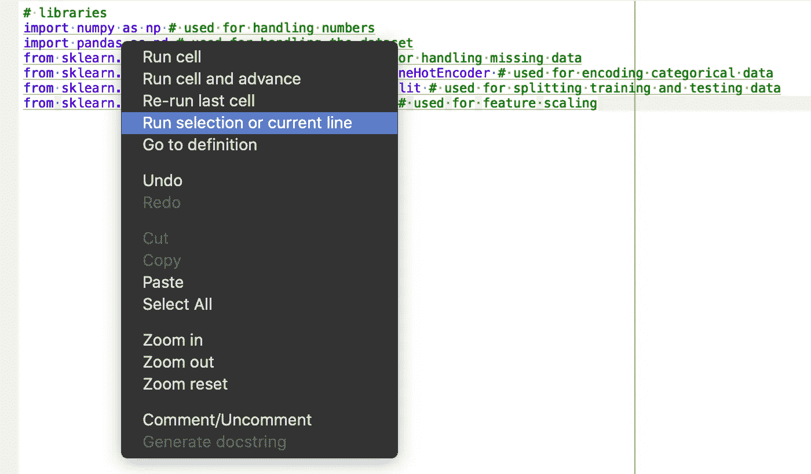**

**如果在 Spyder 中选择并运行上述代码，您应该会在 IPython 控制台中看到类似的输出。**

**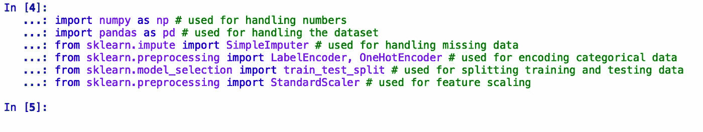**

**如果您看到任何导入错误，尝试使用如下的`pip`命令显式安装这些包。**

```
**pip install <package-name>**
```

> ****导入数据集****

**首先，让我们看一下我们将在这个特定示例中使用的数据集。你可以在这里找到[数据集](https://github.com/tarunlnmiit/machine_learning/blob/master/DataPreprocessing.csv)。**

**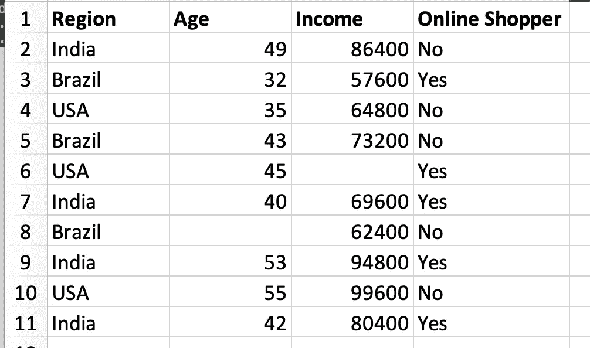**

**为了将这个数据集导入到我们的脚本中，我们显然要使用 pandas，如下所示。**

```
**dataset = pd.read_csv('Data.csv') # to import the dataset into a 
variable# Splitting the attributes into independent and dependent attributes
X = dataset.iloc[:, :-1].values # attributes to determine dependent variable / Class
Y = dataset.iloc[:, -1].values # dependent variable / Class**
```

**当您运行这段代码时，如果您确保脚本和 *Data.csv* 在同一个文件夹中，您应该不会看到任何错误。成功执行后，您可以在 Spyder UI 中移动到变量资源管理器，您将看到以下三个变量。**

**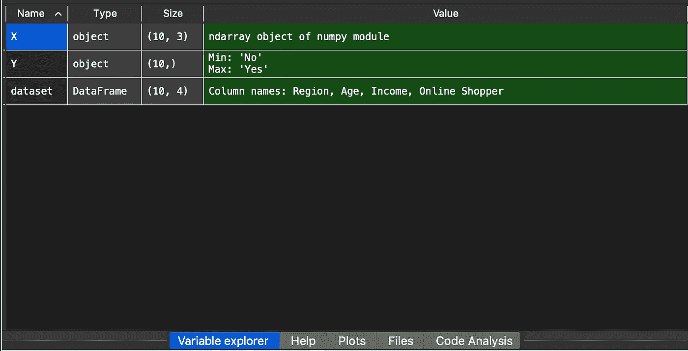**

**当您双击这些变量时，您应该会看到类似的内容。**

**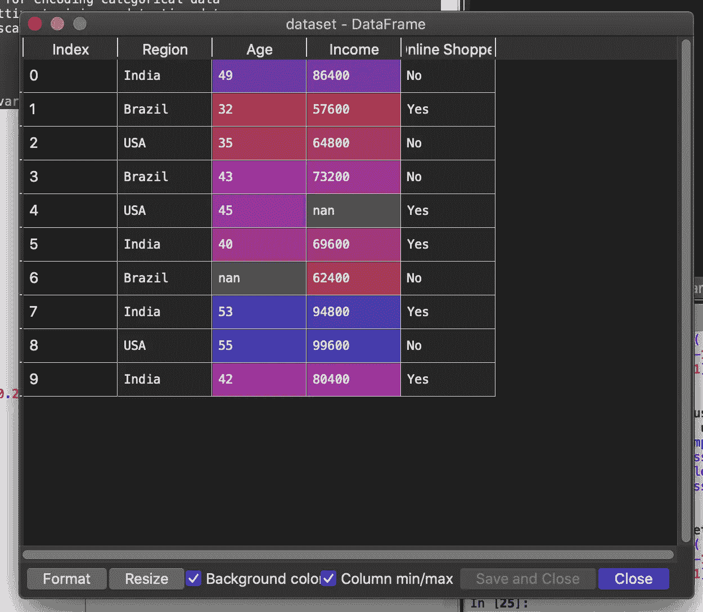****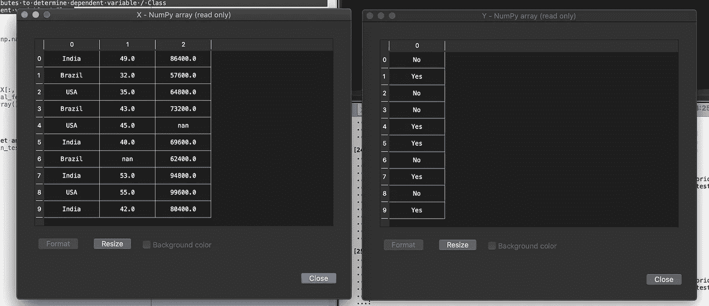**

**如果您在查看这些数据变量时遇到任何错误，请尝试将 Spyder 升级到 Spyder 版本 4。**

> ****缺失数据的处理****

**我将在下面的[帖子](/assessing-the-quality-of-data-e5e996a1681b)中详细讲述丢失数据的处理。**

**[](/assessing-the-quality-of-data-e5e996a1681b) [## 评估数据质量

### 对于数据挖掘和机器学习算法…

towardsdatascience.com](/assessing-the-quality-of-data-e5e996a1681b) 

第一个想法是删除观测数据中缺失数据的线。但这可能非常危险，因为想象一下这个数据集包含了至关重要的信息。删除一个观察是非常危险的。所以我们需要想出一个更好的办法来处理这个问题。另一个处理缺失数据最常见的方法是取列的平均值。

如果您注意到在我们的数据集中，我们有两个值丢失，一个是第 7 行数据中的年龄列，另一个是第 5 行数据中的收入列。应该在数据分析期间处理缺失值。因此，我们做如下。

```
# handling the missing data and replace missing values with nan from numpy and replace with mean of all the other values
imputer = SimpleImputer(missing_values=np.nan, strategy='mean') imputer = imputer.fit(X[:, 1:])
X[:, 1:] = imputer.transform(X[:, 1:])
```

执行完这段代码后，独立变量 *X* 将转换成以下形式。

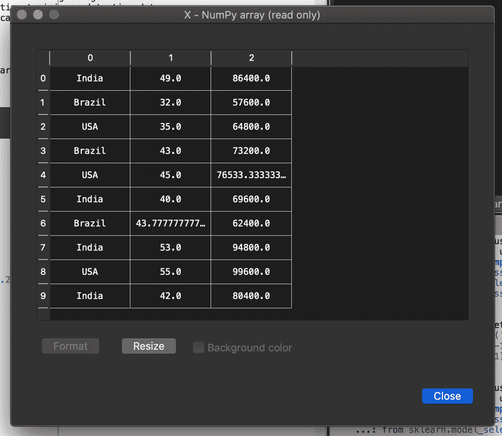

这里您可以看到，丢失的值已被相应列的平均值所替换。** 

> ****分类数据的处理****

**在这个数据集中，我们可以看到我们有两个分类变量。我们有地区变量和在线购物者变量。这两个变量是分类变量，因为它们包含类别。该区域包含三个类别。它是 ***印度、美国&巴西*** 并且在线购物者变量包含两个类别。 ***是*** 和 ***否*** 这就是为什么它们被称为分类变量。**

**你可以猜测，由于机器学习模型是基于数学方程的，你可以直观地理解，如果我们在方程中的分类变量中保留文本，会导致一些问题，因为我们只希望方程中有数字。这就是为什么我们需要对分类变量进行编码。那就是把我们这里的文本编码成数字。为此，我们使用下面的代码片段。**

```
**# encode categorical data
from sklearn.preprocessing import LabelEncoder, OneHotEncoder
labelencoder_X = LabelEncoder()
X[:, 0] = labelencoder_X.fit_transform(X[:, 0])
onehotencoder = OneHotEncoder(categorical_features=[0])
X = onehotencoder.fit_transform(X).toarray()labelencoder_Y = LabelEncoder()
Y = labelencoder_Y.fit_transform(Y)**
```

**执行完这段代码后，自变量 *X* 和因变量 *Y* 将转换成以下形式。**

**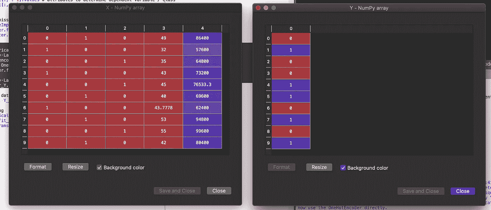**

**在这里，您可以看到区域变量现在由一个 3 位二进制变量组成。最左边的位代表 ***印度，*** 第二位代表 ***巴西*** ，最后一位代表 ***美国。*** 如果该位为 **1** ，则表示该国家的数据，否则表示该国家的数据。对于*网购者*变量， **1** 代表**是**，而 **0** 代表**号****

> ****将数据集分为训练数据集和测试数据集****

**任何机器学习算法都需要进行准确性测试。为此，我们将数据集分为两部分:**训练集**和**测试集。**顾名思义，我们使用训练集使算法学习数据中存在的行为，并通过在测试集上测试来检查算法的正确性。在 Python 中，我们是这样做的:**

```
**# splitting the dataset into training set and test set
X_train, X_test, Y_train, Y_test = train_test_split(X, Y, test_size=0.2, random_state=0)**
```

**这里，我们假设训练集是原始数据集的 80%，测试集是原始数据集的 20%。这通常是它们被分割的比例。但是，您有时会遇到 70-30%或 75-25%的比例分割。但是，你不想对半分。这会导致 ***模型过拟合。*** 这个话题太庞大，无法在同一个帖子里涵盖。我将在以后的文章中介绍它。目前，我们将按 80-20%的比例进行分配。**

**拆分后，我们的训练集和测试集是这样的。**

**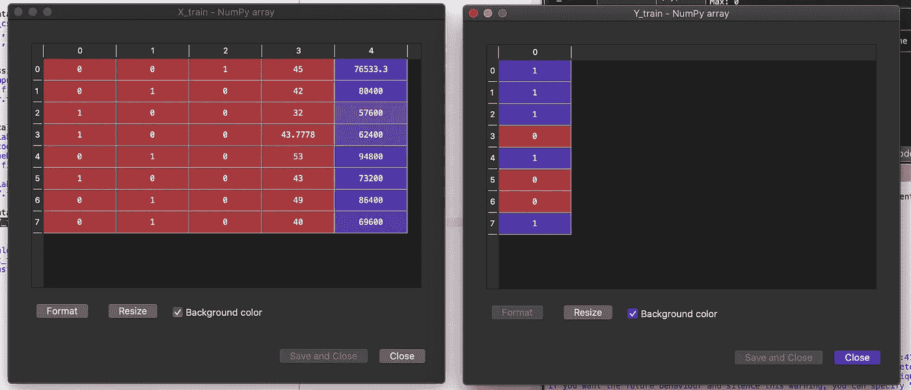****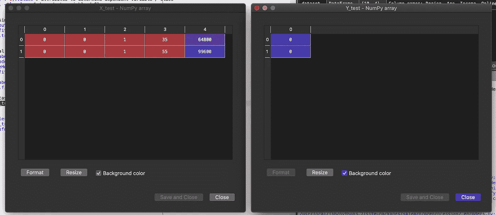**

> ****特征缩放****

**我在下面的[帖](/data-preprocessing-in-data-mining-machine-learning-79a9662e2eb)中详细讲变量变换(特征缩放)。**

**[](/data-preprocessing-in-data-mining-machine-learning-79a9662e2eb) [## 数据挖掘和机器学习中的数据预处理

### 有了详细的概念…

towardsdatascience.com](/data-preprocessing-in-data-mining-machine-learning-79a9662e2eb) 

如你所见，我们有年龄和收入这两个包含数字的列。你会注意到变量不在同一个范围内，因为年龄从 32 岁到 55 岁，薪水从 57.6 K 到 99.6 K。

因为工资变量中的年龄变量没有相同的比例。这将导致您的机械模型出现一些问题。这是为什么？这是因为你的机器模型很多机器模型都是基于所谓的欧几里德距离。

我们使用特征缩放将不同的尺度转换为标准尺度，以使机器学习算法更容易。我们在 Python 中这样做，如下所示:

```
# feature scaling

sc_X = StandardScaler()
X_train = sc_X.fit_transform(X_train)
X_test = sc_X.transform(X_test)
```

这段代码执行后，我们的训练自变量 *X* 和我们的测试自变量 *X* 和*T43 看起来是这样的。*

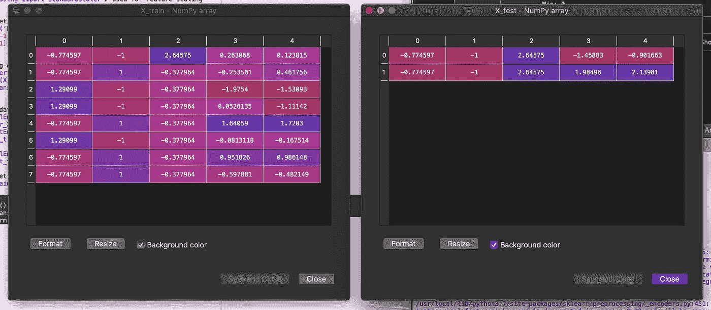

这些数据现在可以输入到机器学习算法中。

这篇关于 Python 中数据预处理的文章到此结束。** 

**附注:首先，你应该收到我的邮件。 [***做到这里*** *！*](https://tarun-gupta.medium.com/subscribe)**

***其次，如果你自己喜欢体验媒介，可以考虑通过报名成为会员* *来支持我和其他成千上万的作家* [***。它每个月只需要 5 美元，它极大地支持了我们，作家，而且你也有机会通过你的写作赚钱。自从我开始工作以来，* ***我每个月都挣 50 多美元。通过这个链接*****](https://tarun-gupta.medium.com/membership) *报名* [***，你就直接用你的一部分费用支持我，不会多花你多少钱。如果你这样做了，万分感谢！***](https://tarun-gupta.medium.com/membership)**

**感谢阅读。如果你喜欢这个，你可以在下面的故事中找到我的其他数据科学文章:**

 **[## 你好，美女！

### 不要害羞，读吧！

tarun-gupta.medium.com](https://tarun-gupta.medium.com/hello-beautiful-a8be3d07f556)**