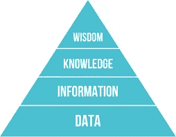
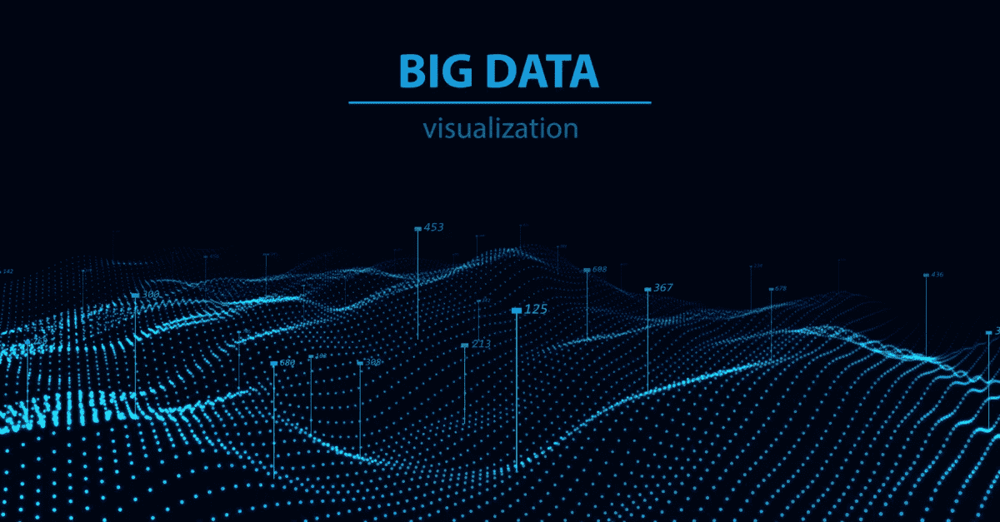
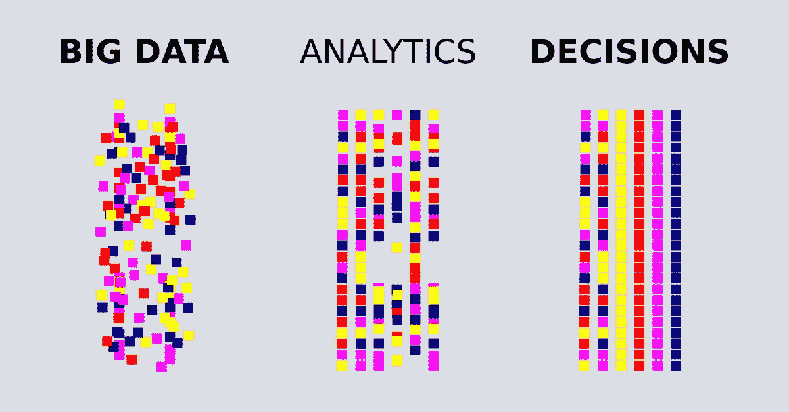

# 组织内部的数据革命

> 原文：<https://towardsdatascience.com/data-revolution-inside-organizations-bf54ed427ef5?source=collection_archive---------25----------------------->

## 如何为将永远改变商业格局的变化做好准备

# 介绍

全球范围内对海量数据的访问改变了商业格局。竞争营销依赖于知道如何管理、处理和分析这些数据。本文描述了组织从收集数据到最大限度地利用数据需要采取的途径。

当今的组织正在经历一个围绕其技术系统的具有挑战性的转型过程。可能存储和处理企业数据的静态软件平台在当前的网络环境中不再可持续。企业需要尖端技术来实时收集大数据，分析这些数据，然后获取所需的信息，以在当今的市场中保持竞争力。

> “数据革命是一场[运动](https://www.macmillandictionary.com/dictionary/british/movement)，[聚焦](https://www.macmillandictionary.com/dictionary/british/focus_1)于[产生](https://www.macmillandictionary.com/dictionary/british/produce_1)，[捕捉](https://www.macmillandictionary.com/dictionary/british/capture_1)，[开发](https://www.macmillandictionary.com/dictionary/british/developing) [数据](https://www.macmillandictionary.com/dictionary/british/data)到[改进](https://www.macmillandictionary.com/dictionary/british/improve_1)的方式就是[用](https://www.macmillandictionary.com/dictionary/british/used)到[促进](https://www.macmillandictionary.com/dictionary/british/facilitate) [改变](https://www.macmillandictionary.com/dictionary/british/change_1)。[数据](https://www.macmillandictionary.com/dictionary/british/data) [革命](https://www.macmillandictionary.com/dictionary/british/revolution) [需要](https://www.macmillandictionary.com/dictionary/british/need_1)一个[人类](https://www.macmillandictionary.com/dictionary/british/human_1) [元素](https://www.macmillandictionary.com/dictionary/british/element)帮助[塑造](https://www.macmillandictionary.com/dictionary/british/shape_1)未来麦克米伦词典

机器学习在数据革命中发挥了重要作用。高端开发人员设计技术系统，通过重复训练自己执行越来越复杂的分析，并产生越来越有意义的见解。

## 迪克夫金字塔

DIKW Pyramid

也被称为知识金字塔、信息层级和其他名称，DIKW(数据、信息、知识、智慧)金字塔将数据转化为智慧的步骤可视化。更全面的指南可以在下面的[文章](/rootstrap-dikw-model-32cef9ae6dfb)中找到。

# 数据转换

敏捷预测平台通过以下主要方式转换数据:

*   **存储、管理和结构化数据访问—** 该功能是 DIKW 金字塔的第一步数据。在这个阶段，数据转换不提供信息，它们只是改变信息的形式以便于处理。
*   **了解数据** —第二步信息引出第三步知识。
*   做出预测——第三步的知识，当被人类解读时，通向第四步的智慧。

# 数据—存储、管理和组织对数据的访问

行业领先的软件平台从多个来源获取多种形式的数据，将其处理为可用的形式，并存储在安全的云仓库中。人的因素伴随着您的业务需要做出的关于整体数据管理的决策。来自敏捷工作的专业开发团队的建议至关重要。

## **养什么？**

当你设计和维护一个系统时，**决定收集和保留什么数据可能是你的公司将做出的最有影响力的决策选择**。

你可能会根据当前的信息和你的预期增长提前做出决定，但你可能是错的。即使是最好的预测系统也无法准确描绘出你公司的未来。以这种方式设计会创建一个僵化的软件平台，它装载了比您需要的更多的数据，并且不能收集和处理您将来可能需要的数据类型。

相反，您需要一个从一开始就构建的平台，以便随着您的业务扩展其数据管理功能。你需要一个团队，让你作为合作伙伴参与开发过程。然后，您不断变化的需求和新想法可以融入您的平台的每一步。

## 在哪里？

考虑潜在可用的大量且不断增加的数据、高度敏感的业务和客户数据，以及日益复杂的网络犯罪。对于安全、可靠的大数据存储和管理，只有一个选择，那就是云上的。

您可能认为您需要雇用一名数据基础设施工程师来定制您的数据管理系统，但是您没有。像亚马逊 AWS、谷歌 BigData 和微软 MySQL 这样的顶级行业云数据管理系统旨在满足大多数企业的需求。务实一点，在简单和定制之间权衡最佳取舍。

我的建议是选择简单。

## 怎么会？

要决定如何管理数据以及谁可以访问和控制数据，请考虑以下策略:

*   **标准化。**使用预先确定的方法和工具，以设定的格式收集和管理所有来源的数据。这种管理设计提供了经济、效率、速度和一致性。
*   **定制。**根据数据的来源和类型，使用不同的方法、工具和格式收集和管理数据。这种设计支持需要复杂性和多样性的数据操作。
*   **中央集权。**所有数据都在一个地方存储和管理，并使用相同的工具进行处理。集中化非常适合大型企业，因为它是处理大量数据的快速、经济且一致的解决方案。
*   **放权。数据在不同的地方以不同的方式收集和处理。分散化适用于拥有本地分支机构的企业，以及需要快速访问和响应本地数据源的其他小型或个性化企业。**
*   **上下文依赖。**根据情况或其他因素或影响对数据进行解释和处理。定制的和分散的数据管理系统通常包含上下文依赖。

## 谁啊。

负责标准化数据定义和决定如何管理数据的人需要做出一些重大决策。？这些决策者是你的领导团队、技术团队，还是两者都是？为了选择最佳策略，您可以创建一个数据委员会，由了解您业务的不同方面以及哪种技术最能满足您的需求的人员组成。这些决策对您企业的技术健康至关重要。

如果您的平台无法运行，错误的设计选择会导致技术债务和收入损失。对于是创建一个集中的还是分散的系统，没有正确或错误的答案。不一定非此即彼。为了满足各种业务部门和功能的需求，大型企业通常会使用不同的数据操作策略组合来设计单独的系统。

# 信息和知识—了解您的数据

有了合适的平台之后，你就可以开始理解你的数据以及它的意义了。这一步是 DIKW 金字塔的第三层——知识。从数据中获取知识的一些常见方法是可视化和机器学习技术，如聚类和预测系统。

## 形象化

Big Data Visualization

随着大量和各种类型的新数据不断出现，如果组织想要保持可持续性和竞争力，就必须具备相应的可视化数据的能力。数据可视化领域是一个涵盖广泛的学科，包括复杂的分析和显示结构。[仪表盘可以带来很大的不同](/data-visualization-and-truthful-art-324b13a2ad34)。

为了从数据中获取知识，需要对数据进行简单的解释和探索。带有预建查询和可视化的仪表板可以减少理解和查看数据时的摩擦。您在构建有洞察力的仪表板上花费的精力和资源是值得的。您可以使用众多用户友好的商业智能工具之一来帮助您创建自己的可共享可视化和分析，从而使这一过程变得更加简单。一些例子有[查蒂奥](https://chartio.com/)、[格拉夫纳](https://grafana.com/)和[克利普弗利奥](https://www.klipfolio.com/)。

## 集群化

集群化的机器学习技术是分析数据和检测模式的极其强大的工具。[聚类](https://scikit-learn.org/stable/modules/clustering.html#clustering)算法创建相似对象的集合。这些算法是[无监督学习](https://scikit-learn.org/stable/unsupervised_learning.html)的例子，它对给定输入的概率密度进行建模。因为无监督学习算法没有偏见，所以它们是检测数据集中模式的最佳工具之一。

关于监督和非监督学习的更多信息可以在我下面的[文章](/data-demystified-machine-learning-3b40ec435ff2)中找到。

这些示例是您可能从集群化中获得的知识类型:

*   我们的客户来自东海岸还是西海岸？
*   他们买的是更时尚的衣服还是休闲的？

有了这些知识，我们对客户有了更好的了解。但是，只有当我们能够将知识应用于商业决策时，它才有用。**在某些时候，我们需要可操作的见解。**

那么下一步是什么？你如何从这里继续前进？机器学习预测是一种将我们的知识转化为更深入的见解的方法，我们可以将这些见解转化为可操作的计划。

# 做预测

Predictions inform Decisions

试图给一篇文章定价是预测系统的一个经典问题。你真的在试图预测用户的行为:

*   顾客会买你的产品吗？
*   他们愿意在这上面花多少钱？
*   结合潜在销售额的价格会给你在生产和营销成本上的投资带来回报吗？

根据从数据中获得的知识，机器学习预测可以为您的定价问题提供可行的答案。一个例子是预测的算法

预测技术可以应用于影响组织的许多领域。在[监督学习](https://scikit-learn.org/stable/supervised_learning.html)中，我们为我们的算法提供了一组正确的值来运行，从而从中进行训练。这些基于监督学习的预测示例可以在重要的业务领域产生可操作的知识:

*   **股票营销算法。**股票市场算法的目标是让系统从对过去市场数据的分析中学习如何预测未来趋势。
*   **年龄段和购买产品的概率。**在这种情况下，将针对不同年龄段的购买模式分析数据。根据过去的数据，系统预测未来的购买概率。
*   **诈骗。人类审查过去的交易是否为欺诈。预测系统将具有相似特征的交易标记为潜在欺诈。**

您可以通过对过去的数据运行监督学习算法来测试它的准确性。然后，您可以使用测试结果产生的新数据来提高其算法的未来性能。

## 非平稳性

在我们不断变化的世界中，过去的数据通常不代表未来。今天的公司存在于一个动态的环境中。记住这一点将有助于任何组织根据他们所依赖的过去的数据做出更好的决策。

当我们试图进行基于数据的预测时，我们首先需要识别非静态和静态数据集。这些示例显示了对数据的一些静态和非静态影响:

**静止不动。季节性是购买活动中的一个重要因素。过去顾客在黑色星期五和圣诞节等固定假日的行为可以预测未来的行为。**

**非平稳。**经济起伏是非平稳变化，通常无法准确预测。

## 可解释性

组织需要能够解释算法产生的数据。一个平台可能有很多关于过去行为的信息。但是要创建一个预测，我们需要了解哪些数据集与我们提出的问题相关。哪些因素重要？每个因素有多重要？

当您研究您的业务指标时，您可能会看到基于过去数据的相关性。但是相关性并不一定表明因果关系。举个例子，你可能会发现你的大多数买家都是女性。你对这一发现的解释可能是你的网站对女性比男性更有吸引力。但这种假设可能是一种危险的营销决策方式。每当你以肤浅或有偏见的方式解读数据时，它可能会显示一种相关性，而这实际上并不是问题的根源。

我们的大脑很容易混淆相关性和因果关系。这个[网站](https://www.tylervigen.com/spurious-correlations)有一些“虚假相关性”的例子，我也写了一篇关于[“因果关系与相关性”](/correlation-is-not-causation-ae05d03c1f53)的文章。这种类型的认知偏差是一个巨大的问题，影响到从微小的决策到医学研究的一切。事实上，几十年来，这种错误的想法一直支配着健康建议。

# 智慧——从预测到决策

在我们获得机器学习预测之后，我们移动到 DIKW 金字塔的顶端。关于如何应用这些预测的决定需要智慧，并且必须由人类做出。一个公司的价值观、使命和商业敏锐度都必须基于人类对预测的分析来指导行动和投资。正确或错误的决策不仅会影响企业的成功机会，还会影响外部因素，如客户、社会问题和环境。

# 参考

斯坦福大学(2019)。“通过预测建模将数据转化为洞察力”课程。

丹尼·华莱士(2007 年)。"知识管理:历史和跨学科主题."*图书馆无限量*。第 1-14 页。ISBN 978–1–59158–502–2。

安东尼·菲格罗亚(2019)。“相关性不是因果关系”。[https://towards data science . com/correlation-is-not-causality-AE 05d 03 C1 f 53](/correlation-is-not-causation-ae05d03c1f53)

安东尼·菲格罗亚(2019)。“DIKW 金字塔”。[https://towards data science . com/root strap-dikw-model-32 cef 9 AE 6 DFB](/rootstrap-dikw-model-32cef9ae6dfb)

安东尼·菲格罗亚(2019)。《数据去神秘化—机器学习》[https://towardsdatascience . com/Data-de 神秘化—机器学习-3b40ec435ff2](/data-demystified-machine-learning-3b40ec435ff2)