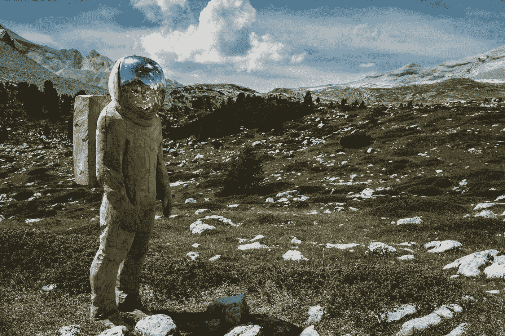

# 数据科学:酝酿 10 年

> 原文：<https://towardsdatascience.com/data-science-10-years-into-the-making-ad1c5be12a32?source=collection_archive---------25----------------------->

## 我们是如何到达这里的？

Photo by [Jonas Verstuyft](https://unsplash.com/@verstuyftj?utm_source=medium&utm_medium=referral) on [Unsplash](https://unsplash.com?utm_source=medium&utm_medium=referral)

距离我上次写文章已经过去一个多月了，当时我正为读研做着充分的准备。没关系，我回到了正轨，并计划保持我的常规剂量的知识和发现。所以，让我们开始吧！

我正在阅读关于数据科学的文章，并看到了一组令人惊叹的文章，这些文章可能有助于我们理解什么是数据科学。

> 谷歌首席执行官埃里克·施密特在 2010 年评论说，每两天，我们就产生相当于从文明开始到 2003 年所有数据的数据。— [TechCrunch](https://techcrunch.com/2010/08/04/schmidt-data/)

数据量约为 5 艾字节(10 的 18 次方)。今天，我们已经超越了自己，因为我们今天所做的一切(就像我们一天中的大部分时间在网上冲浪)都留下了大量的数据。这些数据非常有用，因为它包含的信息可以帮助我们回答问题，帮助[检测疾病](/deep-learning-to-identify-malaria-cells-using-cnn-on-kaggle-b9a987f55ea5)，并帮助[的司机在通勤期间保持注意力集中](/using-deep-learning-to-save-lives-by-ensuring-drivers-attention-e9ab39c03d07)。可能性是无限的。以至于出现了一个新的工程师/科学家阶层，叫做数据科学家。

让我们深潜一下！

## 数据

Photo by [Pietro Jeng](https://unsplash.com/@pietrozj?utm_source=medium&utm_medium=referral) on [Unsplash](https://unsplash.com?utm_source=medium&utm_medium=referral)

可以通过多种方式和多种形式收集数据。你访问的地点，你浏览的网站，城市的温度变化，指数，地理分布等等。最令人着迷的是，所有这些数据都有潜力挖掘出丰富的信息。

> 在一篇文章中，[经济学家](https://www.economist.com/leaders/2017/05/06/the-worlds-most-valuable-resource-is-no-longer-oil-but-data)阐述了数据的价值是如何超越石油的价值的。

早在 2010 年，谷歌和其他公司就已经意识到数据的价值。**谷歌使用数据分析进行多种语言的文本转换，因为数据是这么说的。**2011 年， **LinkedIn 开发了“你可能认识的人”功能，将他们的点击率提高了 30%。他们通过分析数据来做到这一点，比如一个人的背景，比如他们在哪个学校学习，他们在哪里工作等等。他们还使用了*三角形闭合*方法，即如果一个人认识乔并且也认识戴安娜，那么乔和戴安娜很有可能也认识对方。此外，在许多项目中，这些数据导致更快地找到问题的解决方案，而准确性只有轻微的损失。**

但是数据收集、数据处理、分析等等，比表面上看起来要多得多。有时数据没有引用每个值所代表的内容，有时数据是一个 HTML 页面，可能需要提取，有时没有首先存储或检索数据的结构。即使你能找到一些方法来获得数据，这些值也可能会丢失，甚至更糟…是错误的。数据格式可能需要特殊的程序来读取或使用。要从数据中获取价值，需要正确有效地克服许多障碍。

为了解决这些问题并真正获得洞察力，数据科学应运而生。

## 数据科学

Photo by [Alex Kondratiev](https://unsplash.com/@alexanderkondratiev?utm_source=medium&utm_medium=referral) on [Unsplash](https://unsplash.com?utm_source=medium&utm_medium=referral)

**数据科学**是一门收集数据、处理数据、然后分析数据以得出商业见解的艺术，这些见解可以向非技术人员解释。就像上图一样，数据科学是许多事物(如果你可以称之为化学)的并置，如**计算机科学、数学、统计学、数据挖掘、图形设计和人机交互**。

> 数据科学家是数据黑客、分析师、沟通者和可信顾问的混合体。——[哈佛商业评论](https://hbr.org/2012/10/data-scientist-the-sexiest-job-of-the-21st-century)

然而，技巧是深远的。数据科学家需要了解像 **R(现在还有 Python)**这样的语言来处理数据和进行数据争论。为了处理大数据，他们需要知道如何使用 **Hadoop** 或基于它的技术。**云计算**技能对于在多个集群/服务器上分配密集的数据争论过程至关重要。此外，图形设计和良好沟通等技能是数据科学家成功的关键。这些可以让他/她清楚地解释为什么事情会发生的洞察力和可能的原因。这些技能使数据科学家(以及像我一样有抱负的科学家)能够在我们的数据中找到模式。现在，这是强大的！！我们现在可以做很多事情，包括数据收集、处理、存储、修改、分析、建模等等。

虽然许多人相信并实践机器学习作为数据科学家的一部分，但这实际上是不正确的。一旦你进入学术界，开始处理自己的数据，数据本身就成了一个问题。如何收集数据？收藏什么？如果这是一种新的方法，保留什么，丢弃什么？可能需要哪些元数据？数据质量好吗？这些问题有助于我们思考这样一个事实，即数据科学家扮演着许多角色，从问题识别到数据收集和争论，再到得出真知灼见。

在实践和理论中，没有正确的答案。正如乔治·博克斯所说，“所有的模型都是错误的，但有些是有用的”。数据科学是一门艺术，在这门艺术中，你要不断尝试，直到找到足够准确的结果。数据及其处理都是与问题相关的，不能标准化。

## 我们现在在哪里？

Photo by [Aron Visuals](https://unsplash.com/@aronvisuals?utm_source=medium&utm_medium=referral) on [Unsplash](https://unsplash.com?utm_source=medium&utm_medium=referral)

我们都处于数据科学的中心。是的，你，我和其他所有人。我们浏览的网站，我们访问的地点，我们购买的东西，我们患有的疾病——都有助于数据。这些数据让数据科学家可以做很酷的事情。

数据科学的领域已经发展得非常广泛。有像 [Kaggle](https://www.kaggle.com/) 这样的网站，让全球各地的用户体验数据科学，竞争并赢得奖金，以及向成千上万的其他人学习。公司已经开始公开一些服务，允许数据科学家随心所欲地使用它们，比如 GitHub API 和其他服务。

我们现在可以检测欺诈，制造自动驾驶汽车，识别疾病，在猫和狗之间分类(如果你真的想，相信我，这很有趣)等等。可能的应用范围是无限的。最棒的是，数据科学不再局限于任何特定领域。在他/她自己的领域拥有专业知识的人可以使用数据科学来增加价值。你可能是生物学家、物理学家、计算机工程师或数学家，但你仍然可以从事数据科学，让这个世界变得更美好。

然而，这对数据科学来说并不都是好事。有时，如果未获得适当授权，数据收集会被视为侵犯隐私。这是一件大事，因为你真的不想被跟踪。在这种情况下，必须采取适当的措施。《一般数据保护条例》( GDPR)是一部法规性法律，基本上规定欧盟的任何居民都可以要求在欧盟运营的任何公司删除他/她的记录。这样的法律允许个人过自己的生活，而不用担心他们的隐私。

## 结论

数据科学是一个美丽的领域，在过去的几年里发展很快。我们今天正在做令人惊叹的事情，并计划在未来继续这样做。虽然这个角色看起来很紧张，但是看到你的工作产生巨大的影响真的很有趣。

## 参考资料:

[1]数据洪流使科学方法变得过时(【https://www.wired.com/2008/06/pb-theory/】T2

[2]未来职业:数据科学家([https://Mashable . com/2012/01/13/Career-of-the-Future-Data-Scientist-infograph/](https://mashable.com/2012/01/13/career-of-the-future-data-scientist-infographic/))

[3]数据科学家:你没听说过的最热工作([https://www . AOL . com/2011/08/10/Data-Scientist-The-hot-Job-You-have-heated-Of-heated-Of-heated/](https://www.aol.com/2011/08/10/data-scientist-the-hottest-job-you-havent-heard-of/))

[4] LinkedIn 的 Daniel Tunkelang 在《什么是数据科学家？([https://www . Forbes . com/sites/danwoods/2011/10/24/linkedins-Daniel-tunkelang-on-what-is-a-data-scientist/# 8 efda a11 cc 13](https://www.forbes.com/sites/danwoods/2011/10/24/linkedins-daniel-tunkelang-on-what-is-a-data-scientist/#8efdaa11cc13))

【5】什么是数据科学？(【https://www.oreilly.com/radar/what-is-data-science/】T4)

[6]数据科学家的崛起([https://flowing Data . com/2009/06/04/Rise-of-the-Data-Scientist/](https://flowingdata.com/2009/06/04/rise-of-the-data-scientist/))

[7]数据科学家:21 世纪最性感的工作([https://HBR . org/2012/10/Data-Scientist-21 世纪最性感的工作](https://hbr.org/2012/10/data-scientist-the-sexiest-job-of-the-21st-century))

[8]谢尔盖·布林寻找治疗帕金森病的方法([https://www.wired.com/2010/06/ff-sergeys-search/](https://www.wired.com/2010/06/ff-sergeys-search/))

[9]十大数据科学应用([https://www.edureka.co/blog/data-science-applications/](https://www.edureka.co/blog/data-science-applications/))

请分享你的想法、观点和建议。我很乐意收到你的来信。也可以通过 [LinkedIn](https://www.linkedin.com/in/bhanotkaran22/) 联系我。