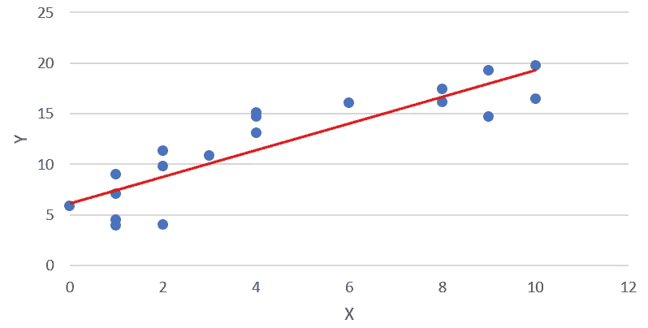

# 数据科学基础课程

> 原文：<https://towardsdatascience.com/data-science-101-99e34bea86c?source=collection_archive---------11----------------------->

Photo by [Franki Chamaki](https://unsplash.com/@franki?utm_source=medium&utm_medium=referral) on [Unsplash](https://unsplash.com?utm_source=medium&utm_medium=referral)

## 数据科学简介:迷路就从这里开始。

# 什么是数据科学？

好吧，如果你刚刚从 10 年的昏迷中醒来，不知道什么是数据科学，不要担心，还有时间。很多年前，统计学家有一些很好的想法来分析数据并从中获得洞察力，但他们缺乏计算能力，所以他们的手被束缚住了。直到有一天，计算机设法赶上了那些家伙，并使他们所有的梦想成真。突然间，我们不仅拥有了历史上前所未有的可用数据，而且我们还拥有了强大的机器来对这些数据进行繁重的计算，让统计学家可以尝试所有这些新算法。数据科学是统计学和计算机科学联姻的产物。换句话说，它是利用计算机能力从数据集中提取有用模式的科学。

# 它是用来做什么的？

数据科学如今如此受欢迎的原因之一是正在出现的可能应用的数量。

## 营销和销售

数据科学在营销中的一个典型用例是产品推荐。当你在亚马逊上查看一款产品时，他们告诉你还有另一款你可能喜欢的产品，这种推荐背后有一种算法，根据其他也看到该产品的客户实际购买的东西，认为你会喜欢这些产品。

## 金融

银行使用数据科学方法最常见的方式是进行信用风险分析:过去，当有人要求贷款时，银行家通常会仔细查看他们的财务记录，以决定是否贷款。如今，有复杂的统计模型不断更新，并给出了良好的违约概率估计，使整个过程更快、更可靠。

## 卫生保健

说到数据科学，医疗保健是最有前途的行业之一。智能手表等联网可穿戴设备产生了大量数据，包括消耗的卡路里、行走的英里数和心跳。其中一个可能的应用是跟踪变量，这些变量可以帮助解释一些疾病，如果你表现出可能表明健康问题的行为，甚至会提醒你去看医生。

# 它回答了什么问题？

我们可以将数据科学任务分为两大类:监督学习和非监督学习

Illustration of a linear regression for one explanatory variable. (*Image by author)*

## 监督学习

监督学习包括我们有目标变量的所有任务，也就是说，我们已经知道我们想要预测的数据中的一些特征。例如，如果我们想要[根据房价的特征](https://medium.com/dataseries/linear-regression-the-basics-4daad1aeb845)(例如房间和楼层的数量)来解释房价，或者如果我们想要预测客户停止使用我们服务的可能性。

## 无监督学习

这些是当我们不确定要问的问题时的任务。一个典型的例子是聚类任务，当我们只想在数据中找到模式，而不一定与某个特定变量相关(例如，客户细分)。

# 谁做的？

除了统计学和计算机科学所需的知识，数据科学还需要商业意识:如果不适用于该领域，无论你的算法有多好，它们都是无用的。与数据打交道的人通常分为三类，这取决于他们更关注这三个专业领域中的哪一个:

## 数据分析师

有时也被称为业务分析师，这个人知道如何与不直接处理数据的人交谈。他通常负责将业务需求转化为数据需求(并将数据洞察转化为业务建议)。他对主要的数据科学算法有全面的了解，并且通常在数据可视化方面有很好的技能。

## 数据工程师

这个人确保从所有来源收集数据，几乎无缝地集成到公司的技术环境中，并且开发的所有算法都又好又快。他们几乎总是来自技术背景，有时不得不创建专用工具来显示数据流程，尤其是如果他们要与公司的其他利益相关者共享。

## 数据科学家

从名字就能猜到，这家伙对大多数算法的运行方式有着更深刻的理解，以及哪种算法最适合每种情况。他们可能比数据分析师和数据工程师更了解统计学，但对业务或流程工业化的来龙去脉了解较少。一些公司更愿意聘用博士来担任这个职位，但情况并非总是如此。

# 它要去哪里？

在接下来的几年里，我们将会看到许多不同领域的进步。通过使用数据，城市将能够更好地管理它们的交通、能源消耗，甚至警察单位的分配。通过使用可穿戴设备，我们将能够更好地锻炼、饮食和睡眠。可能还有很多我们没有想到的其他可能性。

但是，我们也会发现，并不是所有的事情都可以用数据来改善，我们很快就会发现这个极限在哪里。在每一个人类活动或自然现象中，总会有一个重要的随机成分，永远不会被任何机器学习算法跟踪，无论它有多复杂。

这种数据驱动的文化也可能导致一些重要的行为变化。人们开始意识到他们的个人生活有多少被大公司和政府跟踪，而且大多数人似乎并不喜欢这样。这可能会导致人们自愿降级他们的技术设备，使用工具来阻止数据收集，甚至减少他们的整体技术使用。政府已经意识到这些问题，当涉及到人们的隐私时，世界各地的监管越来越严格。让我们看看未来几年这将如何塑造社会(黑镜系列对这些可能性提供了有趣的见解)。

# 怎么做？

如果你想了解更多，我推荐麻省理工学院出版社的基础知识系列书籍《数据科学》，作者是约翰·d·凯莱赫和布伦丹·蒂尔尼。这是对这个主题的一个很好的介绍，不用太专业，可以帮助你了解数据科学是否真的适合你。

接下来是福斯特·普洛沃斯特和汤姆·福塞特的《商业数据科学》。这本书更侧重于商业应用，深入算法的细节。它将让你真正很好地掌握数据驱动的决策所带来的所有可能性。

然后，一旦你掌握了基础知识，就该真正学习了:你几乎肯定需要学习编码(如果你还不知道的话)。你应该关注的主要语言是 SQL 和 R 或者 Python。第一个用于查询数据库，以正确的形式提取您需要的数据。另外两个用于应用算法和创建图。r 的创建侧重于统计学，而 Python 是一种更通用的编程语言。首先，从两者中选择一个来集中精力，如果需要的话，以后再学习另一个。

开始练习技能的一个好方法是[Kaggle.com](http://www.kaggle.com)，在那里你可以玩玩具数据集并参加真正的比赛。这将有助于你检验你的知识，也有助于你建立自己的投资组合。然而，请记住，最终，您将需要处理现实生活中的案例，这是一种不同的情况。

# 结论

既然你已经知道了一些数据科学的术语，你就可以去做你自己的研究了。可用资源的数量几乎是无穷无尽的，每天都有新的信息出现，所以要确保你总是了解最新的方法和可能性。