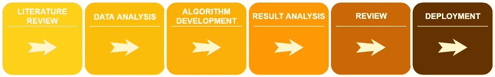
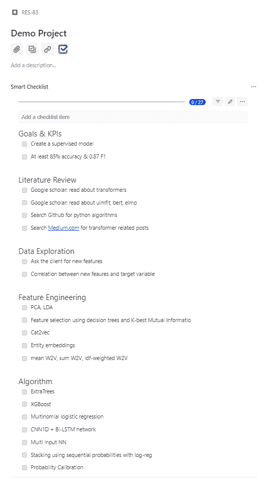
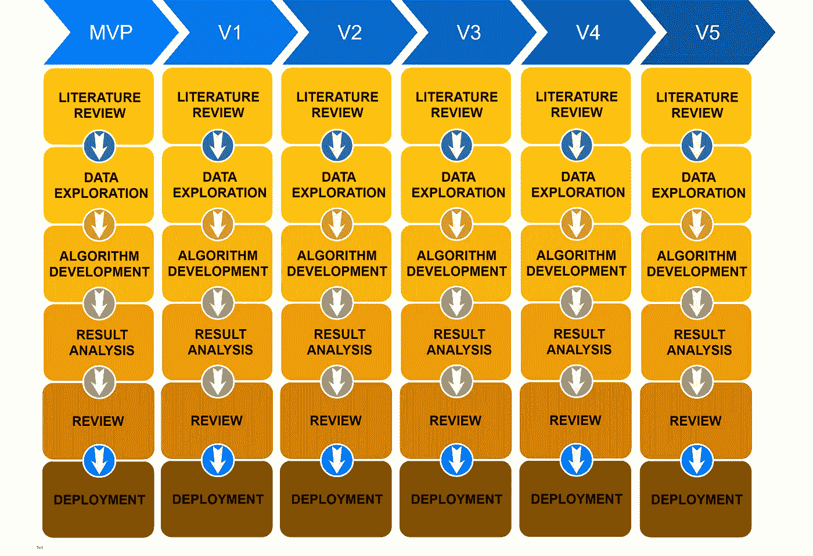

# 数据科学？敏捷？周期？我管理高科技行业数据科学项目的方法。

> 原文：<https://towardsdatascience.com/data-science-agile-cycles-my-method-for-managing-data-science-projects-in-the-hi-tech-industry-b289e8a72818?source=collection_archive---------3----------------------->

The Austrian Alps

## 揭开数据科学研究项目管理的神秘面纱

敏捷软件开发已经接管了高科技产业。无论是以 Scrum、看板还是 Scrumban 的形式实现，这些方法都是为了保持灵活性，允许在短周期内快速改变。虽然这些实现非常适合开发，但它们在某些方面与研究相冲突，因此为了在研究中保持敏捷，我们需要调整敏捷的核心价值，并将它们与研究方法相协调，例如，创建一个使用敏捷价值和思想但面向研究的工作实现。下面是我开发的一个方法，它是基于我管理一个数据科学研究团队的个人经验，并且经过了多个项目的测试。在接下来的部分中，我将从时间的角度回顾不同类型的研究，比较开发和研究工作流方法，最后提出我的工作方法。

# **研究类型**

我们通常会遇到三种类型的研究:

1.  在学术界和 IBM 或 FACEBOOK 等公司进行长期研究，即推进科学或技术的研究。
2.  中期，即在不久的将来对贵公司有贡献的战略项目。
3.  短期项目，即公司产品的特性、客户项目、内部项目，如可重用 API 或 POC。

短期或中期项目，在我看来，适用于任何与学术界或公司相关的项目有一定的亲和力，旨在创建一种新颖的算法或实现一种新功能，但有时间，资源或资金等行业限制的项目。相比之下，行业内的长期研究通常是最让人害怕的(虽然也有例外)。例如，在许多面试中，作为一名博士毕业生，我被问及是否可以在一家快节奏的初创公司工作，并在短期内取得成果。

# **开发和研究的主要区别**

让我们比较一下这两个领域的开发工作流程。

***编程*** :在软件开发中，你将代码组织成函数、类(即面向对象编程)，可能会用到设计模式等。你试图设计一个清晰的、可重用的、将来易于维护的通用架构。在研究中，这个过程可以比作原型阶段，我们需要很大的灵活性，这允许我们尽可能快地尝试许多想法。对于我和其他人来说，这可以归结为使用“笔记本”——一种交互式 python 环境，通过划分某些代码块并保持持久内存，它允许您比传统 ide 更快地**原型化**。如果没有必要，我们不必重新加载巨大的变量或重新计算算法，我们可以从先前的阶段继续工作。在笔记本上编程可以比作使用一个分成几个单元的大“主”,每个单元充当一个功能。传统的编程 ide 也与持久内存不兼容，想象一下当试图调试某个算法时试图读取一个巨大的数据集。

*:调试过程有完善的工具，您可以轻松地在函数和类中逐行调试。在传统的 ide 中，当您重新启动调试过程时，您不得不重新加载您的数据集并浪费宝贵的时间，而在笔记本中，数据集是持久的，并在整个持续时间内保存在内存中(只要内核没有被重置)。在笔记本中，调试过程包括使用 print()。因此，调试阶段真的非常简单。最终，当算法完成时，我们使用传统的软件开发工具(如 PyCharm)使用 OOP、设计模式对其进行重构，最后我们编写输入输出测试。*

****时间和进度管理*** :在敏捷的常见实现中，每个项目都被分解成许多小的可交付任务，这些任务给出了一个短期的估计。交付物被分组为周期。这些小任务由团队成员拉动直到完成，试图完成所有任务直到循环结束。周期每 X 周重置一次。一般来说，研究任务比较长，并且不总是与短周期方法相一致。例如，当我们启动一个模型时，可能需要几个星期才能得到梦寐以求的准确性度量。然而，这并不意味着我们在这几周内看不到其他方面的可衡量的结果，例如，特征与目标变量之间的相关性等。*

*既然我们已经讨论了软件开发和研究之间的一些主要差异，那么让我们来谈谈我的敏捷研究管理方法，看看我是如何尝试解决这些问题的。*

# ***我的研究管理方法***

*在研究中，我们关注产品需求，分配功能，思考可能的算法解决方案，定义目标和 KPI。事实是，我们没有一条通往那个目标的清晰的道路，换句话说，我们不知道完成任务的确切道路是什么。算法开发不仅仅是生产，它更多的是关于理解问题、评估选项、验证等等。在实践中，我们基于直觉和经验测试许多不同的假设和想法，有些可能有帮助，有些可能没有。*

*我们首先为一个项目确定一个合理的最后期限，不管是两周、一个月还是更长，基本上是你根据经验或猜测认为需要的时间。不同项目之间的期限不一致，因此很难放在严格的周期中。重要的是要记住，这些截止日期可能会改变，项目可能会延长或提前结束。*

*我将每个项目分成六个基本阶段(图 1。)，这允许我根据上下文对子任务进行分组。下面列出的六个基本阶段在图 1 中可以看作是吉拉板。*

**

*Figure 1: the six stages of an applied-research or data-science project*

# ***项目阶段:***

*1.文献评论*

*2.数据探索*

*3.算法开发*

*4.结果分析*

*5.回顾*

*6.部署*

*使用阶段方法，项目可以在各个阶段之间来回切换，直到完成(图 2 中的蓝色和绿色箭头)。例如，我们完成了算法的编写，在“结果分析”阶段，我们发现我们需要返回并改变一个核心特征工程思想，项目将返回到“数据探索”并再次经历算法和结果分析阶段。*

**

*Figure2: the six stages of an applied-research or data-science project overlaid on a Jira board. Showcasing the main idea that a project can move to a different stage, either forward or backwards.*

*在每个阶段，我都会创造尽可能多的想法、假设或任务，也就是可交付成果。例如，在“文献综述”阶段，你可能有几个任务，比如寻找关于 Github.com 的论文，或者试图寻找关于 Medium.com 的相关文章。在“数据探索”阶段，您可能会探索特征工程、选择或目前可用的所有嵌入方法，从 word2vec、phrase2vec、sent2vec 到 Elmo、Bert 等。在“算法”阶段，我们可以测试几种经典的机器学习算法，尝试一些神经网络思想(CNN、LSTM、双 GRU、多输入网络)、堆叠算法、集成等。在“结果分析”阶段，我们可以探索准确性、F1 等许多指标，通过查看内容来探索模型的正确性等。在“审查”阶段，团队成员审查我们的算法。最后，在“部署阶段”，我们将笔记本转换成一个清晰的基于类的 API，向 DevOps 团队公开 init()、train()、predict()、upload_model()和 download_model()，[创建单元测试](/unit-testing-and-logging-for-data-science-d7fb8fd5d217)并以一个 Pip 包结束(我们正在使用 circleCI 和 Gemfury)。*

*我没有对每个可交付成果进行评估，因为这增加了计划开销，安装了我想要避免的僵化的工作计划，并破坏了研究过程中的创造性，即，我们不希望工作计划管理我们，我们希望管理工作计划。我希望我的团队探索在创意过程中出现和想到的不同解决方案，而不是拘泥于基本上只是愿望清单的预定计划。换句话说，来自过程的数据、结果和见解产生了许多优秀的想法，这些想法将允许我的团队解决新的业务问题。*

*最终，我们会探索许多可能引导我们实现目标的想法，然而，并不是每个阶段都必须完成所有任务，换句话说，如果我们对当前阶段感到满意，我们可以在没有完成所有其他任务的情况下进入下一阶段。另一方面，如果你对当前的计划不满意，你可以改变它，跳过或返回。*

*作为一个小团队经理，我不希望子任务管理带来的开销。为了管理这些子任务，我为吉拉使用了'[智能清单'插件](https://marketplace.atlassian.com/apps/1216451/smart-checklist-for-jira-enterprise),如图 3 所示。任务列表包含在每个项目框中，适当的任务可以在 UI 中标记为“完成”或“进行中”,显然，您只能在项目框所在的阶段中处理子任务列表。随着你的团队的成长，你可能会有一个专门的人，他的工作是维护每个子任务的极端细节，你可能会觉得有必要使用吉拉的内置子任务管理，这给子任务管理增加了一些开销。我个人认为，我们的大部分子任务不需要被完整地跟踪，董事会视图应该尽可能地清晰和分组。*

**

*Figure 3: an example project with tasks in each one of the primary stages.*

# ***研究日报***

*项目管理不仅仅是一个管理委员会，每日例会也是项目管理的一个非常重要的方面。我的团队每天都有一个小时的会议，通常在早上，类似于开发，我们尝试头脑风暴，同步，谈论我们昨天做了什么，讨论我们陷入困境的问题，并谈论下一步。由于我们的谈话相对较长，我发现每天坐下来谈比每天站着谈更合适，也就是说，舒服地坐在沙发上谈论算法细节更有益。这让我们能够分享想法，发挥创造力，不断改进，而无需在周期结束时等待反馈。*

# ***调研工作流程:***

*以下概述了我的研究工作流程方法*

1.  *交换周期-方法学，每个项目都有合理的期限，符合项目的期望、目标和 KPI。*
2.  *承认项目在其生命周期中存在几个阶段。*
3.  *承认一个项目可以暂时回到以前的阶段，以便尝试更多的想法。*
4.  *将每个项目分解成基于阶段的可交付成果。*
5.  *为每个阶段分配一个软期限。*
6.  *承认你的可交付成果列表不需要作为一个整体来完成，可交付成果可以在整个项目中添加，这会影响最后期限。*
7.  *在每一个阶段，首先选择要完成的最佳交付物，当满意时，进入研究的下一阶段。*
8.  *重复清洗漂洗。*

# ***版本开发***

*下面简单讨论一下算法开发版本。我通常试图达到项目目标和 KPI，但是一个足够好的算法总是比没有好。因此，建议创建一个最小可行产品(MVP ),完成流程，将其投入生产，然后决定下一版本的未来目标，这些目标可能来自您的产品部门、结果分析阶段或您未完成的工作计划，如图 4 所示。*

**

*Figure 4: a flow-chart representing version development while utilizing the research-stage-methodology workflow.*

*希望您可以采用或使用这里提到的一些想法来管理数据科学研究项目。请记住，要使这种方法奏效，您的公司必须明白研究是一个不确定的过程，有些结果无法保证，但使用正确的项目管理方法，可以成功地控制该过程，以实现我们的目标。最后，如果你对从产品设计到模型完成和维护的项目工作流程感兴趣，Shay Palachy 写了一篇优秀的[帖子](/data-science-project-flow-for-startups-282a93d4508d)。*

*我要感谢(按字母顺序)Alon Nisser、Guy Nesher、Ido Ivri、Kobi Hikri、Moshe Hadad、Netanel Davidovitz、Samuel Jefroykin、Simon Reisman 对敏捷方法的宝贵见解、评论、校对和评论。*

*Ori Cohen 拥有计算机科学博士学位，专注于机器学习。他在 [Zencity.io](https://zencity.io/) 领导数据科学团队，试图积极影响市民生活。*