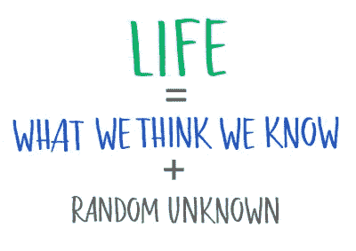
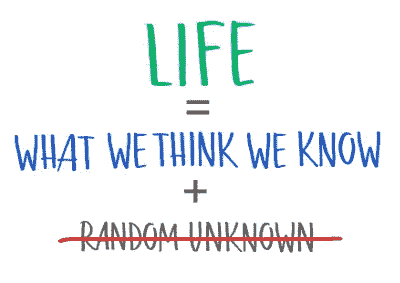
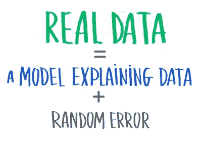

# 数据科学是科学吗？

> 原文：<https://towardsdatascience.com/data-science-and-ai-for-business-data-analysts-64f28a5d7ff2?source=collection_archive---------8----------------------->

# 对你的第一个数据科学项目有什么期望？希望涉足数据科学和人工智能的企业指南。第一部分

*任何成功的商业数据科学项目都是数据科学家、商业利益相关者、商业专家和其他各方成功合作的结果。最近，有一些关于数据科学家如何变得更加面向业务以更有效地解决业务问题的文章。但没有多少帖子涉及合作的另一面，帮助企业为数据科学和人工智能项目做好准备，我认为这同样重要。*

*这篇文章是对商业人士——领域专家、项目经理和利益相关者——的数据科学和人工智能的非技术性概念介绍。与解释数据科学、人工智能或机器学习的一些部分的许多其他非技术文章不同，这一系列文章只提供了一小部分图片，将提供数据科学在商业数据分析领域的位置的直升机(甚至卫星)视图。*

我目前工作的很大一部分是在商业中寻找数据科学和人工智能的机会。当我开始任何关于数据科学和人工智能的对话时，我面临的最大问题是与不是数据科学家的商业人士进行交流。不是因为我使用数据科学术语，而是因为我的正常语言没有被理解成我想要的方式。我花了一些时间才意识到，这是因为人们为了填补理解上的空白而做出的假设。

炒作只会让事情变得更糟:每个人都在某个地方听说过数据科学或人工智能，最有可能的是从一篇描述谷歌、亚马逊或脸书发明的一个新的很酷的东西的文章中。这些文章向读者灌输诸如数据科学、人工智能、机器学习和所有其他“知识”等时髦词汇，却不解释它们是什么。在这种情况下，人们不得不做出自己的假设来填补这些空白，以在脑海中构建一幅画面。

> **这些假设将任何关于数据科学或人工智能解决方案的建设性对话变成了数据科学家行走的雷区，他们永远无法确保人们正确理解他/她，而不是以他们自己的方式。**

在项目后期，参加启动会议的 5 个人可能会对项目有 5 种不同的理解。这不仅会认为任何项目都会失败，还会给企业和数据科学家带来很多挫折。双方都将学会在未来远离对方，以避免进一步的失败，并遗憾地错过这次富有成效的合作可能带来的机会。

这就是为什么我从一个快速教育课程开始与新业务人员谈论数据科学机会，这个课程是基于我在过去两年中开发的系统。它旨在通过填补典型的理解差距和解释常见的误解，为未来关于人工智能和数据科学机会的对话奠定坚实的基础。该系统基于我在商业智能和数据科学咨询领域多年来与业务分析师、项目经理和主管进行的大量项目和对话。

> 我发现这种方法在实践中非常有效——只需花几个小时参加一个教育研讨会，我就可以实现多个目标:大幅降低误解带来的风险，减少人们因感知到来自人工智能的威胁而对工作安全的焦虑，并且它还有助于启发他们自己的思考，有时甚至达到他们自己为自己的企业找到人工智能机会的水平！

这篇文章是我将要写的少数几篇涉及这个系统的文章之一。虽然任何人都可以发现它很有用，但它是为从事商业数据分析的人设计的，他们希望探索数据科学和人工智能的机会。它基于对传统业务数据分析和数据科学的比较，并解释了以下问题:它们如何以及为什么不同，任何数据科学项目的特定风险是什么，如何最小化这些风险，以及什么使数据科学项目成功。

我从一个略带哲理的问题开始这一系列的文章:

# 数据科学是科学吗？

*TLDR:是的，就是它！阅读下面为什么*

根据维基百科的说法，科学是一项系统工程，它以可检验的解释和对宇宙的预测的形式构建和组织知识。这个定义有点枯燥，我没有在我的演讲中使用它，相反，我从我所谓的“知识的大公式”开始:

我们的知识让我们了解周围的生活并做出预测。我们充满了这方面的知识:我们知道让我们交流的语言，我们有让我们理解和影响他人的社交技能，我们知道帮助我们安全驾驶的交通规则等等。想象一下，如果没有这些知识，我们的生活会是什么样子——正确，一片混乱，从上面的公式中随机未知。我们将无法交流和预测其他人，驾驶汽车将是在玩俄罗斯轮盘赌。上述公式表明，我们知道的越多，我们面临的随机未知就越少，反之亦然:我们知道的越少，随机未知的空间就越大。

与未知生活在一起是不舒服的，这就是为什么我们自然地想要任何事情的解释，我们想要了解我们周围的任何事情。我们想要足以解释事物的知识，而不一定是科学知识——任何有助于解释和预测作品的知识，包括宗教或超自然的。我们寻找答案的集体努力得到了回报——大多数时候我们生活在一个舒适区，在这里我们的知识为我们提供了相对较好的服务，我们可以安全地忽略上述等式中的随机未知，并相信:

并不是所有人都喜欢舒适，有些人花更多的时间在舒适区之外，更多地与未知打交道——他们是科学家、探险家、实验者。他们的目标是让未知变得已知，让我们的生活更加安全、舒适和有趣。

过去，我的博士论文是根据一项名为“科学价值”的标准进行评估的——这是一个条件，确认相同的工作以前没有做过，可能的结果有价值。用上面的公式来说，这意味着我的论文不得不处理一些令人烦恼的未知，使之成为有价值的已知。

[A Monument of the Discoveries (Padrão dos Descobrimentos)](https://en.wikipedia.org/wiki/Padr%C3%A3o_dos_Descobrimentos) in Lisbon. The figure with the ship in his hands is [Henry the Navigator](https://en.wikipedia.org/wiki/Prince_Henry_the_Navigator), a Portuguese Prince who is regarded as the main initiator of what would be known as the [Age of Discovery](https://en.wikipedia.org/wiki/Age_of_Discovery), which changed the world at a much bigger scale than the Romans before. The other figures are famous Portuguese navigators, artists, writers and scientists of that time. They all did not prefer comfort.

你现在可能知道我要去哪里了。数据科学处理现实生活中的数据，其目标是建立一个数据模型，尽可能好地解释数据，并能够对新数据做出准确的判断(预测)。不正确的预测称为预测误差，是随机的，它们的数量表明模型对真实数据的解释有多好。说到这里，我可以把“知识的宏大公式”漂亮地应用到数据科学中:

现在我可以回答题目问题了:“数据科学是科学吗？”是的，它是！像其他科学一样，它发现以前未知的事实，它使用系统的方法，它创造可重复的结果。换句话说，它具有科学的所有属性。

与物理学等其他科学相比，数据科学并不直接解释现实生活中的过程，而是通过这些过程产生的数据来解释。这就是数据科学的特殊之处——它可以用相同的方法解释不同性质的过程，只要这些过程产生数据。如果你在 [Kaggle](https://www.kaggle.com/competitions) 上查看数据科学竞赛历史，你可以找到从社会科学到核物理的任何类型的问题。这些问题都可以用数据科学来解决！魔法？不，这只是因为数据科学使用了一种独特的方法——它通过这个过程产生的数据，从过程的本质中抽象出自己。例如，为了预测掷硬币的结果，数据科学不会关心硬币的形状或质量、施加到硬币上的力、地球引力等。相反，它会根据硬币产生的数据做出预测。为了获得这些数据，人们只需要多次投掷硬币并记下结果。

您可能想知道数据科学与统计学(一个成熟的数学子领域)有何不同？这是一个非常有争议的问题，还没有被数据科学家和统计学家回答和接受。只有观点，我也有观点。从上面的公式来看，没有什么不同——它们都是一样的。对我来说，主要的区别在于他们是如何做的。

数据科学是为了应对现代数字时代的新数据挑战而诞生的:我们现在拥有的数据比过去的统计学家多得多，对实用数据研究的需求在过去几十年中呈指数级增长。人类现在每天产生的所有 Pb 级数据并没有放在那里，随时可以拿来用来构建模型。不幸的是，所有这些数据通常分散在不同的数据库、应用程序和系统中，每个都可能有自己复杂的接口。最重要的是，该行业现在不仅期待数据建模的结果和一些结论，他们现在还期待数据产品——一种能够带来收益和投资回报的应用程序。所有这些新的挑战需要一套非常广泛的技术技能，这是统计学家以前所没有的。

另一方面，有了大量的可用数据，数据科学通常不会面临统计学特有的挑战:从微小的数据样本中对大事情做出判断。这是一个非常困难的挑战，需要很高的数学和统计技能。如今，当脸书覆盖了北美 72%的人口，并且大多数数据科学家可以访问可能可用的高达 100%的数据时，在真实数据上验证模型要比花费时间开发完美的理论模型容易得多。因此，实用数据科学确实需要良好的统计专业知识，但通常不要求数据科学家成为顶级统计专家。

我相信，数据科学不仅仅是统计学的一个新的花哨名称，它是一个完全现代化的统计学，配得上它自己的名字。

# 早期采用的问题

感谢科技巨头，通过社交媒体、移动和智能设备以及物联网的发展，数据科学和人工智能已经成为我们个人生活的一部分。相比之下，企业总体上刚刚开始探索数据科学和人工智能的商业潜力。但不幸的是，进展并不顺利——大多数项目都没有超过概念验证阶段。关于有多少数据科学项目失败，目前还没有公布的数字，但对于以前技术炒作的项目，有一个类似的衡量标准——大数据。[根据 Gartner](https://www.techrepublic.com/article/85-of-big-data-projects-fail-but-your-developers-can-help-yours-succeed/) 的数据，他们的失败率可能高达 85%。我敢肯定，对于 AI 和数据科学项目来说，这个数字更糟糕。

大公司早期商业采用数据科学缺乏成功的原因有很多，但大多数都源于对数据科学概念的误解:它有什么用途，它与熟悉的事物有何不同，以及如何使用它。例如，商业数据分析人员中的一个典型误解是，数据科学只是“类固醇上的 BI”，它是更聪明地工作的相同的旧商业智能。仅仅是这种误解就会认为数据科学项目失败，因为它产生了一种错误的信念，认为旧的商业智能框架同样适用于数据科学。他们需要做的只是将数据科学家融入其中。如果他们知道这是多么错误，他们根本不会开始一个项目！

在接下来的两部分中，我将探索数据科学的概念及其在商业环境中的应用。在下一部分，“数据科学是不是一种兴奋剂？”，将触及数据科学与商业智能的根本区别，商业智能是企业已经使用多年的传统数据分析方法。它还将解释将在第三部分“如何从数据科学项目中获益？”中使用的概念。

所以很快就要注意新零件了…

我已经在商业数据分析领域工作了超过 13 年，经历了从一名普通的商业智能开发人员到一名人工智能研究人员、开发人员和传播者的旅程。

*你可以在* [*LinkedIn*](https://www.linkedin.com/in/maxim-scherbak/) 上找到我