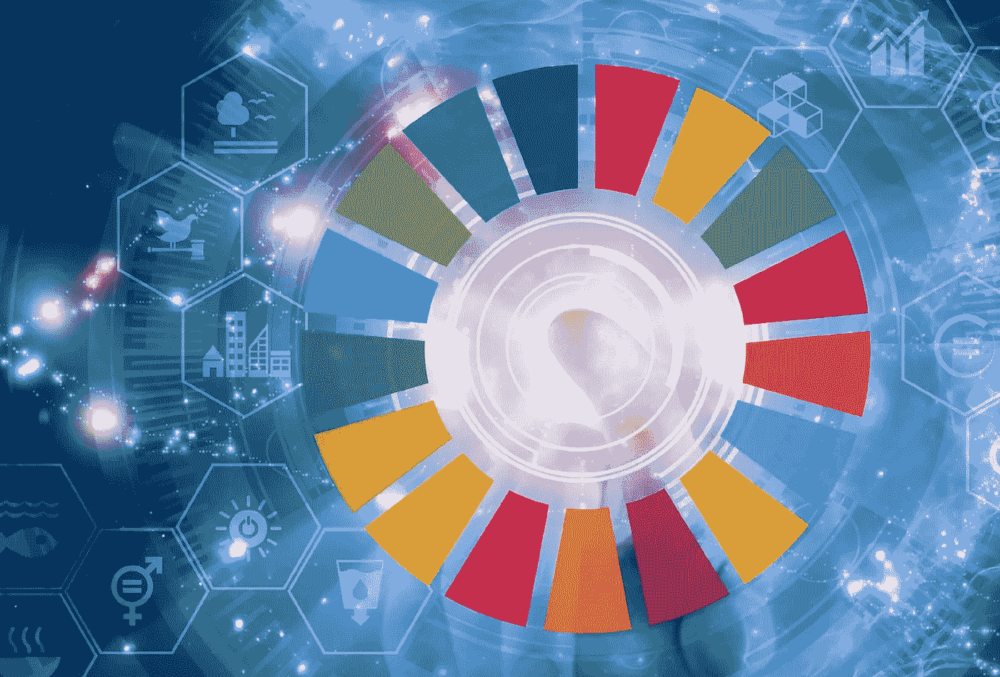
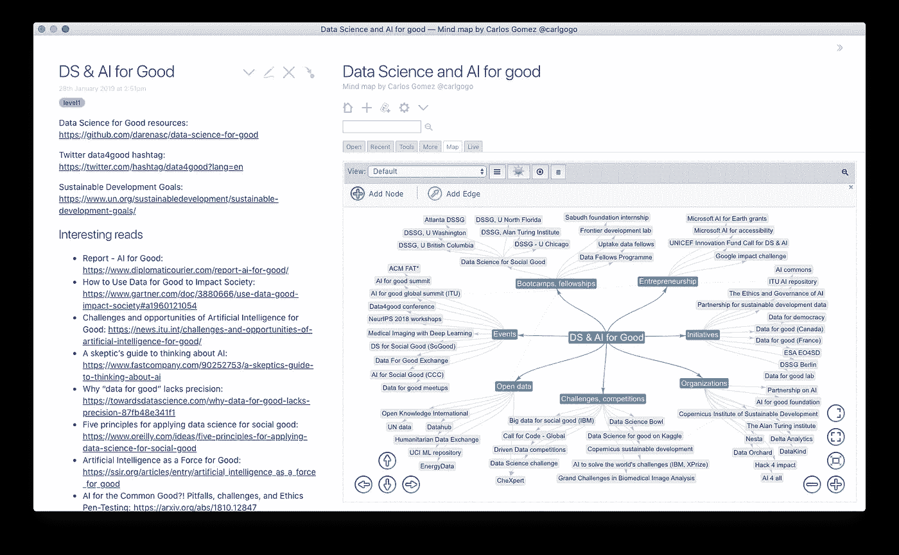
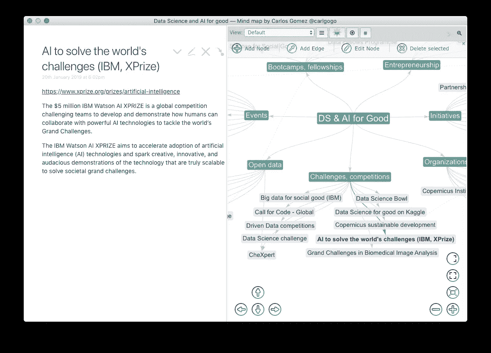

# 数据科学和人工智能——概述

> 原文：<https://towardsdatascience.com/data-science-and-ai-for-good-an-overview-577c9c2a3dcb?source=collection_archive---------18----------------------->

Taken from: [https://www.flickr.com/photos/itupictures/39621400230](https://www.flickr.com/photos/itupictures/39621400230)

## 思维导图把 *AI 换成好的*动作

**更新 2:***[*数字知识园*](https://carlos-gg.github.io/digitalgarden/) *已在* [*本帖*](https://carlos-gg.medium.com/my-ai-knowledge-digital-garden-888a8bc3eba1) *中介绍，包含大量 AI、ML、数据科学方面的资源。**

***update 1:***[*新版*](https://carlos-gg.github.io/digitalgarden/AI4G/AI4good/) *的 AI for good 思维导图现存放在我的* [*数字知识花园*](https://carlos-gg.github.io/digitalgarden/) *中，并将定期更新。***

****TL；** *闭嘴博士，带我去看* [*思维导图*](https://carlos-gg.github.io/AI4G_mindmap/) *！***

****

**[https://carlgogo.github.io/AI4G_mindmap/](https://carlgogo.github.io/AI4G_mindmap/)**

**就技术发展而言，人类正在到达一个转折点。与此同时，我们正在重新评估我们在地球上的位置，并重新思考如何建立一个更加公平的社会。人工智能(人工智能、机器学习、统计学习或你想怎么称呼它)能用来应对社会和环境挑战吗？是的，绝对的。事实上，用于在电子商务网站上推荐产品或选择显示给你的广告的相同算法可以应用于解决真实的人类问题。所有数据科学家，从有抱负的科学家到研究人员，都有机会(甚至有责任)利用当前的数据革命来改善我们的世界。**

**但让我们明确一点，这是一项复杂的工作，需要跨学科和多部门的合作，涉及政府、非政府组织、私人组织和学术界。否则，我们将很容易陷入人工智能的炒作，而不是将其理解为一种增强我们能力的工具。只有通过研究和对各自问题领域的深入理解支持的解决方案才是稳健的(记住[科学方法](https://en.wikipedia.org/wiki/Scientific_method))并且长期有效的。**

> **它需要跨学科和多部门的合作，涉及政府、非政府组织、私人组织和学术界，以善用人工智能。**

**但是学术研究是将人工智能用于好的方面的唯一方法吗？作为数据科学家，我们该如何提供帮助？我最初的冲动是浏览网页，寻找现有的倡议。这个浏览网页的练习比最初计划的要严肃一些(反正外面很冷)。事实证明，有许多有爱心的人和伟大的倡议以某种方式与数据科学和 AI for good 运动相关。这非常令人鼓舞，但仍有许多工作要做！**

# **思维导图人工智能的良好运动**

**我开始使用[思维导图](https://en.wikipedia.org/wiki/Mind_map)已经有几年了。它们是知识管理和共享的强大工具。我准备了*数据科学和 AI for good* 思维导图来收集我的发现。它旨在概述世界各地现有的“为善”的倡议，从组织和训练营到初创企业的种子资金机会。这个思维导图由两个令人惊叹的开源软件驱动:TiddlyWiki 和它的扩展。TiddlyWiki + TiddlyMap 组合允许用 JavaScript 创建带有集成概念图的交互式 Wiki。此外，该应用程序可以作为单个 HTML 文件使用，可以方便地托管在 GitHub 页面上。**

****

**Double click on a node to display (on the left panel) relevant links and a short description.**

**事不宜迟，*数据科学与 AI for good* 思维导图可以在[这里](https://carlgogo.github.io/AI4G_mindmap/)找到。在右侧面板中，您将找到地图本身(选择*地图*选项卡),左侧是与每个主题或节点相关的内容。双击打开一个节点。*实时*选项卡提供了一个不那么杂乱的地图视图，因此您可能会发现它更容易导航。**

**不管你处于职业生涯的哪个阶段，也不管你愿意投入多少时间，你都会找到有用的资源。例如，如果你只是在寻找灵感和有趣的阅读，就去根节点。子节点(深绿色的节点)涵盖以下主题:**

*   ***挑战和竞赛*:包含关于个人项目、黑客马拉松和数据挑战的信息，您可以在周末进行(提高数据技能的最佳方式！),**
*   ***训练营和奖学金*:为渴望在从事具有社会影响的项目的同时学习数据科学的学生提供的资源。这些实习通常持续 2-3 个月，**
*   ***事件*:链接一些相关学术会议和聚会的部分，**
*   ***倡议*:这个节点列出了科技公司的倡议。它的子节点指向社区、多部门网络和其他旨在用人工智能应对世界挑战的努力，**
*   ***组织*:通向机构和组织。对于那些寻找志愿服务或咨询机会的人来说，这可能很有趣，**
*   ***企业家精神*:这个节点指向为致力于社会公益或环保事业的人工智能/科技初创公司提供机会。**

**既然您已经知道了利用数据和技术服务于公共利益的不同方式，那么您还在等什么呢？我已经为未来几个月挑选了几个项目。如果您知道任何缺少的、值得添加的资源，请通过[电子邮件](mailto:carlosgg33@gmail.com)或使用相应 GitHub 资源库的[问题部分](https://github.com/carlgogo/AI4G_mindmap/issues)联系我们。**

***PS:一个类似的 TW+TM web 应用程序正在准备中，它有一个更大的思维导图，探索人工智能和数据科学的前景，充满了免费和有价值的资源。敬请期待！***

**原帖:[https://carlgogo.github.io/ai4good_mindmap/](https://carlgogo.github.io/ai4good_mindmap/)**