# 数据科学和人工智能:在不久的将来释放最好的角色

> 原文：<https://towardsdatascience.com/data-science-and-artificial-intelligence-unlocking-the-best-roles-in-near-future-5ef0ace4e80c?source=collection_archive---------22----------------------->

## "*将数据科学和人工智能的力量带给每个企业"*

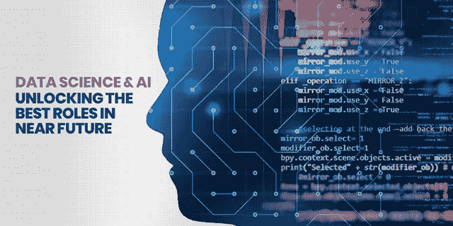

数据科学和人工智能是 2019 年每篇文章的“趋势话题”，这是理所当然的。这很像互联网作为游戏改变者出现在每个人的生活中。人工智能和数据科学已经准备好改变我们多年前无法想象的生活。

**让我们更深入地了解他们在不久的将来会提供什么。**

**但是在我们进入未来之前，最好理解这些术语。**

让我们开始吧。

# 什么是数据科学和人工智能？

一个针对存在物的流线型解决流程就是**人工智能**。它允许软件在没有明确编程的情况下执行任务。包括神经网络和深度学习。更大的概念是，机器可以执行我们认为的职责。

此外，结合领域经验、编程能力以及数学和统计知识以从数据中获得重要见解的科学研究领域被定义为**数据科学**。除了其他实验类型，数据科学还需要观察、问题、假设、测试、结果分析和实际建议。

# 为什么 AI 和数据科学很重要？

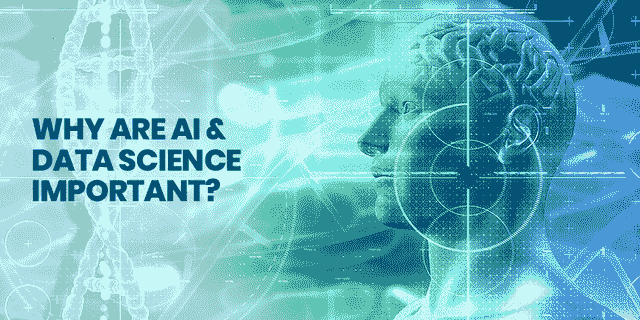

鉴于可获取信息的数量和种类不断增加，对计算机处理的需求变得至关重要，以提供深入、廉价和易于获取的信息。在人工智能和数据科学的帮助下，可以分析更大、更复杂信息的模型可以自动自动化，以返回更快、更精确的结果。

数据科学很重要，因为公司的问题可以解决。当你和政府认识到这一点，你就走上了正确的道路。很多时候，公司希望学习机器和大数据项目，而不考虑它们真正在做什么。如果你想让你的信息研究者成功，把问题介绍给他们——让他们开发替代方案。简单地建立一个机器学习项目不会想被告知。知道最终目标是什么是至关重要的。

人工智能很重要，因为它们足以有效地减少不同领域的人力。他们中的许多人使用人工智能在该部门进行多项操作，创造出定期进行多项操作的机械奴隶。人工智能的应用有助于使工作更快，结果更精确。人工智能背后的主要原因是无错误和有效的世界。即使在创造今天的****移动应用的同时，人工智能也发挥着重要作用。此外，近年来许多行业已经开始使用人工智能技术来减少人类的努力，并实现更有效和更快的结果。****

****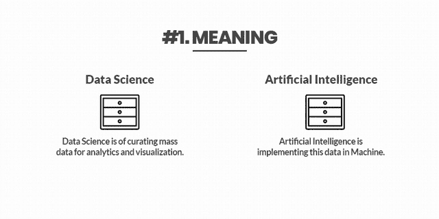********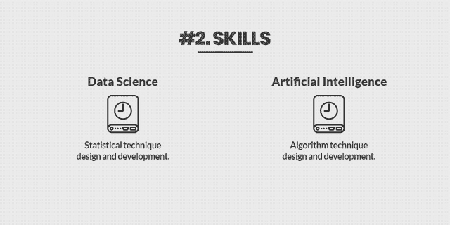********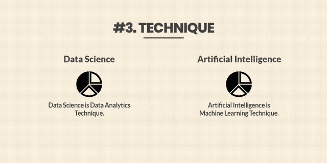********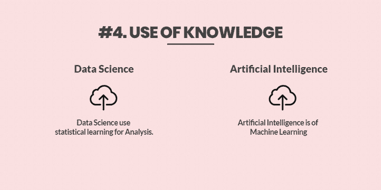********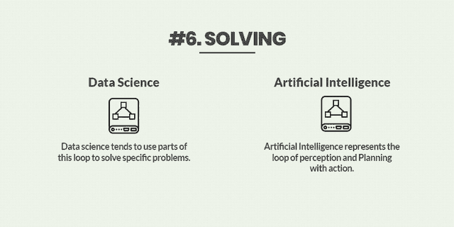********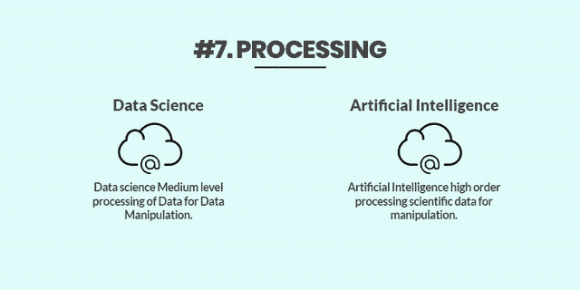********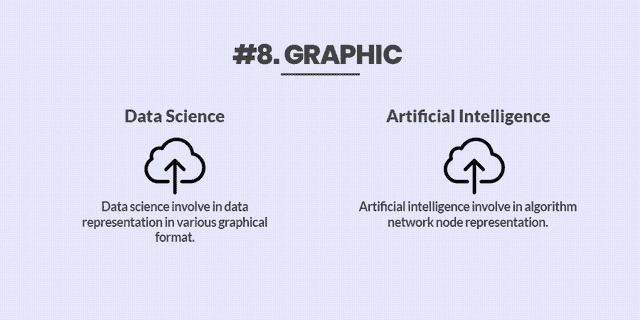********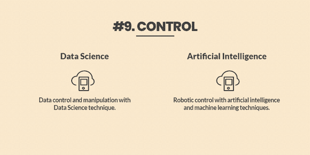****

# ****谁在使用这些技术？****

1.  ******银行业******

****银行业总有欺诈的危险。监控金融市场，并帮助发现和减少滥用或不当行为。数据科学一直在帮助银行有效地集中资源，做出更明智的决策并提高效率。而 AI 一直在通过提供支持贷款和监管合规选择来帮助他们克服客户服务的传统障碍。****

******2。电子商务******

****数据科学通过捕捉和整合客户的网络行为及其生活事件，帮助电子商务企业更全面地了解客户，从而购买产品或服务，跟踪客户与各种渠道的互动等。而人工智能允许企业实时收集和研究信息，从而提高效率和公司竞争力。****

******3。金融******

********

****人工智能将引领下一场经济革命，从客户服务到风险管理。在金融领域，人工智能实现了流程自动化，并大幅降低了客户服务成本。虽然人工智能降低了金融服务的价格，但一方面，资金变得非常容易使用。而金融是数据中心。数据科学的早期消费者和先驱用于金融机构。在开发创新的 [**软件开发解决方案的领域**](https://www.xicom.biz/) 对于风险分析、客户管理、欺诈检测和算法交易，数据科学是常用的。****

******4。保健&健身******

****医药和健康是一个革命性的领域，为数据科学提供了有前途的替代方案。数据分析将医学推向了一个全新的水平，从计算机化到药物发现和遗传疾病的探索。医疗保健和数据科学通常由财务联系在一起，因为该行业正在使用大量信息来降低成本。尽管人工智能(IA)的变革力量在许多领域都产生了影响，但它对真正改变生活的一个领域——医疗保健——产生了影响。人工智能应用正在彻底改变医疗行业的运营方式，以降低支出并改善患者效果，从医院护理到临床研究，药物开发和保险。****

******5。保险******

********

****从欺诈检测到增加客户体验，专家预测，下一世纪任何重大的保险选择都可能得到人工智能的支持。此外，随着繁琐和劳动密集型公司程序的自动化，保险公司将能够提高销售额，腾出时间来处理使用人工智能的客户。而大数据分析使保险公司能够提高价格精确度，构建定制的商品和服务，识别欺诈，处理索赔，为最终客户创造价值，并帮助自动提高公司效率和盈利能力。****

******6。运输和运输******

****当客户收集更多互联设备或装置时，企业专注于利用这些装置产生的信息，在数据科学的帮助下改进实时消费者分析。然而，从独立汽车到智能道路，人工智能正在成为交通领域需要考虑的一个重要因素。****

******7。销售和营销******

****人工智能允许通过推动收入和定制客户体验来扩大营销人员的增长。精明的营销人员发现人工智能是一种非常强大的方法。它使他们能够通过个性化的、有针对性的信息(所有这些都是大规模的)来吸引受众，从而在自己的职位上脱颖而出。而使用数据科学，营销专业人员了解需要确定哪些营销策略对特定客户最有效。****

# ****数据科学的未来****

****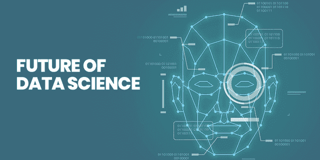****

****对包含如此多不同学科的科学进行预测是非常困难的。这意味着你必须思考每个学科的当前趋势和前景。然而，数据科学以前和现在的状态应该作为预测数据科学未来的有用基础。因此，数据科学在过去和现在都主要集中在描述性分析上。换句话说， ***数据科学的未来*** 取决于信息收集和过去发生的事情。****

****然而，专家们预计，由于技术的快速进步，未来将开发出更高级的分析，包括实时和预测分析。这些行业将再次对数据科学的面貌和目标产生重大影响。****

****作为数据科学的基本组成部分之一，机器学习预计也将发生巨大变化。数据科学家将不得不释放他们的创造力，利用不同的模式，而不是把他们的主要注意力放在这种教学机制上。虽然数据科学家的效率很高，但如果他们想在未来保持竞争力，并改变他们在机器学习中的实践方式，他们需要提高他们的效率。****

****如前所述，我们可以预期的未来和趋势并不容易预测，但一些研究人员认为，仅仅根据我们迄今为止对数据科学 ***未来趋势*** 的经验，未来几乎没有什么可做的。****

********

*   ****首先，我们将看到新的信息源出现。物联网并不新鲜，但未来这种想法支持的机器之间的链接将导致跨电子设备的链接。如今，数据科学家使用点击流数据、购买数据和销售数据，但他们必须包括从不同的零售环境、制造流、办公室、汽车、员工等收集的数据。在不久的将来。****
*   ****此外，今天的数据科学家使用的工具很可能变得更加先进，使复杂的任务变得更加简单。事实上，我们已经通过所谓的 BI 工具和开源库见证了这一点。许多算法必须从零开始创建。今天有现成的代码可以使这项工作变得更容易。随着技术的进步，即使是新的分析师也有望单独进行交叉验证和机器学习。****
*   ****数据科学家和系统工程师之间合作水平的提高是另一件很可能在不久的将来发生的事情。这种合作的第一个例子被证明对公司的整体效率非常有用。****
*   ****最后，数据科学家需要关注两项基本任务。首先是使用他们的领域和业务理解准备输入数据。第二，需要分析和解释工具产生的结果。****

> ****数据科学并不是一个新鲜的想法，但根据许多专业人士的说法，它现在变得越来越重要，并且在未来将变得更加重要。****

# ****人工智能的未来****

****科幻小说总是让人类着迷，试图重现一些最疯狂的科技想象。这种魅力源于机器人、智能机器、复杂软件、人工智能和神经网络，现在这些都已成为过去。从愿景到实际进展，我们走过了漫长的道路。正在慢慢塑造 ***人工智能未来的耐人寻味的科学技术。*******

> ******然而，我们认为，当人工智能完全成型时，未来将变得更加宏伟。我们预见人工理解的未来不亚于最好的科幻电影。这里是人工智能的未来在你脑海中描绘出一个更好的形象。******

*   ****关于自动驾驶汽车，我们已经听够了、读够了、看够了。我们已经经历了自动化运输的第一步，像特斯拉、谷歌、优步和其他自动驾驶汽车的技术猛犸象。虽然某些测试失败了，但乘坐自动驾驶汽车是成功的。我们将在《回到未来》的高速公路上看到复制品，政府巴士、小木屋甚至私人汽车都将实现无人驾驶和自动驾驶。智能汽车可以更精确地行驶在高速公路上，为更安全、更快捷、更经济的交通系统铺平道路。****
*   ****今天，人们从事一些最危险的工作。我们下去，弄脏我们的手，冒着生命危险，从清理垃圾到救火和散发炸弹。在这些过程中，我们失去的生命数量也很大。在不久的将来，机器或机器人有望得到照顾。随着更多人工智能的发展和智能机器人的推出，人们可以取代它们从事世界上最危险的工作。这是我们期待自动化就业的唯一时刻。****
*   ****我们中的一些人可能已经使用虚拟助手了。然而，随着技术的发展，我们可以期待技术成为私人助手和情感人。我们可以将机器人情绪化，并为它们提供人工智能、深度学习和神经网络的帮助，这是极其可行的。它们可以用于各种用途，比如招待、日托、老年人、文书工作以及许多其他用途。如今，许多企业都希望雇佣拥有人工智能专业知识的移动应用程序开发人员，因为他们希望将虚拟助手整合到他们的移动应用程序中。****
*   ****数据是目前最强大的东西之一。作为人类，缺乏对现状及其影响的了解是我们对气候变化无能为力的原因之一。对于日常生活中的微小变化和行动对气候变化的影响，我们也知之甚少。这不是计算机的情况。随着物联网的发展和城镇变得智能化，我们可以大大减少我们日常使用自动化公用设施、家庭等造成的伤害。****

# ****结束了****

****所有这些听起来可能很遥远，但如果我们说人们已经开始密集地研究人工智能，你绝对不会相信。我们还远远没有看到超级智能机器人的第一个原型。机器可以通过访问数据和准确性让世界变得更美好。因此， [**人工智能开发公司**](https://www.xicom.biz/latest-thinking/artificial-intelligence/?utm_source=SM12) 应该做更多的研究，努力推出更多前沿的人工智能技术，让我们的生活变得更好、更轻松。你怎么想呢?你相信什么？在下面的评论框中提出你的想法。****

****世界上其他地方对 IT 专家和 [**软件开发公司**](https://www.xicom.biz/?utm_source=SM12) 的需求一直很高，但在这样一个快速变化的行业中很难发现一个高度可靠和广泛的在线*数据科学和人工智能公司*。许多公司希望在这些领域提供出色的服务，需要在核心人工智能和数据科学技术方面进行充分的研究，并只雇佣专家开发人员。****

****对于下一代程序员、工程师和开发人员来说，这些公司应该有意成为当前专业人员的起点和资源。****